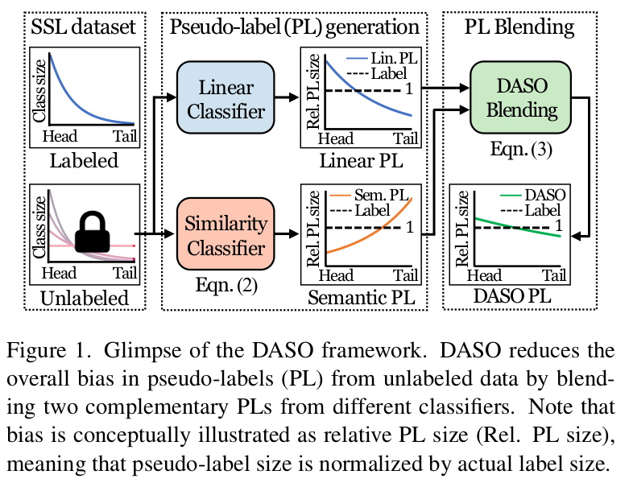
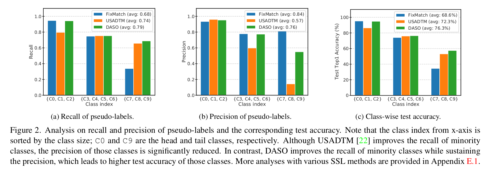
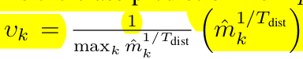
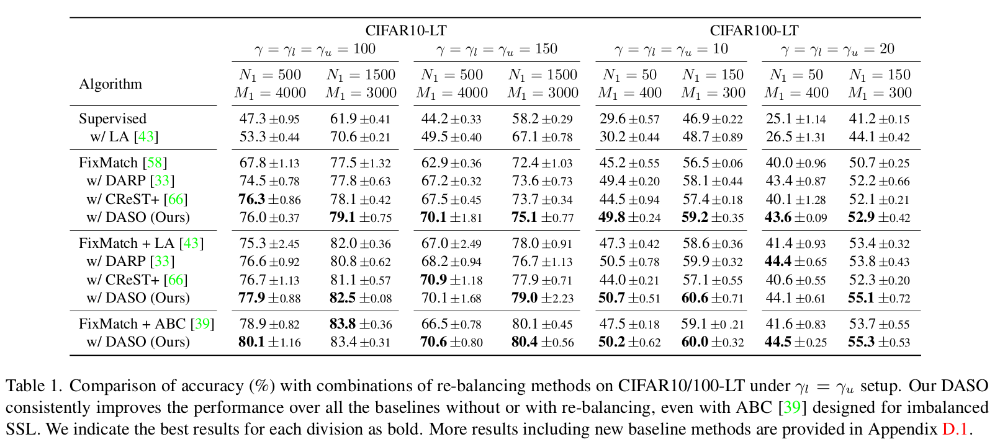
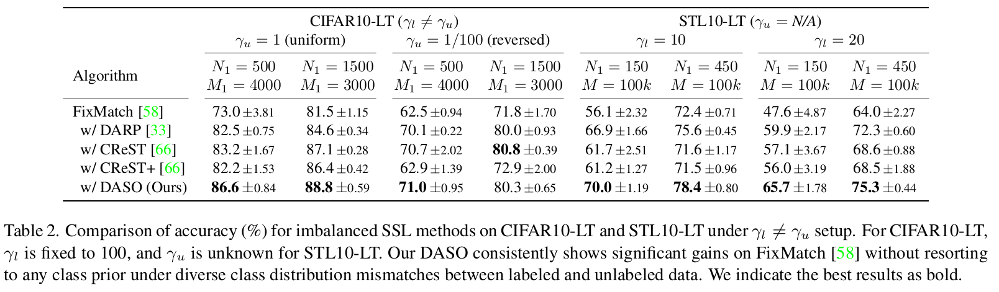
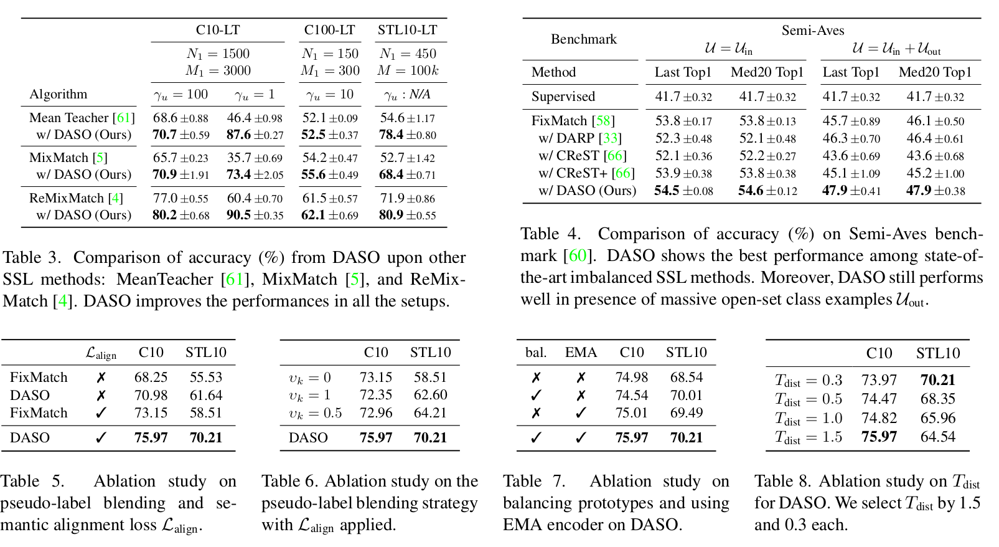

# DASO: Distribution-Aware  Semantics-Oriented Pseudo-label for Imbalance Semi-Supervised Learning

- paper: https://arxiv.org/pdf/2106.05682.pdf
- github: https://github.com/ytaek-oh/daso
- downstream task : Class-Imbalance SSL for Classification

# 1. Motivation

- 기존에 연구되는 semi-supervised learning은 label과 unlabel의 class 분포가 같다고 가정한다. 이는 매우 현실과 괴리된 가정이다.
- Class imbalanced semi-supervised learning을 고려해야 한다.
- Similarity-based classifier와 Linear classifier의 분포 bias가 서로 상이하여 보완이 될 수있는 점을 발견!
  - Similarity classifer : Class prototype과의 유사도 (cosine-similiarity)를 기준으로 class probability score를 산출하는 분류기

# 2. Contribution

- Class Imbalanced data에서 semi-supervised learning 시에, labeled data & unlabeled data간의 distribution이 같다는 approximation을 제거하고 bias를 완화하는 SSL 방법 (DASO) 제안
  - Similarity classifier는 minor class로 distribution이 bias되는 현상 포착
  - Linear classifer는 major class로 distribution이 bias되는 현상 포착
  - 둘의 조합으로 pseudo label을 class-wise하게 rebalancing하는 DASO 제안
- Similar prototype의 서로 다른 augmentation을 가한 consistency regularization loss를 추가함
- CIFAR-10/100, STL-10 등 Class-Imbalanced SSL (CI-SSL)에서 좋은 성능
- open-set class가 많은 long-tailead dataset Semi-Aves에서도 좋은 성능

# 3. DASO Psuedo framework

## 3.1 Imbalanced semi-supervised learning

defined as  $\gamma_l=\frac{max_kN_k}{min_kN_k} >> 1$ for labeled data, $\gamma_u=\frac{max_kM_k}{min_kM_k} >> 1$ 

- $N_k$: labeled examples
- $M_k$: unlabeled examples

## 3.2 Motivation

- Linear Classfier 기법인 FixMatch, Similarity classifier 기법인 USADTM의 precision / recall을 major / minor class별 비교
  - C0~C2 : Major class
  - C7~C9: Minor class
  - FixMatch는 Major class recall이 좋지만, minor class의 recall이 낮음
  - USADTM은 minor class recall이 좋지만, (상대적으로) major class recall이 낮음
  - 우리 방식 DASO는 모두 좋음

## 3.3 DASO Pseudo-label framework

### 1. Linear Classifier

$$\hat{p}=\sigma(f_{\phi}^{cls}(z^{(w)}))$$ where $z^{(w)}=f_{\theta}^{enc}(A_w(u))$

- $\sigma$: softmax activation
- $z^{(w)}$: wealkly augmented feature map

### 2. Similarity Classifier

- Balanced prototype Generation
  - class frequency에 따른 Queue size를 저장하지 않고, Class-wise fixed length $L$ 의 Queue에 feature를 저장
  - encoder를 EMA로 업데이트 ($f_{\theta}^{enc}$의 $\theta'=\rho\theta'+(1-\rho)\theta$)

$q=\sigma(sim(z, \mathbb{C}/T_{proto}))$

- $sim$ : similairty function (cosine similarity)
- $\mathbb{C}$: Class prototype
- $T_{proto}$: prototye temperature hyper-parameter

### 3. Distirbution-aware Blending

Major class에 biased된 linear classifier와 minor class에 biased된 similarity classifier의 출력의 interpolation으로 최종 pseudo label 생성

$$\hat{p}'=(1-v_k')\hat{p}+v_k'\hat{q}$$ where 

- $\hat{m}$: $\hat{p}'$의 class-wise distribution 을 temporary 저장하여 normalized한 값
  - 1,000개의 queue에 pseudo label $\hat{p}'$가 argmax로 class k에 할당되면 k class에 수를 증가. 최종 update는 1,000번에 한번 진행 (code 분석 결과)
  - 즉, Major class에 속하는 class일수록 $v_k$는 1에 가까워 짐
  - Most major class는 $\hat{q}$로, Most minor class는 $\hat{p}$로 업데이트 → Dibiased pseudo label
- 장점 : pre-defined distribution (가령, labeled distribution)이 요구되지 않음

### 4. Semantic-aware Loss

$L_{align}=H(\hat{q}, q^{(s)})$

- $H$ : Cross-entropy loss
- $q^{(s)}$ : strong-augmented similarity probability score

- 가장 similar한 class prottype과의 similarity classifier output을 다른 augmentation을 먹인 분포 사이에 consistency regularization을 가한 loss → 더 뛰어난 feature를 추출 (SimCLR, MoCo, etc)

### 5. Overall Loss

$L_{DASO}=L_{cls}+\lambda_uL_u+\lambda_{align}L_{align}$

# 4. Experiment

- Balanced SSL

- Imbalanced SSL

- Ablation Studies
