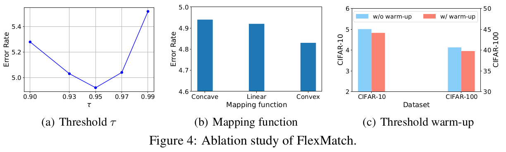

# [SSL][CLS\] FlexMatch: Boosting Semi-Supervised Learning with Curriculum Pseudo Labeling

- NeurIPS 2021 (인용수: 447회, 23'.11.20기준)
- paper: https://arxiv.org/pdf/2110.08263.pdf
- git: https://github.com/TorchSSL/TorchSSL
- downstream task : SSL for CLS

# 1. Motivation

- SSL의 (당시) SOTA FixMatch의 한계점을 지적 
  - class마다 학습할 정보량이 다른데 동일하고, 고정된 threshold를 사용하는건 sub-optimal할 것이다!

# 2. Contribution

- Class별 높은 성능, 낮은 성능을 예측하기 위한 단순한 방식을 제안 (Curriculum Pseudo Labeling)
- CIFAR-10/100, STL-10에서 FixMatch보다 13.96% ~ 18.96% 좋은 성능

# 3. FlexMatch

- 가정: Class별 balanced된 dataset이 존재한다고 가정!
- Pseudo label이 예측한 class sample의 갯수에 비례해서 해당 class가 학습이 잘 되었다고 판단함
- 따라서, 학습이 잘 안된 class는 더 많이 학습시키기 위해 Threshold를 낮춰줘야 함 (vice-versa)

$T_t(c)=\beta_t(c) \times \tau$ where $\beta_t{c}=\frac{\sigma_t(c)}{max_c\sigma_t}$

- $\sigma_t(c)=\sum_{n=1}^N \mathbb{I}(max(p_{m,t}(y|u_n))>\tau)\times \mathbb{I}(argmax(p_{m,t}(y|u_n))=c)$
- T_t(c)$: t step에 c class의 threshold 가중치
- $\tau$: fixed threshold (upperbound)
- $p_{m,t}(y|u_n)$: t step에서 unlabeled data $u_n$에 대한 모델의 예측값

### Loss

- unsupervised loss

$$L_{u,t}=\frac{1}{\mu B}\sum_{b=1}^{\mu B}\mathbb{I}(max(q_b)> T_t(argmax(q_b)))H(\hat{q}_b, p_m(y|\Omega(u_b)))$$

- $\Omega$: strong augmentation
- $q_b=p_m(y|w(u_b))$ where $w()$ is weak augmentation

### Threshold  warm-up

- Initial step에서 $\beta$는 unstable하므로, 특정 class로 모든 unlabeled data를 할당할 수 있음. 따라서 초기엔 unused unlabeled data 갯수로 max 함수를 취함 (**stablization**)

$$\beta_t(c)=\frac{\sigma_t(c)}{max\{max_c \sigma_t, N-\sum_c \sigma_t\}}$$

### Non-linear mapping

- Initial step에서 $\beta$는 unstable하므로, big jump하게 되면 성능에 좋지 않음. 점진적으로 0부터 시작해서 $\tau$까지 점진적으로 커지도록 non-linear mapping 함수 사용 

$T_t(c)=M(\beta_t(c)) \times \tau$ where $M(x)=\frac{x}{2-x}$

- $M$: monotone increasing convex function

# 4. Experiments

- Ablation Studies
