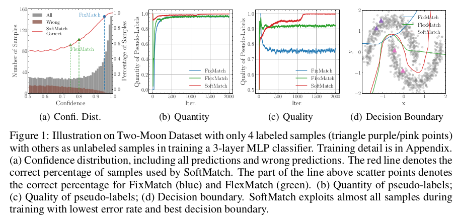

# [SSL][CLS\] SoftMatch : Addressing the Quantity-Quality Trade-Off in Semi-Supervised Learning

- ICLR 2023 accpeted (인용수 : 27회, '23.11.22 기준)
- paper : https://arxiv.org/abs/2301.10921
- github: https://github.com/Hhhhhhao/SoftMatch
- downstream task: SSL for CLS [CI]

# 1. Contribution

- Semi-Supervised learning에서 unlabel data의 quantity와 quality는 threshold에 의해 영향을 받는 한계를 지닌다.
  - 이는 Hyperparameter weight sample이 threshold 기준으로 step function으로 단순화되어 있기 때문에 그러하다.
- Quantity & Quality 모두를 좋게하는 SoftMatch 방식을 Truncated Gaussian(TG) 함수를 사용해 제안한다.
  - Hyperparameter로 사용되던 Weight sample이 Confidence를 parameter로 하는 TG 함수로 정의한다.
- Uniform Alignment라는 방식을 제안해 Class Imbalance 를 보완한다.
- Image classification, Text classification,  class imbalanced image classification에서 좋은 성능을 낸다.

# 2. Quantity-Quality Trade-Off of SSL

## 2.1 Sample weighting 관점

$$L_u=\frac{1}{B_u}\sum_{i=1}^{B_U}\lambda(p_i)H(\hat{p_i}, p(y|\Omega(x_i^u)))$$

- $\lambda(p_i)$ : weighting function

1. $f(p)$: Quantity of pseudo-labels

   - unlabeled data의 sample weight $\lambda(p)$의 평균치

   

2. $g(p)$ : Quality of pseudo-labels

   - pseudo label의 weighted 0/1 error

     $$\bar{\lambda}=\lambda(p)/\sum\lambda(p)$$

     - probability mass function (PMF) of **p**
     - 이론상 계산하기 위해서만 unlabeled data의 GT를 활용

3. Quantity와 Quality trade-off이 없기 위해서는 잘 정의된 sampling weight Function이 필요

# 3. SoftMatch

## 3.1 Gaussian Function for Sample Weighting

- Summary

- $\hat{\mu}_b$ : unlabeled sample의 max prediction의 평균
- $\hat{\sigma_b}^2$ : unlabeled sample의 max prediction의 분산

- EMA updated
  - Initial value : 1/C for mean, 1 for standard deviation

​	

- Gaussian parameter를 unlabeled data에서 adaptively 예측하면 quantity-quality trade off를 해결할 수 있음
- Table 1에서 SoftMatch는 최소 절반의 quantity를 사용 ($\lambda_{max}/2$)
- 학습이 지속될수록 quality도 높아짐

## 3.2 Uniform Alignment for Fair Quantity

- long-tail 문제에서 학습이 잘 안된 weak-class 에 대해 uniform 분포로 encourage시켜준다는 의미

  

  -  : Unlabeled data의 model prediction의 평균 
  -  : Batch 단위로 EMA업데이트한 의 근사값

- 최종 SoftMatch식

  

# 4. Experiment

- classification

  

- class-imbalanced classification & text classification

  

- Qualitative Analysis

  

  - Quantity, Quality모두 좋은 pseudo label 생성. accuracy도 좋음

- Ablation Study

  
