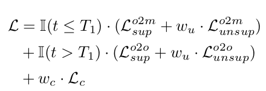
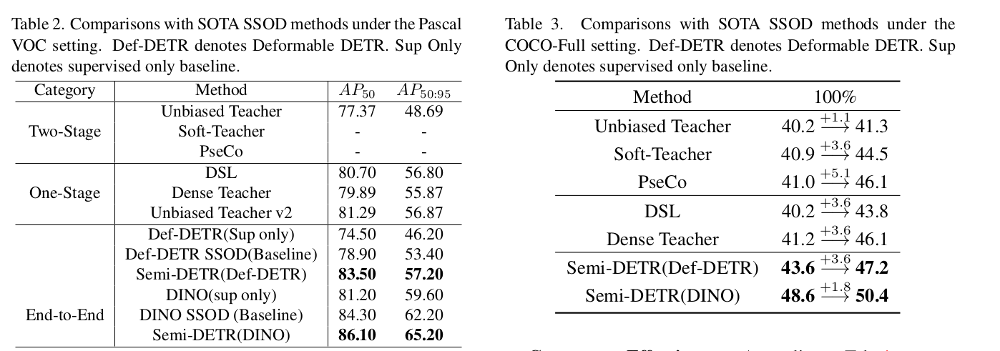

# Semi-DETR: Semi-Supervised Object Detection with Detection Transformers

- paper: https://arxiv.org/pdf/2307.08095.pdf
- git: https://github.com/JCZ404/Semi-DETR
- CVPR 2023 accepted, (인용수: 4회, '23.11.27 기준)
- downstream task : SSL for OD

# 1. Contribution

- Teacher-Student기반의 Semi-DETR 모듈을 최초로 제안함
- one-to-one matching의 pseudo labeling 한계를 극복하는 stage-wise Hybrid Matching 및 consistency-regularization 및 cost-based pseudo label mining기법을 제안함
- SSL OD에서 SOTA

# 2. Semi-DETR

- Overall Diagram

  

## 2.1 Stage-wise Hybrid Matching

- Previous one-to-one Matching

  - Hungarian algorithm을 기반으로한 cost를 최소화하는 query와 matching하여 positive로 할당

    

    - $\hat{\sigma}_{o2o}$: Student의 one-to-one matched index 
    - $C_{match}$: Matching cost
    - $\zeta_N$: N개의 pseudo gt element set

  - SSOD 학습 시, 초기 학습중에는 pseudo label의 질이 떨어지므로 one-to-one assignment기법 적용 시, recall이 떨어질 수 있음 -> one-to-many assignment로 변

- One-to-many Matching

  

  - $M,N$: M개의 proposal, N개의 pseudo-GT

  - $C_N^M$: pseudo gt $\hat{y}_i^t$당 M개의 proposal set

  - M개 중 top-m개를 Positive, 나머지 (M-m)개를 negative로 학습

    

    - $m$: IoU score와 prediction score의 곱 ($s^{\alpha} \times u^{\beta}$)
      - $s$: prediction score
      - $u$: IoU
      - $\alpha, \beta$: hyper parameter. 1, 6
    - $\hat{b}, \hat{m}$ : pseudo label의 bbox, Iou-aware prediction score

- One-to-one matching

  - One-to-many에서 통과한 query중 NMS-free로 학습시키기 위해 다시 one-to-one matching loss를 부과함

    

## 2.2 Cross-view Query Consistency

- DETR에서는 conventional OD와 다르게 query와 GT가 determininistic 하게 matching되지 못하므로 아래 식을 바로 적용할 수 없음

  

  - $f_{\theta}$: student output
  - $f_{\theta}'$: teacher output

- 대신, cross-view로 augmentation된 image feature를 RoIAlign Layer를 통과시켜 각각 student, teacher에 cross로 넣어준 후 결과값에 consistency regularization loss를 부과함

  

  - $F_t, F_s$: Teacher, Student의 backbone feature
  - $b$: Pseudo bbox

  

  - $E_t, E_s$: Encoded image Feature
  - $q_t, q_s$: Teacher, student의 query
  - $A$: Attention mask
  - $\hat{o}, o$: decoded된 cross-view query & original query

- Consistency Loss

  

  $$L_c=MSE(\hat{o}_s, detach(\hat{o}_t))$$

## 2.3 Cost-based Pseudo Label Mining

- Gaussian Mixture Model (GMM)을 활용해 student proposal에 대해 teacher의 pseudo gt와 Hungarian matching하여 reliable, unreliable 중 하나로 clustering하여 filtering

  

  - GMM모델은 batch 내에서 fitting 수행
  - pseudo gt에 대해 loss가 낮으면 reliable하고, vice-versa

- Matching cost

  

## 2.4 Loss Fuction

- Overall Loss function

  

  - $T_1$: Training Step

# 3. Experiments

- COCO-Partial

  

- Pascal-VOC & coco-additional

  

- Ablation Studies

  

- CPM과 다른 기법 비교

  

- One-to-many 다른 기법 비교

  

  - Ranking 기반의 Assignment방식 (SimOTA, ours) 외에는 효과가 없었음
  - ATSS 등 Dynamic assignment의 경우 positive number 갯수에 변동폭이 커서 성능 하락에 기여함

- Hyperparameters

  
