# TOOD: Task-aligned One-stage Object Detection

- paper: https://arxiv.org/pdf/2108.07755.pdf
- git: https://github.com/fcjian/TOOD
- ICCV 2021 accepted, (인용수: 318회, '23.11.29 기준)
- downstream task : OD

# 1. Motivation

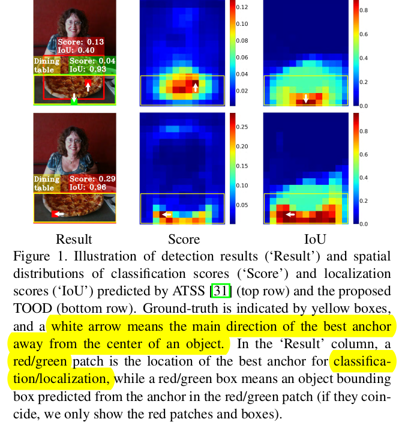

- OD task의 경우 multi-task learning으로, object classification과 object localization task간에 mis-match가 발생하는 문제가 있음
  - 한쪽에서 optimal한게 다른쪽에서 optimal하지 않기 때문
- 두 task를 align하는 Task-Alignment Learning이 필요!

# 2. Contribution

- OD에서 classification & localization task 모두에 optimal한 anchor를 positive anchor로 할당하는 Task-aligned Head (T-Head) 제안함
- Task-aligned loss를 사용한 Task-Aligned Learning (TAL)을 제안함
- One-stage detector들 중 우수한 성능 달성

# 3. Task-Aligned One-stage Object Detection

- Overview

  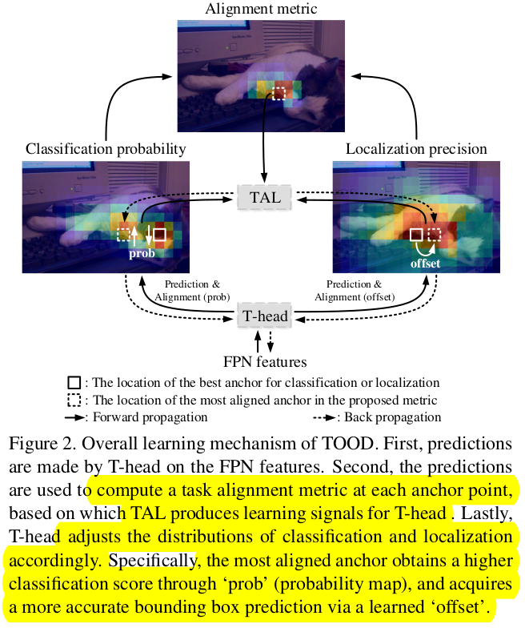

  - Task-aligned Head (T-Head)를 통과한 feature에 대해 Task Alignment Learning (TAL)을 수행

  ## 3.1 Task-aligned Head

  - 역할 : FPN feature를 받아 Layer 별 Attention을 수행함으로써 Task-aligned feature를 생성하고자 함

    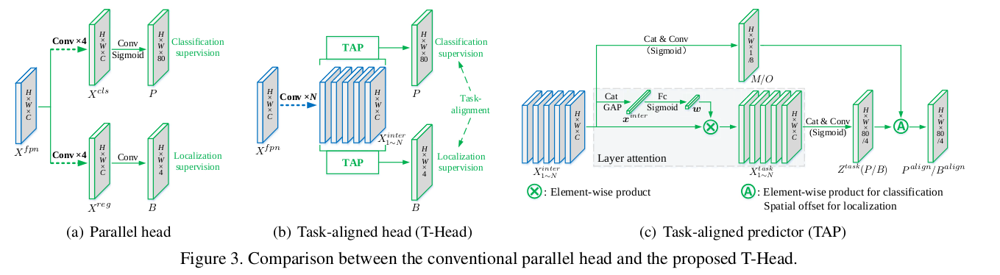

    - Convolution Layer와 ReLU를 사용함

  - T-Head

    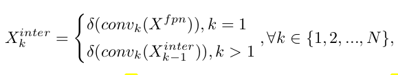

    - $\delta$: ReLU 함수
    - N: FPN feature의 갯수
    - $X^{inter}_k$: k번째 task-interactive feature (output feature)

## 3.2 Task-aligned Predictor (TAP)

- 역할: Task-specific한 feature (object localization, object classification)을 생성하고자 task-specific feature를 생성함 

  $$X^{task}_k=\bold{w}_k \times X^{inter}_k, \forall k \in \{1, 2, ... , N\}$$

  - $\bold{w}_k$: k번째 interactive feature의 attention weight

    $$\bold{w}=\sigma(fc_2(\delta(fc_1(\bold{x}^{inter}))))$$

    - $\bold{x^{inter}}$: interactive feature를 global average pooling을 통과시킨 feature
    - $fc_1, fc_2$: Fully-connected layer
    - $\delta$: ReLU
    - $\sigma$: sigmoid function

  - GAP (Global Average Pooling)과 element-wise product, 그리고 concat & sigmoid 함수를 사용함

- 최종 식

  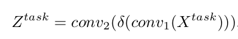

  - $conv_1$: 1x1 conv layer. channel 맞춰주는 역할
  - $Z^{task}$: 최종 task specific feature. sigmoid 함수를 통과하여 bbox or classification prediction output이 생성됨

## 3.3 Prediction Alignment

- 역할: 각 task prediction들 간에 alignment를 하기 위해 최종 TAP의 결과에 한번 더 후처리 해줌

- Classification

  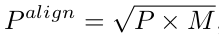

  - 역할: interactive feature의 sigmoid를 통과한 mask M으로 weighting을 줌

  - P: classificaiton score feature map

  - M: mask generated by interactive features with convolution layers

    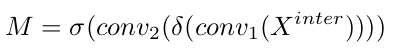

- Localization

  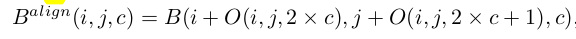

  - 역할:channel-wise offset를 학습시켜 optimal anchor point (anchor box)를 selection

  - (i,j,c): (i,j)번째 spatial localtion의 c번째 channel을 의미함

  - $O$: Offset mask

    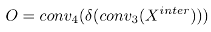

## 3.4 Task Alignment Learning

- 역할: 동적으로 높은 질의 anchor를 선정하는 역할

  - 자동으로 weighting도 부여함

- Metric

  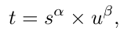

  - $\alpha, \beta$:  hyper-paremeter
  - s : prediction score
  - u: IoU score
  - t의 max를 u로 constrain

- t를 기준으로 top-m개를 positive, 나머지를 Negative로 선정

- Classification Loss

  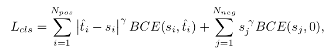

- Localization Loss

  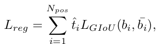

# 4. Experiments

1. Model structure 변화에 따른 TOOD 성능 향상

   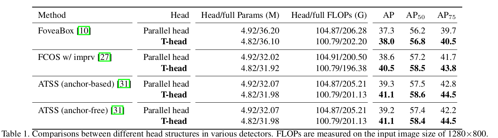

- MS-COCO

  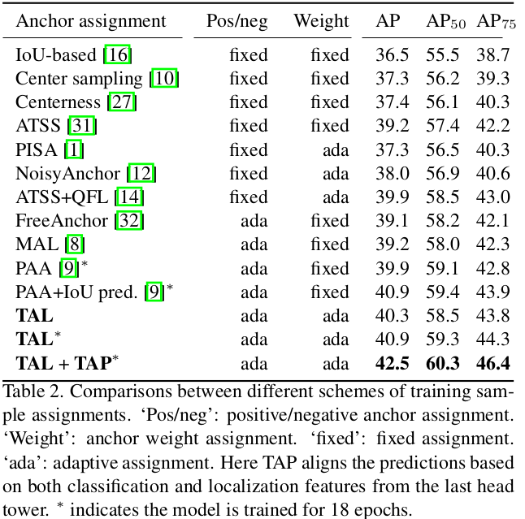

- Qualitative Analysis

  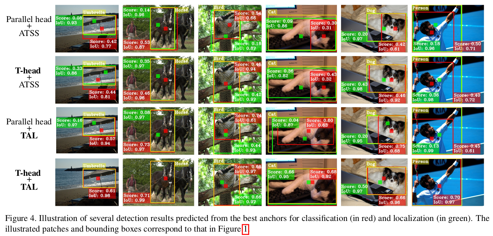

- Ablation Studies 

  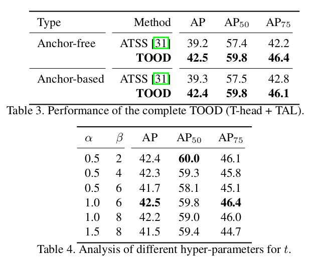

- MS-COCO test-dev set

  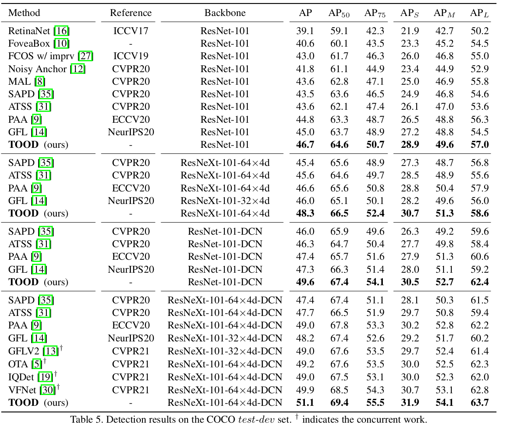

- Classification & Localization alignment 분석

  - PCC : Peasrson Correlation Coefficient

    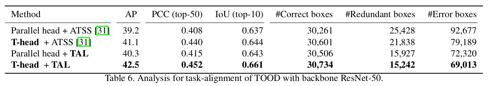
