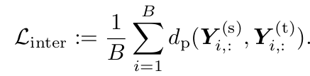
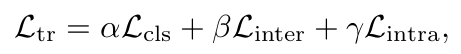
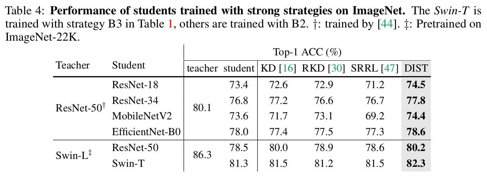

# DIST: Knowledge Distillation from A Stronger Teacher

- paper: https://arxiv.org/abs/2205.10536
- git: https://github.com/hunto/DIST_KD
- NeurIPS 2022 accepted, (인용수: 60회, '23.11.30 기준)
- downstream task : KD for LS

# Motivation

- 기존의 Knowledge Distillation에서 상대적으로 잘 다루지 않았던 Stronger Teacher에 따른 KD 성능 향상을 다루고자 함

- 즉, Teacher와 Student의 차이 (구조적 차이, Layer 수 차이 등)가 클수록 성능 향상폭이 적어지는 "Catastrophic Discrepancy Problem"을 해결하고자 함

- 기존 KD 방식들을 사용하면 Stronger Teacher로 학습해도, 성능이 오히려 떨어지는 현상을 목격함

  

  - Baseline인 naive KL Divergence로 prediction score를 이용하는 방식은 Student의 representational capacity limit으로 인해 challenging하다.

# Contribution

- Teacher의 출력과 일치하도록 강제하는 기존 방식들은 Stronger teacher에서는 성능 향상이 없는 문제제기를 함

- 오히려 teacher의 "relation of predictions"을 유지하도록 학습하는 방식이 stronger teacher를 활용할땐 유의미함을 증명함

- Teacher의 preferences (relative ranks of predictions)를 유지하기 위해 "Pearson correlation coefficient"를 활용

  $$d_p(u,v)=1-\rho_p(u,v) \\ \rho_p=\frac{Cov(u,v)}{Std(u)Std(v)}$$

  - Inter-class correlation : 한 instance 안에서 (row-wise) teacher와 student의 (1-유사도)로 정의

    $$L_{inter}=\frac{1}{B}\sum_{i=1}^Bd_p(Y^{(s)}_{i:}, Y^{(t)}_{i:})$$

  - Intra-class correlation : 한 class 안에서 student, teacher의 (1-유사도)로 정의

    $$L_{inter}=\frac{1}{C}\sum_{j=1}^Bd_p(Y^{(s)}_{:,j}, Y^{(t)}_{:,j})$$

  - 이점: Student가 Stronger teacher의 정확한 Output matching방식해야하는 짐을 제거함, 자유해짐. 대신 informative한 relation으로 guide받게 됨

- 다양한 모델 구조, 모델 사이즈, 그리고 task (OD, Seg, Cls)에서 잘됨을 입증

# Revisiting Prediction Match of KD

- 기존 방식들은 teacher에 따른 성능 향상에 집중하지 않았음

- 식

  

  

  

- Stronger Teacher

  - 모델 사이즈가 커짐에 따른 stronger teacher

    

  - 학습 방식의 진화(?)에 따른 stronger teacher

    

  - Standalone 성능

    - R18B1: 69.76% → R18B2: 73.4%
    - R50B1: 76.13% → R50B2: 78.5%

  - 발견점

    - R18의 경우, Training strategy에 따른 output의 변화량이 적다(?) 
      - 이는 model의 representational capacity에 한계가 있음을 의미한다고 함 (output 변화량을 어떻게 산출한건지는 나와있지 않음)
    - Stronger strategy (B2)일 경우, teacher와 student의 discrepancy가 커짐 (어떤 discrepancy?)
      - 이는 KD loss로 학습할 때 student의 학습을 방해한다고 함
    - 즉, exact match는 **too overambitious**한 목표라고 함

  # Dist: Distillation from a Stronger Teacher

  ## 1. Relaxed match with relations

  - inference 환경에서 classification task의 결과를 나타낼 때, 중요한건 "정확한 수치"가 아니라 class간의 상대적 relations (i.e., ranks of predictions)임

  - 따라서 student가 teacher의 정확한 "score"를 추종하는 것보다, 그들간의 relation을 배우는 것이 학습이 주안점이 되어야 할 것임

    - 정확한 score = prediction의  mean
    - relation = prediction의 분포 == prediction의 분산

  - 한편, 두 input간의 distance metric을 정의할 때 isotone한 mapping으로 입력을 감싸더라도 distance는 보존됨

    

    - $\phi, \psi$: isotone mapping $\mathbb{R}^c \to \mathbb{R}^c$

  - 따라서 단순한 linear mapping으로 distance를 정의할 수 있음

    

    - 단, 조건은 $m_1 \times m_2 > 0$

  - 여기서는 1-유사도로 distance를 정의함

    

    

  - Relation as correlation (Inter-class Loss)

    

  ## 2. Better distillation with intra-relations

  - Inter-Class의 경우 multiple class간의 관계를 instance별로 transfer했다

  - 직관적으로 Intra-Class를 사용하여 multiple instance간의 관계를 class별로 transfer하는 것도 informative하다.

    

  - Total Loss

    

# Experiments

- Dataset

  - CiFAR-100 : $\tau=4$
    - Overfit 방지용
  - ImageNet : $\tau=1$

- Loss weight

  - Classification : $\alpha=1, \beta=2, \gamma=2$
  - Object Detection : $\alpha=1, \beta=1, \gamma=1$
  - Semantic sementation : $\alpha=1, \beta=1, \gamma=1$

- ImageNet Baseline setting(B1) Results

  

  - DIST는 output만 활용하며, 중간 feature사용하지 않아 computationally cheap하다

  - 또, 매우 simple해서 a few lines of code로 구현 가능하다.

    

- ImageNet Strong strategy(B2) Results

  

- CiFAR-100 Results

  

- Object Detection & Semantic Segmentation Results

  - Vanilla KD를 DIST로 simply replace

  

- Ablation Studies

  

  - Vanilla KD보다 Inter-class, Intra-class 모두 성능 향상이 좋음
  - 둘 사 쓸 경우 제일 좋음

- Classifcation Loss 없이 비교

  - 목적 : informative 한 정보가 정말 많은지 비교하기 위해

  

  - 예상대로 KD보다 DIST가 w/o cls. loss에서 훨씬 좋음
  - 이는 cls. loss만 사용한 것보다 DIST loss가 더 좋음으로 반증 (70.65% vs. 69.76%)
