# Towards Few-Annotation Learning for Object Detection: Are Transformer-based Models More Efficient ?

- paper: https://openaccess.thecvf.com/content/WACV2023/papers/Bouniot_Towards_Few-Annotation_Learning_for_Object_Detection_Are_Transformer-Based_Models_More_WACV_2023_paper.pdf
- github: x
- WACV 2023 accepted (인용수: 4회, '23.12.01 기준)
- downstream task : SSL for OD

# 1. Motivation

- SOTA transformer 계열이 convolution 계열보다 few-labeled image에서 좋은 성능을 냄을 확인 (FRCNN vs. Deformable DETR)

  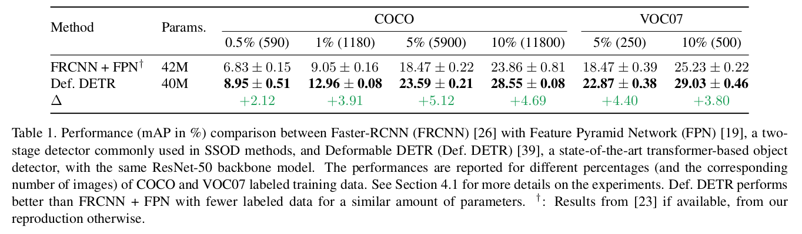

- Unbiased Teacher 기반의 SSL을 Deformable DETR에 적용하면 발산하여 학습이 안됨을 발견

  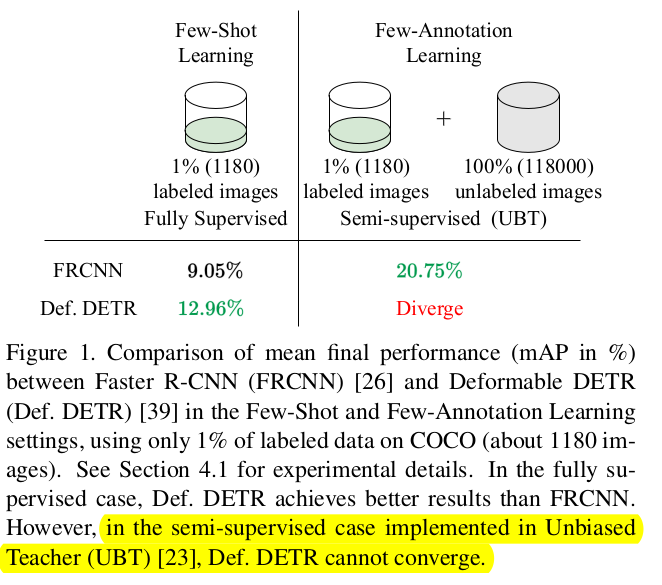

- Transformer계열에서 잘되는 SSL 기법을 찾는다면 SSL에서 SOTA를 낼 수 있지 않을까?

# 2. Contribution

- Transformer 구조에 적합한 SSL기법인 Momentum Teaching DETR (MD-DETR)를 제안함 (기존과 EMA alpha값 schduling한것 외엔 크게 안다른듯)
- 기존 Convolution기반 OD와 다르게 heuristic한 post-processing이 불필요 (아예 threshold 0으로 쓴다는 것도 heuristic하게 발견한 건데..)

# 3. SSL for Transformer-based OD

- Overall Loss

  $$L(B^l, B^u)=\frac{\lambda_l}{N^l}L_s(B^l)+\frac{\lambda_u}{N^u}L_s(B^u)$$

- Supervised Learning

  - Student model의 prediction $\hat{y}^l_i$과 GT $y^l_i$사이의 matching Loss를 최소화하는 optimal bipartite matching $\hat{\sigma}^l_i$를 N개의 permutation elements $\mathbb{G}_N$중에 찾는 문제

    $$\hat{\sigma}^l_i=argmin_{\sigma \in \mathbb{G}_N}\sum_j^NL_{match}(y^l_{(i,j)}, \hat{y}^l_{(i,\sigma(j))})$$

    - $y^l_{(i,j)}$: i번째 이미지의 j번째 G.T.

  - Focal Loss, GIoU Loss, L1 Loss를 최소화하는 알고리즘으로 Hungarian algorithm을 사용

    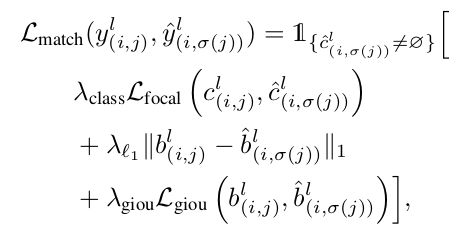

    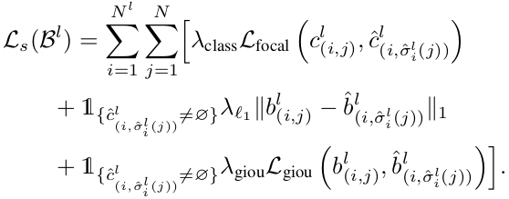

- Unsupervised Learning

  - Student model의 prediction $\hat{y}^u_i$과 teacher model의 prediction $y^u_i$사이의 matching Loss를 최소화하는 optimal bipartite matching $\hat{\sigma}^u_i$를 N개의 permutation elements $\mathbb{G}_N$중에 찾는 문제

    $$\hat{\sigma}^u_i=argmin_{\sigma \in \mathbb{G}_N}\sum_j^NL_{match}(y^u_{(i,j)}, \hat{y}^u_{(i,\sigma(j))})$$

  - Classification Loss 

    - Soft-label을 사용함으로써 class간 관계를 학습하고, hard-label로 인한 over-confidence 특성을 방지하고자 함

      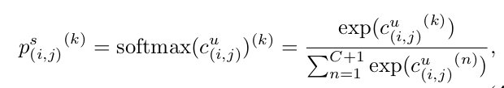

      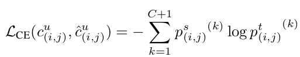

  - Total Loss

    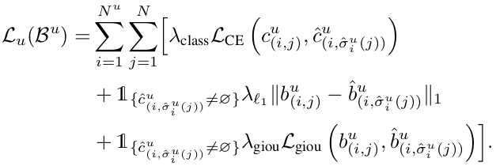

- Updating Teacher

  - EMA방식을 채택하되, 초반에는 $\alpha$를 작게하고, 나중에 크게하여 Consistent한 teacher로 학습시킴

    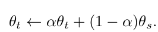

    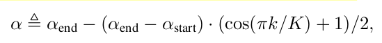

    - K: K 번째 epoch

# 4. Experimental Results

- Augmentations

  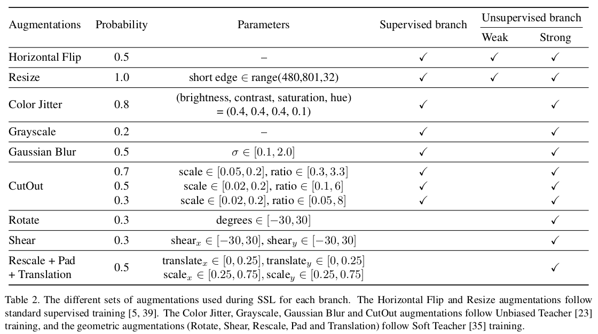

- MS-COCO

  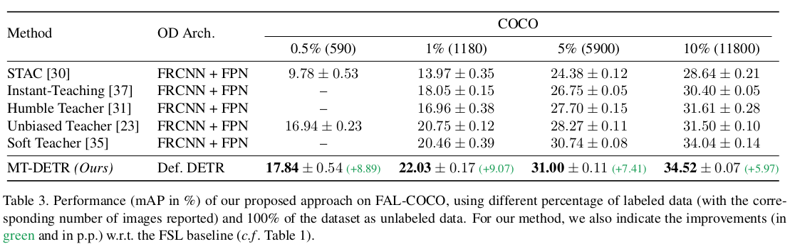

- Pascal-VOC

  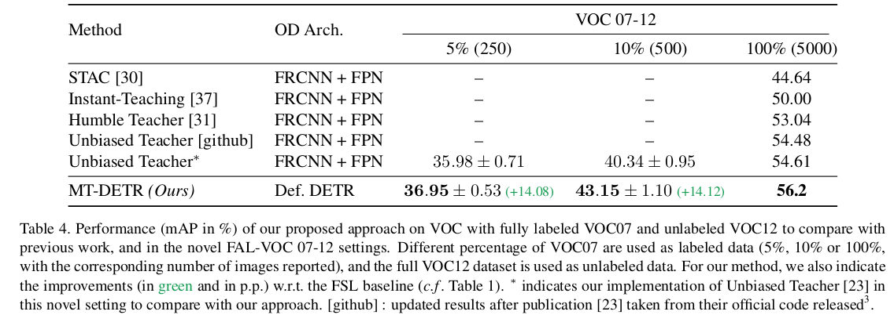

- Ablation Studies

  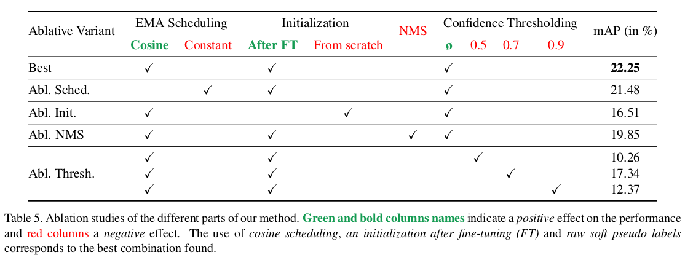
