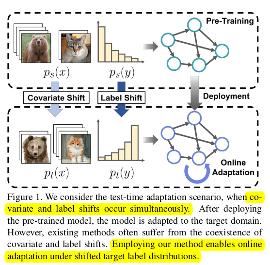

# LSA: Label Shift Adapter for Test-Time Adaptation under Covariate and Label Shifts

- paper: https://arxiv.org/abs/2308.08810
- git: X
- ICCV 2023 accepted, (인용수: 1회, '23.11.29 기준)
- downstream task : TTA for CLS

# 1. Motivation

- 기존 TTA 연구들은 covariance shift만 고려하고, source & target 간의 label shift가 있는 상황에서는 잘 되지 못함을 발견함

  

  - 새로운 label shift adapter를 제안하여 label shift & covariance shift가 있는 real-world에 근접한 TTA를 풀고자함

  - 특히 Class imbalance한 source data인 long-tail problem에서 shift를 풀고자 함

    - 이는 기존 연구들에서는 학습이 안됨 -> Entropy minimization을 하면, over confident한 class에 대해 더 over-confident해지기 때문!

      

  # 2. Contribution

  - label distribution을 예측하는 label shift adapter를 제안함
    - input: source label distribution (+ uniform distribution, inverse label distribution)
    - output: target label distribution의 optimal parameter
    - 장점: Computationally efficient & model structure agnostic함
  - Model의 구조와 상관없이 applicable한 방식임
  - class-imbalance label distribution에서 성능 향상을 보임

  

# 3. Methods

## 3.1 Problem Formulation

- Covariance shifted

  $$p_s(x) \neq p_t(x)$$

- Label shifted

  $$p_s(y) \neq p_y(y)$$

  - 특히 source label 분포가 long-tail인 경우, 기존 TTA는 major class의 bias되는 문제를 해결하지 못함

## 3.2 Label Shift Adapter

- Model $f$가 dynamically target label distribution에 adapt하는 adapter를 제안함

- Overview

  

  - Pre-Training: Source model을 학습하는 단계
  - Training Label Shift Adapter : Frozen pretrained model로 adapter를 학습하는 단계
  - Test-time Adaptation : Affine parameter를 optimze하는 단계. Target Label distribution에 따라 affine parameter를 optimze

## 3.3 Label Shift Adapter

- $\mathbb{G}_{\phi}$

  - input : label distribution $\pi \in \mathbb{R}^c$

  - output 

    - affine parameters $\gamma_h \in \mathbb{R}^{1 \times d}$, $\beta_h \in \mathbb{R}^{1 \times d}$
    - Classifer weight differences $\Delta W \in \mathbb{R}^{d \times C}$, $\Delta b \in \mathbb{R}^{1 \times C}$,

  - Prediction after Optimization 

    

    - $\Delta W$, $\Delta b$: Classifer head에 대한 weight만 업데이트 수행함. <u>이는 모델의 구조가 어떻든 적용 가능하며, Efficent하게 설계하기 위함.</u>

- Generalized logit adjusted Loss

  - Controlled bias를 학습에 활용하여 long-tail problem을 학습할 때 사용하는 Loss

  

  - $\pi_s$: source의 label distribution, uniform distribution, inverse source label distribution 중 1개로 매 iteration마다 선택됨
  - $\tau$: $\pi_s$가 선택되는 분포에 따라 0, 1, 2로 선택됨
    - 0: no bias 
    - 1: uniform bias added
    - 2: inverse bias added
  - $y_i$: source의 label
  - $\hat{y}_i$: softmax 이전 model의 출력
  - $\sigma$: softmax

- $\tau$가 커짐에 따른 decision boundary의 움직임 (minor class -> major class)

  

## 3.4 Test Time Adaptation

- Entropy Minimization Loss

  

  - $\hat{y}$: EMA로 업데이트된 test pseudo label

    

    - $\bar{y}_t$: 
      - $\hat{y}^i_t$: Label Adapter로 optimize된 값

# 4. Experiments

- CiFAR-10-C / CiFAR-100-C

  

- ImageNet-C

  

- VisDA-C & OfficeHome

  

- DomainNet

  

- Upper bound vs. Label Shift Adapter

  

  - Comparable 결과를 출력함

- Long-Tailed Problem에 특히 효과적 (Backward-LT)

  

- Computational Cost

  

  - 무시 가능한 수준

- Estimated Label Distribution

  

  - With / Without LSA가 차이가 큼 -> LSA가 효과있음을 입증
