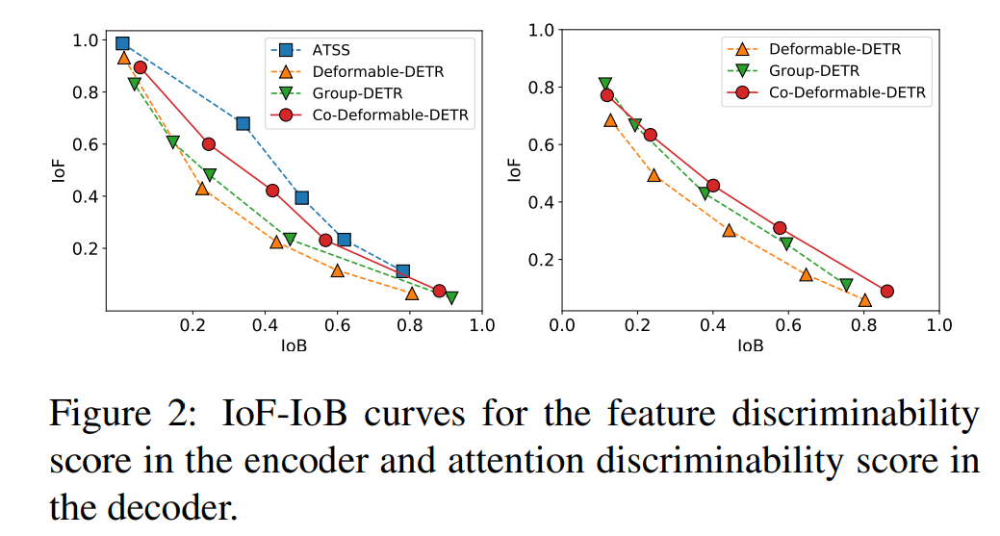

# [OD] CoDETR: DETRs with Collaborative Hybrid Assignments Training

- paper: https://arxiv.org/abs/2211.12860
- git: https://github.com/Sense-X/Co-DETR
- Published: ICCV 2023 - 11.23 기준 35회 인용
  - 22년 11월에 arxiv 등록, ICCV 2023 3월 제출

## Introduction

### Problems of previous works and motivation

- 기존의 DETR methods 는 few queries 들만 positive samples 에 할당됨 → 학습에 안좋은 영향
- one-to-one matching 이 갖고 있는 문제를 해결하기 위한 방법론들을 제안
  - one-to-many matching 을 사용하는 다양한 detector head를 사용하는 구조 제안
- Collaborative hybrid assignments training scheme 을 제안
  - 기존의 one-to-one matching
  - one-to-many matching detector 들의 다양한 head 사용 (training 과정에만)

- 기존의 다른 DETR 방법론들보다 뛰어난 성능을 보여줌

### One-to-One Matching Problem

One-to-One matching 의 문제점 분석을 위해서 **Discriminability score** 와 **IoF-IoB curve** 실험 결과를 보여준다.

- **Discriminability score**: Encoder feature를 channel 방향으로 L2-norm

  $F_j \in \mathbb{R}^{C \times H_j \times W_j} \to \hat{F}_j \in \mathbb{R}^{1 \times H_j \times W_j}$

  - Multi scale에 대해 평균한 값

    $D(F) = \frac{1}{J} \sum_{j=1}^J \frac{\hat{F}_j}{max(\hat{F}_j)}$

    - J: Multi scale number

- **IoF-IoB curve**

  - IoF - Intersection over foreground

    

    - Foreground 에 해당하는 부분에서 S 값을 넘는 부분을 masking

      $$M^{fg} \in \mathbb{R}^{H \times W}$$

  - IoB - Intersection over background

    

    - 왼쪽 - Encoder feature, 오른쪽 - Decoder attention score
    - One-to-One matching 인 DETR 방법들은 One-to-Many matching 방법인 ATSS 보다 떨어지는 것을 보여줌

## Proposed Method

**Collaborative Hybird Assignments Training**

one-to-many matching 을 사용하는 여러 detector 의 head를 사용

- Multi-scale Adapter
  - Given encoder’s latent features
  - 3 x 3 convolutions 와 stride 2 로 downsampling

- one-to-many label assignments 학습 loss

  - 각 Detector head 과정을 그대로 사용

    $$L^{enc}=\sum_{i=1}^KL_i^{enc}$$

    - K개의 head에 대해 합

**Customized Positive Queries Generation**

one-to-many detector 의 head 들에서 얻어지는 proposal 을 통해서 queries 를 생성

- positive에 해당하는 proposal 들에 대해서만 query를 생성

- 해당 query를 입력으로 사용해서 decoder 에서 prediction 하고 loss 연산

  

- 최종 학습 loss

  

  - one-to-one matching loss + K개 head 에 대한 decoder loss + K개 head 에 대한 proposal loss

## Experiments

- **Implementation details**
  - K=1 - ATSS
  - K=2 - ATSS, Faster-RCNN
  - 300 queries
  - {λ1, λ2} - {1.0, 2.0}

- single scale DETR에 auxiliary head 추가

  

  - ++ 은 Detrs with hybrid matching 에서 제안하는 방법과 정확한 비교를 위해서 세팅을 맞춰서 진행한 것을 따라한 것

    

    - Detrs with hybrid matching 논문의 표현

- MS-COCO Validation

  

  

- LVIS Validation

  

- K에 따른 ablation study

  - K가 무작정 많아진다고 성능이 올라가지 않는다 → 저자들은 이부분을 여러 헤드가 붙으면 conflicts 가 난다고 분석

    

  - 어떤 헤드에선 positive 어떤 헤드에서는 negative

  - **Conflicts analysis**

    

    - KL divergence 를 활용해서 분석

      

      - 각 헤드에 대한 결과를 class activation maps(CAM) 에 대한 KL 결과를 사용 (자세한 서술이 없지만 해당 데이터의 GT class 정보를 활용해서 classification layer 에 붙어 있는 feature 값을 활용했을 것으로 추정)

        - K=1 일때는 원래 detr head 와 비교
        - K>1 일때는 각 head 들끼리 비교하고 평균

        

        

- K=1 Head에 따른 성능 변화 Ablation

  

  - K=1 에 대한 결과, 어떤 헤드를 사용해도 상관없을 정도의 차이들이다

- 각 component 들에 대한 ablation study

  

- 정성적 분석

  

  - red point - gt 와 assign 된 query
  - blue points - Faster-RCNN head로 부터 얻어진 positive query
  - orange points - ATSS head로 부터 얻어진 positive query

## Conclusions

- one-to-many 방식의 head 들을 추가해서 hybird 방식으로 학습하는 방법을 제안
- 추가된 head 에서 얻어진 proposal 을 기반으로 query를 만들고 decoder 를 학습
- SOTA를 달성
