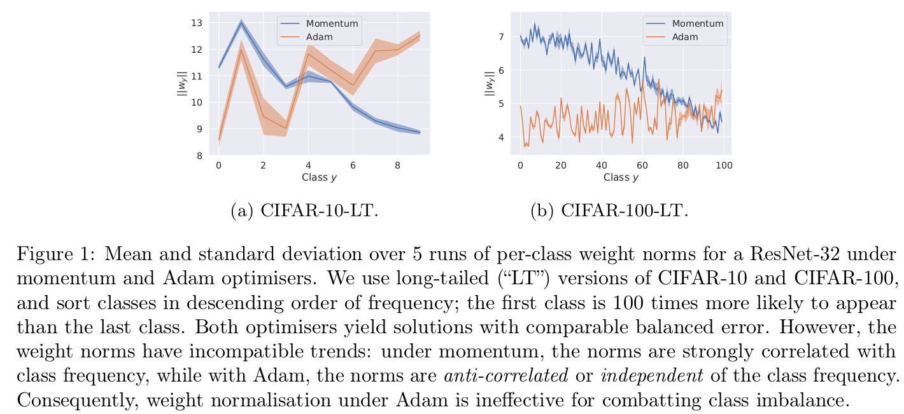
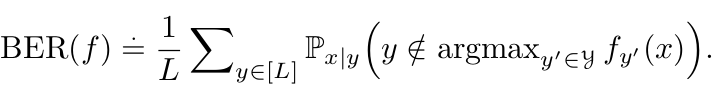

# [LT][CLS\] Long-Tail Learning via Logit Adjustment

- paper: https://arxiv.org/pdf/2007.07314.pdf
- github: https://github.com/google-research/google-research/tree/master/logit_adjustment
- ICLR 2021 accepted (인용수: 456회, '23.12.06 기준)

# 1. Motivation

- Long-tailed classification 문제를 푸는데 domiant label에 biased된 학습을 하곤 한다.

- 기존에 LT문제를 풀기 위해 사용되는 label adjustment 기반의 방법론을 검토한다.

  - weight normalization : optimizer에 따라 성능 차이가 발생함

    

    - SGD optimizer : weight norm값과 class frequency 패턴이 유사함 (class 0 -> 100 갈수록 적어지는 데이터 CiFAR-100-LT)
    - Adam optimizer : 다른 경항

  - loss modification : argmax를 취했을 때, consistency 문제가 발생함

    - **Fish Consistency** : **Balanced error를 최소화하는 결과와 loss modification으로 인한 error를 최소화 하는 결과가 같아야 한다**

      - Balanced Error : Imbalance classification에서 주로 사용하는 Loss (or Metric)

        가령, native  dominant class로만 예측하면 accuracy가 증가하는 문제가 있음

        하지만, 는 에 dependent하지 않음

        

        - $L$: Number of class
        - $y$: label
        - $x$: image
        - $y'$ : negative label

      - 기존 방식은 positive $y$의 frequency와 negative $y'$의 frequency를 모두 고려하고 있지 않음

      - 하지만 본 논문에서는 통계적 background를 바탕으로 fisher consistent margin을 부여함

# 2. Contribution

- Long-Tailed problem에 적합한 logit adjustment을 기반으로 하는 두 가지 방법론을 제안함
  - post-hoc : 학습 없이 post-hoc으로 진행
  - during training (softmax loss기반) : 학습 병행하여 추가 성능 향상
- pairwise label margin을 추가한 General한 Softmax version의 loss를 제시
  - 기존 방식들의 한계인 Balanced Error에 대해 Fisher consistent하지 못하다는 문제를 해결함
- Real-world dataset에서 성능 향상이 있음을 보임

# 3. Problem setup

- Softmax Cross Entropy Loss

  

  - $f(x)$: model의 softmax 통과 전 output
  - $L$: number of Class

- Previous Methods

  

  - input을 건드림 : over-sampling / under-sampling

  - output을 건드림 : pos-hoc correction

  - internal 값을 건드림 : loss 함수 변경, 등

    여기서는 output / internal 두 방식을 중점으로 재점화

## 3.1 Post-hoc 

- $\nu_y$: weight term for label $y$. could be weight 2-norm or label y's distribution

- $\Phi(x)$: feature before classification weight of input $x$

- $w_y$: classification weight for label $y$

  단점: weight norm의 경우, optimizer dependant함. 그렇다고 $\nu_y=\pi_y$ 즉 label $y$의 분포를 direct하게 쓴다 해도 label ordering이 달라지는 이슈가 생김

## 3.2 Loss modification

- 다양한 형태의 Loss modification이 있음

1. Balance loss

   

   - label $y$ 의 prediciton score의 역수를 곱해 imbalance한 class에 대한 가중치를 높임 -> decision boundary를 dominant class쪽으로 밀어내는 역할

2. Hingle loss

   

   - class label마다 per-class margin $e^{\delta_y}$를 곱한 형태. $ \propto \mathbb{P}(y)^{-1/4}$
   - rare positive $y$와 any negative $y'$간의 더욱 큰 margin을 부여

   

   - $\delta_{y'} \leq 0$: non-decreasing transform. 
   - 직관적으로 negative dominant label $y'$에 대해 음의 margin을 주어, rare positive $y$에 대해 gradient가 inhibit되는 것을 방지

단점: 모든 기존의 Loss modification들은 either $y$ 혹은 $y'$의 분포만 고려했지, 둘 다 고려하고 있지 않음 -> fisher consistency가 무너짐

# 4. Logit Adjustment for long-tailed learning : Statistical Review

- 목표: Balanced error를 최소화

  

  - 위 식에서 $\mathbb{P}^{bal}(y|x) \propto \frac{1}{L} \mathbb{P}(x|y)$이기 때문에 2, 3번째 equal 이 성립함 (L은 상수)
  - 정의에 의해 $\mathbb{P}^{bal}(y|x) \propto  \mathbb{P}(y|x)/P(y)$ 임
  - $\mathbb{P}(y|x) \propto e(s^*_y(x))$, $s^*: x \to \mathbb{R}^L$ 인 scorer이므로

  

  

- 위 식을 optimize하기 위한 두 가지 방법

1. Post-hoc: 기존의 standard 를 학습시키고, class prior y의 분포에 대한 log값을 빼준다.
2. Train: 을 위 식처럼 수정해서 학습한다.

# 5. Post-hoc Adjustment

- $\tau >0$: hyperparameter. 1이면 위 4장에서 다룬 balanced error 와 동일. 아니면 temperature scaling한 post-hoc
- $\pi_y$: true label $y$의 distribution

# 6. The Logit Adjusted softmax cross-entropy

- $\pi_{y'}$: label $y'$의 distibution 분포
- $\pi_{y}$: label $y$의 distibution 분포
- $f_{y'}$: label $y'$의 softmax 이전 model output feature
- $f_{y}$: label $y$의 softmax 이전 model output feature

- 위 식은 scorer $g_y(x)=f_y(x)+\tau log(\pi_y)$를 학습시키고, pos-hoc adjustment처럼 $\tau log(\pi_y)$를 logit에 추가한 형태로 볼 수 있음

- 이를 일반화 하면

  

  - $\Delta_{yy'}$: desired label margins between $y$, $y'$

    ex.

    - $\alpha_y=1$ , $\Delta_{yy'}=log(\frac{\pi_{y'}}{\pi_y})$ 면 6장의 adjusted softmax cross-entropy
    - $\alpha_y=\frac{1}{\pi_y}$ , $\Delta_{yy'}=0$ 면 3.2장의 balanced loss
    - $\alpha_y=1$ , $\Delta_{yy'}=\pi_y^{-1/4}$ 면 3.2장의 hinge loss

- Theorem 1

  

  - $\delta_y=\pi_y$면 logit adjusted softmax cross-entropy 가됨
