# [MM] SKD : Combining inherent knowledge of vision-language models with unsupervised domain adaptation through self-knowledge distillation

-  paper: https://arxiv.org/abs/2312.04066
- github: https://github.com/ThomasWestfechtel/SKD
- downstream task : DA for cls

# 1. Motivation

- 최근 vision-language 기반 zero-shot classification의 성능이 매우 좋음

  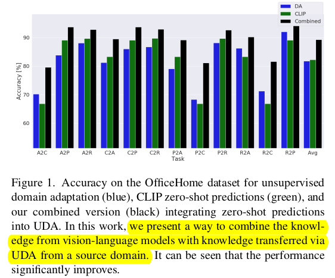

- Domain Adaptation에 vison-language foundation model을 적용한 연구가 없음

- Domain Adaptaion과 VLM을 함께 사용하여 DA를 해보자!

# 2. Contribution

- VLM으로 zero-shot Self-Knowledge Distillation을 하는 방법을 기존에 UDA와 함께 적용함
  - zero-shot prediction을 간단하게 adjust하는 기법을 제안함
- Gradual source domain expansion (GSDE)를 통한 UDA에 zero-shot prediction을 적용함
- CNN & Vision-Transformer기반에서 좋은 성능을 나타냄

# 3. SKD

- Overview

  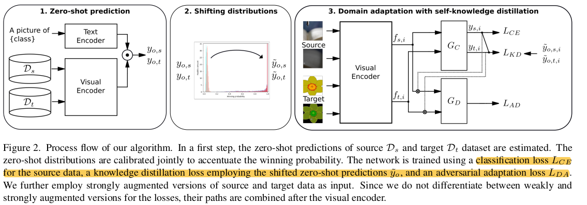

  - 3단계로 구성
    - 1단계: source & target data의 probability distribution 산출
    - 2단계 : entropy sharpening parameter $\alpha$로 distribution을 one-hot vector처럼 만드는 단계
    - 3단계 : KD Loss, UDA Loss, CE Loss로 학습하는 단계 (VLM의 Visual Encoder 포함)

  

- Total Loss

  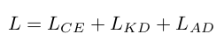

## 3.1 Knowledge Distillation Loss

- VLM의 Zero-shot prediction은 evenly distributed된 경향이 있음

  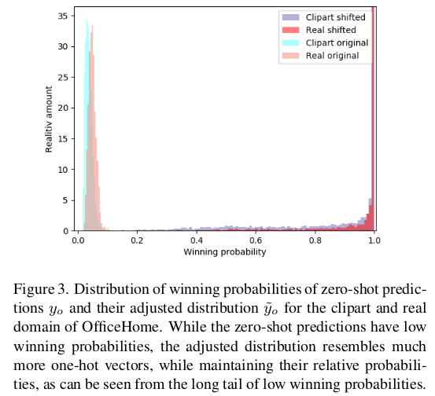

- 이를 teacher model의 output처럼 one-hot으로 만들어주고자, winning probability $\tau$ 라는 hyperparameter로 tuning을 진행

  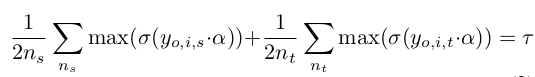

  - 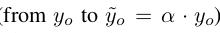
  - $\sigma$: softmax
  - $y_{o,i,s}$: i번째 source data의 zero-shot prediction
  - $y_{o,i,t}$: i번째 target data의 zero-shot prediction

- 위 식으로 tuning된 zero-shot prediction $\tilde{y}_o$

  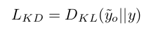

## 3.2 Adversarial Loss

- baseline : CDAN

  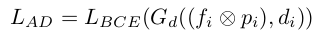

  - $G_d$: target인지 source인지 분류하는 분류기
  - $f_i$: sample i의 feature
  - $d_i$: domain label
  - $p_i$: sample i의 class probability

## 3.3 Gradual source domain expansion

- network가 N번 반복하며 학습하며 매번 weight를 resetting해주되, n번째 score는 $\frac{n-1}{N}$ hishest scoring target sample로 pseudo-label을 예측하는 기법 (Ensemble 느낌)

- 거기에 zero-shot prediction을 추가한 형태 

  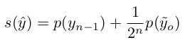

  - $n$: n번째 iteration
  - $s$: score of sample (pseudo-source sample)

## 3.4 Batch Norm layer adjustment

- Test-Time Adaptation에서 많이 쓰는 기법

- Zero-shot VLM의 batch-norm affine parameter만 switching해줌

  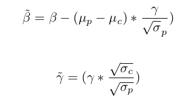

# 4. Experiment

- OfficeHome

  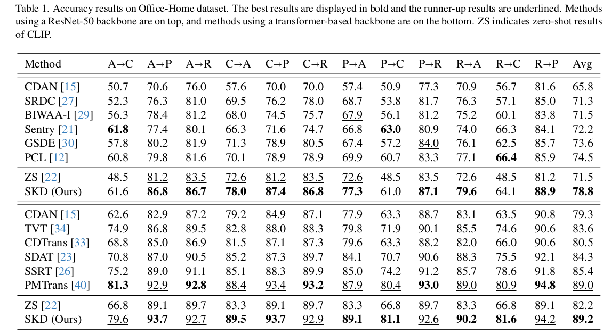

- VisDA

  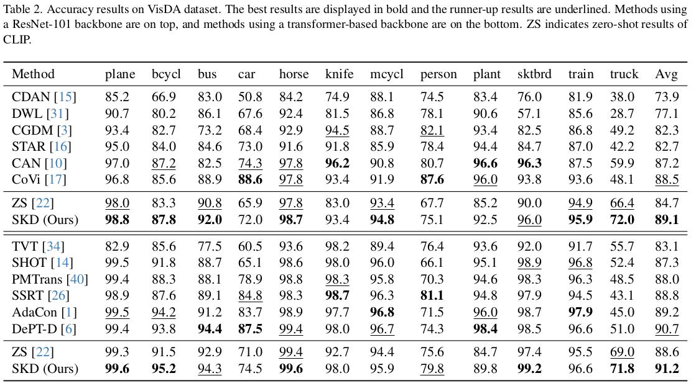

- DomainNet

  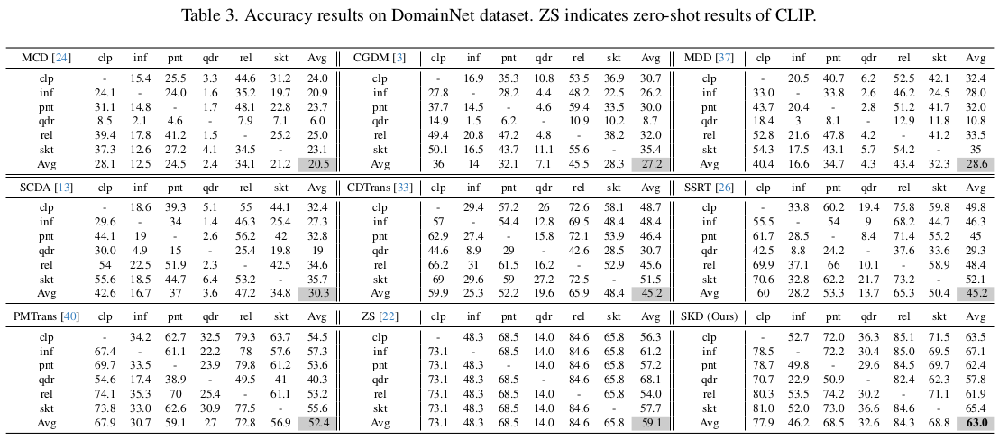

- Ablation

  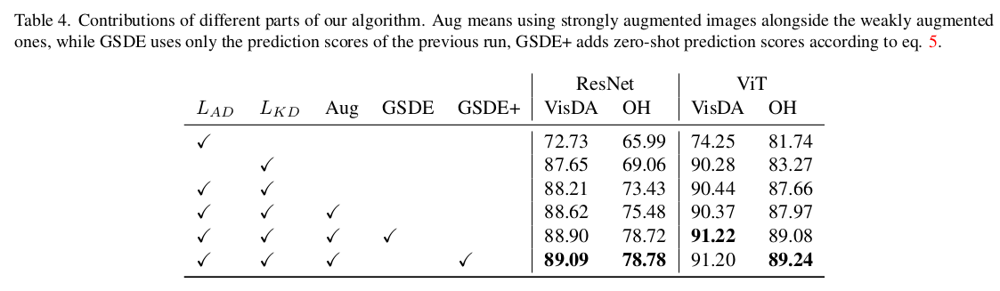

- Hyperparameter Tuning

  - $\tau$=0.9 사용

    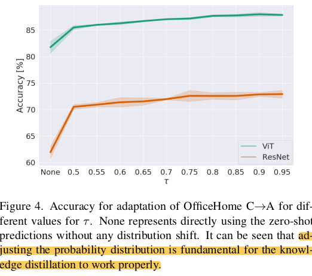
