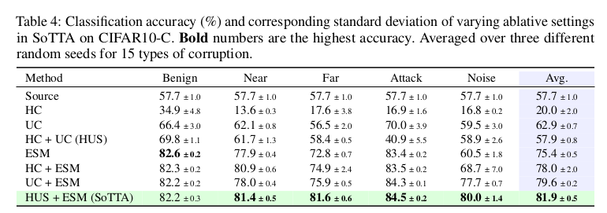

# [TTA][CLS] SoTTA: Robust Test-Time Adaptation on Noisy Data Streams

- paper: https://arxiv.org/pdf/2310.10074.pdf
- github: https://github.com/taeckyung/SoTTA
- downstream task: TTA for CLS
- NeurIPS 2023 accpeted (인용수:0회, '23.12.12 기준)

# 1. Contribution

- noisy label이 있다 가정하여 현실에 적합한 TTA 셋팅을 제안하고, 기존 SOTA TTA는 이에 적응하지 못함을 발견

- noisy image가 있는 상황에서도 강인한 Screening-Out TTA (SoTTA)를 제안함

  - Noise를 4가지로 정의함

    

    - Near : domain이 다른 데이터 (ex. ImageNet vs. CiFAR-100)지만, 유사한 semantic을 지닌 데이터
    - Far : 완전 다른 데이터 (ex. CiFAR-100 vs. MNist)
    - Adversairal Attack : model이 헷갈리도록 attack한 데이터
    - Noise : white noise

  - 2가지 방식으로 구성됨

    - Input-wise : High-confident sample을 memory bank에 저장함 
    - Parameter-wise : entropy sharpness minimization을 기반으로하여 sharp minima에 빠지는 것을 방지함

- SoTTA가 기존 noisy dataset에서 우수함을 보임

# 2. SoTTA

- Overview

  

## 2.1 Input-wise robustness via high-confidence uniform-class sampling

- noisy sample에 대해서 confidence가 benign (original clean image)에 비해 낮다는 특징을 관찰함

  

- 또한, noisy sample에 대해서는 attack case를 제외하고는 label distribution이 skewed되는 현상을 발견함

- uniform하게 clean한 데이터에 대해서만 adaptation을 수행하고자 HUS (High-confidence Uniform class Sampling)을 제안함

  

  - $M$: Memory bank

  - $C(x, \theta)$: class score

    

  - $C_0$: conifdence threshold

- 기존 TTA 방식 차용

  - BN affine parameter만 업데이트

  - EMA로 $\mu, \sigma$ 업데이트

    

## 2.2 Parameter-wise robustness via entropy-sharpness minimization

- 그럼에도 불구하고, 모델이 noisy sample로 학습될 수 있음

- 위 현상에 대해 robust하고자, entropy-sharpness minimzation을 도입함

  

  - (a)는 noisy sample을 학습에 활용함에 따라 over-fitting되어 gradient norm은 줄어드나, accuracy가 감소함

  - (b)는 noisy sample을 학습함에도 entropy-sharpness minimization을 통해 sharp한 minima에 빠지지 않음으로써 robust 하게 학습함

  - ESM (Entropy-Sharpness Minimization) Loss

    

    - $\rho$: model parameter perturbation. hyperparameter

  - Gradient of ESM : Tayler series 1차로 approximation.

    

  - Dual Norm 문제로 approximate

    

    - $p+q=1$

    

    

# 3. Experiment

- CiFAR10-C

  

- CiFAR-100C & ImageNet-C

  

- Ablation Studies

  

- Noisy data 수에 따른 성능 변화

  
