# [OD] DAB-DETR: Dynamic Anchor Boxes are Better Queries for DETR

- paper: https://arxiv.org/pdf/2201.12329.pdf
- github: https://github.com/IDEA-Research/DAB-DETR
- ICLR 2022 accepted (인용수: 329회, '23.12.20 기준)
  - Tsinghua University, Intell. Tech., HK University
- downstream task: OD

# 1. Motivation

- Cross-attention의 Query, Key간의 Positional prior가 mismatch하는 것이 DETR-like 모델들의 학습 속도가 느려지는 원인임

  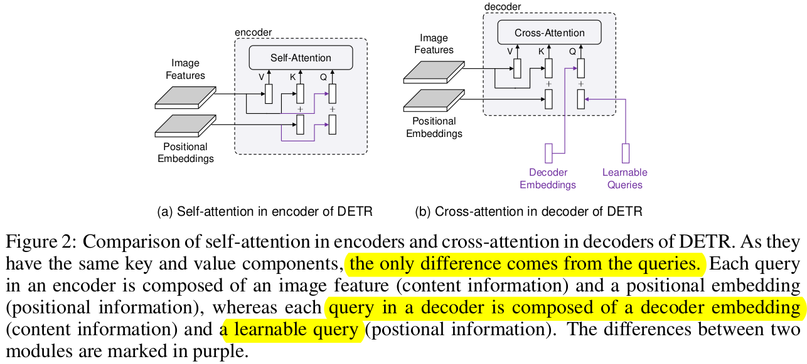

  - Decoder embedding : Decoder의 self-attention 을 통과한 embedding vector. Initialized as zeros
  - Learnable Queries : Object candidate를 찾는 learnable vector.
  - Positional embedding : positional information을 지닌 embedding. 주로 Sinusoidal embedding을 활용

- Cross-attention에서 학습이 느려지는 가설 2개를 실험을 통해 검증함으로써, 위 가설을 증명함

  1. query가 optimization 하며 학습하는게 힘들기 때문

     - 이미 학습된 query를 Fix 시키고 iteration마다 학습 결과를 보니, 차이가 없었음. 즉, 학습이 잘 되고 있다!

       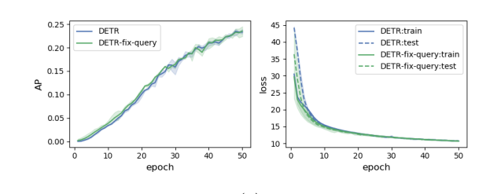

  2. image feature의 positional embedding과 다른 값으로 query의 positional embedding을 encoding했기 때문

     - 2D positional embedding값으로 query의 positional embedding해보니 학습도 빠를뿐더러, 성능이 좋아지더라

       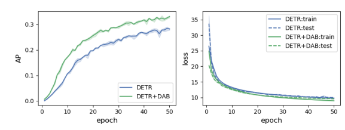

- conditional-DETR, Anchor-DETR 등 기존에 DETR의 학습 속도 개선을 위한 논문들에서는 object query의 spatial query로 box size를 고려하고 있지 않았다. box size를 고려해보자!

- Anchor의 4D 정보를 활용하여 PE를 구함으로써 **직관적이고, layer-by-layer dynamic updated anchor**를 활용해보자!

  - 4D box coordinates $(x,y,w,h)$

  

# 2. Contribution

- DETR의 Decoder cross-attention시 query에 4D anchor를 활용하여 구현함으로써 DETR의 query에 대한 이해도를 향상시킴

  - learnable query는 key, value의 image feature에서 **soft-RoI pooling layer** 역할을 한다!

- Anchor shape를 고려함으로써 positional attention map을 구성할 때, 위 정보를 고려하여 설계할 수 있게됨

  - box size $(w,h)$가 cross-attention map을 modulate하는데 활용함

    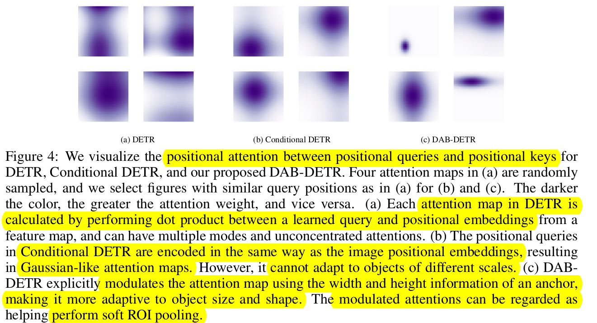

  - $w,h$가 각각 positional embedding $x, y$의 cross-attention weight를 계산할 때 활용! 

  - different shape에 따른 object에 match할 수 있도록 Attention-map의 Gaussian prior를 변경함

  - 직관적인 positional embedding을 활용했기 때문에, decoder의 layer-by-layer로 anchor를 업데이트 할 수 있게됨

    (기존에 object query는 layer-by-layer 업데이트 하지 않고 있었음)

    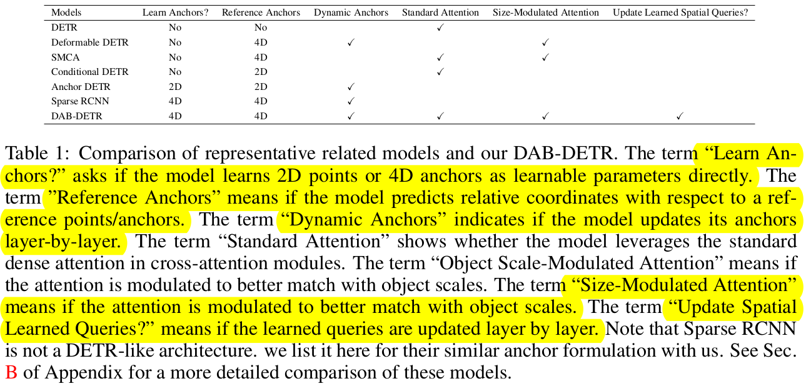

- MS-COCO benchmark에서 SOTA

# 3. DAB-DETR (Dynamic Anchor Box DETR)

- Overall Diagram

  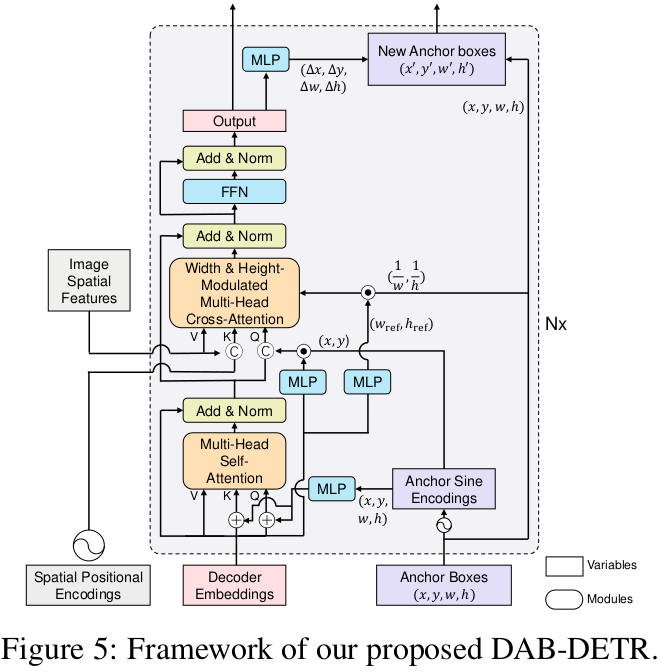

- 가장 큰 차별점 2가지

  - 2D coordinate anchor-box를 기반으로 positional query를 encoding한다. 따라서, key의 positional embedding과 같은 coordinate로 mapping되어 학습이 빨라진다.
  - layer-by-layer로 positional embedding을 업데이트 시켜준다. 즉, 점차적으로 향상된 anchor-box priror로 positional embedding을 수행할 수 있게된다.

- Compared with previous SOTA DETR-like decoders

  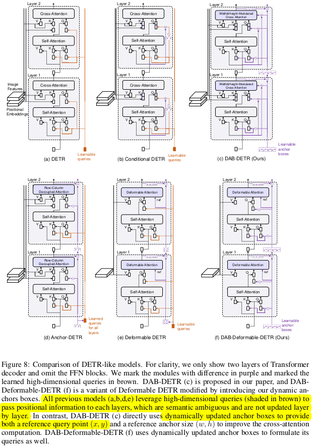

## 4.1 Learning Anchor Box Directly

- Query는 Positional Query($P_q$) + Context Query($C_q$)로 구성됨

- Positional Query

  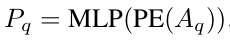

  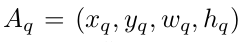

  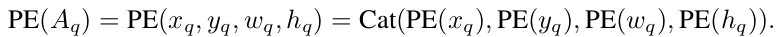

  - **PE**: Positional Embedding function. $\mathbb{R}^D \to \mathbb{R}^{D/2}$
  - **MLP**: Multi Layer Perceptron. $\mathbb{R}^{2D} \to \mathbb{R}^{D}$

- Scale vector query

  - MLP로 학습되며, cross-attention map의 x, y의 weight에 영향을 주게 구성함

    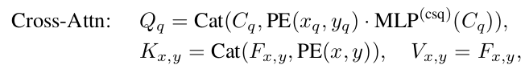

    - **MLP**$^{csq}$ : conditional spatial query. $\mathbb{R}^D \to \mathbb{R}^D$

- Anchor Update

  - query의 입력이 coordinate이므로, decoder의 이전 layer 출력값을 통해 positional embedding anchor를 업데이트할 수 있음 $\Delta{x},\Delta{y},\Delta{w},\Delta{h} $

## 4.2 Width & Height Modulated Gaussian Kernel

- cross-attention map의 x, y에 해당 anchor의 w, h를 곱해준다.

  - As Is

    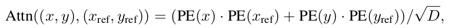

    - $x, y$: decoder cross attention layer key의 positional embedding
    - $x_{ref}, y_{ref}$: decoder cross attention layer query의 positional embedding

  - To be

    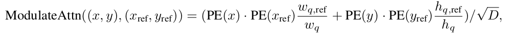

    - $w_q, h_q$: Positional query의 Anchor로 사용된 2D anchor width and height

    - $w_{q, ref}, h_{q, ref}$: Content query ($C_q$)로부터 MLP를 통과한 normalized 2D anchor width and height

      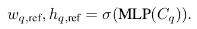

## 4.3 Temperature Tuning

- Temperature parameter에 따른 Positional embedding Gaussian attention map이 달라짐

  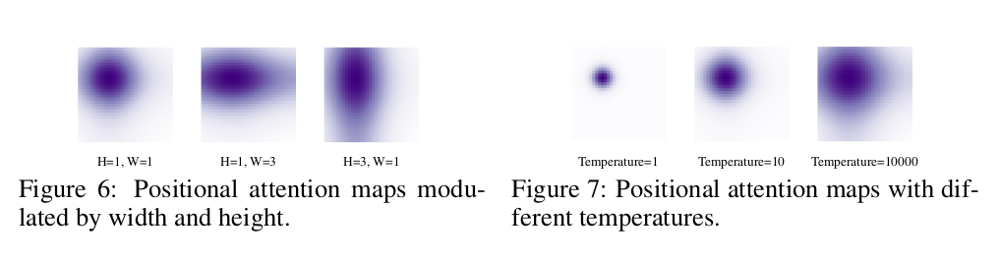

# 5. Experiment

- MS-COCO

  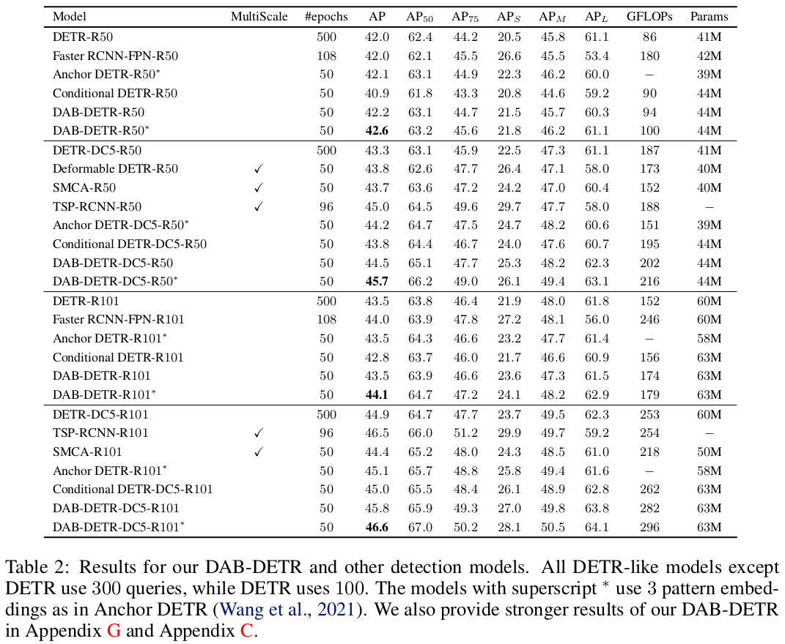

- Ablation

  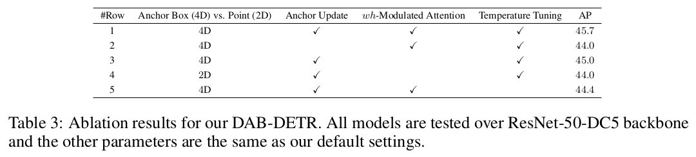
