# [OD] DINO: DETR with Improved DeNoising Anchor Boxes for End-to-End Object Detection

- paper: https://arxiv.org/abs/2203.03605
- github: https://github.com/IDEA-Research/DINO
- CVPR 2022 accepted (인용수: 496회, '23.12.26 기준)
- downstream task: OD

# 1. Motivation

- Classical detector들은 오랜 시간에 걸쳐 최적화가 수행되었기 대문에 현재 SOTA 모델은 Transformer기반이 아니었음
- Transformer 기반의 DETR-like 모델들의 scalability에 대한 고찰과 larger backbone에 따른 고찰이 부족하였음

# 2. Contribution

- Contrastive DeNoising training, Mixed query selection, 그리고 look forward twice를 적용한 새로운 DETR-like model인 DINO를 제안함

- DINO 모듈별 ablation study를 통해 각 모듈별 유효성을 입증함

- Public benchmark에서 pre-training data와 backbone을 scale up한 결과 SOTA를 달성함

  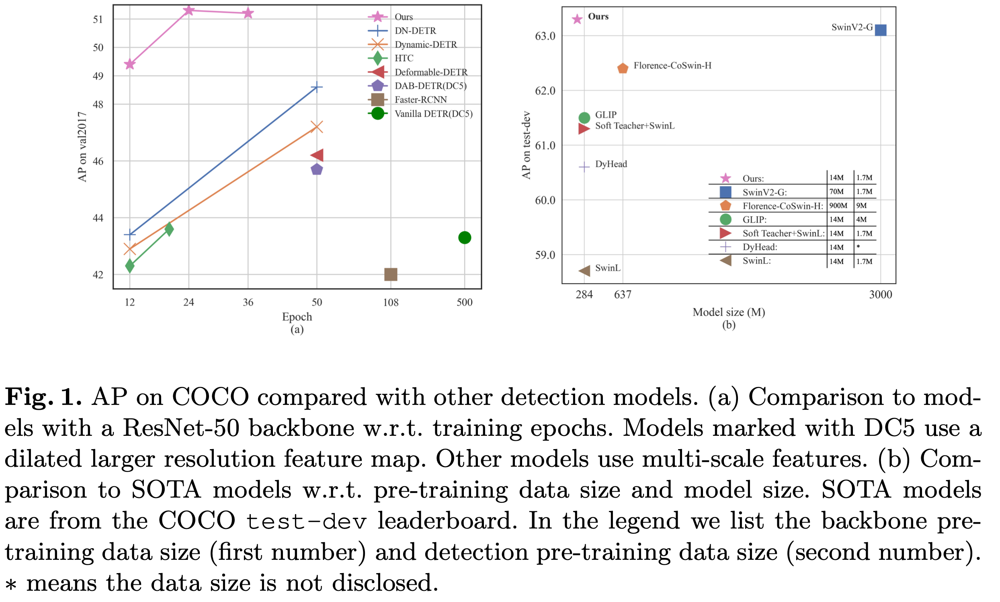

# 3. DINO

- baseline : DAB-DETR+DN-DETR+Deformable-DETR

- overall diagram

  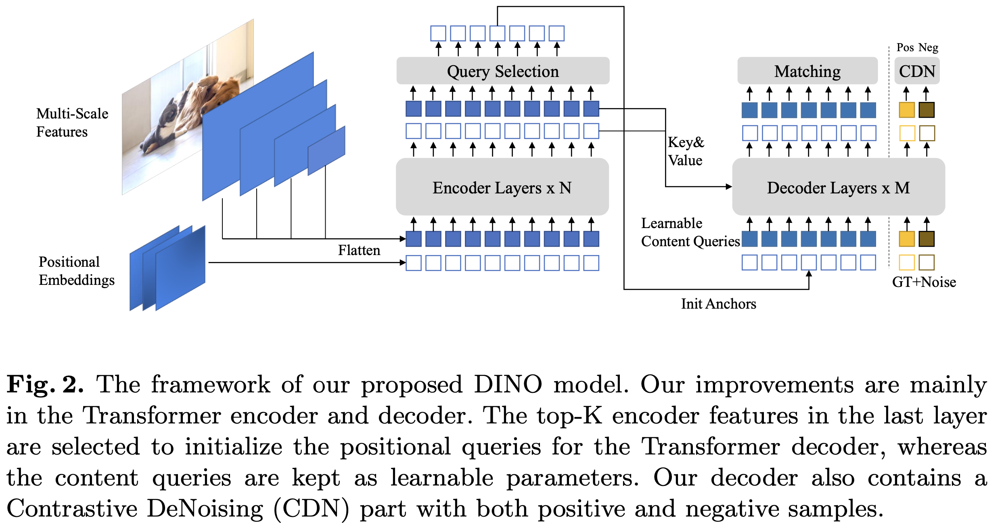

  - Mixed Query selection: Positional query의 경우, encoder에서 학습된 query를 사용하되, content query의 경우 learnable query로 initialize된 query를 사용
  - Contrastive DeNoising training: 중첩된 matching을 최소화 하고자 positive, negative 4D anchor를 noisy GT label로 생성하여 negative query의 경우 "no object"로 reconstruction하며 학습함
  - Feed forward twice: decoder의 positional offset뿐만 아니라, 이전 layer의 anchor자체도 학습에 활용

## 3.1 Contrastive DeNoising Training

- "No object"에 대한 예측 능력은 기존 방식으로 학습이 잘 안되었음.

- $\lambda_1, \lambda_2$를 hyper parameter로 선정하여, $\lambda_1 \leq$영역의 noise는 positive, $\leq \lambda_1$ and $ \lambda_2 \leq$인 noise에 대해서는 hard negative로 정의하여 각각 object, no object로 reconstruction loss, $l_1$ loss로 학습

  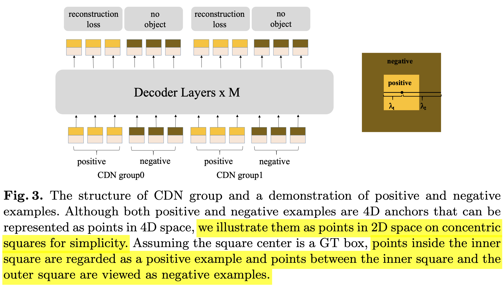

- n개의 GT에 대해 2n개의 query가 CDG group별로 학습에 활용됨

- 효과: 한개의 GT에 대해 nearby positive anchor끼리 중첩되어 혼동되는 이슈를 해결하게 됨

  - 정성적 입증

    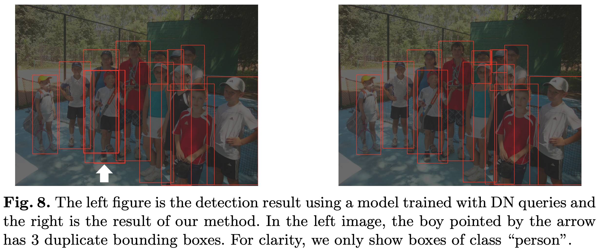

    - 좌측: DN training 결과. 화살표 person에 대해 3개의 prediction box가 동시에 예측함
    - 우측: CDN training 결과. 화살표 person에 대해 1개의 prediction box만 예측함

  - 정량적 입증

    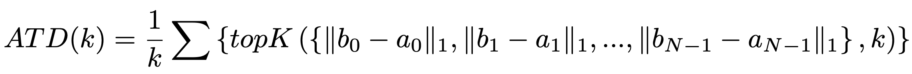

    - 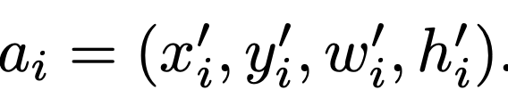: anchor box
    - 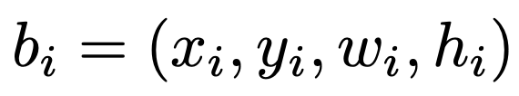: GT box

    - Average Top-K Distance (ATD) metric: GT box에 대해 matching된 anchor중 distance 기준으로 top-K에 해당하는 anchor들의 $l_1$ distance를 의미함. 이는 confusion이 distance가 큰 anchor에 대해 발생하므로 top-K function을 사용하였음

      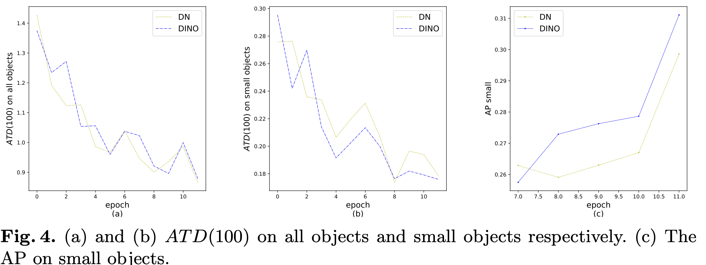

      - Small object에 대해 (b, c) DN-DETR에 비해 제안한 방식의 성능이 좋아짐을 확인

## 3.2 Mixed Query Selection

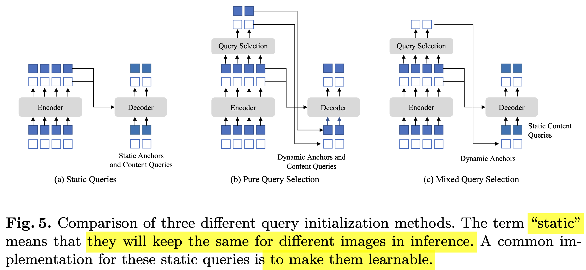

- Static Queries : Decoder의 queries (content & positional) 모두 0으로 initialize하고 learnable query로 학습하는 방식 (DN-DETR, DAB-DETR에서 사용)
- Pure Query Selection : Decoder의 queries (content & positional) 모두 encoder의 query로부터 linear transform해서 초기화 하는 방식. Deformable DETR에서는 "Two-stage" 라는 용어로 활용됨 (Deformable-DETR에서 활용)
- Mixed Query Selection : Decoder의 query 중 positional query만 encoder의 query로부터 linear transform하여 사용하며, content query는 0으로 초기화하여 learnable query로 학습하는 방식. 
  - 장점: Content query의 초기화된 query는 preliminary feature이고 refine되지 않았기 때문에 object를 여러개 겹쳐 표현하거나, 잘려 표현하는 등 quality가 좋지 않다. 따라서, learnable content query 방식을 채택하였다고 한다.

## 3.3 Look Forward Twice

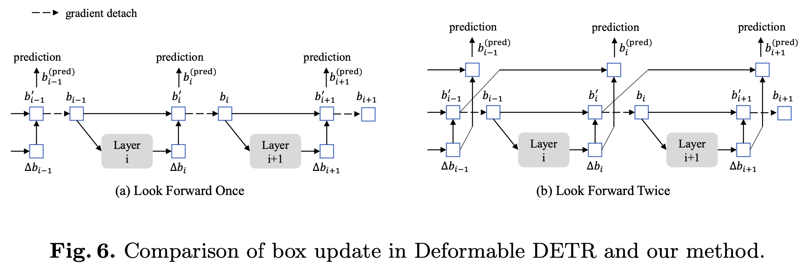

- Deformable DETR에서는 stablize training을 위해 box offset만 학습하고, anchor box에 대해서는 gradient back-propagation을 하지 않았음.

- 본 논문에서는 이전 layer(i-1)의 prediction box와 현재 layer(i)의 box offset을 모두 현재 prediciton에 활용하는 것이 더 좋은 box를 prediction한다고 추측함

  

# 4. Experiment

- 1x setting result

  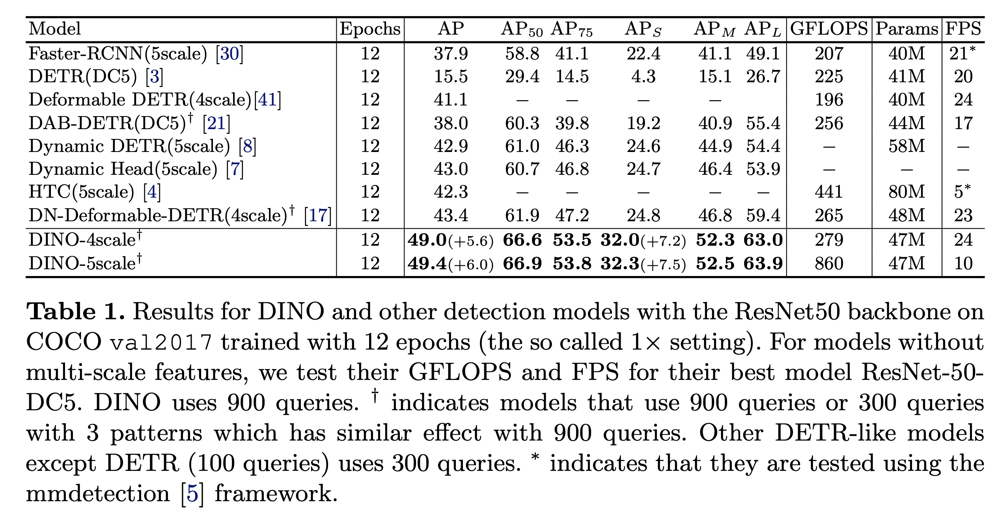

- Res-50 backbone result

  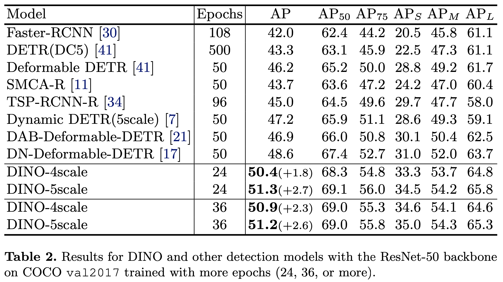

  - learning curve

    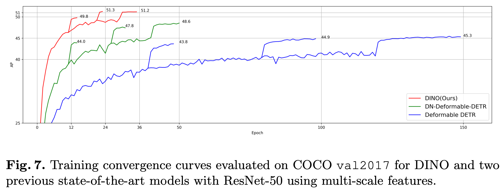

- vs. SOTA model

  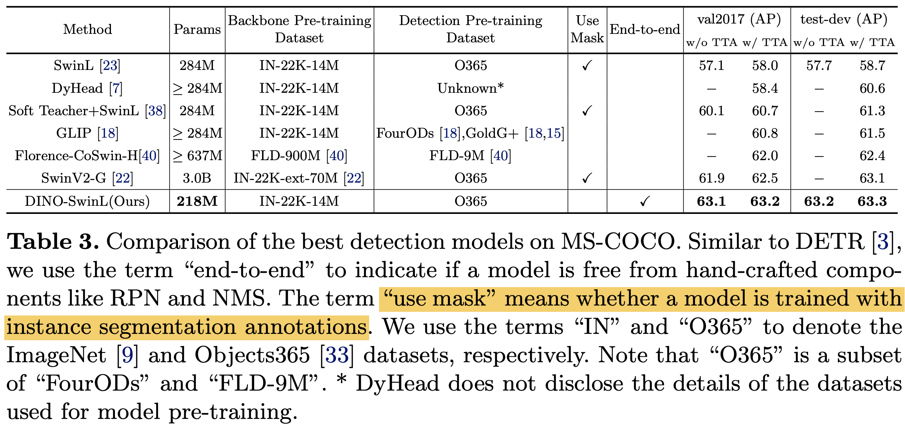

- ablation study

  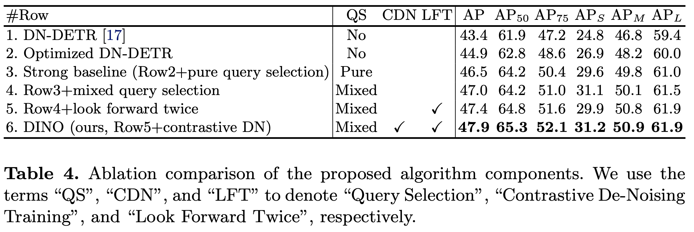
