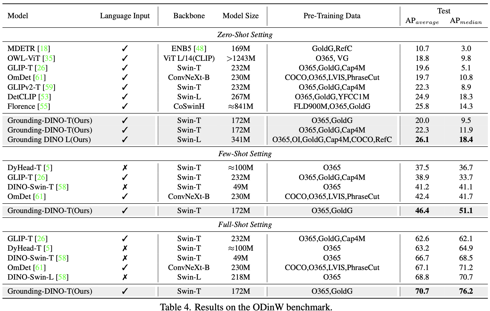

# [MM][OD] Grounding DINO: Marrying DINO with Grounded Pre-Training for Open-Set Object Detection

- paper: https://arxiv.org/pdf/2303.05499.pdf
- github: https://github.com/IDEA-Research/GroundingDINO
- archived (인용수: 263회, '23.12.27 기준)
- downstream task: Open-Set Object Detection, Referrence Expression Comprehension

# 1. Motivation

- Visual Intelligence 시스템의 기초적인 능력은 novel concept에 대한 이해력이 있어야 한다.
- 자연어를 입력으로 주었을 때, 해당하는 물체를 검출하는 "open-set object detection"의 경우, "closed-set object detection"의 성능에 영향을 받는다. 따라서, 최근에 DETR-like Transformer기반의 SOTA인 DINO를 이용한 "open-set object detection"을 수행해보자
- 뿐만 아니라, Transformer기반의 OD구조는 Text기반의 구조와 fusion하기 용이하므로, text-driven object detection이 용이할 것이다.

# 2. Contribution

- closed-set object detector로 Transformer 기반의 DINO를 활용하여 vision-language를 여러 phase에서 fusion하는 Open-set object detector인 Grounding DINO를 제안함
  - feature enhancer : vanilla text embedding, vanilla visual embedding 정보를 early phase에서 fusion한 enhanced feature를 encoder단에서 생성하는 역할
  - language-gudied query selection: decoder의 positional query로 text feature와 유사도가 높은 top-K개의 encoder position feature를 initial value로 활용함 (mixed-query selection)
  - cross-modality decoder : late fusion text-to-image, image-to-text cross attention으로 text-driven open-set object detection성능을 향상시킴
- open-set object detection을 $\to$ REC (Referring Expression Comprehension)으로 확장시킨 task를 제안함
- 다양한 public dataset에서 SOTA (zero-shot od, open-set od)

# 3. Grounding-DINO

- overall diagram

  

  - Feature Enhancer : 기존 DINO의 encoder를 대체하는 Text와 Image 정보를 early-fusion하기 위한 encoder. Text-backbone, Image-backbone으로 구성된 dual-encoder-single-decoder 구조
  - Cross-modality Decoder query selection : enhanced feature 중 text와 유사도가 높은 top-K feature decoder의 positional query의 initial value로 활용하기 위해 사용
  - Cross-Modality Decoder : language-visual feature간 late-fusion하는 구조

  

  - 기존 Language-Image fusion기반 open-set object detector와 비교

    

  

  ## 3.1 Feature Extractor and Enhancer

  - Text: BERT backbone
  - Image: Swin-T/L
  - GLIP에서 영감을 얻어, image-to-text(K,V: text, Q: image)와 image-to-text(K,V: image, Q: text) layer를 사용

  

  ## 3.2 Language-Guided Query Selection

  - text와 가장 유사한 image feature를 num_query 만큼 추출

    

  

## 3.3 Cross-Modality Decoder

- Text와 Image간의 더 나은 alignment를 위해 decoder에서도 fusion을 수행

## 3.4 Sub-sentence Level Text Feature

- Sentence level: 전체 문장을 1개의 feature를 encode. 단어간 영향력을 줄여주고, fine-grained 정보를 손실하게됨.
- Word level: 개별 단어를 feature로 encode. 단어간 영향력을 살리지만, 불필요한 단어간의 영향력도 계산하게 됨.
- Sub-sentence level: 관계가 있는 phrase간의 영향만 계산함.

## 3.5 Loss Function

- Box regression: $L_1$ loss, GIoU loss (Bipartite matching)
- Classification: Focal Loss (Bipartite matching)
- Contrastive Loss: Predicted object와 langauge token (class)간의 dot-product로 focal loss를 계산 (similarity classification)

- GroundingDINO vs. DINO

  - Architecture 변화

    - 파란 박스가 Grounding DINO로 바뀌며 추가되거나 바뀐 부분

      

  - x1 setting (Res-50 backbone)

    

    - Full-shot OD는 DINO가 더 좋음

# 4. Experiments

- Zero-shot COCO

  

- Zero-shot LVIS

  - LVIS는 long-tailed detection dataset

    

- Zero-shot/Few-shot/Full-shot ODinW 

  

- Referring Expression Comprehension task

  

- Ablation Studies

  

- Transfer Pretrained DINO $\to$ GroundDINO as pretrained weight

  - 최종 성능 향상은 없으나, 학습 성능 수렴 속도가 빠름

    

  - 학습 성능 curve

    
