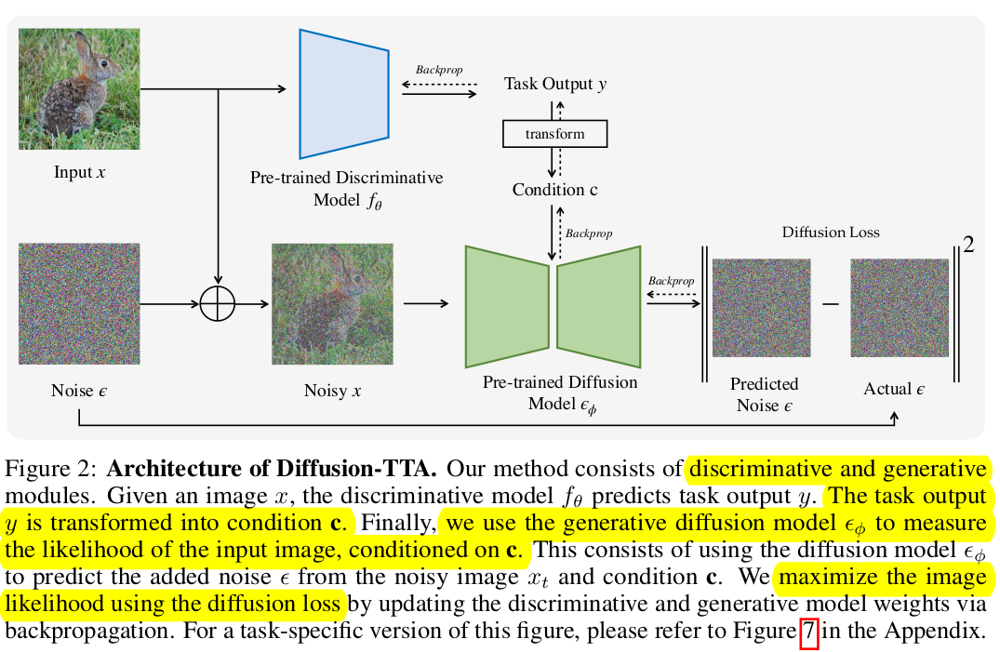

# [GM][TTT] Diffusion-TTA: Test-time Adaptation of Discriminative Models via Generative Feedback

- paper: https://arxiv.org/pdf/2311.16102.pdf
- github: https://diffusion-tta.github.io/
- NeurIPS 2023 accpeted (인용수: 0회, '23.12.28 기준)
- downstream task: TTT for CLS

# 1. Motivation

- Diffusion 기반의 Generative Model의 성능이 향상됨에 따라 이를 어떻게 잘 활용하여 TTA를 수행할 수 있을까? 하는 의문이 생기게 됨
  - discriminator의 경우, $p(y$|$x$)를 mapping하는 과정을 학습하는데 비해, generator는 $p(y$|$x$)를 학습하게 됨 $\to$ Inverted using Bayes Rule을 하면 iterative 하게 inference를 할 수 있게됨
  - Generator의 task가 더 어렵기 때문에, data의 maximum likelyhood를 학습하는 과정을 통해 data에 대한 미묘한 차이도 학습할 능력이 생길 수 있게됨 (Nuance understanding of data)
- Discriminator가 생성한 결과를 가지고 Conditional Diffusion의 condition을 생성해서 maximum likelyhood를 높여보자!
  - inverting generative model의 경우 OOD (Out-of-Distribution) 이미지에 대해 generalize한 특성이 있다고 알려짐 $\to$ TTA에 적합!

# 2. Contribution

- Pre-trained dicriminator (classifer, segmentor, depth predictor)와 Diffusion model을 동시에 학습하는 Diffusion Loss를 TTT (Test-time-Training) Loss로 활용하는 DIffusion-TTA 제안
- 다양한 Downstream task의 Large-scale discriminative model들 (Classifier, Semantic segmentation, Depth estimation)에서도 탁월한 성능 향상을 보임

# 3. Diffusion-TTA

- Naive Method

  - Generater의 inversion과 Discriminator의 Ensemble을 활용해보면 어떨까? 

    $$\frac{p_{\theta}(y|x)+p_{\phi}(y|x)}{2}$$

    $\to$ 실험 결과, 성능 향상이 없었음

- Test time에서 generator의 Loss (Maximizing sample's likelyhood)를 줄이는 방향으로 Discriminator와 Generator를 학습하는 DIffusion-TTA를 제안함

  

  - Encoder-Decoder구조와 비슷함 
    - Encoder : Discriminator. Image에 대해 Class score를 예측함
      - Classification : ResNet, ConvNext, SegFormer(SSG), DenseDepth (Depth prediction)
      - Diffusion: DiT (ImageNet), Stable Diffusion (Open-vocabulary)
    - Decoder : Diffusion. Encoder의 class score를 condition으로 Denosing할 noise를 예측
  - Total Loss
    - 오직 Diffusion의 Reconstruction Loss만 활용 (not joint training with classification loss)

## 3.1 Diffusion Model

- Loss

  

  - $\alpha_t$: $1-\beta_t$
  - $\beta_t$: t-step의 diffusion process variance $\in (0,1)^{T}_{t=1}$
  - $\bar{\alpha}_t$: $\Pi_{i=1}^ta_i$
  - **c**$^i$: i번째 sample에 대한 discriminator가 생성한 condition vector
  - $\epsilon$: Gaussian Noise $~N(0,1)$

  

## 3.2 TTA with Diffusion Model

- **c** 생성과정

  - Similairy classification과 동일하게, 학습된 L개의 class에 대한 text embedding $l_j \in \mathbb{R}^D $에 대해 $j \in {1,..,L}$  dot production로 계산

    - Classification

      

    - Semantic Segmentation

      

    - Depth Estimation

      **c**$$=y$$

- Loss

  

  - $\theta$: discriminator의 parameter. **c**생성 시 활용
  - $\phi$: generator의 parameter

- Algorithm

  

- Implementation details

  - batch를 키우는게 효과적임을 실험적으로 확인 $\to$ gradient accumulation을 수행함 (x5)
  - 모든 실험에서 discriminator의 모든 parameter를 업데이트 수행함
  - open-vocabulary실험에서는 diffusion을 freeze시키고, CLIP 실험에서는 Clip을 freeze하고 LoRA의 adapter weight만 학습시킴

# 4. Experiments

- ImageNet Variants vs. SOTA TTA

  

- ImageNet-C specific results

  

- 정석적 분석

  

- Open-Vocabulary CLIP classifiers

  

- Segmentation & Depth Estimation

  

- Segmentation 정성적 분석

  

- Ablation of hyperparameters

  

  - +diffusion loss TTA: diffusion loss로 single randomly sampled time step으로 학습 수행 (-2.9%)

    - 정답 logit에 대해서 모든 step에서 loss가 상대적으로 다른 class logit에 비해 작지 않기 때문에 누진해서 학습해야 함

      

  - +timestep aug: batchsize 를 accumulate해서 $1 \to 180$로 키우면 성능이 크게 증가함 (+4.8%)

  - +noise aug: random noise를 매 time step마다 augmentation하면 추가 성능 향상(+0.2%)

  - +adapting diffusion weight: DiT diffusion weight도 adapt (+1.1%)

- Ablation of parameters/layers to adapt

  

  - random init: pretrained weight대신 random initial weight 사용 (no adapt)
  - adapt logits: diffusion loss 기준으로 logit만 adapt
  - adapt logits + ensemble : Res-18의 predictdion과 DiT Diffusion의 ensemble
  - adapt BN: ResNet18의 BN layer만 adapt
  - adapt last FC layer : 마지막 FFN만 adapt
  - adapt classifier: Res18를 모두 adapt
  - adapt classifier + adapt diffusion : Res18 + DiT모두 adapt
