# [TTA]\[CLS] On Pitfalls of Test-Time Adaptation

- paper: https://arxiv.org/pdf/2311.16102.pdf
- github: https://github.com/LINs-lab/ttab
- NeurIPS 2023 accepted (인용수: 12회, '23.12.30 기준)
- downstream task: TTA for CLS

# 1. Motivation

- 기존 TTA 방식들에 대해 일관된 setting으로 비교하지 못하고 있음
- Systematical한 study가 없었음
- 기존 TTA 10개 algorithm을 분석한 결과, 세 가지 문제를 발견했음

# 2. Contribution

- 10개의 최신 TTA를 포함하며, 다양한 distribution shift와 2가지 evaluation protocol를 포함한 Test-Time-Adaptation Benchmark (TTAB)를 제안함
  - 기존 TTA 들의 세 가지 범주의 문제점(pitfalls)을 지적함
    - **Online batch**에 따라 종속적으로 성능이 변화하기 때문에 **적절한 hyper-parameter**를 선택하기가 엄청 어렵다.
      - learning rate
      - adaptation step 갯수
      - pretrain weight를 뭐로 선택할지
    - **Pretrained weight**의 **quality**에 따라 TTA의 최종 performance에 많은 영향을 끼치게 됨
      - norm layer에 따른 성능 변화 (batch norm $\to$ group norm / laryer norm)
      - auxiliary training objectives를 함께 학습함에 따른 성능 변화
      - data augmentation에 따른 성능 변화
    - **Distribution shift**를 모두 반영하지 못함
      - spurious correlation
      - label shift
      - non-stationary shift

# 3. TTAB (TTA-Benchmark)

- 10가지 기존 TTA 방식들의 실험 환경 정리

  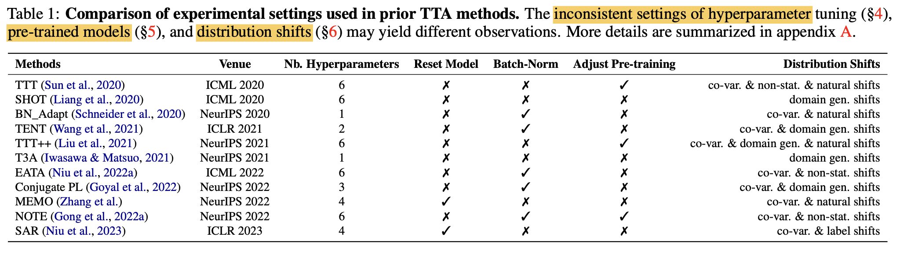

  - 제안한 방식의 유효성을 각기 다른 환경에서 실험하고 있으므로, 적절한 비교하기 어려움

- TTAB benchmark의 특징

  - 기준이 되는 setting 제안함

    - dataloader 등 통일

    - attribute에 따른 손쉬운 data distribution 정의

      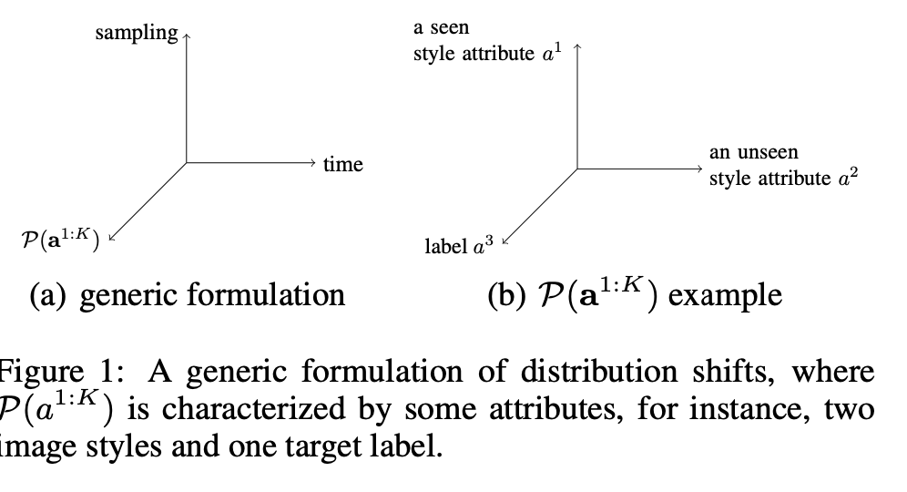

  - 확장 가능한 baseline들 $\to$ 표 1 참고

# 4. Experiments

## 4.1 Batch Dependency Obstructs TTA Tuning

- Hyperparameter에 너무 sensitive하다. 특히 **learning rate**와 **number of adaptation steps**

  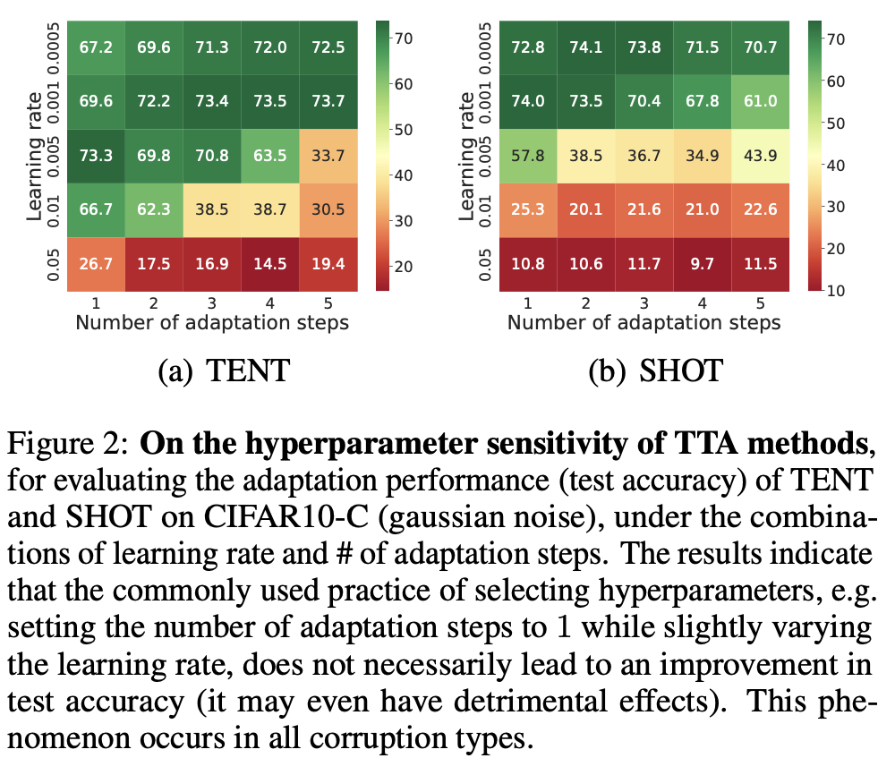

- number of step=1일때, Learning rate에 따라 TTA 성능이 sensitive하게 달라지는 모습

  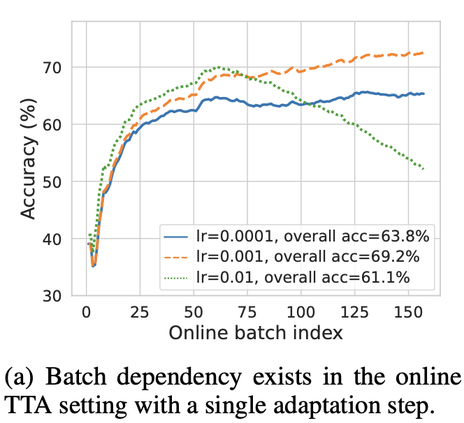

- 좋은 learning rate (1e-3)을 안다고 쳐도, number of adatation step에 따라 over-adatation되어 언제 끊을지 어려움

  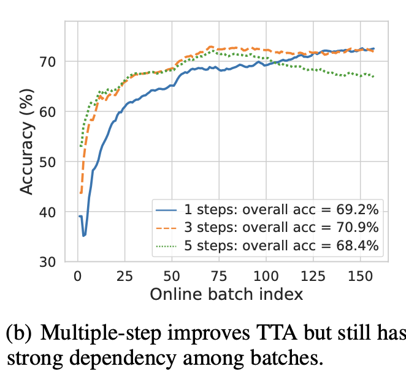

- 심지어, test data의 label를 써서 early stopping해서 얻은 oracle 모델로 adaptation해도 그건 마찬가지

  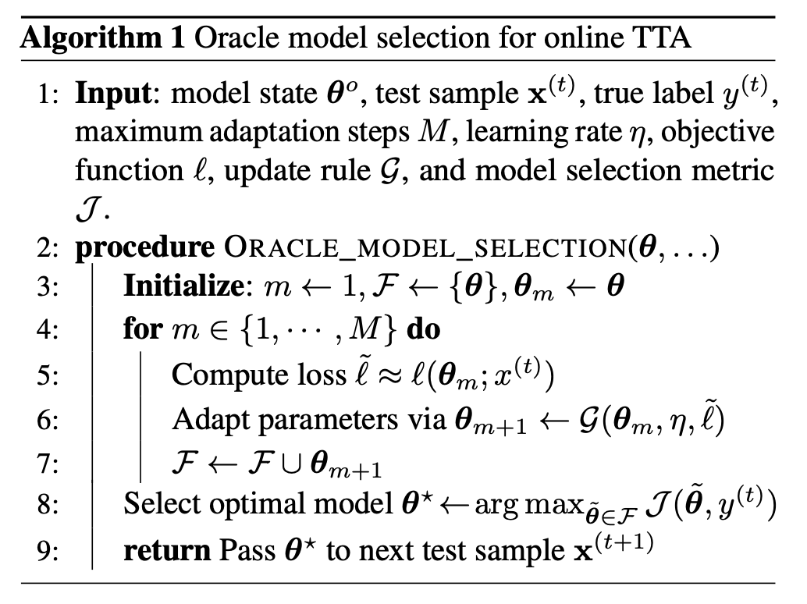

  - M: adaptation step의 max값. 50으로 실험적으로 결정 (large dataset은 시간상 25)

  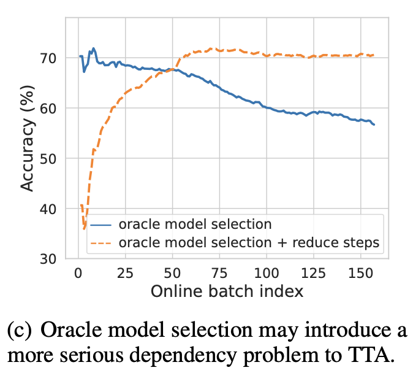

- Auxiliary Regularization을 통한 adaptation 수행할 때도 비슷한 양상이 보임

  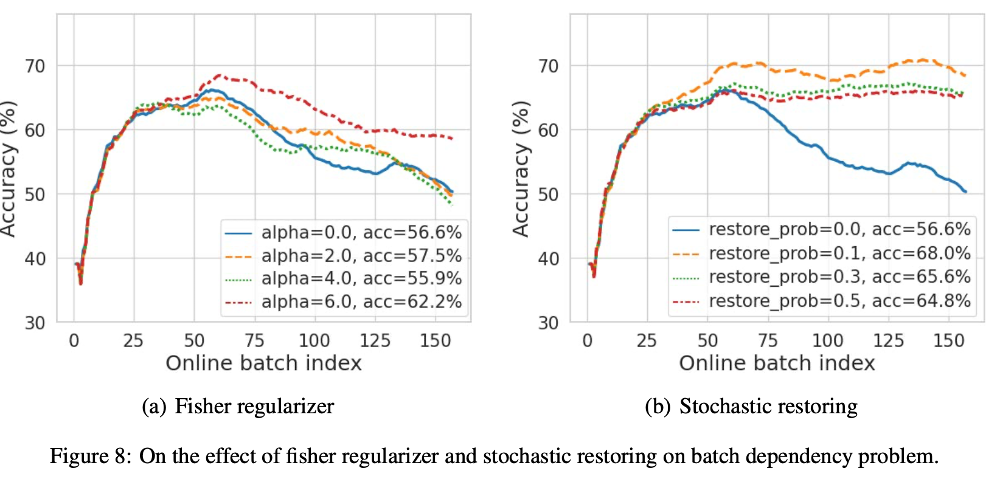

  - Fisher regularizer
  - stochastically restoring

## 4.2 Pre-trained Model Bottlenecks TTA Efficacy

- Pre-trained Model이 어떤 성능을 내느냐에 TTA가 좌우됨

- feature extractor & classification head & data augmentation에 따른 disentangled된 비교를 수행함

  - feature extractor

    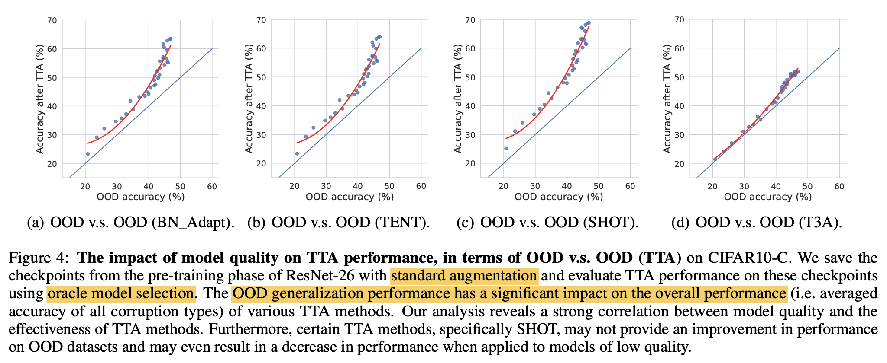

    - feature extractor는 freeze하고 classification head만 adapt
    - 초기 Test data (OOD)에서 좋은 성능을 내는 모델이 TTA after adapt이후에도 좋은 성능을 냄 
    - 위 결과는 Oracle Model Selection으로 구한 수많은 모델을 대상으로 실험
    - 실험 결과는 강력한 feature extractor가 TTA에 매우 중요한 영향력을 준다고 볼 수 있음

  - classification head

    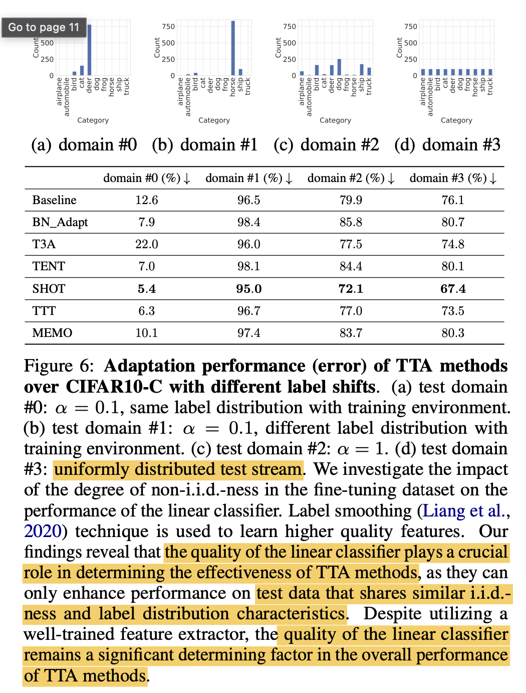

    - train /test data 분포에 따른 성능 비교를 수행함
    - train의 분포와 같은 test 분포에서만 유의마한 결과 (SHOT 5% error)가 나오고, 나머지는 모두 random 예측보다 못한 결과를 출력함
    - 이는 classification head가 매우 중요한 역할을 한다고 볼 수 있음

  - data augmentation

    - no augmentation / standard augmentation (random crop & horizontal flip) / mixup / pixmix 비교

    - 오른쪽으로 갈수록 augmentation이 심해짐

    - OOD 에서 좋은 결과를 냈다고, TTA adaptation이후 좋은 성능을 내지 않았음

      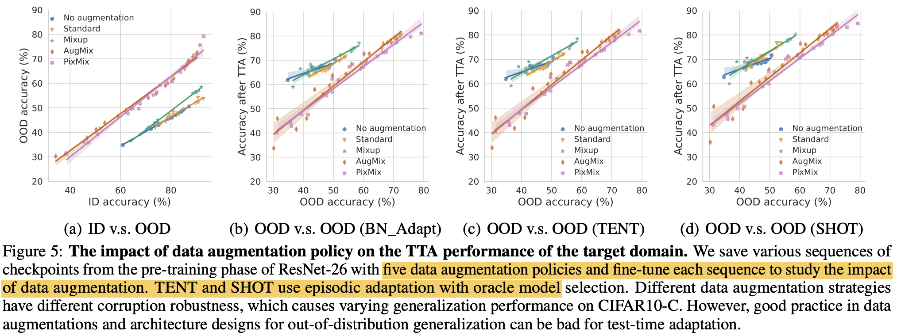

      - (a)에서는 PixMix, AugMix > No aug, Standard, Mixup
      - (b)에서 adapt 이후 No aug, Standard, Mixup > PixMix, AugMix
      - 이는 BN_Adapt, TENT, SHOT에서 모두 동일하게 나타남

    - 이는 ViT의 효율 극대화된  CCT에서도 동일하게 나타남

      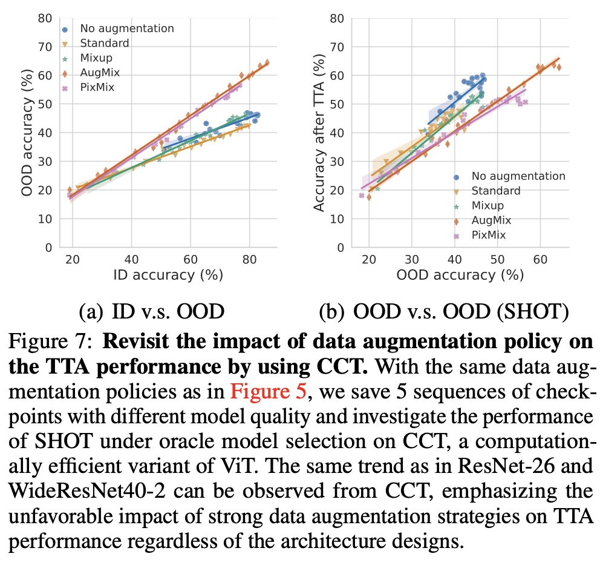

## 4.3 No TTA Method Migitage All Shifts Yet

- Common distirbution shifts

  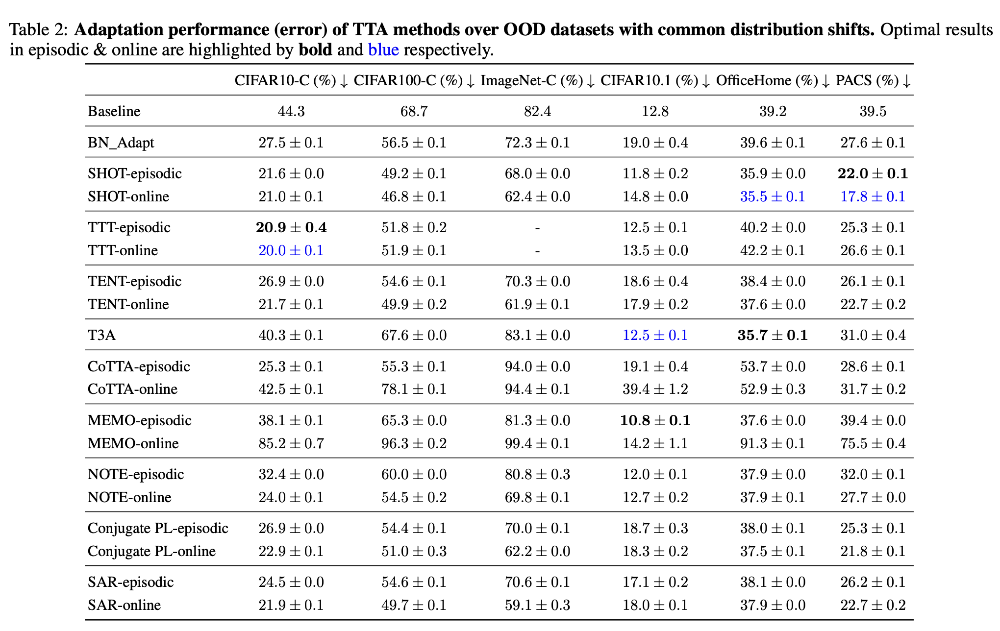

  - synthetic, natural, domain generalization 에서는 모든 방법들이 adaptation후 성능 향상이 있었음.

-  Spurious correlation shifts & Label shifts

  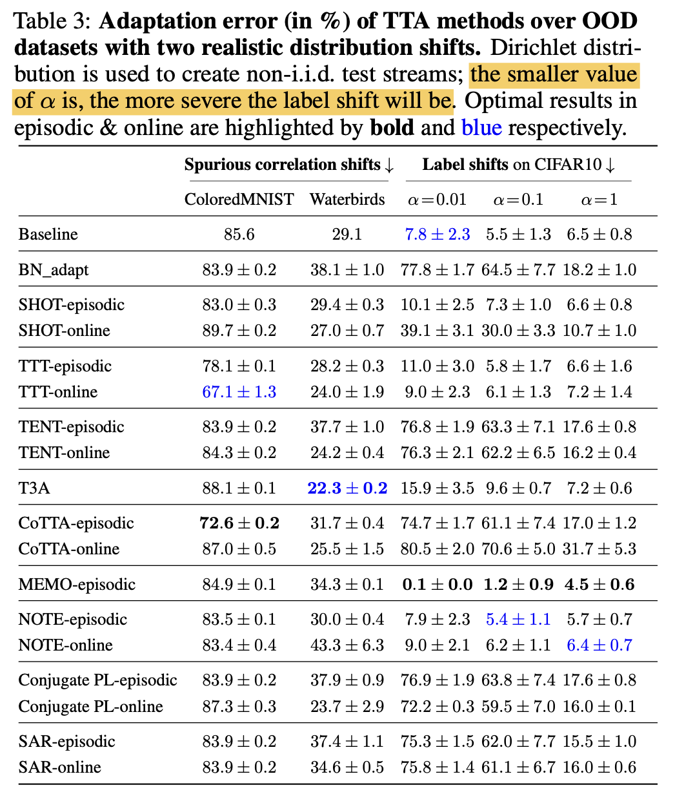

  - ColoredMNist는 random 예측보다 못한 error를 보임.
  - Label shift는 기존에 CiFAR-10-C를 쓰는 방식은 label shift+co-variance shift 가 있는 상황이라 순수하게 label shift만 주기 위해 CiFAR0-10인데 dirihelet $\alpha$값만 달리 주는 실험 셋팅으로 진행함

- Non-stationaory Shift

  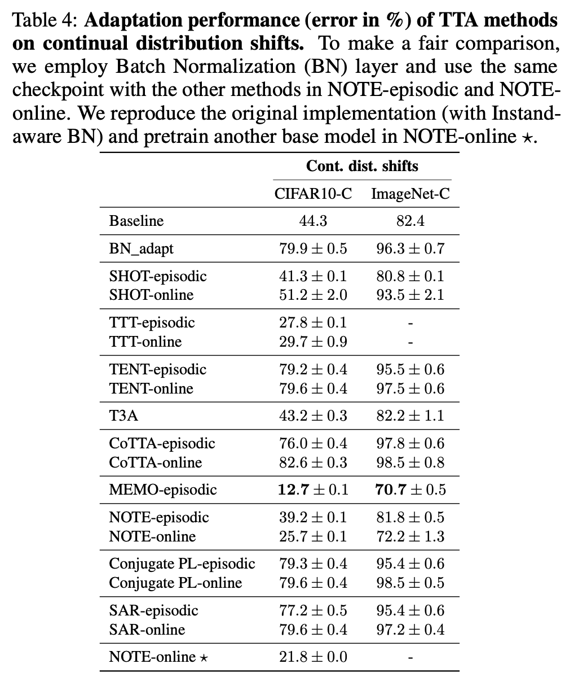

  - Temporally correlated shift
