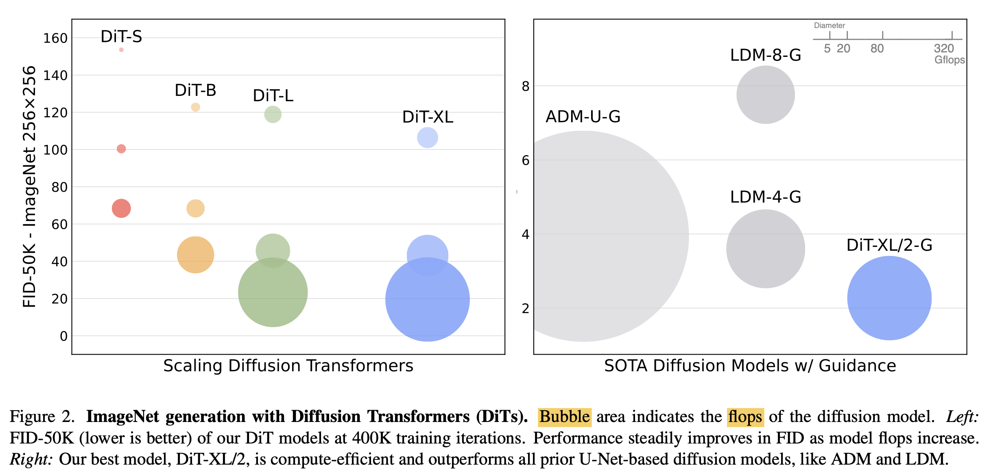

# [GM] Scalable Diffusion Models with Transformers

- paper: https://arxiv.org/pdf/2212.09748.pdf
- github: https://www.wpeebles.com/DiT.html
- ICCV 2023 accepted (인용수: 162회, '23-12-31기준)
- downstream task : Image Generation

# 1. Motivation

- 생성 AI분야에서 시대에 뒤떨어진(?) 모델 구조 (CNN기반 U-Net)을 사용하고 있음. 생성외 다른 분야에서 각광받는 Transformer 구조로 생성 AI를 바꿔보자!

# 2. Contribution

- scalability 확보된 Transformer 기반의 Diffusion Model DiT제안함

  - GFlops vs. FID

    

- class-conditional ImageNet에서 SOTA FID 성능을 냄

# 3. DiT

- baseline : DDPMs

  

  - $x_0$: 0 step (original) image
  - $\bar{\alpha}_t$: hyper-parameter.
  - $\epsilon_t$: Gaussian Noise ~N(0, **I**)

- Denoising Diffusion process objective

  

  - $\epsilon_{\theta}$: 모델의 예측한 noise
  - $\epsilon_t$: t step의 forward noise

- Classifier Free Guidance

  - DIT에서 Classifier Free Guidance 사용

  

- Latent Diffusion Models
  - VAE 기반 학습된 (freezed된) encoder, decoder를 사용하여 8 output stride로 encode

## 3.1 Design Space

- Patchify

  

  - patch의 사이즈를 변경하며 DiT를 설계함. patch 크기가 작을수록 계산량은 제곱에 비례 
  - p={2, 4, 8}

- DiT Block design

  

  - In-context conditioning: step t, class label c를 patch와 concat해서 사용
  - Cross-attention block: step t, class label c를 cross attention
  - Adaptive Layer(adaIN) norm block: norm layer의 scale, bias parameter만 학습
  - adaIN-zero init block : residual block을 Identity metric로 초기화

- Model size

  

  - DiT block 갯수 (N), hidden dim size (d), head의 갯수에 따른 scale 변화를 줌

# 4. Experiments

- Dataset

  - ImangeNet 256x256, 512x512 

- Evaluation metric

  - FID-50K

- DiT Block design 

  

  - adaIN-zero성능이 제일 좋음

- Scale에 따른 성능 비교 (Scale = GFlops)

  

  - Scale에 비례해서 성능이 좋아짐
    - patch가 작을수록 성능 향상 (1열)
    - Model size 커질수록 성능 향상 (2열)

- Model size별 Training compute의 효율성 비교

  

  - Model size가 클수록 Training compute에 따른 성능 향상이 좋았음
  - 즉, 작은 모델은 아무리 많이 학습해도 성능이 큰 모델보다 좋지 못함

- Scale에서도 GFlops가 같으면 비슷한 성능을 나타냄 $\to$ GFLOPs가 FID score에 중요한 영향을 끼치는 parameter임

  

  - S/2 vs. B/4
  - 기존 방식들은 scale 비교를 model의 parameter로 비교했는데, 이는 정확한 비교가 아님을 시사함

- ImageNet 256x256

  - 정량적 분석 (vs. SOTA)

    

  - 정성적 분석

    

- 512x512 ImageNet

  - 정량적 분석 (vs. SOTA)

    

- Scaling Training vs. Scaling Model

  

  - Model 사이즈가 작은 모델을 학습량을 늘린다 해도, 더큰 모델의 성능을 따라잡지 못함
