# [VLM][UDA][CLS] DAPL: Domain Adaptation via Prompt Learning

- paper: https://arxiv.org/pdf/2202.06687.pdf
- github: https://github.com/LeapLabTHU/DAPrompt
- archived (인용수: 61회, '24-01-02 기준)
- downstream task: UDA for CLS

# 1. Motivation

- 기존의 Domain Adaptation에서 사용하는 adversarial learning 등은 semantic feature를 손상시켜 class간 discriminability를 훼손한다. (실험적으로 제안한 것에 비해 성능이 열등함을 통해 반증한 듯)

  - **domain** 와 **semantic** **representation**을 **disentangle** 해보자!

    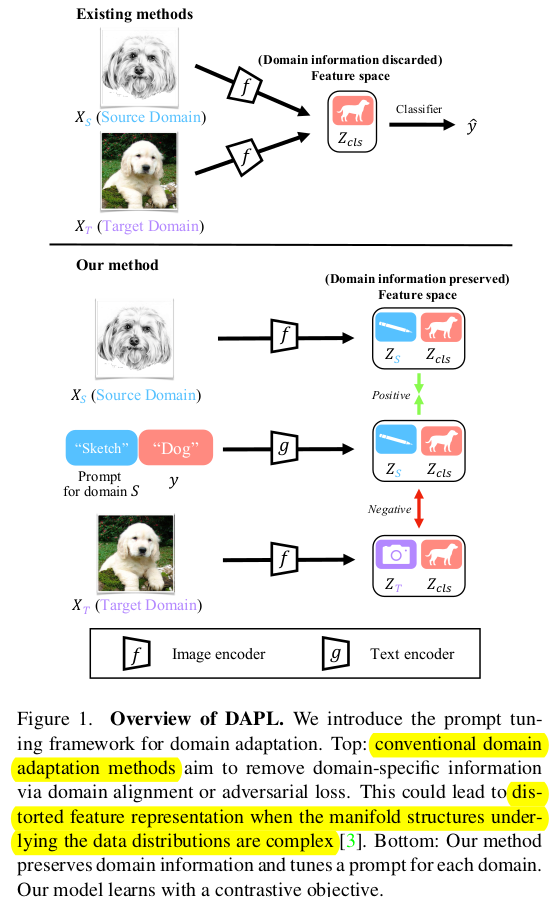

- 최적화 하는 parameter 수가 적어 training time efficient한 prompt learning을 UDA에 적용해보자!

# 2. Contribution

- domain 과 semantic representation을 disentangle하는 prompt learning 방식 (DAPL)을 제안함

  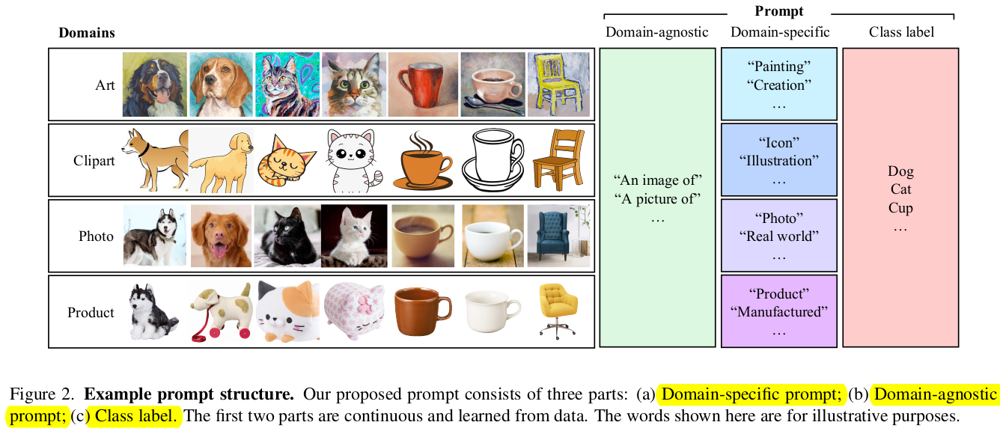

  - Cotrastive Learning 기반으로 Domain Specific Prompt와 (source, target 에 별도로 부여한) semantic prompt (category prompt)가 모두 일치할 경우에 text prompt와 image prompt를 당기고, vice versa로 학습하는 방식임

    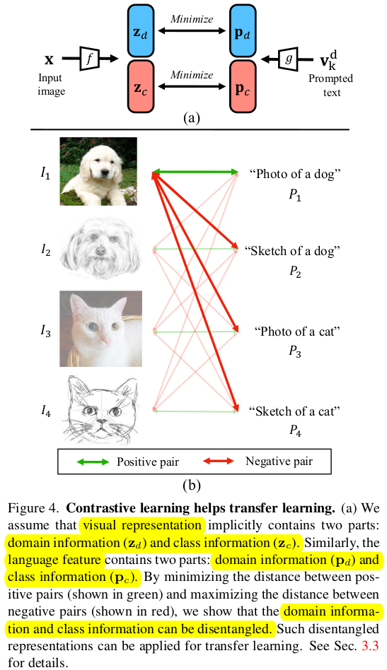

- Office-Home, VisDA-2017등에서 SOTA

# 3. DAPL

- baseline: CLIP (CoOp)

  - Image Encoder : ResNet 계열, ViT
  - Text Encoder : Transformer

- text representation과 image representation간의 similarity prediction score를 기반으로 함

  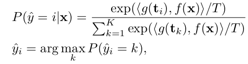

- Domain Adaptation via Prompt Learning

  - overall diagram

    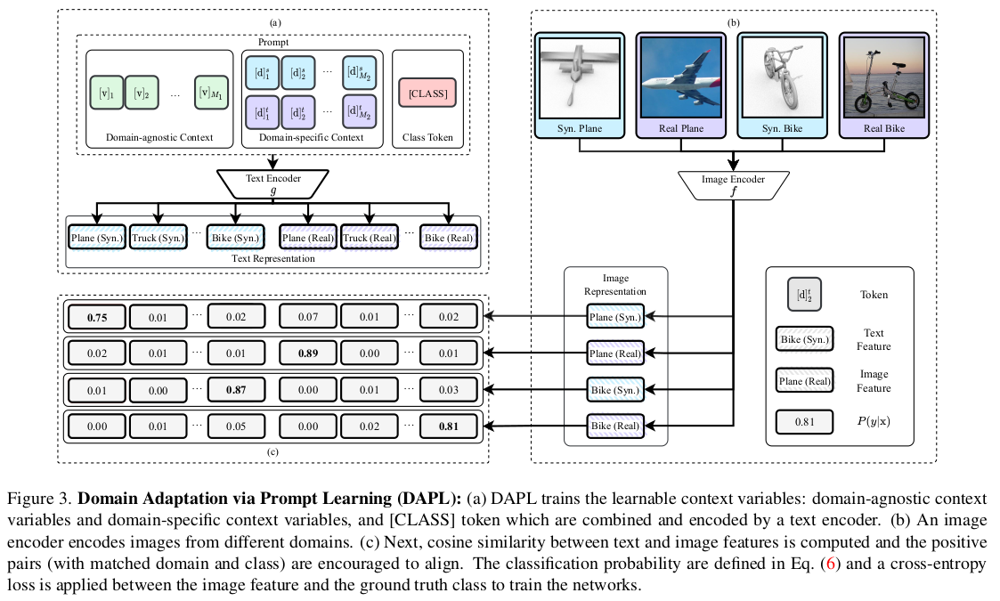

    - unified style prompt : domain의 specific한 특징 없는 text prompt (Eq3)

      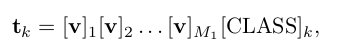

      - k: class index k
      - $M_1$: domain agnostic token 갯수

    - domain specific prompt : domain의 specific한 특징을 추가한 text prompt (Eq4)

      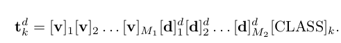

      - $M_2$: domain specific token 갯수
      - d : [l, u]. l : label(source), u: unlabel(target)

    - domain specific + class specific prompt : domain-agnostic prompt (**v**)를 class별로 다른 값으로 초기화 및 학습하게 되면 class token [CLASS]만 학습하는 것보다 큰 representation space로 학습이 가능하게 됨 $\to$ 최종 text prompt로 채택! (Eq5)

      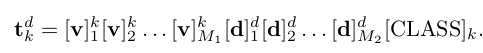

- Total Loss

  - supervised loss

    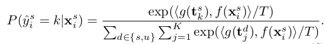

    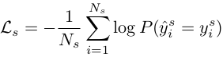

  - unsupervised loss

    - pseudo label : self-generated

      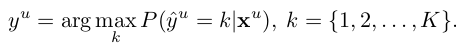

    - thresholding with $\tau$

      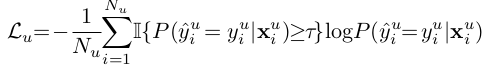

  - Total Loss

    

    $\to$ domain 과 semantic이 같은 경우에만 contrastic learning으로 학습에 사용함. 단, domain만 같거나 class만 같은 경우에는 해당 text prompt를 loss에 반영하지 않음

    - ex. $(I_1, P_3)$
      - domain 정보 ("Photo of")를 제거
    - ex. $(I_1, P_2)$
      - class 정보 ("dog")를 제거

# 4. Experiments

- Office-Home

  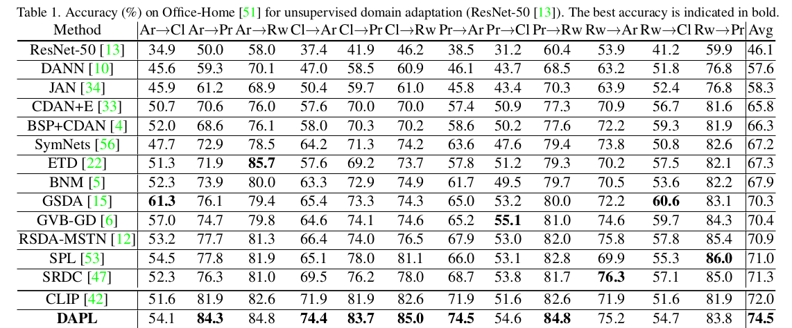

- DomainNet2017

  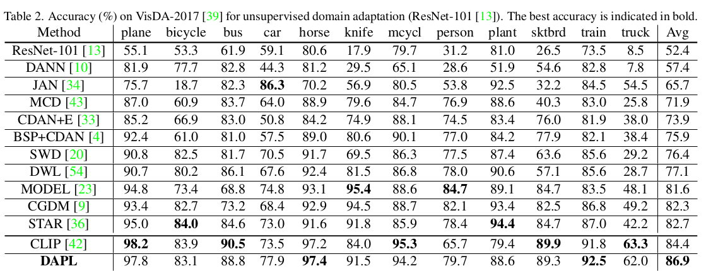

- Ablation

  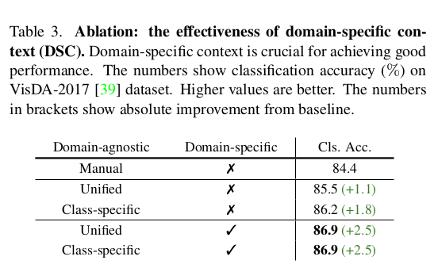

  - Manual : a photo of [CLASS]
  - Unified : 
  - unified style prompt : domain의 specific한 특징 없는 text prompt (Eq3)
  - Class-specific : domain-agnostic prompt + class-specific context
  - Unified + domain specific  : domain의 specific한 특징을 추가한 text prompt (Eq4)
  - Class-specific + domain specific  : domain의 specific한 특징을 추가한 text prompt (Eq5)

- Context token length에 따른 ablation ($M_1, M_2$)

  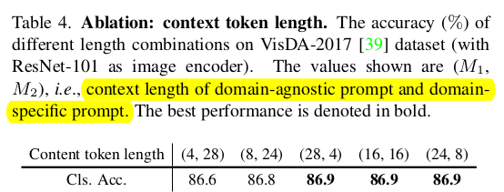

- Pseudo label threshold에 따른 ablation

  

- Visualization

  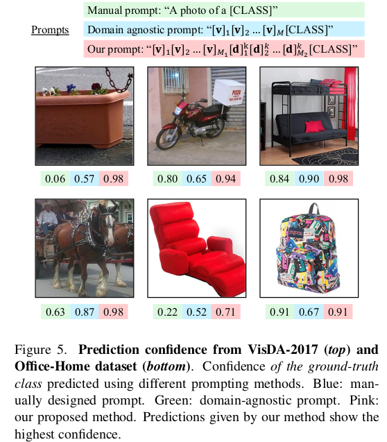
