# [UDA][MM][CLS] AD-CLIP: Adapting Domains in Prompt Space Using CLIP

- paper: https://arxiv.org/pdf/2308.05659.pdf
- github: x
- ICCV 2023 Workshop accepted (인용수: 4회, '24-01-03기준)
- downstream task: UDA for CLS

# 1. Motivation

- vision backbone만 사용하는 Domain Adaptation(DA)은 semantic richness가 부족하다.

- vision-language foundation model인 CLIP의 effectiveness가 DA 적용하는 연구가 부족했다.

  $\to$ Foundation model 을 활용해서 CLIP의 prompt learning 기반으로 DA를 해보자!

# 2. Contribution

- prompt learning 기반의 domain-agnostic prompt learning startegy인 AD-CLIP을 제안함

  - text prompt = domain token + Image-specific token + Class label

    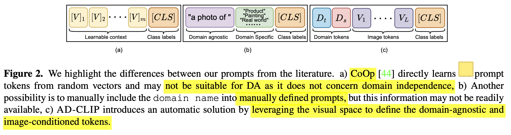

    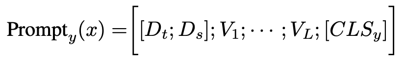

    - domain token : multi scale CLIP's image encoder 출력의 평균과 분산으로 domain style을 정의하고, source domain style과 **style projector**의 출력 결과가 같아지도록 style projector를 학습
    - image-specific token : multi scale CLIP's image encoder의 출력을 한번 더 추상화하기 위해 **content projector**를 통과함
    - class label token : class label

  - prompt와 함께 learnable projector network 기반으로 entropy minimization기반의 domain alignment를 사용함

  - domain의 style을 source와 target간에 같아지도록하는 style-mapping loss를 사용 $\to$ domain-agnostic token

- DA benchmark에서 SOTA

  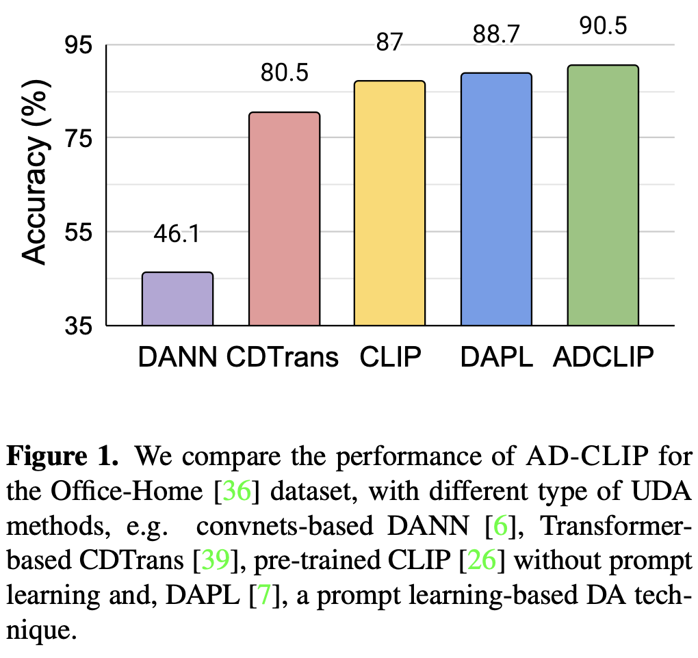

# 3. AD-CLIP

- overall diagram

  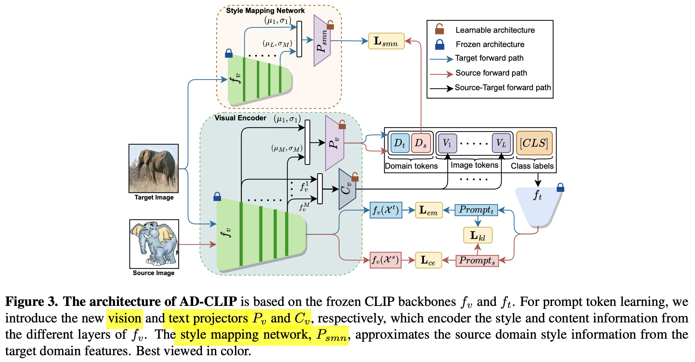

- 목적: **domain-agnostic** & (classwise) **discriminative**한 **domain-aglined** semantic embedding space를 학습하고자 함

  - **discriminative**: 

    - text-prompt를 prototype로 바라보고,  source image embedding과 target image embedding vector를 각각의 text-prompt와의 유사도를 통해 계산한 similarity-based prediction을 구하여 supervised-contrastic learning과 entropy minimization  loss를 기반으로 학습함으로써 달성함

      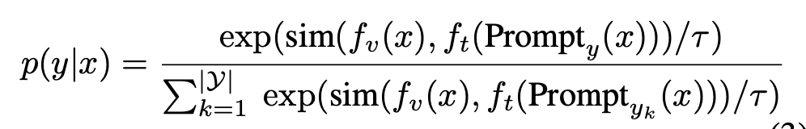

      - source : supervised contrastic loss

  - **domain-aligned**: 

    - (prompt space) **alignment** loss : text-prompt를 prototype로 바라보고, target image embedding vector에 대해서는 entropy minimization loss 기반으로 학습을 수행 (em : entropy minimization loss) $\to$ source와 text prompt와 aliign 된 target text prompt를 prototype로 당기게 학습함으로 align이 됨

      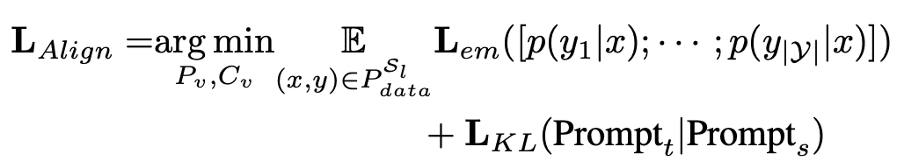

    - **source mapping network**  loss : prompt space에 대해 source와 target의 text-prompt간의 style를 mapping하고자  source style-mapping network $p_v$의 출력 $D_s$와 target style-mapping network $f_{smn}$의 출력간의 L2 loss를 가지고 학습

      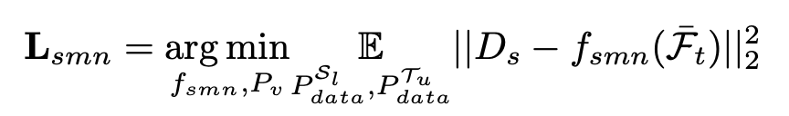

    - 뿐만 아니라, learnable text prompt에 대해서도 source와 target을 KLD로 align 시킴

  - total loss

    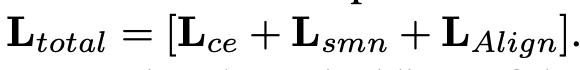

    

# 4. Experiments

- Office Home result

  

- VisDA2017

  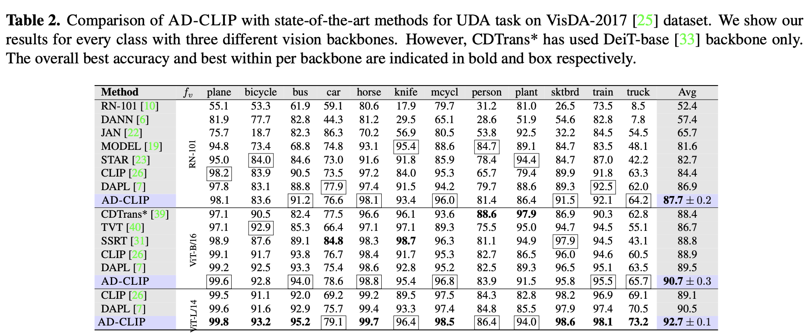

- Mini-DomainNet

  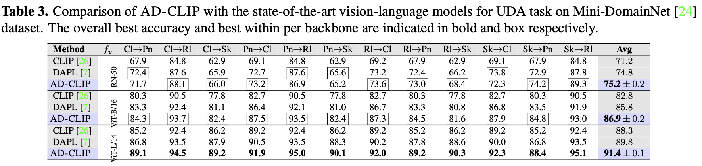

- Ablation Study

  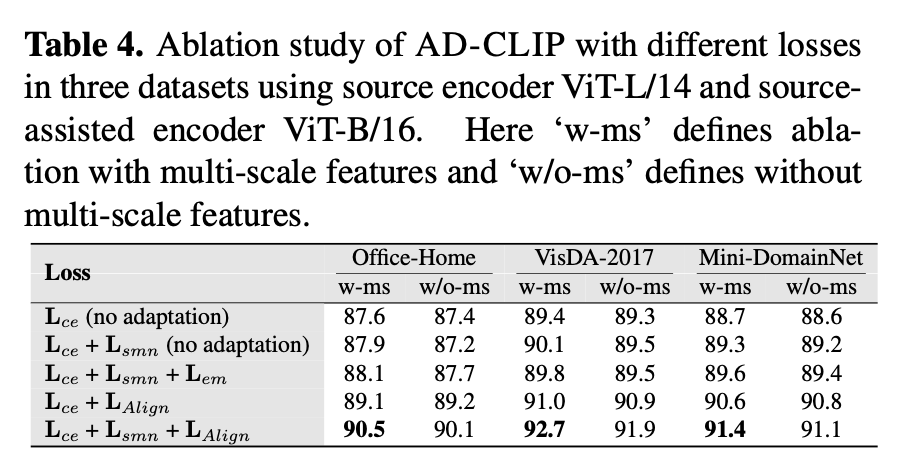

- Ablation for Image Length (L)

  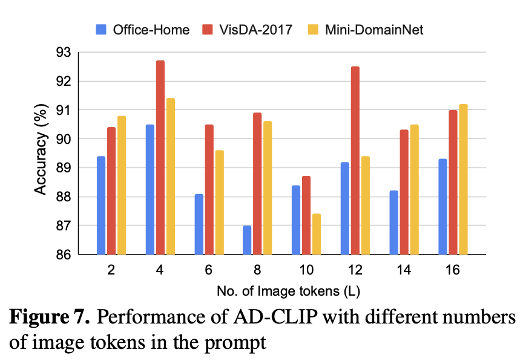

- Ablation for number of multi-scale features

  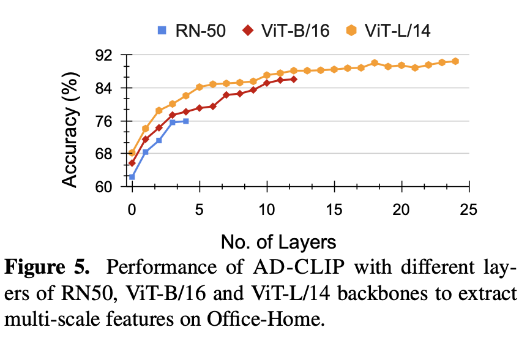

- Computational Cost vs. SOTA

  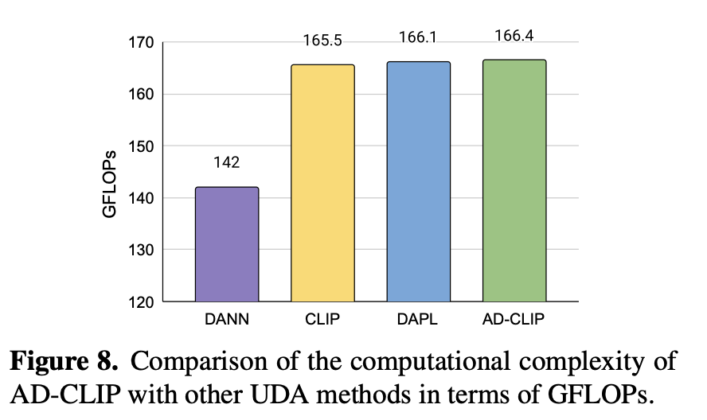
