# [DG][CLS] SIMPLE: Specialized Model-Sample Matching For Domain Generalizaiton

- paper: https://arxiv.org/pdf/2303.18031.pdf
- github: https://github.com/shiralab/OpenDG-Eval
- ICLR 2023 accepted (인용수: 11회, '24-01-04 기준)
- downstream task: DG for CLS

# 1. Motivation

- "No Free Lunch" : 한 개의 모델이 다양한 unseen dataset에서 모두 최고로 잘 학습될 수 없다는 논리. DG에서 존재하는 무한히 많은 unseen domain에서 1개의 모델이 다 잘될 수 없을 것이란 논리로 시작된 논문

  $\to$ 모델과 (unseen) target dataset의 **fitting**이 잘 맞아야 좋은 성능을 낼 수 있지 않을까?

  - 실제로 데이터셋이 fine-grained할 수록, 모든 데이터셋에서 잘되는 pretrained model은 존재하지 않음을 보았음

    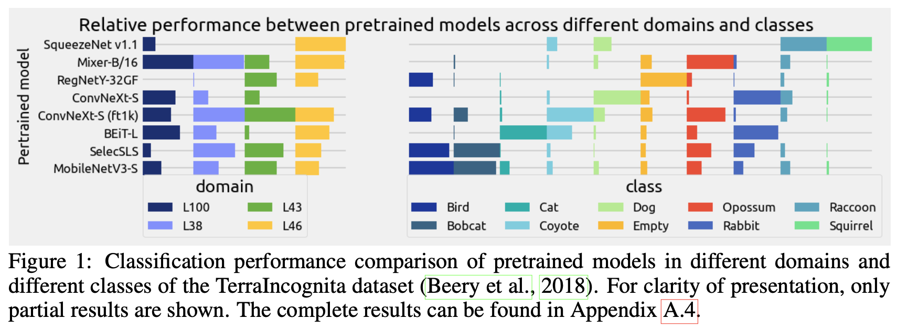

    - 가령, Transformer 기반의 모델은 robust한 대신, CNN 기반의 모델은 fine-grained classification에서 더 좋은 성능을 내고 있음
    - 또, Imagenet pretrained model은 특정 dataset에서는 generalization 성능이 좋지만, 다른 dataset에서는 좋지 않음

- 즉, 추천 시스템에서 item-user 추천하듯 Domain Generalization task를 model-sample 간의 best matching하는 task로 바라보자!

# 2. Contribution

- "No Free Lunch" 가정을 pretrained model에 대해 unseen test 분포에서 generalization 성능이 항상 좋은 1개의 모델이 존재하지 않음을 실험적 & 이론적으로 증명함

- Fine-tuning없이 DG task를 풀고자 하는 새로운 DG framework SIMPLE을 제안함

  - label-space adapter : pretrained model의 label space에서 fine tuning label space로 linear transform하는 adapter
  - matching network : 해당 sample에 대해 제일 fit한 모델들의 weight 값을 예측하는 network

- 학습 관점 & 추론 관점에서 (기존 SOTA 모델에 비해) efficient함을 보임 

  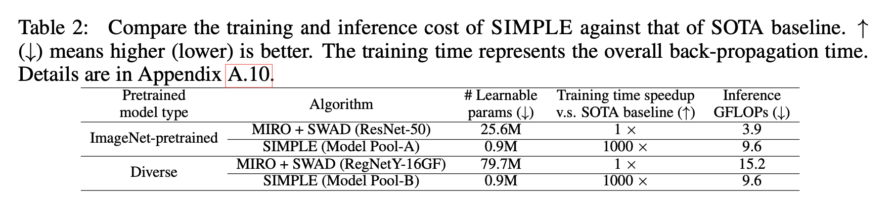

# 3. SIMPLE

- overall framework

  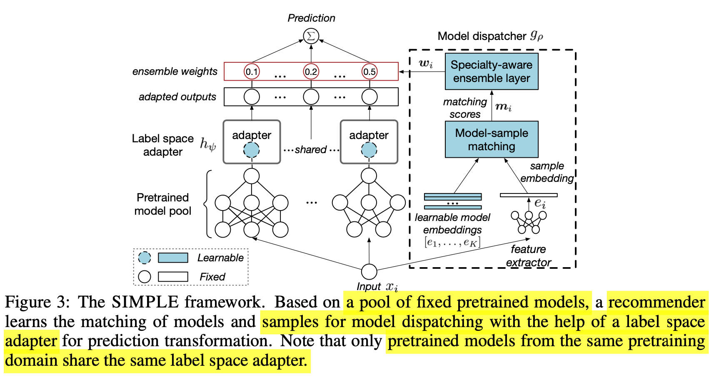

## 3.1 Label Space Adapter

- 일반적으로 pretraining model의 label space는 제각기 다를 수 있으므로 pretraining label space에서 source/target label space로 Mapping해주는 역할

  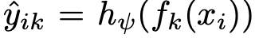

  - $\psi$ : label space adapter weight
  - $h_{\psi}$: label space adapter 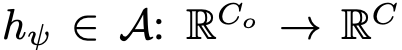
    - $C_0$: pretrained label class 갯수
    - $C$: source/target label class 갯수
  - $f_k$: k번째 pretrained model
  - $\hat{y_{ik}}$: i번째 sample에 대해 k번째 model이 예측한 adapted label

- label space adapter vs. fine tuning vs. linear probing

  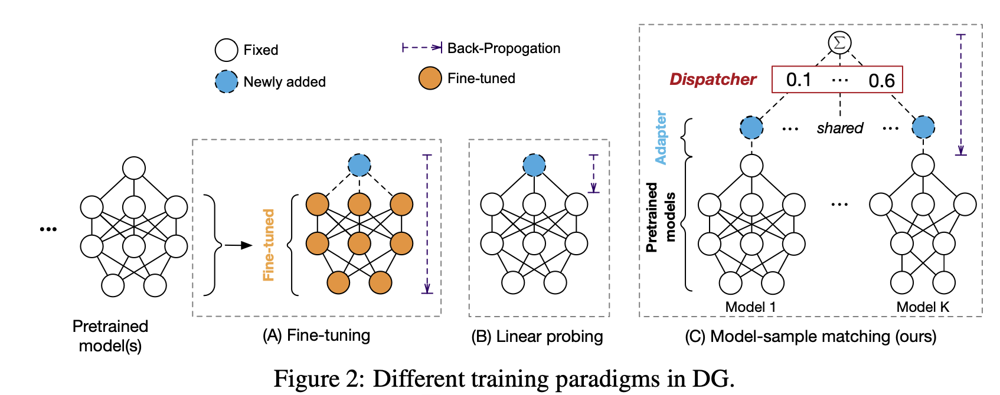

## 3.2 Matching Network

- $g_{\rho}$ 

  - input : sample $x_i$

  - output : k번째 모델 $f_k$에 각기 할당할 weight $w_k$ ($\Sigma_{k=1}^Kw_k=1$)

    $\to$ K개의 모델간 ensemble prediction 효과

  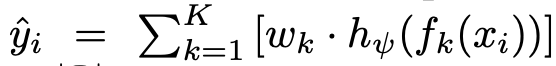

- Loss

  $L_{ens}$=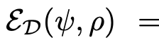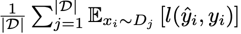

  - D: Domain의 갯수
  - $\rho$: matching network의 learnable parameters
  - $\psi$: label-space adapter의 learnable parameters

### 3.2.1. Model-sampling Matching

- recommendataion 분야에서 많이 쓰는 NCF (Neural Collaborative Filtering)을 사용

- matching score : learnable model embedding $[e_1, ..., e_K]$과 sample $x_i$를 각 model의 learnable model embedding **c**에 대해 similarity를 구하고, MLP layer를 통과시킨 값

  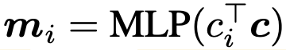

  - $c_i$: i번째 sample의 extracted feature $e_i$를 MLP 통과시킨 embedding vector

    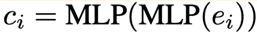

  - **c**: K개의 learnable model embedding $[e_1, ..., e_K]$를 MLP 통과시킨 embedding vector

    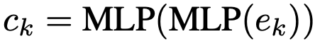

    - matching network parameters $\rho$가 여기에 포함됨

#### 3.2.2. Specialty-aware Ensemble

- top-1 model 결과만 쓰기보다 top-$\tilda{k}$개의 모델에 대한 ensemble 결과를 사용하는 것이 성능에 유리함

- ensemble weights: matching score를 softmax normalizing을 수행한 값

  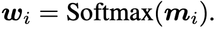

  - **w**$_j$=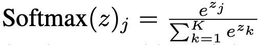
    - z는 matching score m과 동치

  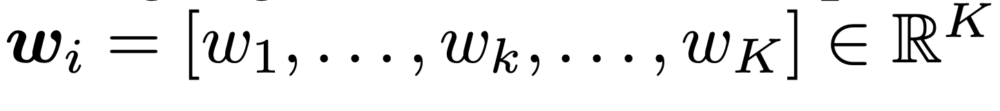

  - K: model pool에 있는 pretrained model의 갯수

- Label-space adapter Loss

  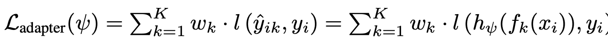

- Model Specialty learning loss (Matching Network)

  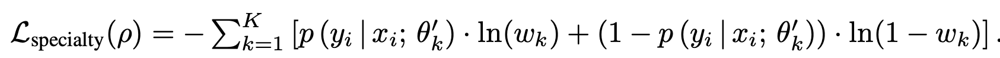

  - $w_k \in [0,1]$
  - $p(y_i|x_i;\theta_k')$: ground truth label

- Total Loss

  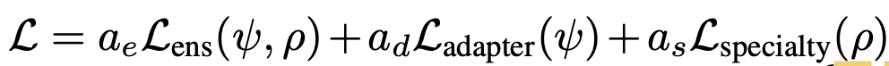

# 4. Experiments

- DomainBed

  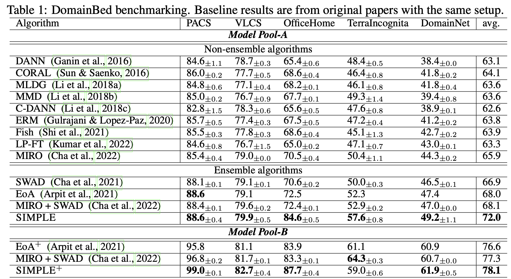

- Different size model pool

  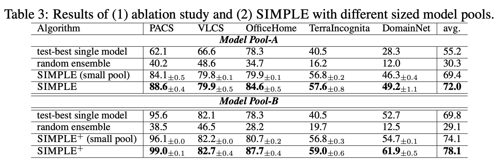

  - Model Pool-A : ImagetNet pretrained weights only
  - Model Pool-B : Various pretrained weights
  - test-best single model : upper bound (source=target prertrained single best model 결과)
  - random ensemble : 단순한 ensemble 결과 $to$ SIMPLE의 ensemble 방식이 훨씬 좋다!

- Ablation Study

  - $\bar{k}$에 따른 성능 변화

    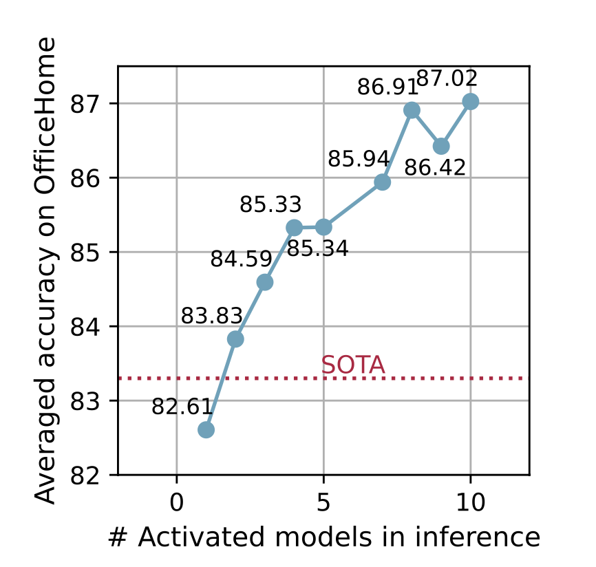
