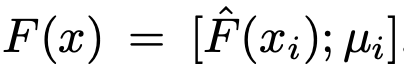
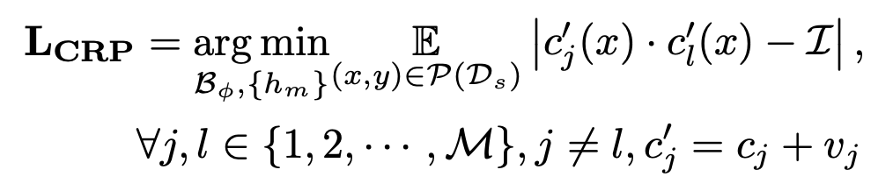

# [DG][PL][VLM][RSSR][B2N] AppleNet: Visual Attention Parameterized Prompt Learning for Few-Shot Remote Sensing Image Generalization using CLIP

- paper: https://arxiv.org/pdf/2304.05995.pdf

- git: https://github.com/mainaksingha01/APPLeNet

- CVPRw (Earth Vision Workshop) 2023 accepted (인용수: 2회, '24-01-06 기준)

- downstream task: DG for Remote Sensing Scene Recognition, Base2New for Remote Sensing Scene Recognition

  - Base2New

    

  - Domain Generalization

# 1. Motivation

- Remote Sensing (Scene classification의 일종) 분야에 Vision Language Model (VLM)을 사용한 Domain Generalization (DG) 연구가 많이 진행되고 있지 않음

  

  - Camera 각도가 다양한 dataset으로 구성. (동일 class도 있고, 다른 class도 혼재됨)

- Zero-shot CLIP의 경우, pretrain data와 다른 domain data를 사용할 경우 (domain-shift) 성능 하락이 많이 발생함

-  CoOp, CoCoOp, CLIP-Adpater 등 기존 learnable text prompt를 활용하는 경우, 

  - CLIP의 마지막 layer만 사용하고, 중간 중간 feature로 multi-scale 특성을 활용하지 않아, 다양한 scale의 instance를 고려하지 않음
  - learnable text prompt가 redundunt가 보장되지 않아 domain feature, style feature를  disentangle할 수 없어 DG task에 적합하지 않음

  $\to$ 위 문제를 해결하는 Domain Generalization에 적합한 방식을 제안해보자!

# 2. Contribution

- Remote Scene (RS) classification task에 적합한 Prompt Learning 기반의 새로운 framework Visual Attention Parameterized Prompt Learning Network (APPLE)을 제안함
  - **Style feature** (Domain-specific)와 **content feature** (Domain-invariant)를 disentangle하고자 두 가지를 제안함
    - Visual Encoder의 multi layer에서 뽑은 feature (content feature)와 batch 내 vison-encoder feature의  평균 vector (style feature)를 concat하여 attention-branch로 feature enhancement를 수행함
    - Anti-Correlation regularizer를 통해 learnable text prompt가 disentangle되도록 함
- Remote Sensing Domain Generalization benchmark에서 SOTA

# 3. AppleNet

- overall diagram

  

- Baseline 

  - CLIP

    - Visual encoder, text encoder를 $t_y$="a photo of [CLS]"로 학습함
      - Visual encoder: Res50, ViT
      - Text encoder: BERT

  - CoOp

    - text prompt를 learnable prompt를 활용함 

  - CoCoOp

    - visual feature로 learnable text prompt에 concat하여 업데이트 진행함

      $t_y$=

      - $c_m$: m번째 text token $c_m$=
        - $\pi$: visual feature를 입력받아 meta network가 출력한 embedding vector

## 3.1 AppleNet

- Injection Block (IB)

  

  

  - $\hat{F}(x)$: context feature
  - $\mu_i$: i번째 sample이 속한 domain style feature
  - $A_q$: q번째 Attention block $q \in Q$

  - Input: Multi-scale visual features (context feature) + batch statistics (mean of batch image features, style feature) 

  - Output: visual token $\{v_m\}_{m=1}^M$

    

    - $v_m$: light-weight projection network $h_m$을 통과한 visual embedding prompt

      

      - $h_m$: light-weight project network $m \in M$

    - $c_m$: learnable text token

    - M: multi feature의 갯수

- Encoded style and context features

  - context feature : $\hat{F}(x)=[\hat{f}_v^1(x), .., \hat{f}_v^L(x)]$
    - $\hat{f}_v^l(x)$ l번째 visual feature를 GAP (Global Average Pooling) layer를 통과시킨 embedding vector 

  - $\mu_i$: batch 내의 i번째 domain sample feature의 평균 

## 3.2. Training & Inference

- Training: Similarity probability기반의 supervised contrastive loss + context redundany penalization loss사용

  - supervised contrastive loss

    

    - $p(y_k\|x)$: sample x에 대한 k번째 class의 probability score

      

      - $B_{\psi}$: Injection Block parameter $\psi$로 encoded된 text prompt
      - $Y$: class 갯수

  - context redundancy penalization (CRP) loss : 각각의 learnable prompt가 disentangle되도록 학습

    

  - Total Loss

    

  

- Inference : similarity probability 중 argmax 취함

  

# 4. Experiments

- 4 datasets

  - PatternNet

  - RSICD

  - RESISC45 

  - MLRSNet

    $\to$ spatial characteristics가 다른 domain shift가 존재하는 remote sensing (위성 사진) 촬영된 scene의 dataset

- Base-to-New (B2N) generalization result

  

- Cross Domain result (DG)

  

- Single-source DG result

  - class가 동일한 image에 대해서만 학습 수행 (closed-set)

  

- Few-shot Learning 비교

  

- Ablation study

  - t-SNE 결과

    

  - class token 위치별 성능 비교 : end가 제일 좋음

    

  - context length에 따른 성능 비교

    

- Multi-scale feature 갯수에 따른 성능 비교

  

- learnable text prompt initial value에 따른 성능 비교

  

  - manual initalization : "a photo of"

- CRP Loss 유/무에 따른 성능 비교

  

- IB 갯수에 따른 성능 비교

  
