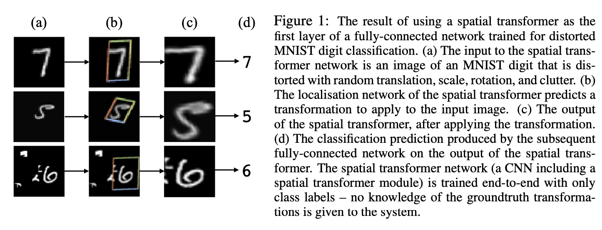
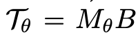
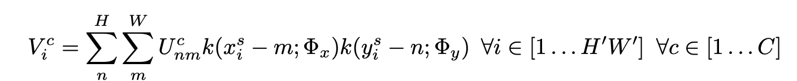
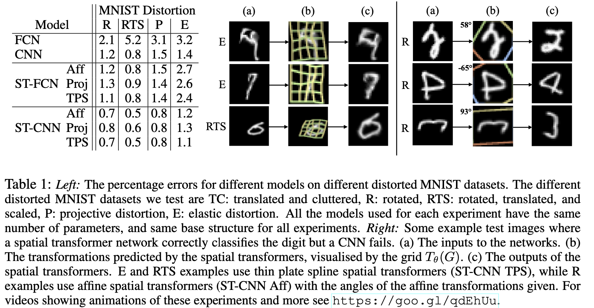
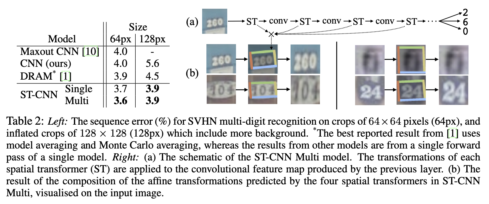
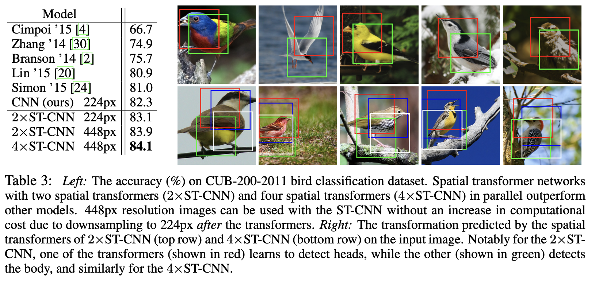

# [CLS] Spatial Transformer Network

- paper: https://proceedings.neurips.cc/paper_files/paper/2015/file/33ceb07bf4eeb3da	587e268d663aba1a-Paper.pdf
- github: https://github.com/kevinzakka/spatial-transformer-network
- NeurIPS 2015 accpeted (인용수: 8287회, '24-01-15 기준)
- downstream task: Classification

# 1. Motivation

- CNN의 translational invariance 특성이 input data에 따라 한계가 있음 

  $\to$ 가령 똑바로 된 이미지만 보다 affine transformed된 이미지는 invariant하게 보지 못함

- 임의의 (source) data에 대해 목표로하는 shape (target) size & shape로 transform해주는 sub-network가 있다면 어떨까?

# 2. Contribution

- Image classification에서 class label과 uncorrelated된 물체의 shape, size를 crop out & scale-normalize하는 spatial transformer network를 제안함

  

  - 추가적인 supervision 없이, end-to-end로 학습 가능함 
  - 단, 구성하는 모듈은 differentiable해야 함

# 3. STN

- overall diagram

  

## 3.1. Localization Net

- input : feature map $U \in \mathbb{R}^{H \times W \times C}$

- output : transformation parameter (usally 6 dim)

  

  - $f_{loc}$는 임의의 network로 구현 가능. CNN or FCN.
  - $x_i^s, y_i^s$: source coordinate
  - $x_i^t, y_i^t$: target coordinate

## 3.2. Grid Generator

- Source와 target의 grid를 transform해주는 역할

  

- B: Source sampled grid
- $T_{\theta}$: Target sampled grid
- $M_{\theta}$: transformation matrix

## 3.3. Sampler

- Differentiable image sampler일 것

  

  - $\Phi_x, \Phi_y$: generic sampling kernel의 parameters
  - $U_{nm}^c$: (n, m) pixel에 위치한 input channel c의 pixel값

# 4. Experiments

- Distorted Mnist

  

  - ST-CNN : 16-point Thin Plate Spline (TPS) layer + CNN
    - CNN : 2 max pooling

- Street View House Numbers

  - 1~5 digit의 house number를 분류하는 task

  

  - Input단 뿐만 아니라, 중간 CNN 앞단마다 STN을 추가함 $\to$ sematic meaningful feature에 대해서도 spatial transform 가능해진 구조

- CUB-200 classificaiton

  - 200 class fine grained bird 예측하는 classification task

    

    - 2 / 4 parallel STN을 덧붙인 STN+CNN 구조
    - 각 STN이 bird head / bird body 등을 구분하여 attention하도록 학습됨
