# [DG][GM] EBTSA: ENERGY-BASED TEST SAMPLE ADAPTATION FOR DOMAIN GENERALIZATION

- paper: https://arxiv.org/pdf/2302.11215.pdf
- github: https://github.com/zzzx1224/EBTSA-ICLR2023 (깡통)
- ICLR 2023 accepted (인용수: 10회, '24-01-16 기준)
- downstream task: DG for CLS

# 1. Motivation

- Deploy된 환경에서 single sample로 model parameter를 adaptation하는 것은 제한된 정보를 제공하므로 domain gap이 큰 상황에서는 문제를 야기할 수 있음

- 차라리 target domain sample을 source data로 adaptation하면 source data로 학습된 모델이 성능을 발휘할 수 있지 않을까?

  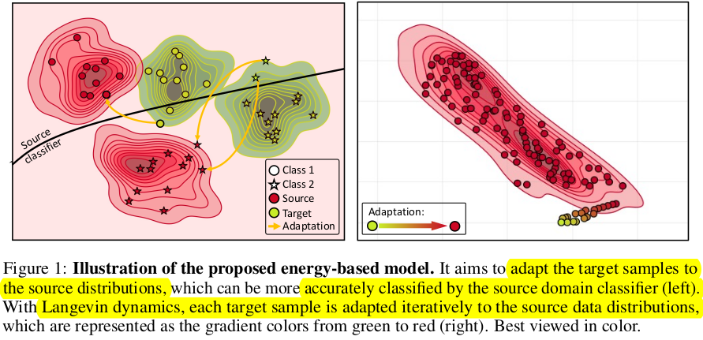

  - (초록색) target sample들의 t-SNE cluster 분포 (2-class)
  - (빨간색) source sample들의 t-SNE cluster 분포 (2-class)

- 최근 각광받는 Energy-based model로 complex data distribution을 modeling해보자! $\to$ **Langevin Dynamics**

# 2. Contribution

- Energy-based Model을 활용하여 unseen target sample을 souce-trained model에 adaptation하는 EBTSA (Energy-Based Target Sample Adaptation)를 제안함

  - Iteratively Langevin dynamics를 활용하여 sample의 energy를 minimization하는 방향으로 학습 수행

    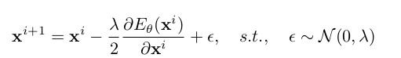

    - **x**$^{i+1}$: i+1번째 step의 adapted target sample
    - **x**$^{i}$: i번째 step의 adapted target sample
    - $\theta$: Energy based model parameter (neural network)
    - $E_{\theta}$: Energy Function $ \in \mathbb{R}^D \to \mathbb{R}$
    - $\lambda$: hyper-parameter

    $\to$ No fine-tuning (adaptation) required!

  - Categorical 정보를 잃지 않고자, categorical prototype latent vector **z**를 함께 활용하여 sample adapation 수행

    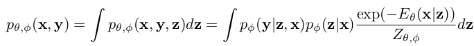

    - $p_{\theta, \phi}$(**x**, **y**): probability score
    - **x, y, z**: input image feature, label space, <u>categorical latent variable</u>
    - $\phi$: classification model parameter
    - $Z_{\theta, \phi}$: $=\int exp(-E_{\theta}(x))$ , intractable partition function
    - 어떻게 **z**를 얻는지? classification model에 variational inference롤 통해 계산함
    - inference time에는 어떻게? unseen target을 source domain 각각으로 adaptation시킨 ensemble결과를 활용 (multi-source)

# 3. Energy Based Test Sample Adaptation

- unseen target sample을 모방하고자, 서로 다른 source domain sample을 다른 source domain으로 adaptation 수행

## 3.1. Energy-based model

- probability distribution을 Energy로 modeling

  $$p_{\theta}=\frac{exp(-E_{\theta}(x))}{Z_{\theta}}$$

- 위 분모 term이 intractable하므로, log-likelhood probability $logp_{\theta}(x)=-E_{\theta}(x)-logZ_{\theta}$를 maximize 수행하는 방식으로 대체

  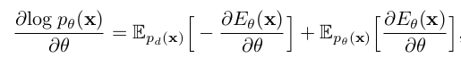

  - 1st term : data distribution ($p_d(x)$). 에너지를 최소화 해야 maximum likelyhood estimate 할 수 있음
  - 2nd term : model distribution ($p_d(x)$). 에너지를 최대화 해야 maximum likelyhood estimate 할 수 있음
  - Model $p_{\theta}$를 approximate하는 가장 Naive 한 방법은 MCMC $\to$ Stochatic Gradient Langevin Dynmaics르 대체

- Stochatic Gradient Langevin Dynmaics로 대체

  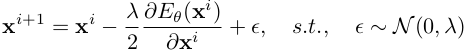

- $logp_{\theta}(x)=-E_{\theta}(x)-logZ_{\theta}$를 최대화 하는 또 다른 방식 $\to$ KL divergence of $\mathbb{D}_{KL}(p_d(x\|p_{\theta}(x)))$을 최소화

  - minimizing contrastive divergence

    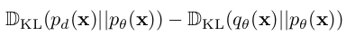

    - $q_{\theta}(x)=\Pi_{\theta}^tp_d(x)$: t seqeuential MCMC starting from p(**x**)

  - 위 식은 아래 식을 최소화함으로 구현 가능

    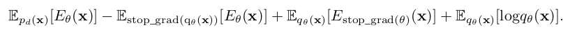

  ## 3.2. Energy Based Test Sample **Adaptation**

  - intial value : uniform distribution $\to$ target sample로 대체
  - target sample을 source sample로 adaptation하는게 목표

- Overall diagram

  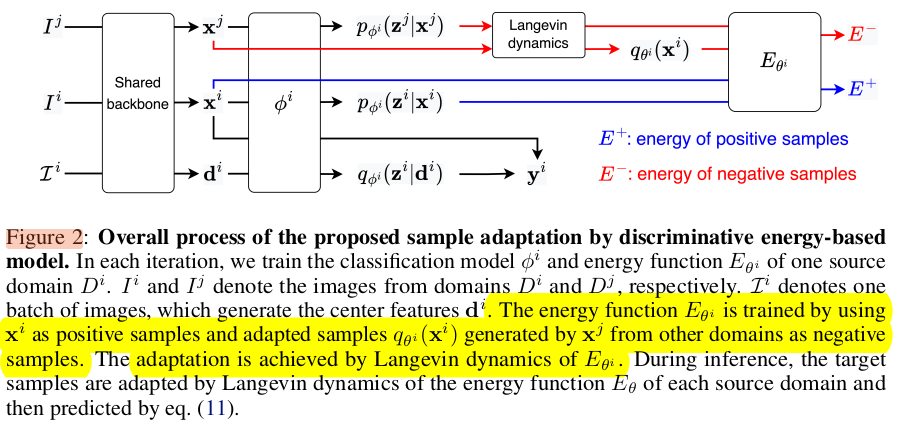

  - **x**$^i$: i번째 source domain에 속한 sample
  - **x**^j: j번째 source domain에 속한 sample
  - Energy based model은 source domain별로 존재하며, real sample from i domain은 positive, adapted sample from j domain은 negative로 contrastive 학습

  **Discimiative Energy-based Model**

  - $p_{\theta, \phi}$ (**x**, **y**): classification model($\theta$)과 energy based model$\phi$로 구성됨

    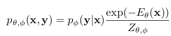

    - **x**: image *I*의 backbone featuer
    - **y**: label space vector

  - contrastive divergence loss를 사용하여 최소화 (**Eq. 6**)

    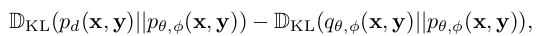

    - 정리하면

    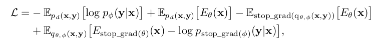

    - $q_{\theta}(x)=\Pi_{\theta}^tp_d(x)$: t seqeuential MCMC starting from p(**x**)

  **Label-preserving adaptation with categorical latent variable**

  - Navie한 Langevin Dynamics는 sampling은 input feature *X* space에서만 수행되고, start point과 독립적으로 random sampling하므로 categorical 정보가 없음

  - label-preserving adaptation을 위해 categorical latent vector **z**를 도입 *X* space $\to$ *X* $\times$ *Z* space 에서 sampling

    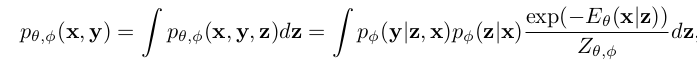

    - $\phi$: classification model의 parameter로, **x**, **z**를 예측함
    - $\theta$: **z** given **x**에 대한 maixmum probability를 modeling하는데 사용되는 energy function network parameter
    - **z**는 fixed되어 사용

  - lower bound of log-likelyhood $log p_{\theta, \phi}$(**x**, **y**) **(Eq. 9)**

    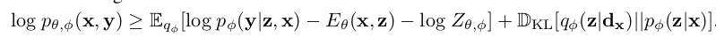

  - 위 식 (9)를 (6)에 대입하여 정리하면

    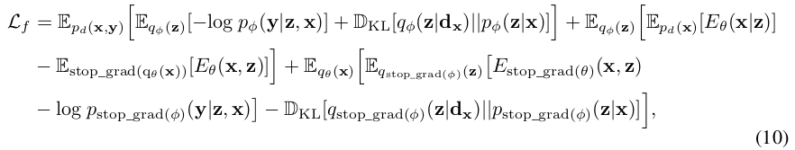

    - **z**는 variational inference로 예측함 (**q**(**z***|**d**$_x$))
      - **d**$_x$: category x로 예측된 average representation of samples on source domain $\to$ class prototype 같은 느낌
    - 1st term: source data로 classification model $\phi$를 학습
    - 2nd term: source data로 energy-based model $\theta$를 학습
    - 3rd term: adapted sampe에 대해 adaptation 과정을 학습시킴

  **Ensemble Inference**

  - S개의 source energy, classifier model의 ensemble 결과를 활용

    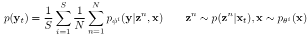

    - **z**$^n$: n번째 sample
    - p(**z**$^n$|x$_t$): target sample feature에 대해 n번째 sample의 prior probability distribution
    - S: source domain sample의 갯수wfa

# 4. Experiments

- vs. SOTA

  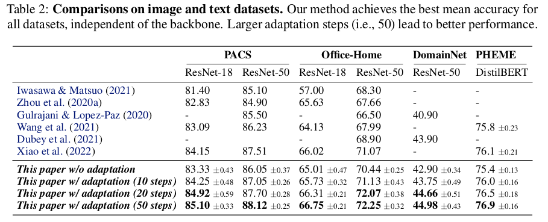

- iterative adation의 유효성

  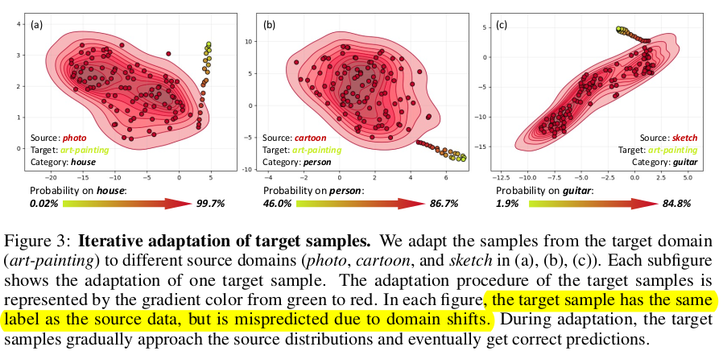

  - 위 실험에서 보여지는 point들은 모두 source/target 은 동일 class임

- Lagevin dynamic step number에 따른 ablation study

  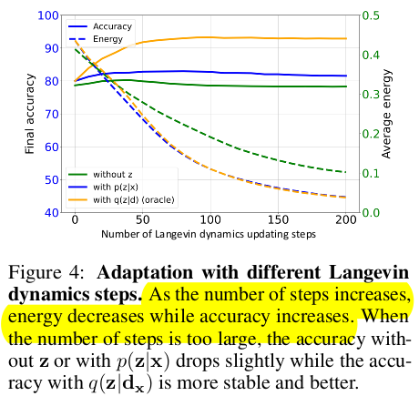

  - (주황색) 실제 target domain의 class prototype을 적용한 경우

  - (파랑색) single target sample에 대해 class prototype (**d**$_x$)을 적용한 경우

  - (초록색) **z** latent vector를 적용하지 않은 경우

    $\to$ (주황색)vs. (파랑색) energy는 minimization하는 방향으로 sample을 adaptation하기 때문에 oracle과 같이 떨어짐. 하지만, single sample만 사용하여 target sample의 category prototype 을 정밀하게 예측하지 못하므로, accuracy는 차이가 나는 것임

    $\to$ (파랑색) vs. (초록색) **z** 유무에 따른 energy / accuracy 비교. **z**를 사용하는게 안정적이며, accuracy로 향상시킴. 즉, adaptation이 잘 됨을 의미함

    $\to$ (파랑색) step이 너무 커지면, energy는 감소하지만, accuracy가 줄어듦. 이는 sample의 category prototype 을 정밀하게 예측하지 못하므로, accuracy는 떨어짐
