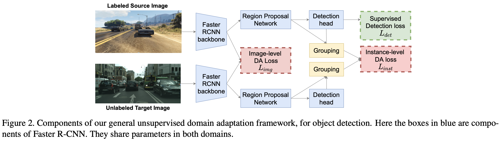

# [UDA][OD] VisGA: Seeking Similarities over Differences: Similarity-based Domain Alignment for Adaptive Object Detection

- paper: https://openaccess.thecvf.com//content/ICCV2021/papers/Rezaeianaran_Seeking_Similarities_Over_Differences_Similarity-Based_Domain_Alignment_for_Adaptive_Object_ICCV_2021_paper.pdf
- github: https://github.com/frezaeix/VISGA_Public
- ICCV 2021 accepted (인용수: 70회, '24-01-20 기준)
- downstream task: UDA for OD

# 1. Motivation

- UDA for OD의 design space를 면밀히 분석해보고, 최적의 조합을 찾아보고 싶다.
- 기존 UDA for OD는 single source 기반으로 one-to-one alignment를 수행했는데, real world에 부합한 many-to-one alignment를 해보고 싶다.

# 2. Contribution

- Alignment Training과 Visual-Similarity기반의 dynamic grouping을 사용하는 VisGA (Visually similar Group Alignment)를 제안함

  

- Alignment를 어떻게? 무엇을 통해 수행할 것인지 in-depth analysis를 수행했다.

  - 어떻게? Adversarial Training vs. Contrastive Learning
    - feature group을 coarsly align하기 위해 group간 alignment를 수행함
    - feature간 distance를 기반으로 grouping 수행
  - 무엇을 통해? Iou based vs. Visual-Similarity based.
  - 무엇을? All instance vs. Multiple Groups based on SIngle Prototype vs. Multiple Groups based on distance (no label)

- 3개의 open UDA OD benchmark를 통해 효과를 입증했다.

- Multi-source to single target UDA에도 효과를 입증함을 보였다.

# 3. VisGA

- Overall architecture

  

- Total loss

  

  - $L_{det}$: superivsed loss
  - $L_{img}$: image-level alignment loss
  - $L_{inst}$: instance-level alignment loss

## 3.1. How to induce Alignment?

- Adversarial Training

  - GRL (Gradient Reversal Layer)를 두어, Backbone이 생성한 feature가 source / target 어디에서 왔는지 분류하는 별도의 discriminator를 두어 adversarial하게 학습

    

- Contrastive Learning

  - 같은 class끼리는 당기고, 다른 class끼리는 밀어내도록 학습

    

    - C: Class 갯수
    - $F_0^i, F_1^j$: 0번째, 1번째 domain에서 출력된 i번째, j번째 class의 feature
    - m: margin

  - Class-agnostic CL도 가능함 $\to$ 가장 가까운 (nearest neighbor) feature에 대해서는 당기고, 나머진 밀어내도록 학습

    

## 3.2. What features to Align?

- 기존 UDA for OD는 모든 feature들에 대해 alignment를 수행함 $\to$ domain specific 한 특성들 (ex. background, et)까지도 align하게됨

  $\to$이는 실현 가능하지 못함

- source/targrt proposal들을 group으로 묶어주어 group 내에서 alignment하도록 해야함

- Design Choices

  - spatial grouping (IoU) vs. **Visual Similarity grouping** (cosine)

    

    - $z_i, z_j$: i, j번째 sample에 대한 feature

  - Class-wise vs. **Class-agnostic**

  - Single-prototype vs. **Multiple-Groups**

## 3.3. Similarity based Group Alignment

- Alignment하기 전에 Visual similarity 기반으로 grouping 후에 alignment를 해주는 3가지 효과

  1. All feature를 alignment하는 것에 비해 현실적임 (background feature까지 align하는 것은 비현실적)

  2.  visually similar한 feature끼리 묶게 되면 위치와 무관하게 묶일 수 있게됨 $\to$ spatial base도 포괄함

  3. pseudo label은 noisy하기 때문에 사용하지 않는 것이 유리함

  4. 모델이 알아서 Multiple group간에 adaptively group의 갯수를 조절하게 하는 것이 intra-domian 내의 representation capacity를 유지하게 함

     - group 갯수는 초반에는 RPN 출력 개개의 single prediction이 group임

       

       - N: RPN 이 출력한 proposal의 갯수
       - m: proposal의 size

     - threshold보다 낮게 distance를 갖는 proposal끼리 묶어주어 group을 형성함

     - Comple-Linkage Heuristics를 통한 grouping $\to$ K-NN보다 좋음

     

     - A, B: group A와 B

     - MaxLink: group A와 B의 (max) distance

     - group의 평균 feature는 평균값

       

# 4. Experiments

- AT vs. CL : AT > CL
  

- Image-level alignment 사용 유/무 $\to$ 유

  

- Aggregation은 어떻게 할지? (Multi-Group vs. Single Prototype / Class-wisevs. Class-Agnostic / Spaitial vs. Visual)

  

  - Class-Agnostic /  Multi-Group / Visual Simiar

- vs. SOTA

  

  

- Qualitative Analysis

  

- Dataset에 따른 Number of Groups

  

  - Sim2Real은 class=1라 적어짐
  - Foggy2origin은 class=9라 많음

- Computational overhead

  - 비교적 무시가능함 (with: 0.79 sec per 1 batch vs. w/o: 0.62 sec per 1 batch)

- Multi-Source Domain Adaptation

  

- Ablation

  
