# [UDA][GM][OD] BlenDA: DOMAIN ADAPTIVE OBJECT DETECTION THROUGH DIFFUSION-BASED BLENDING

- paper: https://arxiv.org/pdf/2401.09921.pdf
- github: x
- archived. (인용수: 0회, '24-01-21 기준)
- downstream task: UDA for OD

# 1. Motivation

- Off-the-Shelf text-to-Image Foundataion 모델을 사용하여 domain adaptation for OD 성능을 높여보고 싶다.

# 2. Contribution

- Off-the-Shelf pretrained text-to-Image model (InstructPix2Pix)이 출력한 Intermediate image를 활용하여 soft domain label로 adversarial learning을 수행하는 BlenDA를 제안함

  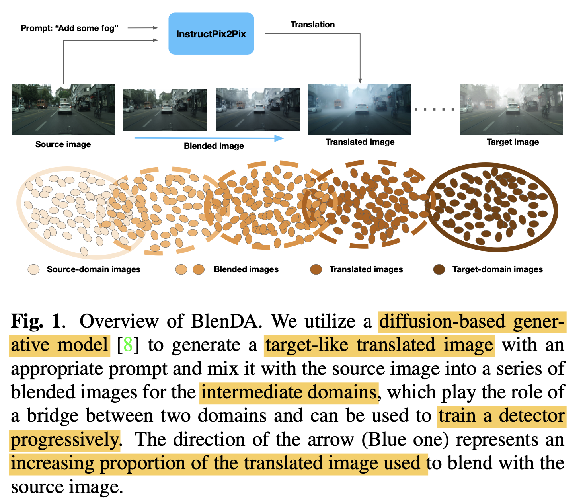

  - Intermidate domain : Source domain과 Translated domain (Target-like domain)을 mixed한 domain.

# 3. BlenDA

- Overall Diagram

  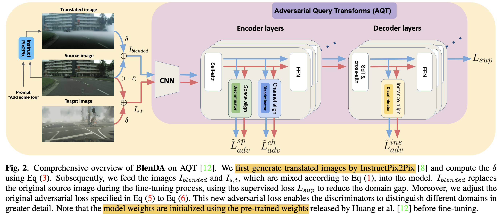

  - baseline: AQT (Adversarial Query Transformer)
  - Blended domain Image를 활용함으로써 Source domain과 Target domain 간의 간극을 줄여주는 bridge 역할을 수행함
    - Blended domain Image를 source image처럼 superivsed learning을 수행함

  ## 3.1. Intermediate Domain

  - Translated image를 학습에 활용하게 되면, forground 객체가 잘 안보일 수가 있으므로, 두 domain간의 비율을 조정해준다.

    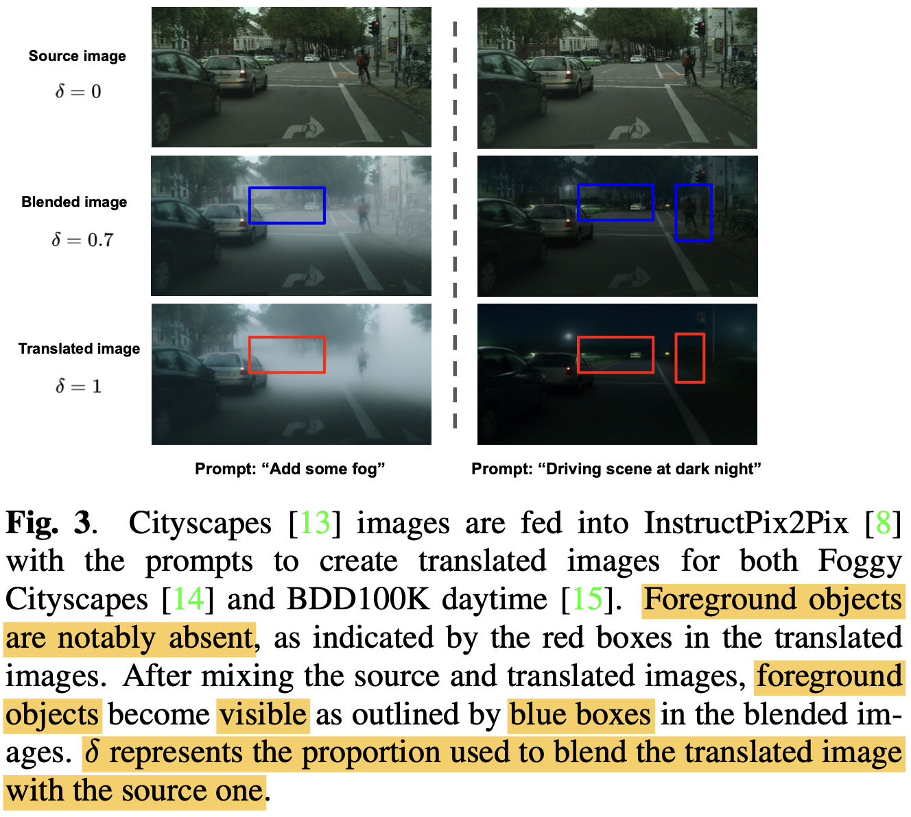

    - Mixed-domain Adversarial Loss

      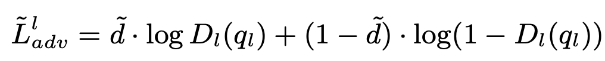

      - $l$: spatial, channel, instance
      - $\tilde{d}$: domain soft label **$\telda{d}=\delta$**
        - domain-soft label을 사용하여 학습함으로써 다양한 (intermediate) domain을 분류하도록 discriminator를 학습함으로써 domain 간의 분류 성능을 향상시킬 수 있음

      - Dynamic weighting of Intermediate Domain (Blended)

        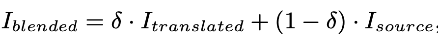

        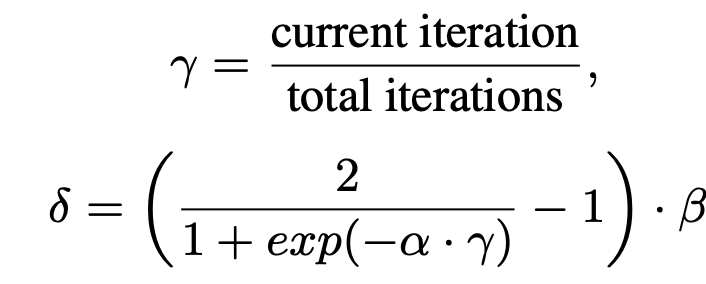

        - $\delta$: 생성된 이미지와 source 이미지간의 비율 (1에 가까울수록 생성된 이미지만 사용.)

      - source, target blending image 를 target domain 대신 사용 $\to$ soft-domain-label을 가지고 adversarial traning

      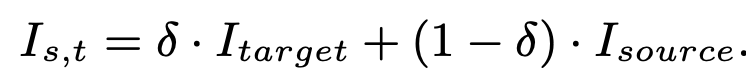

    

- Total Loss

  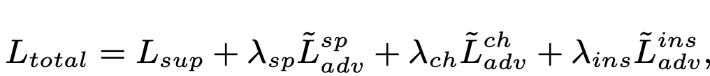

- Optimization of DETR

  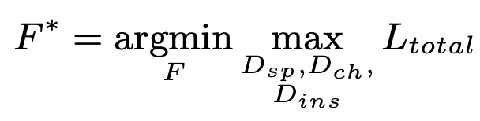

# 4. Experiments

- Cityscapes2Foggy

  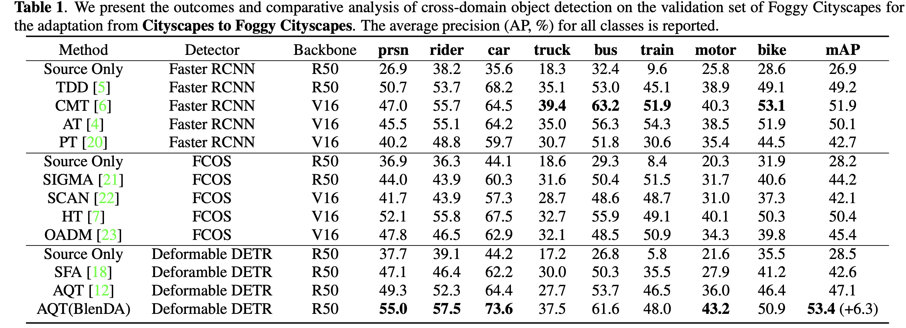

  - text prompt : "Add some Fog"

- Cityscapes2BDD

  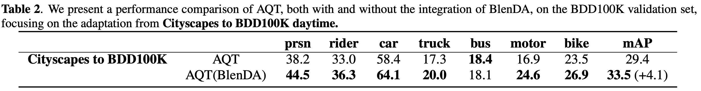

  - text prompt: "Driving scene at night"

- Ablation Study

  - $\delta$, With and W/O Mixed-domain Adversarial Loss

    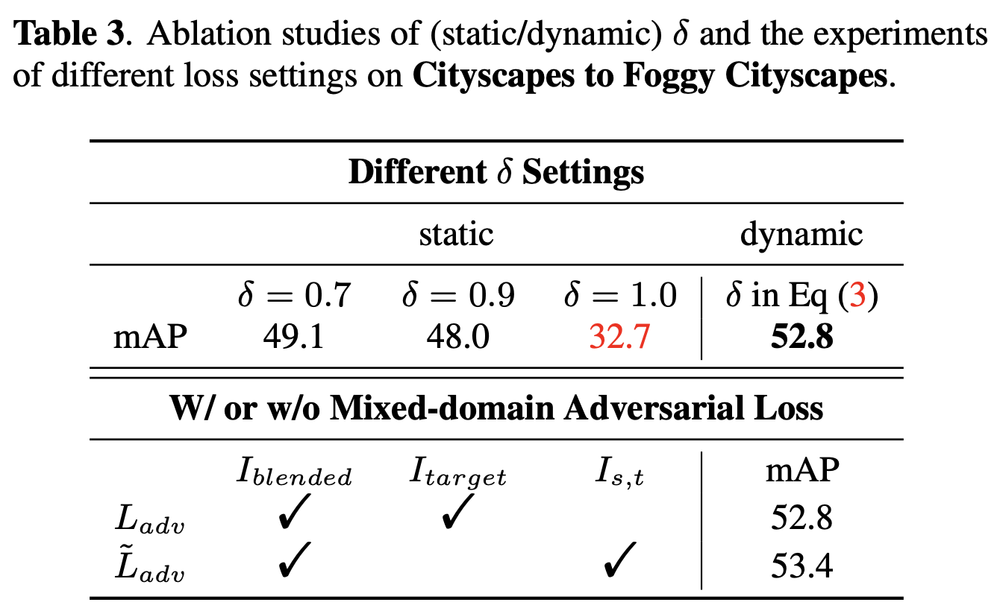
