# [UDA][OD] AQT: Adversarial Query Transformers for Domain Adaptive Object Detection

- paper: https://www.ijcai.org/proceedings/2022/0136.pdf
- github: https://github.com/weii41392/AQT
- IJCAI 2022 accepted (인용수: 10회, '24-01-22 기준)
- downstream task: UDA for OD

# 1. Motivation

- UDA for OD가 CNN기반의 모델들에서는 많이 연구되지만, Transformer 기반에서는 잘 연구가 되고 있지 않다.
- 기존의 colvolution기반에 CNN모델에 적용하던 Domain Alignment를 token간의 relationship을 attention 매커니즘으로 구현한 Transformer 기반에 적용하면 sub-optimal 하다. 
  - source/target feature간에 alignment을 수행시켜주는 domain-specific token을 사용하는 것은 어떨까?

# 2. Contribution

- Adversarial token을 사용하여 Domain-specific한 feature를 학습하여 domain alignment를 수행하는 transformer 기반의 AQT (Adversarial Query Transformer)를 제안함

  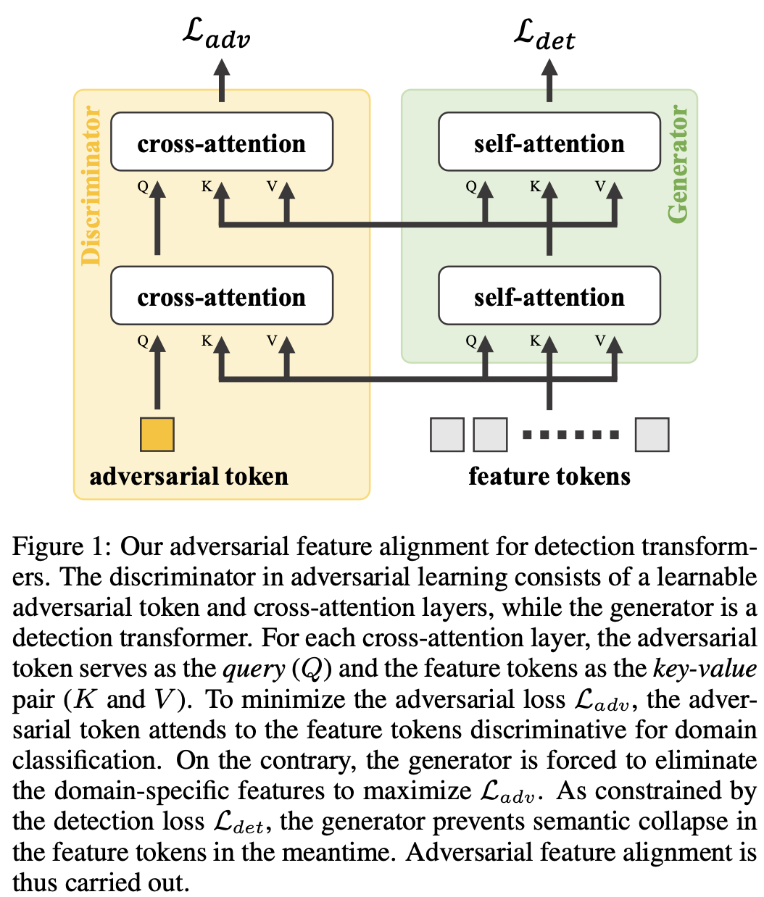

  - Key, Value : Image Features
    - 역할: Generator로써, source/target feature 간에 alignment를 하여 discriminator를 속이도록 feature를 뽑음
      - 유동적인 입력 $\to$ image patches (spatial), feature maps (channel), detected objects (instance) 등을 넣을 수 있음
    - 구성: CNN backbone, Attention기반 Encoder
  - Query : adversarial token
    - 역할: Key, Value에 들어있는 Image feature 중, source/target간에 alignment 되지 않는 영역을 뽑아내어 domain간 분류를 하는 classifier
    - 구성: learnable (adversarial) query, stack of cross-attention layers

- AQT는 Simple plug-and-play 기법의 모듈임

- UDA for OD에서 (당시) SOTA

# 3. AQT

- Overview

  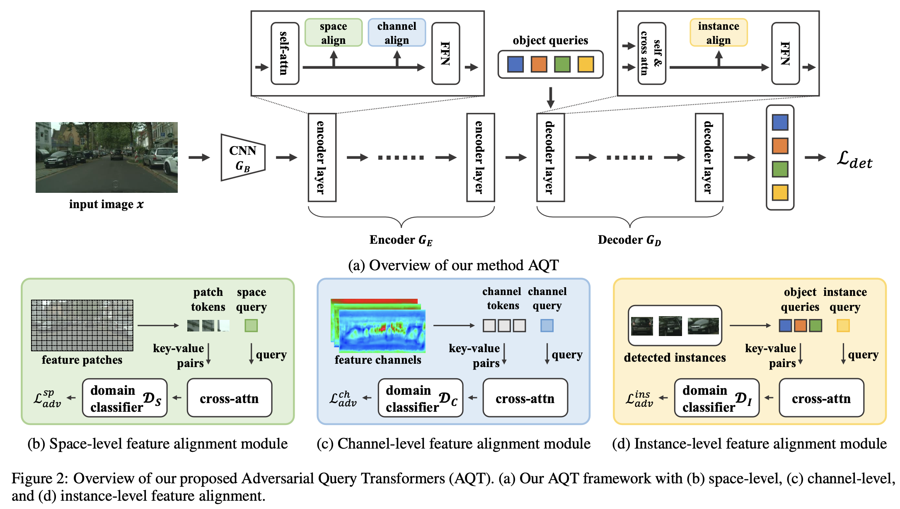

  - 구성 : Generator (CNN Backbone + Transformer Encoder, Decoder), 3개의 discriminator (space-level, channel-level, instance-level)

  ## 3.1. Spatial-level Feature Alignment

  - 역할: domain classification을 하기 위해 domain-specific한 feature를 추출하는 spatial query를 사용

  - 특징

    - learnable, cross-attention layer를 사용하며, spatial query와 image feature를 key-value pair로 사용

    - 이전 layer의 output query를 입력 query로 사용

      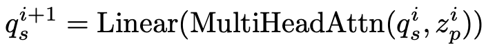

      - i: i번째 encoder layer
      - $q_s^{i}$: i번째 layer의 spatial query
      - $z_p^{i}$: i번째 layer의 patch token $\in \mathbb{R}^{L \times C}$, $L=H \times W$

    - For simplicity, positional embedding vector, normalization layer, residual connection 등을 사용하지 않음

    - GRL (Gradient Reversal layer) 사용

  - Loss

    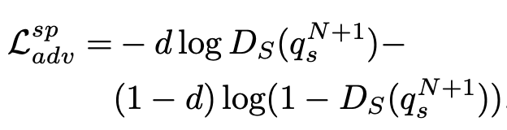

    - $q_s^{N+1}$: N+1째 (마지막) layer가 출력한 query
    - $D_s$: spatial discriminator
    - d: 0 for source, 1 for target
    - $L_{adv}^{sp}$: spatial adversarial loss

  ## 3.2. Channel-level Feature Alignment

  - 역할: Spatial-level feature alignment가 잡지 못하는 global한 영역에 대한 attention을 수행하는 역할

    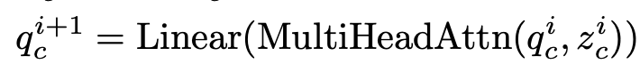

    - $q_c^{i}$: i번째 layer의 channel query
    - $z_c^{i}$: i번째 layer의 channel feature $\in \mathbb{R}^{\hat{L} \times C}$, $\hat{L}=C << L$

  - Loss

    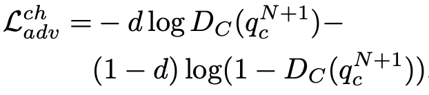

  

  ## 3.3. Instance-level Feature Alignment

  - spatial & channel alignment를 수행했다고 하더라도, 여전히 source pretrained model의 query들은 source biased되어 있음.

  - 역할: instance-level로 feature alignment 를 수행하여 source biased된 feature를 align

    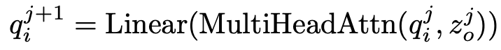

    - $q_i^{j}$: j번째 layer의 instance query
    - $z_o^{j}$: j번째 layer의 object query 

  - Loss

    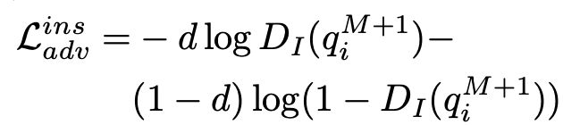

    - M: M번째 decoder의 출력값 (M+1=final

- Adversarial Loss

  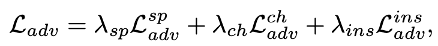

- Detection Transformer의 Total Loss

  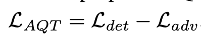

- DAOD Transformer의 opjective

  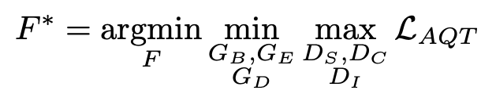

# 4. Experiments

- Cityscapes2Foggy

  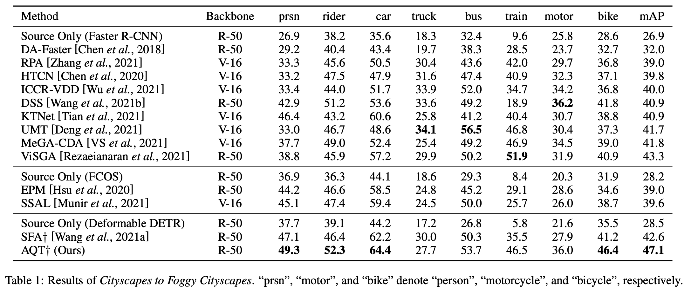

  - minor classes (bus, train, motor, bike)는 CNN보다 성능이 안좋음 $to$ DETR계열이 CNN보다 "data hungy"

- Cityscapes2BDD100k

  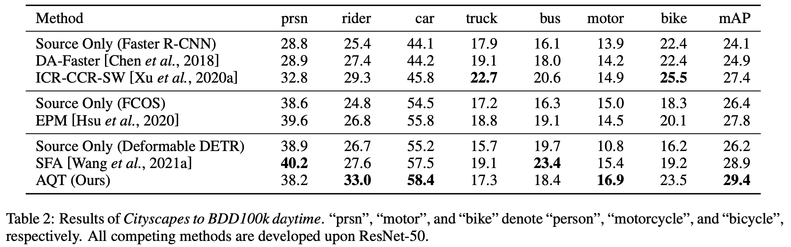

  - minor classes (bus, train, motor, bike)는 CNN보다 성능이 안좋음 $to$ DETR계열이 CNN보다 "data hungy"

- Sim10K2Cityscapes

  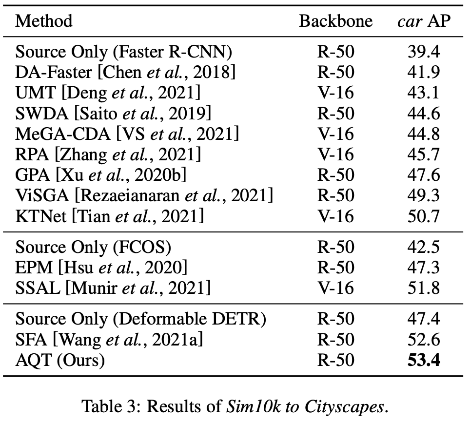

- Space Query의 (visualization)검증

  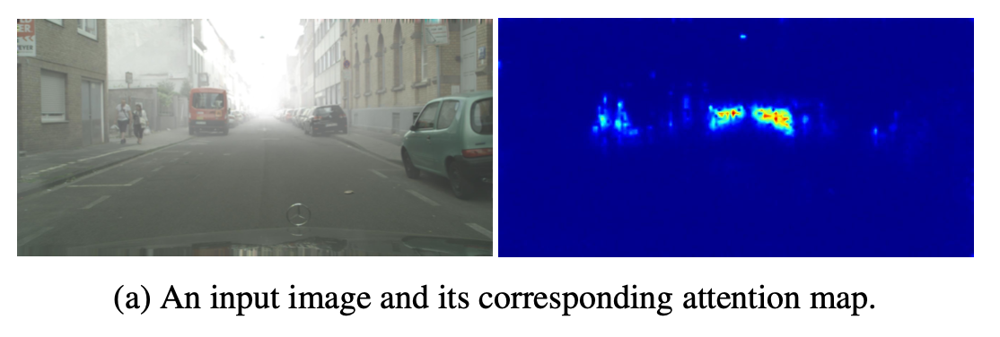

  - 예상대로 Foggy 한 domain specific한 영역에 highlight가 되어 학습됨

- t-SNE 분석

  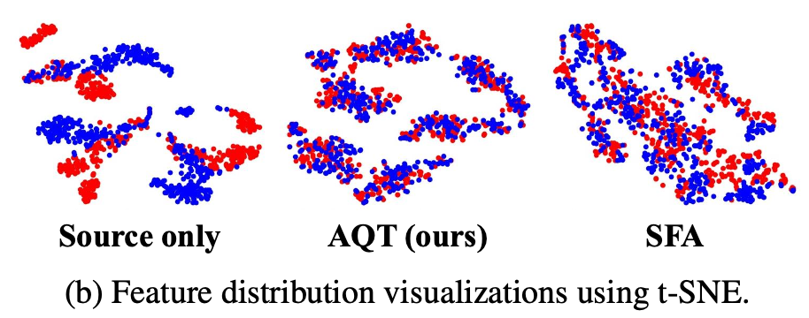

  - 예상대로 source/target feature가 align이 잘 됨

- Ablation study

  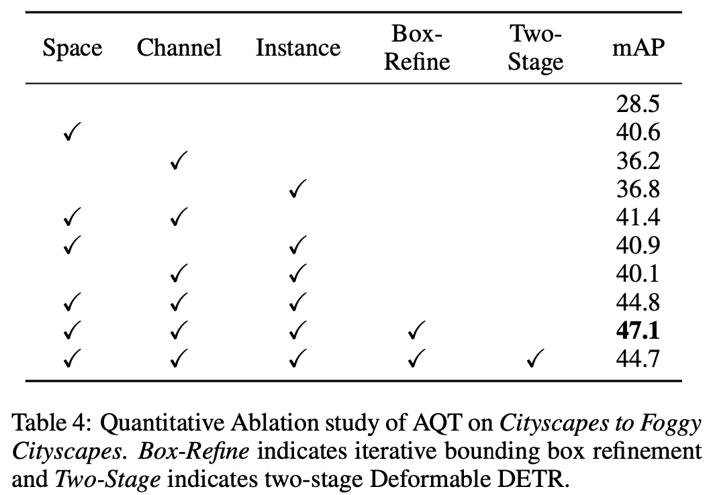

  - 예상대로 모든 alignment 모듈이 성능에 기여함
  - Rox-Refine, Two-stage는 Deformable-DETR것인데 사용하면 더 좋아짐

- Visualization vs. SOTA

  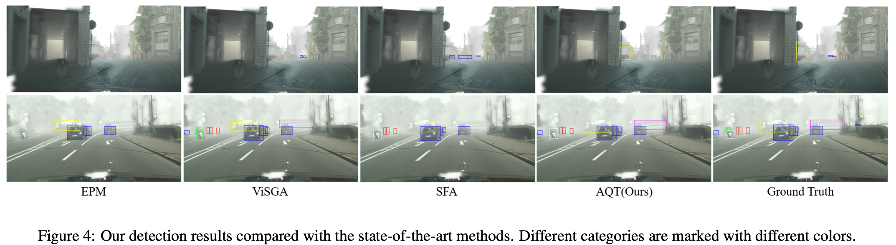

- Visualization of Ablation

  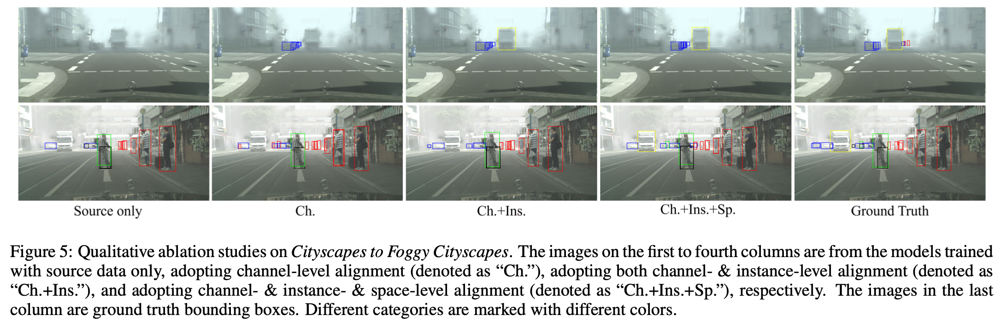
