# [SSDA][CLS] G-ABC: Adaptive Betweenness Clustering for Semi-Supervised Domain Adaptation

- paper: https://arxiv.org/pdf/2401.11448.pdf
- github: X
- IEEE Transactions on Image Processing 2023 accpeted (인용수: 3회, '24-01-24 기준)
- downstream task: SSDA for CLS

# 1. Motivation

- UDA에 비해 적은양의 target domain label을 가지고 classification performance를 증가시킬 수 있는 SSDA를 사용하고 싶음
- 적은양의 Target domain label과 대량의 source domian label에 semantic aligned feature를 대량의 unlabeled data에서 잘 뽑고싶음

# 2. Contribution

- Global categorical domain alignment를 통해 source/target label의 semantic 정보를 target unlabel에 transfer할 수 있는 SSDA framework Graph-based Adative Betweenness Clustering (G-ABC)를 제안함

  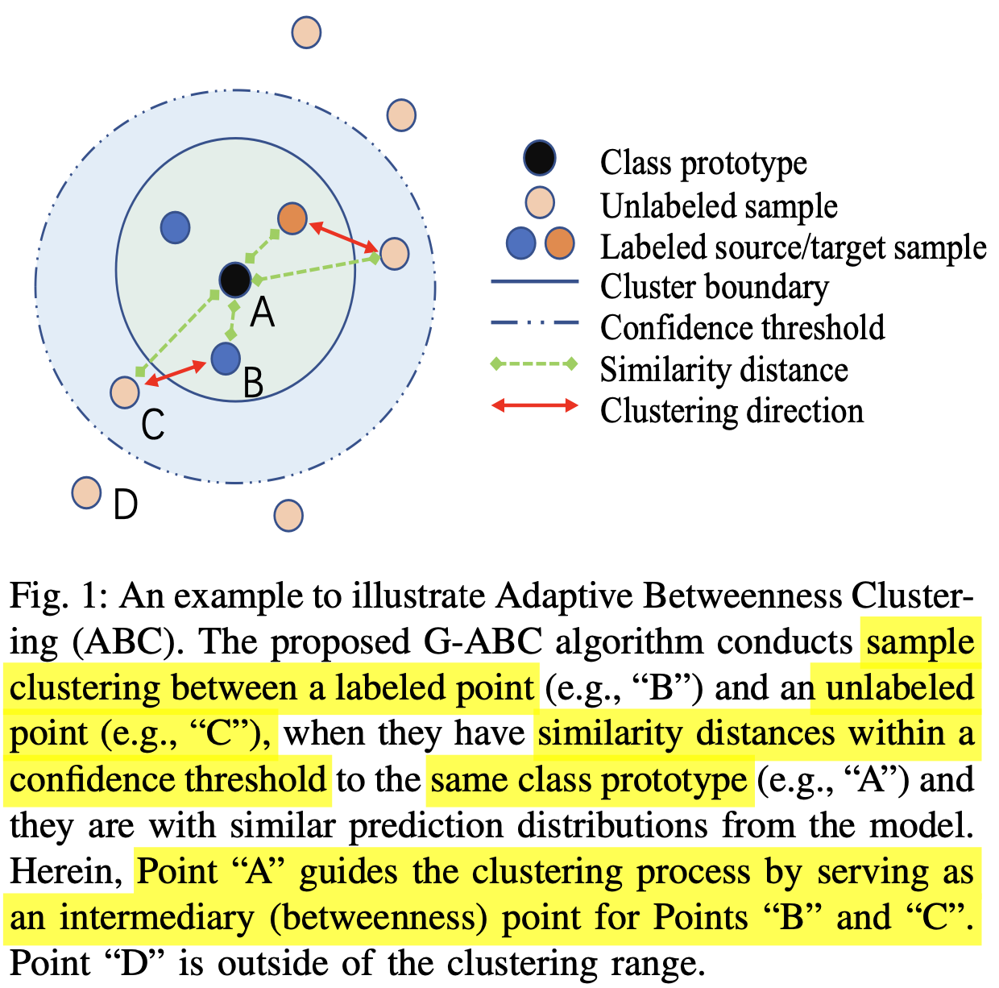

  - Class Prototype: classification head의 weight에 해당. (feature와 CLS weight의 곱이 probability score임)
  - Labeled Sample : Source (대량) / Target (소량). Noisy label이 없다고 가정.
  - Confidence threshold를 넘는 unlabel sample에 대해 같은 class면 Cluster boundary로 unlabeled sample을 pull / 다른 class면 push함

-  Label / unlabel sample간에 관계를 매칭해주는 Heterogenous graph를 제안함.

  - node: sample

  - edge: sample간의 관계

  - Noisy label의 연결을 degrade해주고자, 2가지 connectivity refinement를 제안함

    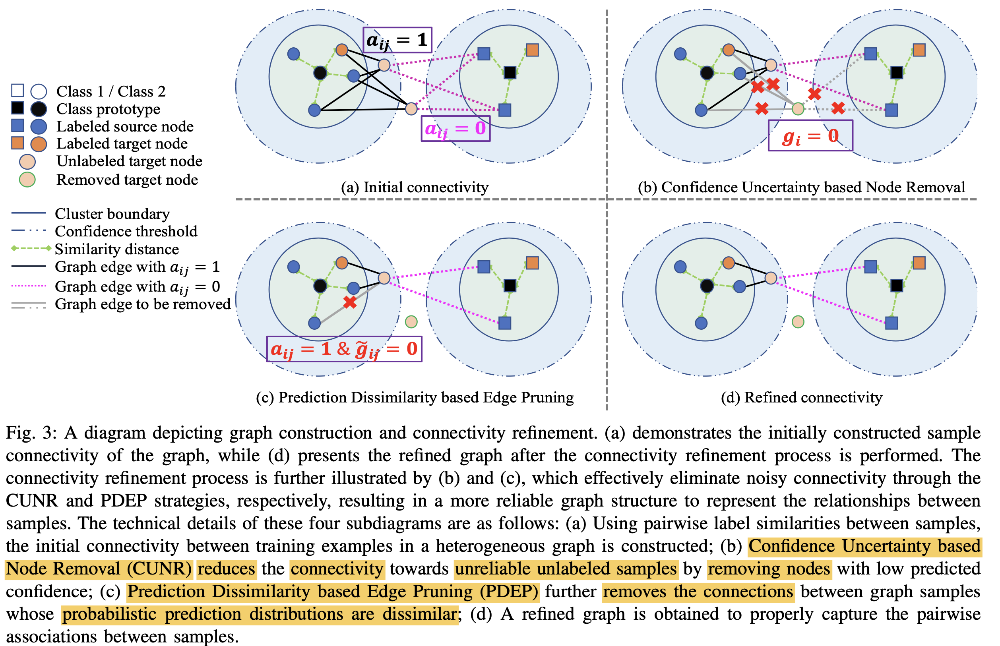

    - Confidence Uncertainty based Node Removal (CUNR)$\to$ unreliable한 sample은 아예 node를 제거함
      - $g_i$: i번째 unlabel sample이 reliable한지 판단하는 지표. 1이면 reliable, 0이면 unreliable 

    - Prediction Dissimilarity based Edge Pruning (PDER)

      - 목적: 
        - 같은 class간에도 diversity를 보존하고 싶어서, similarity score가 threshold보다 낮은 것들까지도 pull하지 않게 pruning
      - $a_{ij}$: i번째 unlabel sample과 j번째 label sample이 같은 class인지 판단하는 지표. 1이면 같은 class, 0이면 다른 class
      - $\tilde{g}_{ij}$: i번째 unlabel sample과 j번째 label sample간에 edge를 prune할지 판단해주는 함수. 0이면 prune. 1이면 preserve

      $\to$를 통해 pull/push 관계를 정립함

  - Label sample의 semantic을 unlabel sample에게 transfer 할 수 있는 Adaptaive Betweenness Clustering (ABC)를 제안함

    - 목적: source / target에 bias되지 않으면서 골고루 label의 semantic knowledge를 transfer해줌
    - Within-Domian Betweenness Clustering (WDBC): target label / target unlabel sample간 clustering

    - Across-Domian Betweenness Clustering (WDBC): source label / target unlabel sample간 clustering

      $\to$이를 위해 self-supervised learning, consistency regularization, pseudo-labeling등을 사용

  - SSDA benchmark에서 SOTA

# 3. G-ABC

- overall algorithm

  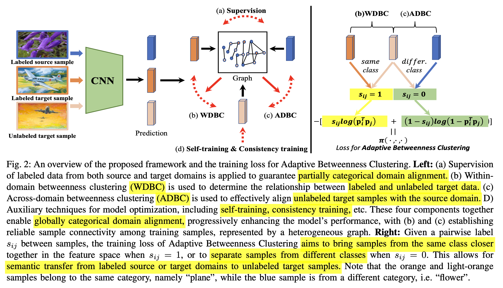

  - Prediction: Backbone + Classification head를 통과한 vector

    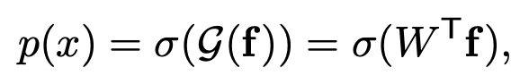

    - W: classification head. $\in \mathbb{R}^K$

      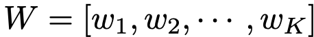

    - K: number of classes

    - **f**: normalized feature of backbone

      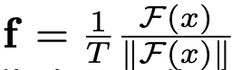

      - T: temerpature parameter
      - F: backbone feature
      - $\sigma$: sigmoid function

    - p(x): similarity score (between feature & classification head's weight)

  - Graph: Vertex, Edge, Association Metric으로 구성

    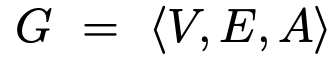

    - V: vertex. 전체 dataset 만큼 node가 구성됨

      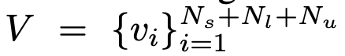

    - E: edge. vertex(unlabel & label)간의 association을 collect

    - A: Association Metric. 기본적으로 sample간의 similarity score를 기준으로 weight를 제공

      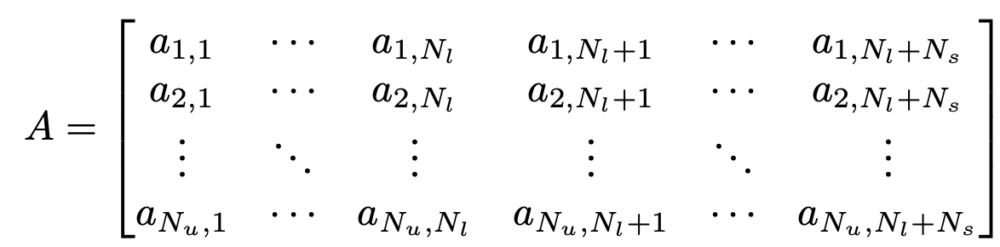

      - 행: unlabel sample

      - 열: label sample

      - $a_{i,j}$: i번째 unlabel, j번째 label sample간의 관계

        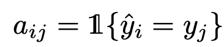

        - 같은 class면 1, 다른 class면 0으로 초기화 (Fig2.(a) 참고)

  - Confidence Uncertainty based Node Removal (CUNR) 

    - 목적: unlabel data는 noisy하기 때문에 unreliable한 sample은 아예 node를 제거함

    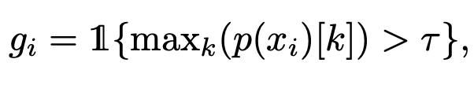

    - $g_i$: i번째 unlabel sample이 reliable한지 판단하는 지표. 1이면 reliable, 0이면 unreliable $to$ **node 제거**

  - Prediction Dissimilarity based Edge Pruning (PDER)

    - 목적: 같은 class라더라도, similarity score가 낮은 것까지 pull한다면 sematic propagation에 negative effect $\to$ **edge prune**

      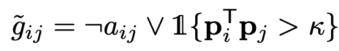

      - $\kapa$: similarity score threshold

      - ㄱ: not

      - V: or

      - **p**: probability score

        $\to$ 서로 다른 class이면($a_{ij}$=0) $\tilde{g}_{ij}$는 항상 1로 $\to preserve

        $\to$ 서로 같은 class이면($a_{ij}$=1)이고, 두 sample (i,j)가 similar하면  $\tilde{g}_{ij}$는 1로 $\to preserve

        $\to$ 서로 같은 class이면($a_{ij}$=1)이고, 두 sample (i,j)가 not similar하면  $\tilde{g}_{ij}$는 0로 $\to prune

  - $g_i^j$: i번째 unlabel sample과 j번째 label sample을 연결할지 판단하는 변수

    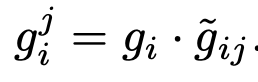

- Adaptive Betweenness Clustering (ABC)

  - Loss

    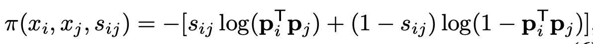

    - $s_{ij}$=$a_{ij}$

  - WDBC (Within-Domain Betweenness Clustering) & ADBC (Across-Domain Betweenness Clustering)

    - source, target 모두 contrastive로 학습하기 위함

      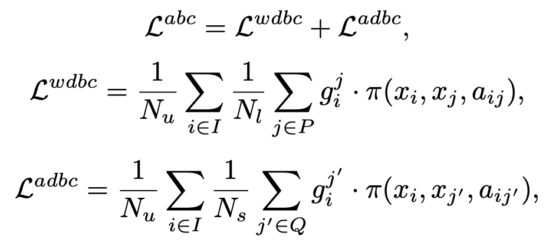

      - I: Unlabeled target set
      - P: Labeled target set
      - Q: Labeled source set

- Intuitive demostration

  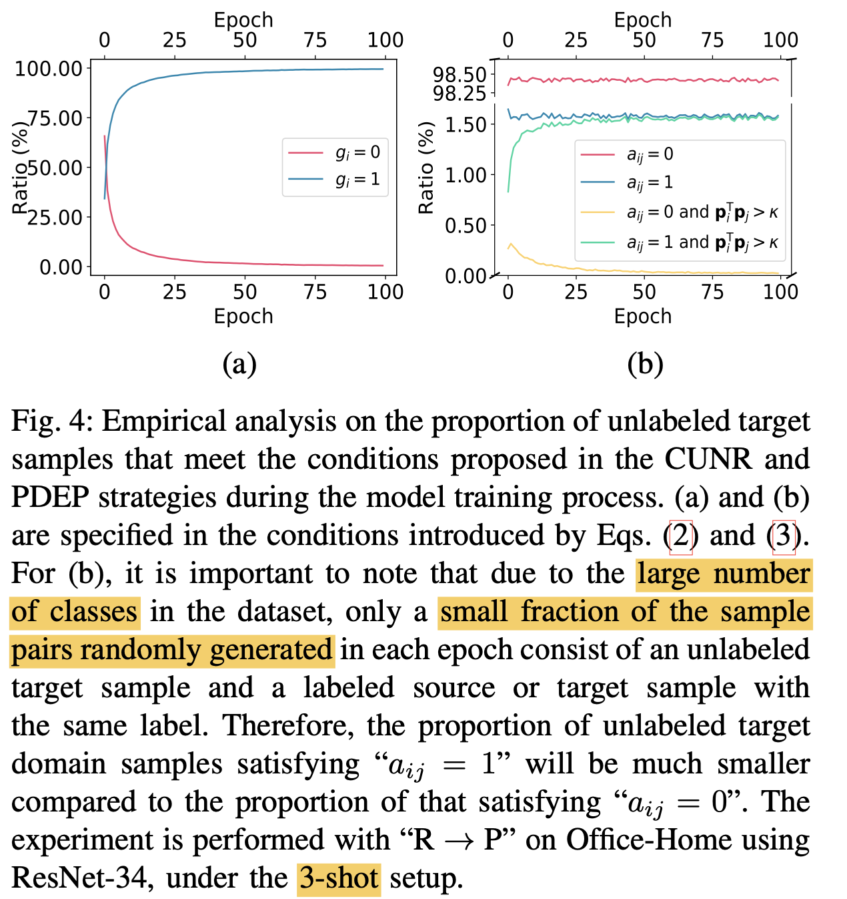

- Further Optimization

  - Pseudo label selection

    - 기존의 방식과 동일. threshold $\tau'$는 위에 사용한 $\tau$보단 크게 잡는게 실험적으로 좋았음

      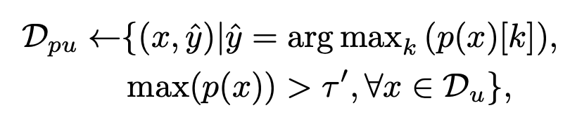

  - Self-training

    - 다른 view로 augmentation한 동일 이미지에 대해 entropy를 최소화

      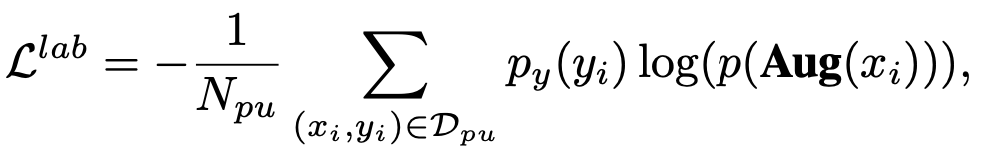

  - Consistency training

    - perturbed된 동일 이미지에 대해 KLD 최소화

      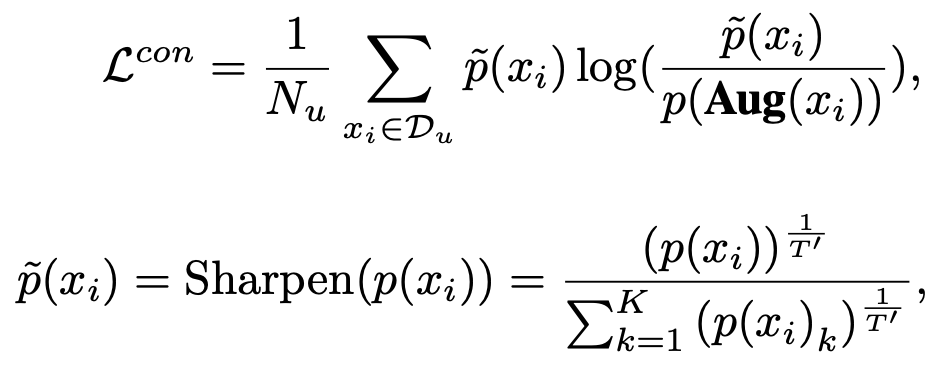

  - Total Loss

    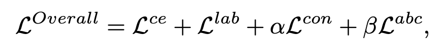

# 4. Experiments

- DomainNet

  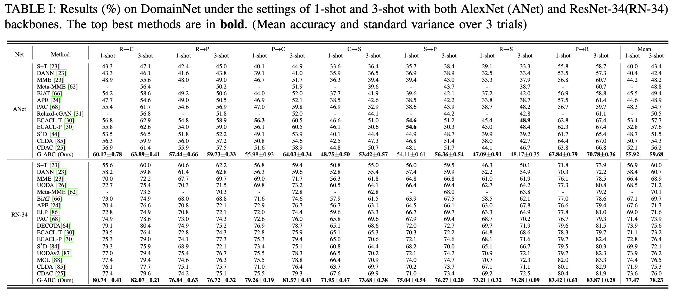

- OfficeHome

  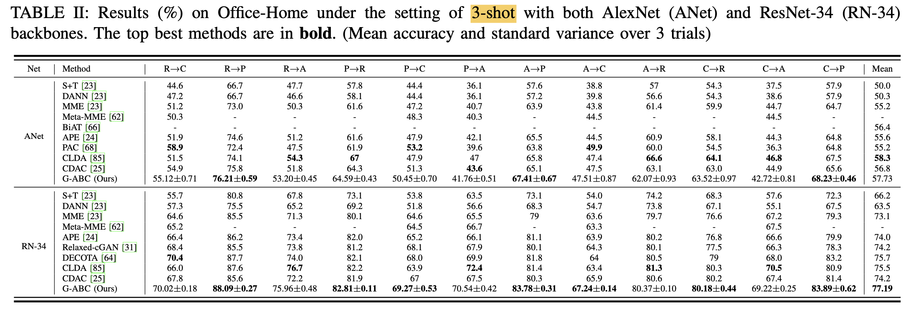

- OfficeHome-31

  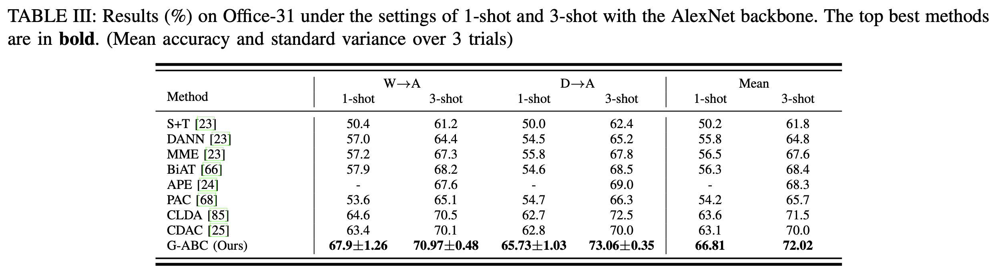

- Ablation

  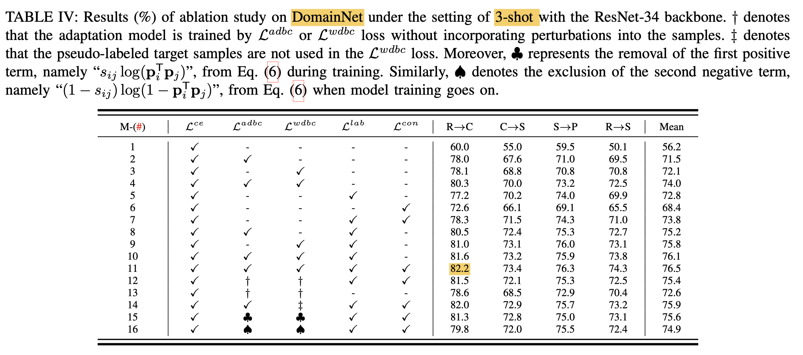

- Classwise Similarity Score

  - label, unlabel class간의 평균 classification probability의 유사도로 정의

    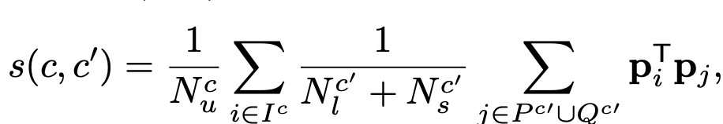

  - Diagonal이 강한 similarity 형성함 $\to$ ABC (Adaptive Betweenness Clustering)이 효과적임

    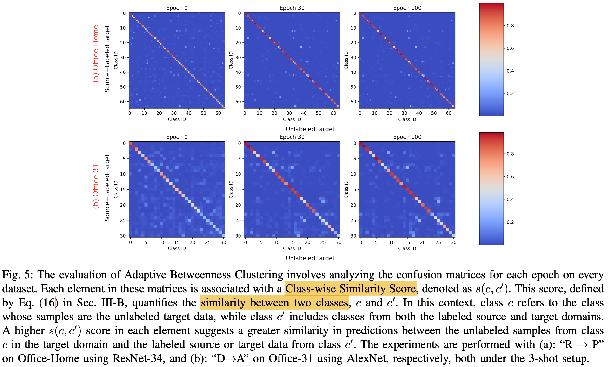

- Graph Refinement Ablation

  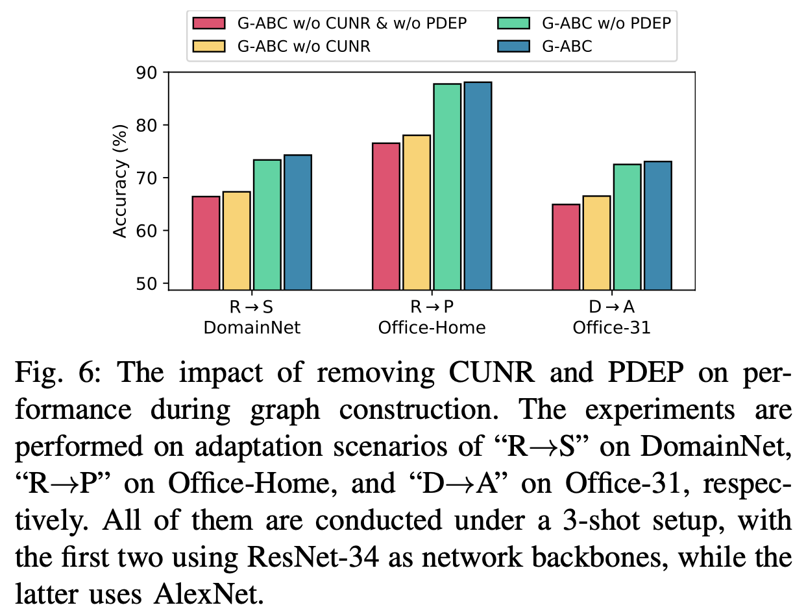

- Hyperparamter ($\tau, $\kapa, $\alpha, $\beta$)에 따른 ablation

  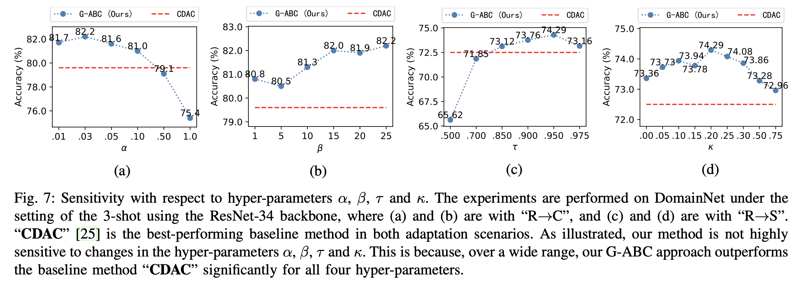

- $\tau'$에 따른 ablation

  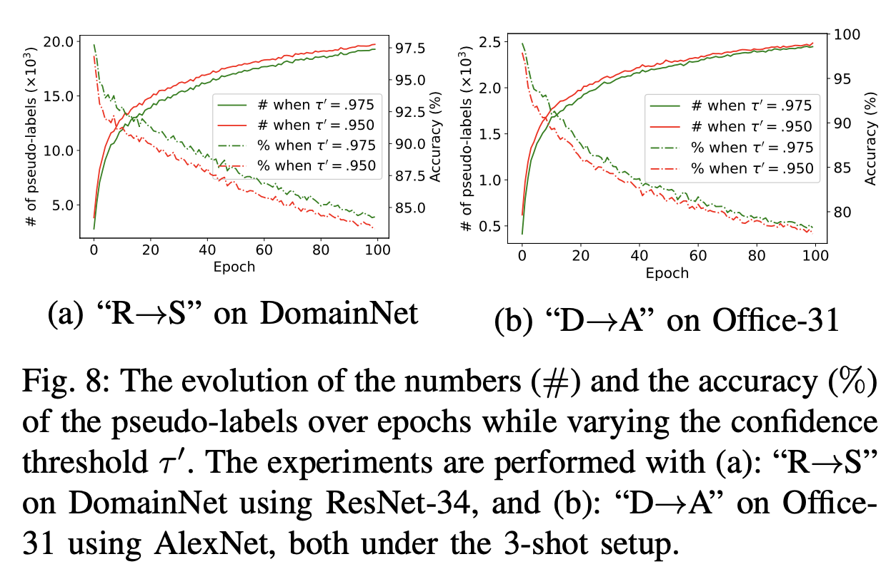

  - 그림이 이상함.. (accuracy가 갈수록 감소? $\to$ error아님?)

- t-SNE

  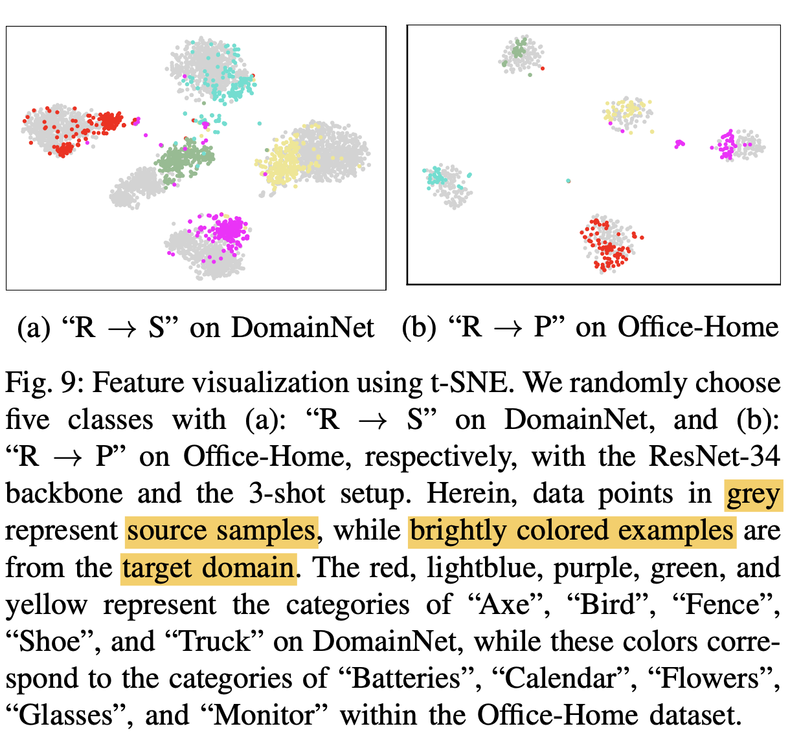
