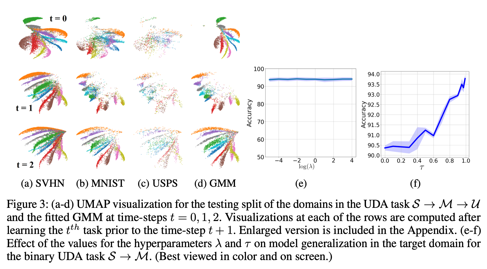

# [UDA][CL] LDAuCID: Lifelong Domain Adaptation via Consolidated Internal Distribution

- paper: https://proceedings.neurips.cc/paper_files/paper/2021/file/5caf41d62364d5b41a893adc1a9dd5d4-Paper.pdf
- github: x
- NeurIPS 2021 accpeted (인용수: 47회, '24-02-07 기준)
- downstream task: Continual UDA for CLS

# 1. Motivation

- Target 에 adaptation 후에도 Source domain에서 catastrophic forgetting이 발생하고 있음
- 기존에는 CL+UDA분야로 연구가 되고 있지 않음

# 2. Contribution

- Model이 학습한 in-distribution으로 학습된 지식으로 모델링된 multimodal distirbution으로 target distribution을 coupling시키는 방법을 제안
- Catastrophic forgetting 방지를 위해 중요한 sample을 replay 하여 모델을 업데이트

# 3. LDAuCID

- 목표: source data에 대해 접근하지 못하는 상황에서, target unlabeled data를 가지고 continually adaptation without catastrophic forgetting하는 것

- overview

  

  - $p_J(z)$: 모델이 학습한 Input $\to$ multimodal distribution (classification cluster) $\to$ GMM 으로 모델링

    

    - $p_J^0(z)$: source domain의 multi-modal distribution

    - $\alpha_J^0$: class별 weighting function

    - $\mu_J^0, \Sigma_J^0$: source feature's mean & variance

    - k: class의 갯수

      

      - 

  - Loss

    

    - **z**$_i^p$: GMM으로 모델링된 분포에서 random sample한 feature
    - $\hat{y}_i^{p,t}$: i번째 sample의 t번째 Target의 pseudo-label
    - **X**$_t$: t번째 Target domain image
    - $\hat{p}_J^t$: GMM의 sampling된 image의 prediction score
    - D: probability discrepancy measure $\to$ SWD metric 사용

  - Replay Buffer

    - catastrophic forgetting 방지를 위해 experimence replay

      

      - **x**$^b_i$: i번째 buffer의 image
      - $\hat{y}_i^b$: i번째 buffer의 pseudo-label (one-hot)

  - Algorithm

    

# 4. Experiments

- Sequential UDA tasks learning curve

  

- UDA task

  

  

  

  

- t-SNE & hyper-parameter ablation

  

- ablation for number of replay buffer

  
