# [UDA][OD] MTTrans: Cross-Domain Object Detection with Mean Teacher Transformer

- paper: https://www.ecva.net/papers/eccv_2022/papers_ECCV/papers/136690620.pdf
- github: https://github.com/Lafite-Yu/MTTrans-OpenSource
- ECCV 2022 accepted (인용수: 16회, '24-02-08 기준)
- downstream task: UDA for OD

# 1. Motivation

- OD에서 각광받는 DETR은 data-hungy, domain shift에 취약하다.

- 이를 해결하기 위한 DETR계열에 특화된 DA방식에 대한 연구가 적었다.

  $\to$ 해결책을 제시해보자!

# 2. Contribution

- MTTrans framework를 제시

  - pseudo label를 기반으로 하는 mean-teacher framework
  - multi-level cross domain alignment 제시
    - DQFA (Domain Query Feature Alignment) : global-image feature level alignment
    - BGPA (Bi-level Graph-based Prototype Alignment) : object-query로 만든 prototype로 align $\to$ instance-level alignment
    - TIFA (Token-wise Image Feature Alignment) : local-image feature level alignment

- 3가지 UDA for OD benchmark에서 SOTA

  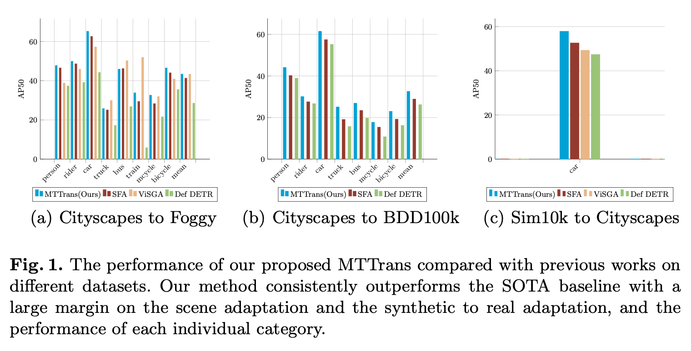

# 3. MTTrans

- overall framework

  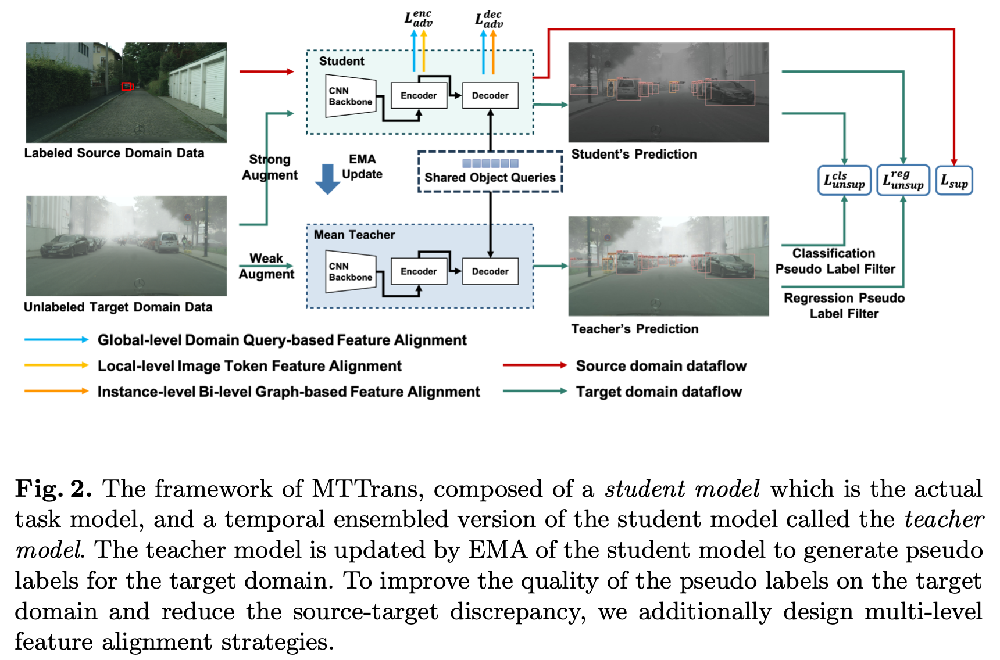

  - student model 상세 구조

    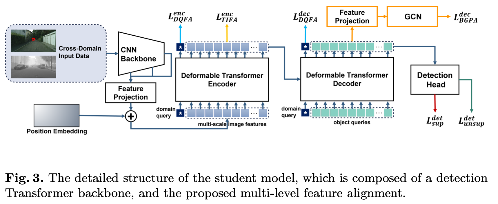

    - Domain Query Feature Alignment : domain query간의 discriminator와 adversarial 하게 학습 (SFA에서 따옴)

    - Bi-level Graph-based Feature Alignment

      - Object query를 MLP 통과 시켜 만든 prototype K (=9)개를 similairity score를 weight로 하는 graph를 생성

      - 생성된 graph를 Graph Convolution Network (GCN)을 통과시켜 Loss를 산출

        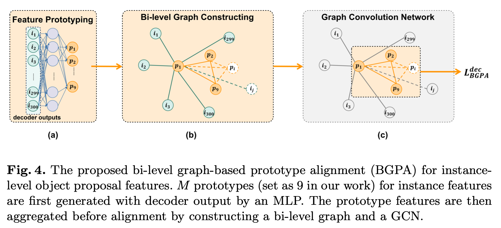

    - Token-wise Image Feature Alignment (TIFA) : Local image patch간의 domain alignment

  - Progressive Training

    - Burn-in : Pseudo label의 quality가 좋아야 하므로, source data로 supervised loss와 domain adversarial loss만 사용

      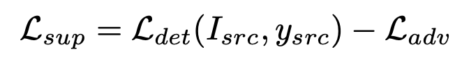

    - Transfer training step

      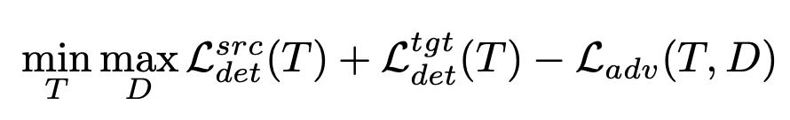

      - T: Object Detector
      - D: Discriminator

# 4. Experiments

- Cityscapes2Foggy

  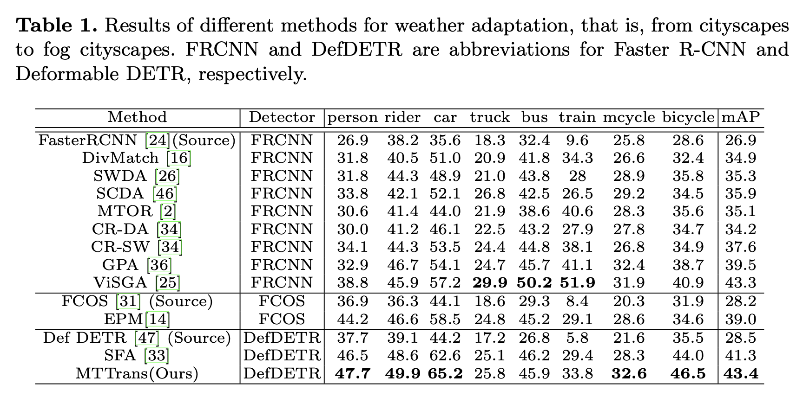

- Cityscapes2BDD100k

  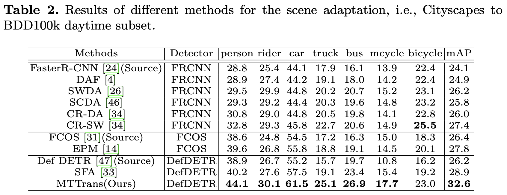

- Sim10K2Cityscapes

  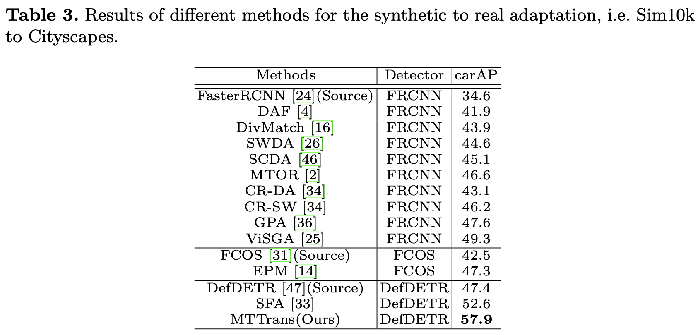

- Ablation Study

  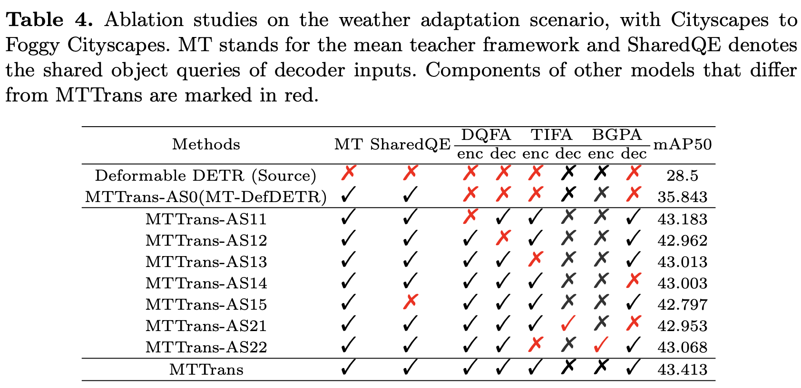

- Visualization Analysis

  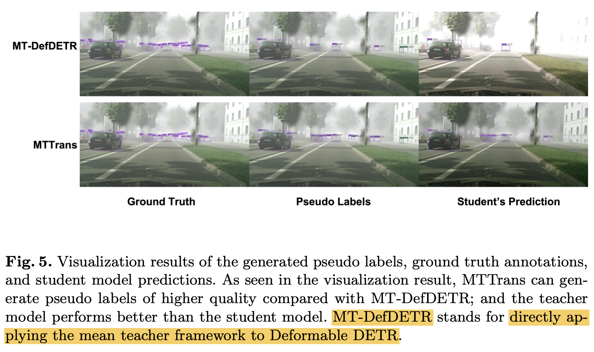

  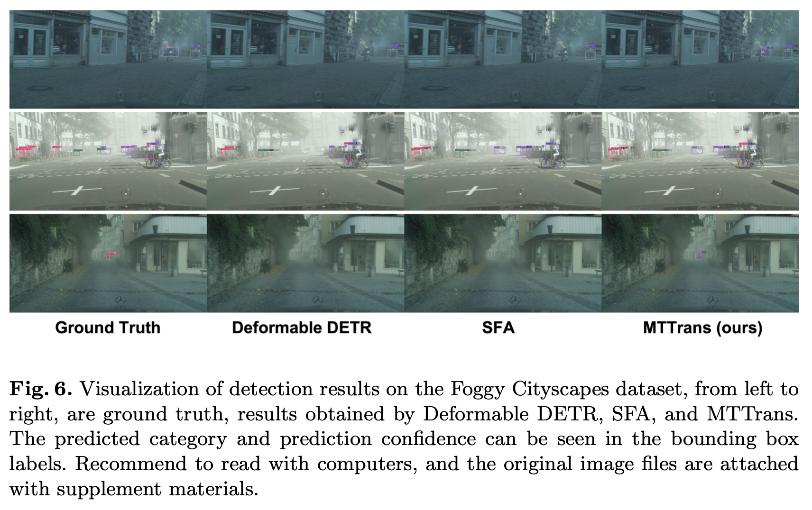
