# [UDA][OD] SFA: Exploring Sequence Feature Alignment for Domain Adaptive Detection Transformers

- paper: https://arxiv.org/pdf/2107.12636.pdf
- github: https://github.com/encounter1997/SFA
- ACM MultiMedia 2021accepted (인용수: 67회, '24-02-09 기준)
- downstream task: UDA for OD

# 1. Motivtion

- UDA for OD가 CNN계열에만 연구되었고, DETR에는 잘 연구되고 있지 않았음

- CNN의 feture alignment는 성능 향상 폭이 DETR에 제한적임

  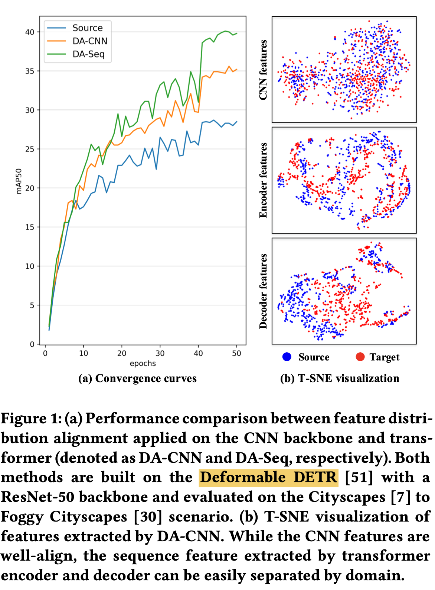

  - 초록색: 제안한 방식대로 encoder, decoder의 domain query를 기준으로 alignment 수행
  - 주황색: CNN backbone feature를 가지고 alignment 수행
  - 파란색: source-only 결과

# 2. Contribution

- CNN계열에서 잘되는 backbone feature alignment 방식이 DETR계열에서 잘 안되는 것을 발견함
- 위 결과에 착안하여 DETR 계열에서 잘되는 DA 방식 SFA (Sequence Feature Alignment)를 제안함
  - DQFA (Domain Query Feature Alignment)
  - TDA (Token-wise feature Alignment)
- Bipartite matching consistency loss를 제안함 $\to$ decoder의 layer별로 consistent한 결과 예측
- UDA for OD benchmark에서 SOTA

# 3. SFA

- overall framework

  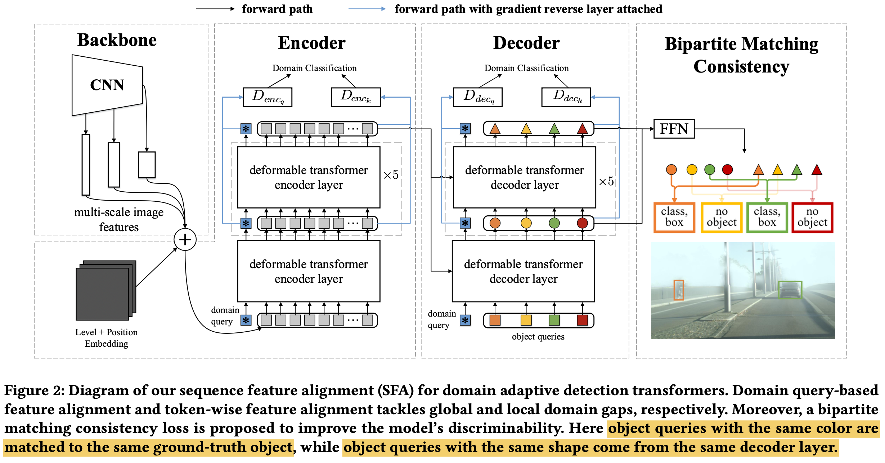

- DQFA

  - domain query를 별도로 두어 encoder/decoder의 입력 token들과 concat하여 입력으로 활용

  - 목적: global domain speciic한 특징들 (ex. layout) 중심적으로 alignment

    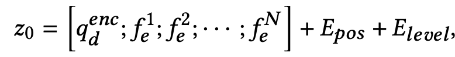

    - $z_0$: encoder input

    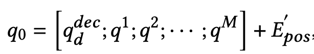

    - $q_0$: decoder input

    - 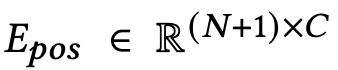
    - $E_{level} \in \mathbb{R}^{(N+1)xC}$

  - Encoder/Decoder의 출력 중, domain query feature만 추출하여 alignment loss를 구성

    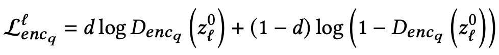

    - $z_l^0$: l번째 encoder의 출력 domain query (source)

    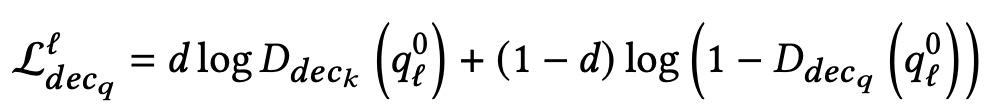

    - $q_l^0$: l번째 decoder의 출력 domain query (source)

- TDA (Token-wise Feature Alignment)

  - 기존에 input feature로 활용되던 token으로 alignment 수행

  - 목적: DQFA에서 잡지 못한 local domain specific한 영역을 중심적으로 alignment

    - encoder 

      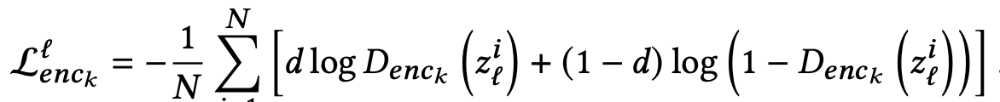

    - decoder

      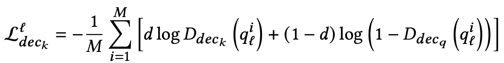

- HSA (Hierarchical Sequence Feature Alignment)

  - hirarchical한 feature를 alignment에 활용하여 comprehensive한 feature alignment를 달성

    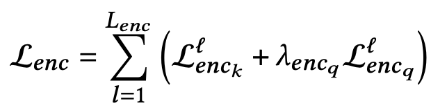

    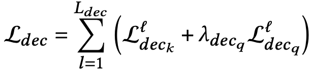

- Bipartite Matching Consistency

  - decoder의 출력결과 들 간에 consistency를 유지하도록 학습함
  - 모든 layer들의 ensemble값을 anchor로 consistency loss를 구성함

  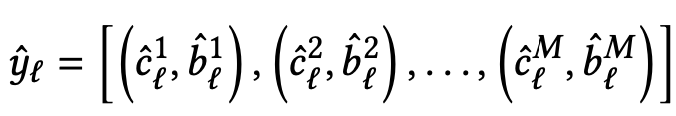

  - l번째 decoder layer의 출력값

    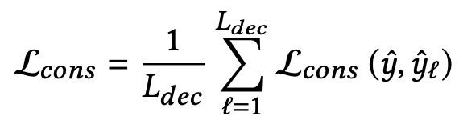

    - $\hat{y}$: L개의 decoder layer들의 ensemble값

  - Loss: JSD와 L1으로 구현

    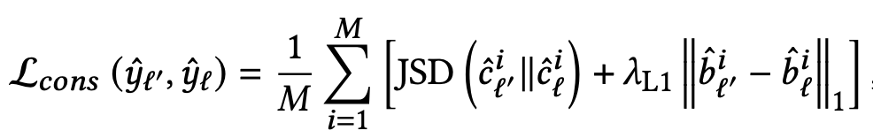

- Total Loss

  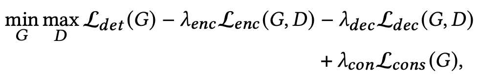

# 4. Experiments

- cityscapes2Foggy

  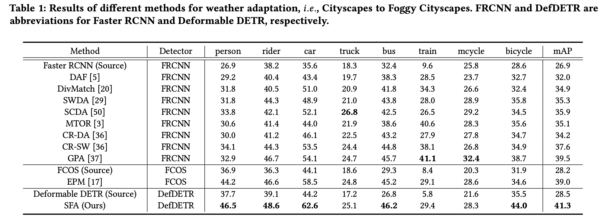

- Sim10k2Cityscapes

  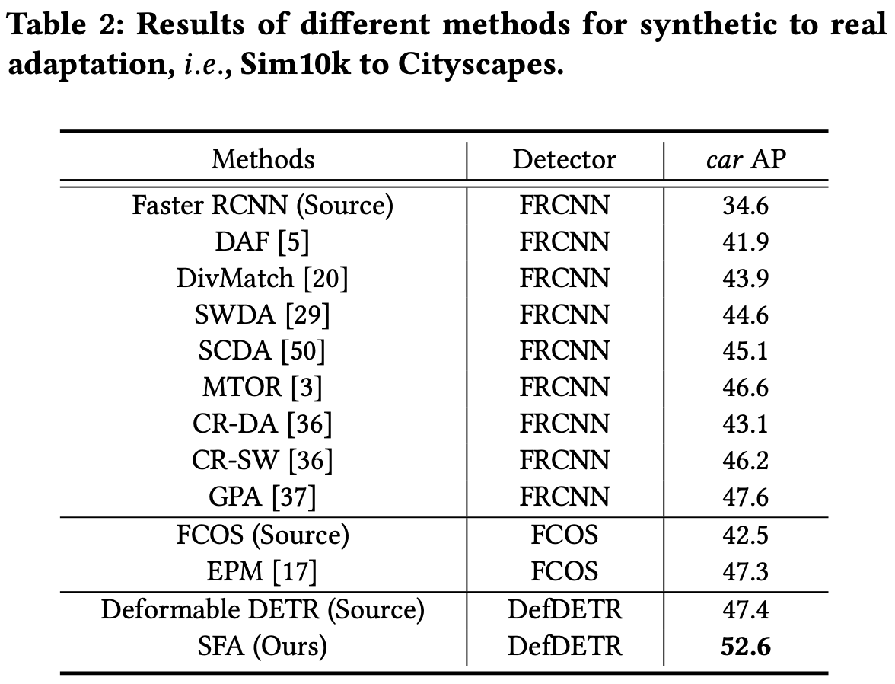

- Cityscapes2BDD100k

  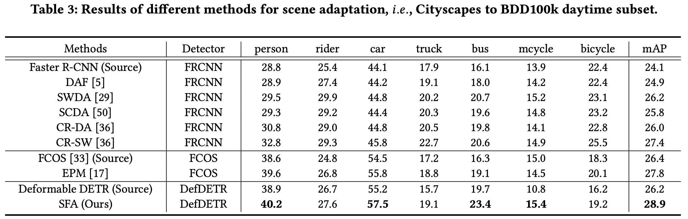

- Ablation

  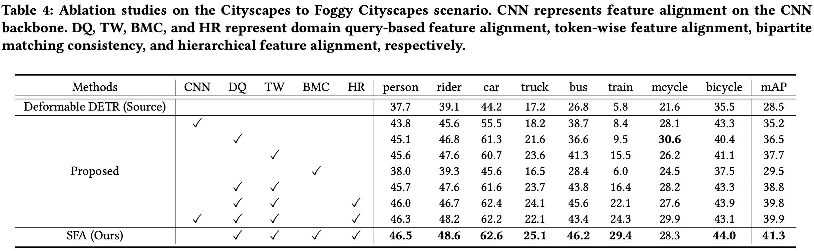

- Visualization

  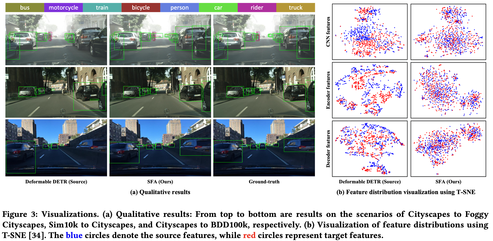

- Domain Query의 Attention 영역 visualizaiton

  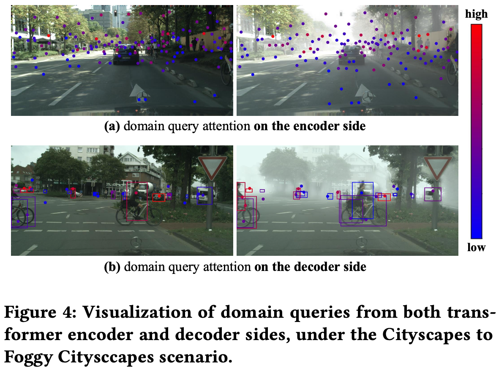

  - Domain specific한 영역에 focus
