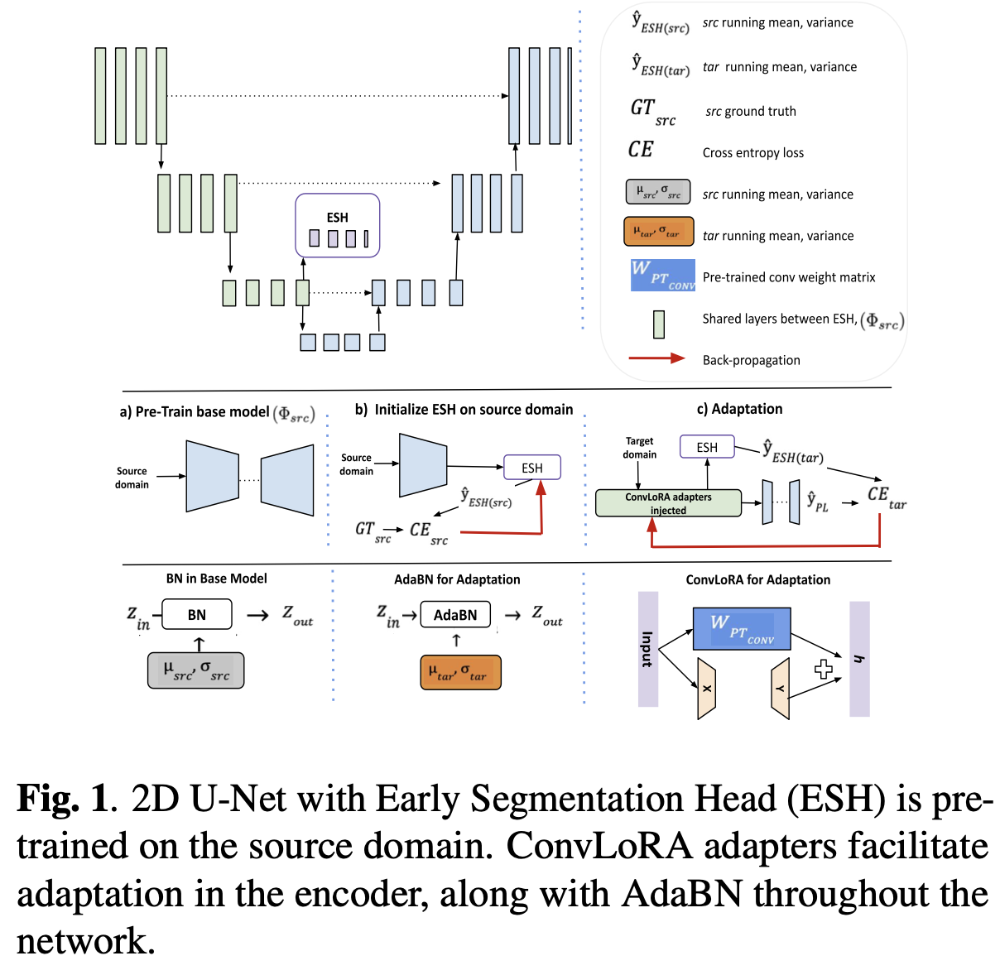
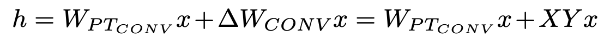
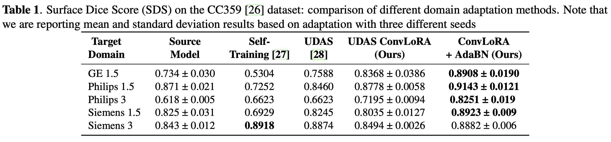
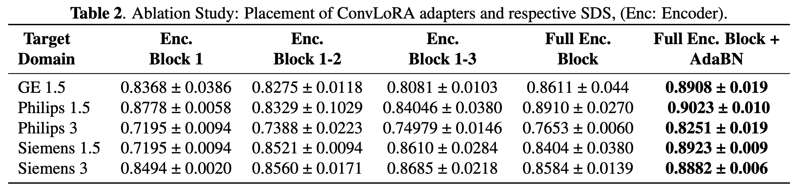
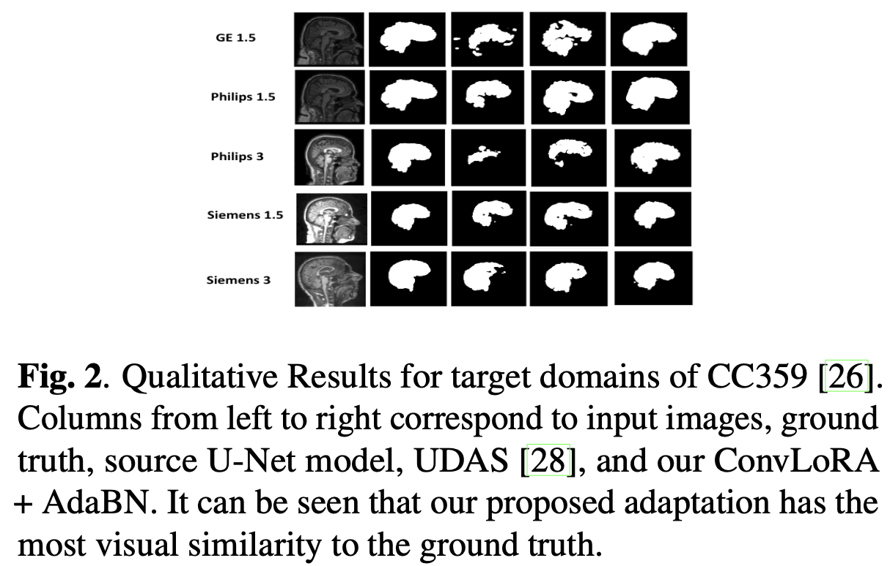

# [MTUDA][SS] CONVLORA AND ADABN BASED DOMAIN ADAPTATION VIA SELF-TRAINING

- paper: https://arxiv.org/pdf/2402.04964.pdf
- github: https://github.com/aleemsidra/ConvLoRA
- [IEEE ISBI 2024](https://biomedicalimaging.org/2024/) in Pytorch accepted (인용수: 0회, '24-02-10 기준)
- downstream task: Multi Target UDA for (Medical Image) SS

# 1. Motivation

- Multi Target domain Adaptation을 하기 위해 기존 single target adaptation처럼 모든 parameter를 adapt하는 것은 expensive하다.
- LLM에서 사용하는 LoRA에 착안하여, Convolution에 특화된 ConvLoRA를 사용해서 MTUDA를 해보면 어떨까?

# 2. Contribution

- LLM의 LoRA를 Convolutional layer에 적용한 ConvLoRA를 제안하고, DA에 적용함
  - 99% trainable weight 감소하면서, 100% fintunined adapted 결과와 성능이 유사한 MTUDA 제안함
- Adaptive Batch Norm (AdaBN) layer를 적용하여 target domain 과 source only trained weight간에 align시킴

# 3. ConvLoRA

- overall framework

  

- Low rank decomposition을 가정하여 weight를 업데이트

  

  - $W_{PT_{Conv}}$: model weight. freezed during adaptation
  - x: input
  - X,Y: row rank matrix ($\mathbb{R}^{m \times r}, \mathbb{R}^{n \times r}$)
    - r << m or n
    - X: random initiaalize
    - Y: zero initialize

- AdaBN : taget feature의 평균, 분산으로 $W_{PT_{CONV}}$ 의 Batch norm layer를 대체

- ESH (Early Segmentation Head)

  - 초기 encoder에 head를 부착함
  - 기존에 decoder에 부착된 seg head의 출력을 pseudo label로 ESH를 학습시킴
  - 함께 share하는 learnable weight ConvLoRA가 학습되면서 pseudo label의 성능도 좋아짐

# 4. Experiments

- 초기 encoder 몇개에만 ConvLoRA 부착

  

- 전체 layer에 ConvLoRA를 부착

  

- Qualitative Result

  
