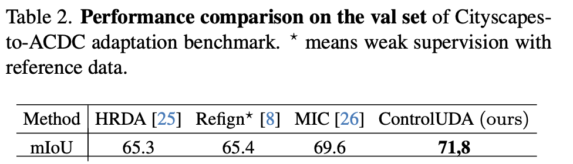

# [MTUDA][DM][SS] ControlUDA: Controllable Diffusion-assisted Unsupervised Domain Adaptation for Cross-Weather Semantic Segmentation

- paper: https://arxiv.org/pdf/2402.06446.pdf
- github: x
- archived '24-02-09 (인용수: 0회, '24-02-12 기준)
- downstream task: Multi Target UDA for SS

# 1. Motivation

- high-fidelity의 data synthesis를 UDA에 적용한 연구는 under-researched되고 있음.
  - 최근 떠오른 large-scale text-to-image diffusion model을 활용하자!
- GAN기반의 synthesize연구는 small dataset으로 학습함으로, high fidelity가 떨어지고, multi-target에 adapt하기 부적합함
  -  controlNet 기반의 flexibile adaptation method를 적용해보면 어떨까?

# 2. Contribution

- ControlNet과 연계하여 multi-scale semantic structure 뿐만 아니라, weather controllable + semantic aligned enhanced prompt를 통해 DM을 tuning하는 UDAControlNet을 제안함
  - target label 없는 문제 
    - source-only 모델이 만든 pseudo label (target prior)를 통해 target-specific generative model을 학습시켜 만든 generated data로 UDA의 성능을 향상시킬 수 있음을 보임
  - prompt generator (BLIP)이 생성하는 caption 정보가 noisy하고 vague함
    - pseudo target label과 sub-domain의 정보를 추가한 enhanced prompt를 통해 generated prompt의 semantic을 향상시키고, 기존 prompt의 영향력을 줄임
  - semantic label만 가지고 표현력이 부족한 prompt로 conplex driving scene의 semantic을 잘 표현하지 못함
    - pseudo target label뿐 아니라, domain-invariant한 edge detector의 output도 추가하여 semantic을 향상하는 RCF (Residual Condition Fusion) module을 제안함
- UDA segmentation benchmark에서 SOTA

# 3. ControlUDA

- overall digram

  

## 3.1. Acquisition of Target Priror Knowledge 

- source-only model의 pseudo label을 활용하여 target domain의 prior를 만듦 $(x_t, \tilde{y_t})$
- 위 방식은 noisy label을 만들므로, high quality data를 생성할 수 없음 $ \to$ edge detector 사용!
  - pretrained HED의 역할: (weather차이에 대해) domain agnostic한 edge를 추가로 priror knowledge로 사용

- task-specific한 UDAControlNet을 구현하기 위해 Residual Condition Fusion (RCF) module을 구현

  

  - $\kappa$: 1x1 conv layer
  - $c_t^{str}, c_t^{seg}$: structure condition (by HED), semantic segmentation condition (by segmentor) for target domain
  - $c_t^f$: fusioned condition for prompt generator

- small to large object모두 검출하기 위해 multi-scale feature를 사용함

- BLIP으로 생성한 prompt의 한계

  - vague / noisy information : 애매하게 도움되지 않은 정보 혹은 거짓 label을 추가하여 성능하락이 발생
  - BLIP의 noisy label을 보완하고자, Source-only 모델의 target prior 정보로 만든 prompt + sub-target domian label 정보를 추가하여 enhanced prompt를 생성함

- Diffusion Traning

  

  - $\epsilon^{\tau}$: $\tau$ step에서의 noise
  - $\phi, \theta$: ControlNet, pretrained SD weights
  - $z^{\tau}_{\phi,\theta}$: $\tau$ step의 SD가 encode한 noise feature

## 3.2. Pseudo Target Generation

- DDIM sampling

  

  - $\z^T$: N(0,1)
  - $c_{\(j)}^p$: j번째 target sub domain의 condition
  - D: Decoder

- Source2Target dataset 취득

  $$D=(\tilde(X)_{s2t|Y_s}, Y_s)$$

  - 2 epoch까지 학습한 initial data랑 final data 그리고 source data로 구성

    

## 3.3. Domain Adaptation

- baseline: MIC

- supervised loss로 위에서 얻은 target dataset을 가지고 학습

- 단, noisy label을 선별하기 위해 두 가지 case를 고려

  - pseudo target label과 prediction이 일치 $\to$ 그대로 사용

  - prediction이 threshold 이하 $\to$ false prediction & good generation으로, 학습에 사용

  - prediction이 threshold 이상 $\to$ good prediction & false generation으로, 학습에 비활용

    

  - Total Loss

    

    

# 4. Experiments

- Cityscapes2ACDC

  - Quantitative Result

    -  Test-set

      

    - Val-set

      

  - Qualtitative Result

    

  - Generated Image Quality

    - Quantitative Result

      

    - Qualitative Result

      

  - Ablation

    - No target domain, only source + generated image (생성 이미지의 효과성을 다른 생성 데이터와 비교하고자)

      

    - Quantitative Result

      

    - Qualitative Result

      

  - Confidence Threshold

    

- Domain Generalization Result

  

  
