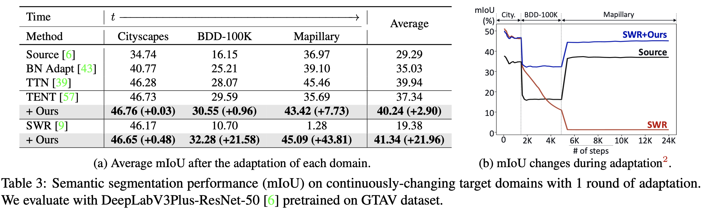

--- 
title: "[TTA][CLS][SS] WoCEM: Towards Open-Set Test-Time Adaptation Utilizing the Wisdom of Crowds in Entropy Minimization"
---
# [TTA][CLS][SS] WoCEM: Towards Open-Set Test-Time Adaptation Utilizing the Wisdom of Crowds in Entropy Minimization

- paper: https://arxiv.org/pdf/2308.06879v1.pdf
- github: x
- ICCV 2023 accepted (인용수: 3회, '24-02-13 기준)
- downstream task: TTA for CLS, SS

# 1. Motivation

- TTA에서 original 모델의 prediction score를 키워주는 방향으로 Entropy minimization에 의해 adaptation됨

- 하지만, wrong prediction sample의 경우, 반대 현상이 발견됨

  $\to$ adapted model과 original model의 prediction의 부호로 wrong/correct을 판별하면 어떨까?

  

- practical TTA에서는 학습하지 않은 class (open-set)이 등장할 수 있음

  - ex. 국내 산불의 풍력 발전기, 도심, 등

    $\to$ open-set TTA를 실험 setting이 필요하다

    

# 2. Contribution

- novel sample selection method를 제안 $\to$ 아래 경우를 모두 filter-out

  - closed-set wrong sample

  - open-set sample

    

    - $\tilde{y}^{C_o}$: original model's prediction score
    - $\hat{y}^{C_o}$: adapted model's prediciton score

  - TTA benchmark에서 SOTA

    

- open-set TTA를 처음으로 제안함

  

# 3. WoCEM

- overall procedure

  

- 왜 prediction score가 낮아지면 wrong sample인가? 

  - entropy minimization을 통해 adaptation된 모델은 수많은 sample의 축적된 방향으로 학습이 된다. 따라서, 간혹가다 발생하는 wrong sample의 adaptation 방향은 prediciton score를 낮추는 방향이 되므로, 이를 통해 wrong sample인지 여부를 알 수 있다.\

    $\to$ **wisdom of crowd**라고 명명

- prediction threshold을 대체할 sample selection metric : $\hat{y}^{C_o}-\tilde{y}^{C_o}$

- Misaligned wrong sample

  - gradient방향을 predicted sample에 대해 ground truth와 비교해봄 $C \times C$ metric

    

    - $g_k^{i,j}$: predicted class i, G.T. j인 k번째 sample의 gradient vector

    - $g_l^{i,i}$: predicted class i, G.T. i인 l번째 sample의 gradient vector

      

      $\to$ diagonal term (correct sample)의 G.T.와의 similarity가 높고, off-diagonal term (wrong sample)은 G.T.와의 similarity가 낮음

  - WoCEM : Wisdom of Crown Entropy Minimization

    - selection criteria

      

      - Loss

        

        

# 4. Experiments

- Long-term adaptation (50-round)

  

- Short-term adaptation (1-round)

  

- long-term continual TTA for  SS (10-round)

  

- short term TTA for SS (1-round)

  

- sample selection 성능 비교

  

  - closed-set wrong-sample포함 case
  - closed-set wrong-sample 불포함 case

- Inference time 비교

  

  - adaptation sample이 적으므로, forward-process가 2배라도, back-prop에서 성능 이득이 있음

- 다양한 모델구조에서도 잘됨

  

- learning rate & batch size에 robust

  
