# [SSL] GCN: SEMI-SUPERVISED CLASSIFICATION WITH GRAPH CONVOLUTIONAL NETWORKS

- paper: https://arxiv.org/pdf/1609.02907.pdf
- github: https://github.com/tkipf/gcn
- ICLR 2017 accpeted (인용수: 31,192회 '24-02-15 기준)
- downstream task: Document classification for graph-based DB

# 1. Motivation

- graph-structured data를 효율적으로 처리하기 위한 Convolution Network의 효율적인 variant인 Graph-Convolution-Network가 필요함

# 2. Contribution

- Graph-structured data에 directly 적용 가능하고, layer-wise propagation이 가능한 graph-conv.-net을 제안함
  - 1st order approximation of spectral graph convolution에서 동기를 얻음
- semi-sup. classification에 어떻게 적용할 수 있는지 제안함

# 3. GCN

- propagation rule

  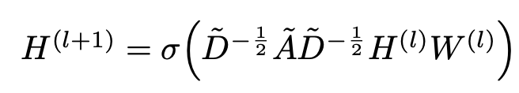

  - $\tilde{A}$: A+$I_N$
    - A: Adjacent matrix. $a_{ij}=1$ if i and j node has at least one edge connected
    - $I_N$: Identity matrix of shape N
  - $\tilde{D}$: $\Sum_{j}$ $\tilde{A}_{ij}$
  - $H^{\(l\)}$: l번째 layer의 activation matrix $\in \mathbb{R}^{N \times D}$
  - $W^{\(l\)}$: l번째 layer의 learnable weight matrix $\in \mathbb{R}^{N \times D}$

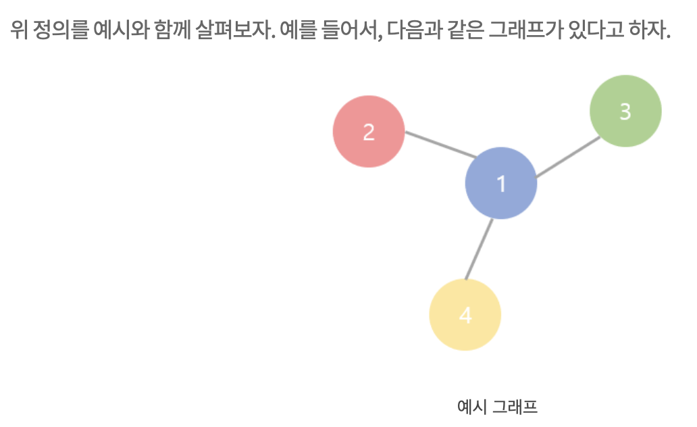

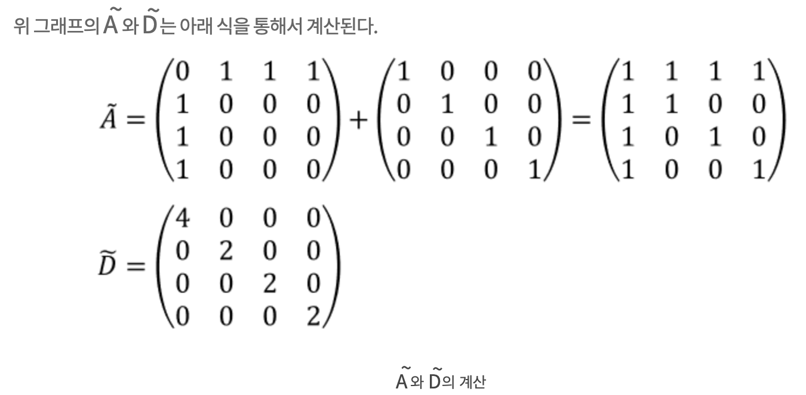

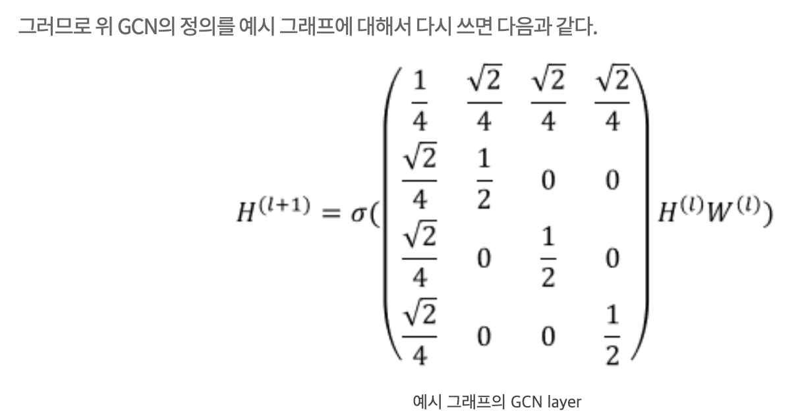

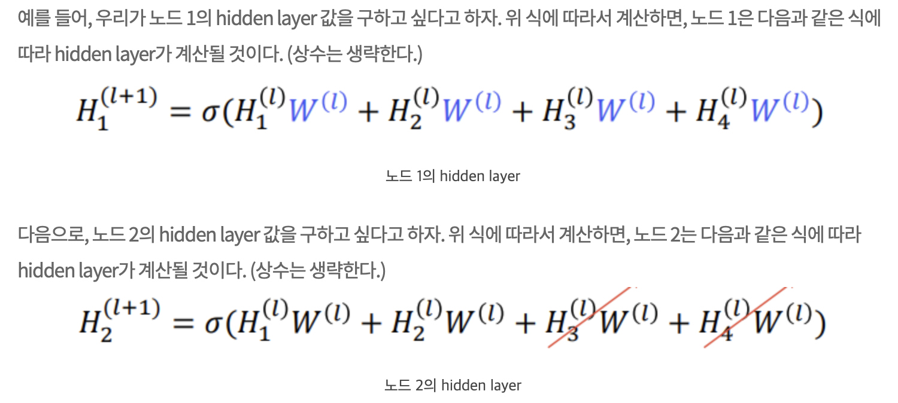

- reference: https://process-mining.tistory.com/176
- 위 식은 1st order approximation of localized spectral filters on graphs에 의해 motivated되었다고 함

- Spectral Graph Convolution

  - Fourier domain에서 signal x와 filter $g_{\theta}$간의 곱으로 표현

    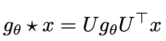

    - U: Normalized graph Laplacian L의 eigenvectors

      - $L=I_N-D^{-\frac{1}{2}}AD^{-\frac{1}{2}}$

    - egienvalue decomposition은 너무 계산량이 크므로 Chebyshev polynomials로 k번째 eigenvalue까지 turncate하면

      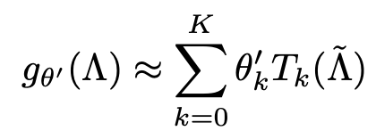

      - 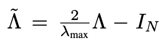
        - 
      - 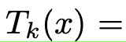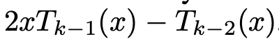

- $\tilde{\Gamma}$에서 $\lambda_{max}$를 2로 근사하여 linear formulation으로 근사하면

  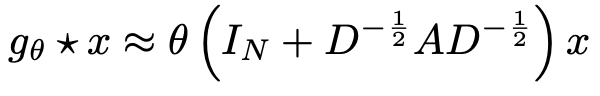

- 이를 일반화 하면

  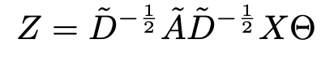

  - 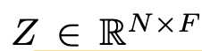
  - 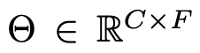
  - 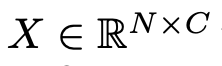

  

- Semi-superivesd Classification

  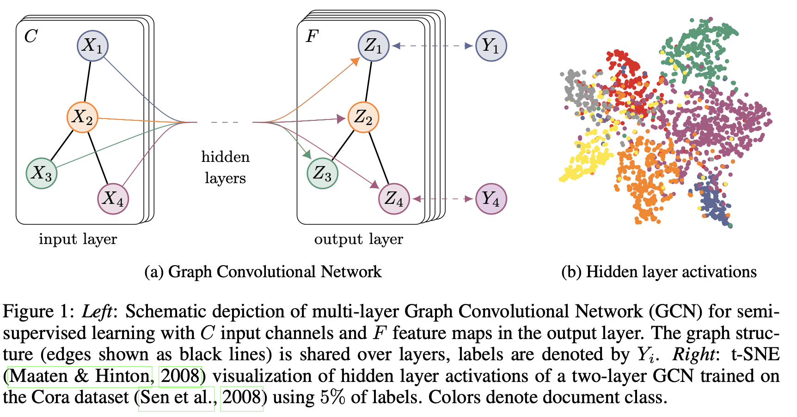

  - foward process of a model

    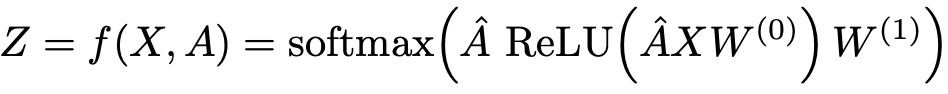

    - A: adjacency matrix. $a_{ij}=1$ if i and j node has edge.
    - 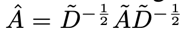

  - Loss

    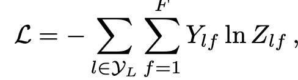

  

# 4. Experiments

- Dataset

  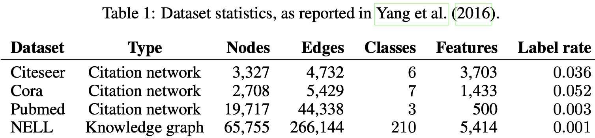

- Results

  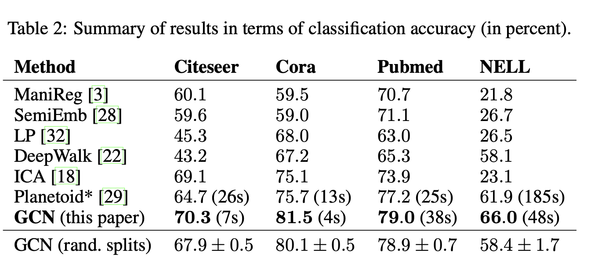

- Propagation function에 따른 ablation

  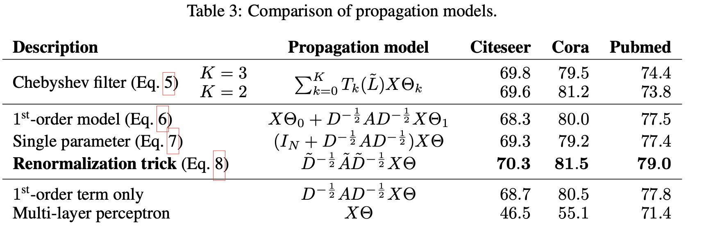
