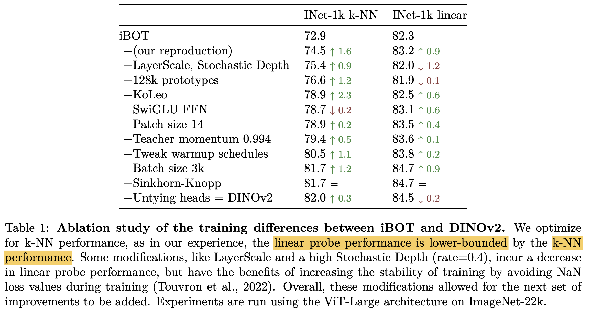
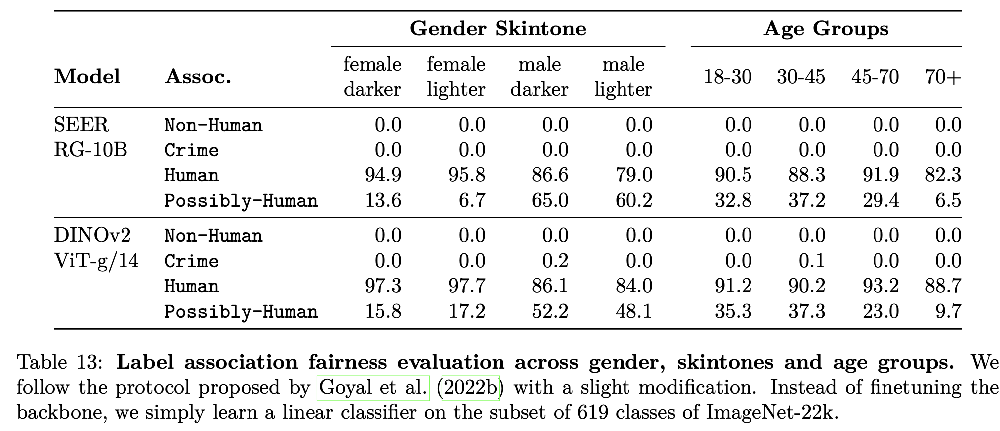

# [SSL]\[FM] DINOv2: Learning Robust Visual Features without Supervision

- paper: https://arxiv.org/pdf/2304.07193.pdf
- github: https://github.com/facebookresearch/dinov2
- archived (인용수: 183회, '24-02-20 기준)
- downstream task: Linear probing for CLS, Depth Estimation, SS, etc

# 1. Motivation

- NLP에서 대용량의 data로 pretrain시켜 만든 foundation model이 각광받고 있음

- Quality of feature는 pretrain에 활용된 quality of data에 연관되어 있음 $\to$ curated 대용량 pretrain용 data가 필요함!

  - 기존에 SSL pretraining의 문제는 대용량의 uncurated dataset으로 학습했기에, finetuning이 요구된다고 가정

    

# 2. Contribution

- Dedicated, Diverse, Curated image dataset을 만들 수 있는 automatic pipeline을 제시함

- 기존에 존재하는 SSL(Self-supervised Learning)인 SimCLR기법을 model size를 키워서 성능 향상시킴

- KD를 적용해 small model에서 SOTA

  

# 3. DiNOv2

- automatic pipeline

  

  - NLP에서 motivate되어, human annotation 없이 data similairty를 기준으로 uncurated image를 curation함

    - Opensource dataset 활용 : Train-val split을 고려하여 pretrain에 validation set이 사용되지 않게 구성 (ex. ImageNet-1K, etc)

    - Web crawling : Publicly avaiable repository의 web page에서  tag 안에 있는 이미지를 모드 긁어옴

      $\to$ 1.8B uncurated image를 모음

    - Deduplication : copy detection 알고리즘을 적용하여 비슷한 이미지는 제거 $\to$ increase diversity, decrease overfitting to dominant modes

    - Retrieval : ImageNet-22K로 pretraining한 모델을 사용하여 query image에 대해 k-NN을 적용

      - 해당 query image가 curated dataset에 이미 있으면 N개 nearest-neighborimage (=4)만 retrive
      - 반대로 해당 query image가 적으면 M개 (M>N?) retrieve

      

  - Naive한 clustering approach가 잘 먹힘 $\to$ 142M dataset을 curatation함

    

  - SSL로 학습된 backbone을 freeze하고, downstream task에 맞는 light-head만 붙여도, 기존에 SSL은 물론, WSL(Open-CLIP)기법과 동등이상 수준으로 성능이 나타남

    

- Discrimiative Self-Supervised Pretraining

  - Image-level objective : DINO의 loss 사용 (SimCLR과 비슷)

    - 즉, 같은 이미지를 다른 augmentation하고, student와 이를 ema로 update한 teacher의 probability score를 CE Loss

      

  - Instance-level objective : iBOT의 loss 사용 (MAE와 비슷)

    

    - i번째 patch에 대해 patch level로 CE Loss 적용
    - 특정 비율로 masking된 이미지를 student에게만 적용.

- Efficient Implementation

  - DINO 적용 시, large crop / small crop image를 forward/backward 수행해야 함

  - 각 crop image를 concat하여 single long sequence로 처리함

    - 단, 해당 sequence 내에서 masking처리하여, large 는 large 끼리, small은 small 끼리만 attention되도록 attention mask를 구성

      $\to$ 속도 향상

# 4. Experiments

- baseline: iBOT

  

- model scale vs. data scale

  

  - ImageNet-22K : 14M
  - LVD-142M : 142M (proposed)
  - 모델 사이즈가 커질수록 LVD-142M으로 인한 성능 향상이 좋아짐

- Loss 에 대한 ablation

  

- Impact of KD

  

- Role of Resolution

  - 224 $\to$ 416: 마지막 10k만 416으로 resize에서 학습 (backbone)
  - resolution: head학습에 활용한 resolution (backbone은 freeze)

  

- Linear Probing vs. SOTA

  

- Finetuning vs. DiNOv2

  - finetuning: encoder (backbone)도 학습
  - linear : linear probing (head만 학습)

  

  - gap 이 학습 효율에 비해 크지 않다.
  - SSL 방식이 효과적이다.

- DG protocol

  - linear : linear probing (head만 학습)

  

- Other image classification & Video classification

  - larger, fine-grained dataset으로 구성
  - linear : linear probing (head만 학습)

  

  

- instace-level recognition

  - linear : linear probing (head만 학습)

  

- Dense recognition tasks

  - linear : linear probing (head만 학습)

  - semantic segmentation, depth estimation

  - Quantitative Result

    

    

  - Qualitative Result

    

    

- PCA analysis

  

  - image당 top-3개의 PCA patch만 남김.
  - 1등-R, 2등-G, 3등-B

- Patch Matching

  - 다른 유사 이미지와 euclidean distance를 계산해서 가장 유사한 patch끼리 매칭

    

- Geographical Fairness and Bias Analysis

  - 아프리카, 유럽, 아시아, 아메리카 별 bias 없는지 체크 $\to$ 여전히 있으나, 다른 방식들보단 fair하다

    

  - 성별, 피부색, 나이에 따른 analysis

    - 비교적 bias가 없음

    

- Environmenet Impact of Training

  
