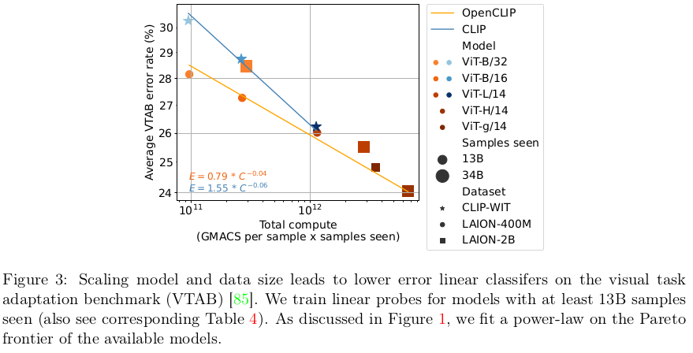

# [SSL2][MM] OpenCLIP: Reproducible scaling laws for contrastive language-image learning

- paper: https://arxiv.org/pdf/2212.07143.pdf
- github: https://github.com/mlfoundations/open_clip
- CVPR 2023 accepted (인용수: 180회, '24-02-22 기준)
- downstream task: Zero-shot classification, Retrieval, linear probing, and fine-tuning

# 1. Motivation

- 기존에 scaling-law에 대한 연구는 uni-modal (language or vision)으로만 진행되었음
  - Scaling-law: model size와 dataset size에 따른 성능 변화 분석
- Multi-modal 기반 scaling-law를 다양한 downstream task에 대해 연구해보자
  - dataset:  80M, 400M, 2B (LAION)
    - text, image pair
  - model : ViT-B / L / H / g

# 2. Contribution

- Reproducing가능한 OpenCLIP을 Open-data인 LAION을 사용하여 공개함

  

  - 학습 환경 (batch size)외에는 최대한 학습 recipes original CLIP을 따라함

- Pre-training에 사용한 dataset에 따라 downstream task의 성능이 좌우됨을 확인

  

# 3. Open-CLIP

- Baseline : CLIP

  - Dataset : WIT
  - Model : ViT-L

  $\to$ model size & dataset size에 대한 scalability에 대한 연구는 진행하지 않았음

- 목적: Reproduction이 가능하도록, Open-source CLIP모델을 Open-source dataset (LAION)을 활용해서 scalability 에 대해 연구함

  

  - 1K A100 GPU를 활용해 32-88K batch-size로 학습했다고 함

    - batch size별 성능 차이는 크게 없었다고 함

      

# 4. Experiments

## 4.1 Zero-shot transfer & Robustness

- Classification
  - pre-defined prompt를 활용해 similarity score에 대해 maximize하는 class로 분류함
- Retrieval
  - text-image score에 대한 similairity score를 기준으로 top-k에 해당하는 image를 retrieval

| zero-shot image classification                               | zero-shot image retrieval                                    |
| ------------------------------------------------------------ | ------------------------------------------------------------ |
|  $\to$ LAION보다 OpenAI's WebImageText(WIT)가 성능이 좋았음 |  $\to$ OpenAI's WebImageText(WIT)가 LAION보다 성능이 좋았음 |

## 4.2 Full and few-shot linear probing

- CLIP enoder는 freeze시키고, 뒤에 classifier head만 학습
- Hyper-parameter sweep을 사용하여 최적의 learning rate, epoch를 찾아 학습 진행

$\to$ dataset과 모델이 scale-up됨에 따라 linear하게 accuracy 성능이 향상됨을 확인함

## 4.3 FIne-tuning

- Encoder를 학습하되, head는 freeze함. Evaluation할 때는 zero-shot text-encoder에서 활용

  
