# [MM]\[OD] RegionCLIP: Region-based Language-Image Pretraining

- paper: https://arxiv.org/pdf/2112.09106.pdf
- github: https://github.com/microsoft/RegionCLIP
- CVPR 2022 accepted (인용수: 551회, '24-02-23 기준)
- downstream task: Zero-shot OD, Open-vocabulary OD, OD

# 1. Motivation

- image-text 기반 Multi-modal CLIP은 Image-based로 학습되어 있어, region-based visual input에 대해 성능 저하가 나타남

  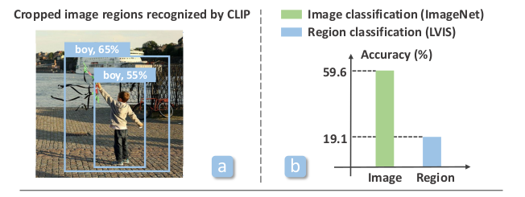

  $\to$ OD에 적합한 Region-based visual input에 적합한 Image-Language model을 만들어보자!

# 2. Contribution

- human-annotation없이 regional representation을 사용한 vision-language pre-training기법을 제안함

  - 핵심은 text token과 image-region을 explicitly align하는 것임

  - 이를 위해 image-text pretrained모델을 활용하여 image-region과 text pair를 pseudo labeling하는 pipeline을 제시

    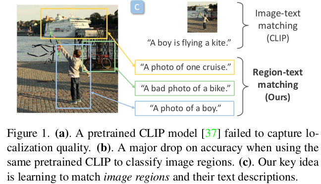

    - pre-defined template "a photo of {CLS}"에 해당하는 class name을 명명하여 text prompt를 생성
    - Contrastive Learning을 사용하여 Language-Vision domain을 alignment

- zero-shot od에서 SOTA

# 3. Region-CLIP

- overall diagram

  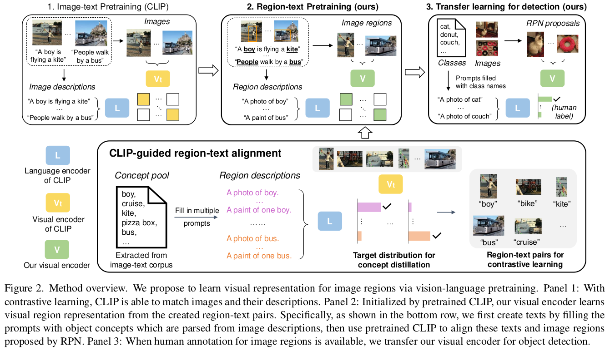

  - region recognition과 localization 중, recongition에 집중하여 학습시킴 $\to$ localization은 off-the-shelf RPN모델의 RoiAlign layer의 output을 활용

  - Pretrained off-the-shelf language parser를 활용해서 pool of object concepts을 구축

  - contrastive learning과 concept distillation활용

    - contrastive learning

      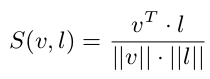

      - highest matching text prompt가 해당 region에 대한 pseudo label로 활용됨

        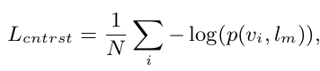

        - $v_i$: i번째 visual region
        - $l_m$: visual region과 paired된 text embedding

      - contrastive loss

        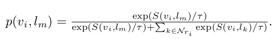

        - $N_{r_i}$: Batch내에 있는 i번째 region과 matching되지 않은 negative text prompt

    - concept distillation

      - 모든 object concepts (text embedding)의 similarity score에 대해 teacher와 student의 KLD Loss를 부여함

        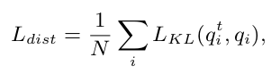

        - $q_i^t$: teacher의 i번째 object of concept의 similairty score 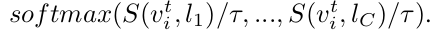
        - $q_i$: student의 i번째 object of concept의 similairty score 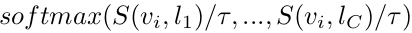

- Total Loss

  - image-level contrastive loss까지 활용 (기존 Image-Captioning dataset의 GT 활용)

    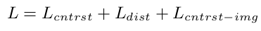

- Transfer Learning for OD
  - Pre-trained된 visual encoder를 OD의 backbone으로 활용하여 성능 향상을 보임

# 4. Experiments

- Open-Vocabulary OD

  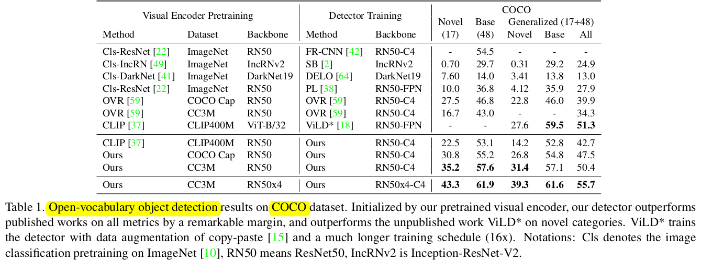

  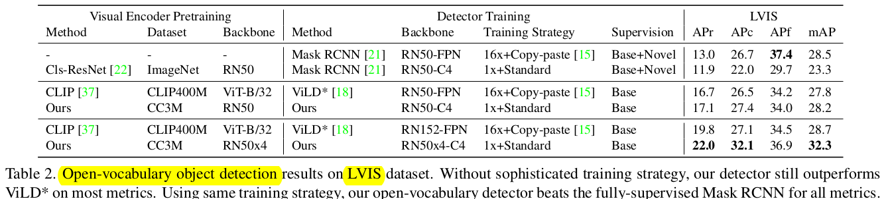

- Fully-supervised OD

  - Pretrained visual encoder를 initial weight로 활용하여 fine-tuning

    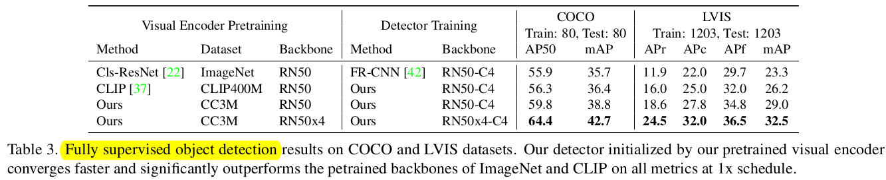

- Zero-shot inference

  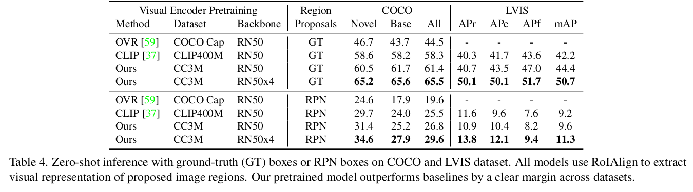

- Ablation Study

  - Region-text pairs 유효성 검토

    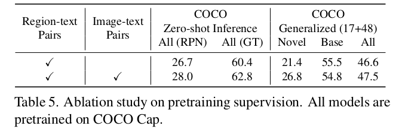

  - Regions used for pretraining에 따른 성능 검토

    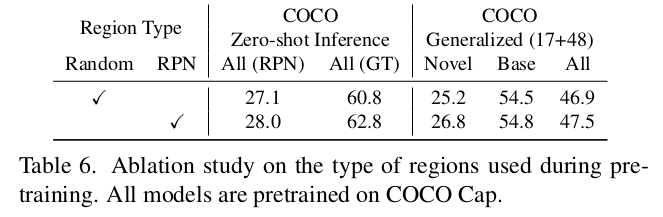

- Concept pool에 따른 ablation

  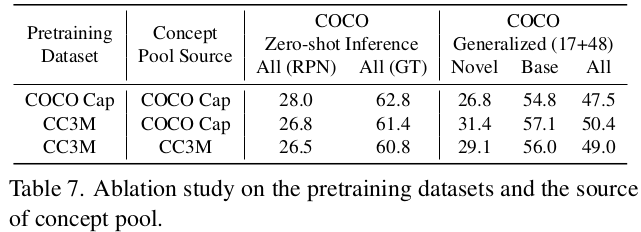

- Pretraining Loss에 따른 ablation

  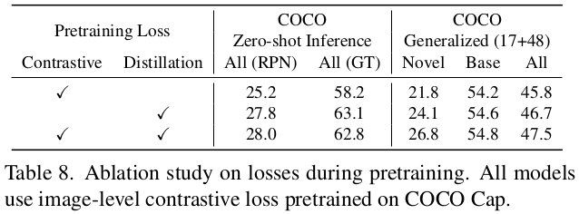

- Teacher & Student model에 따른 ablation

  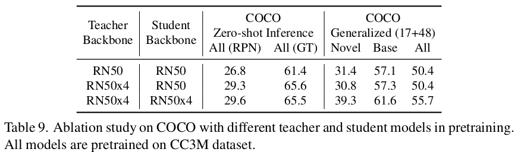

- Focal scaling 유무에 따른 ablation

  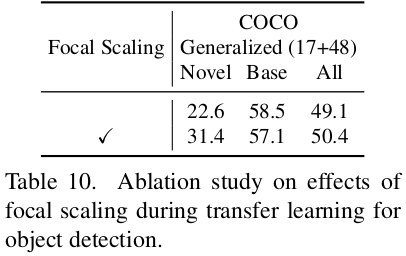

- Qualitative Results

  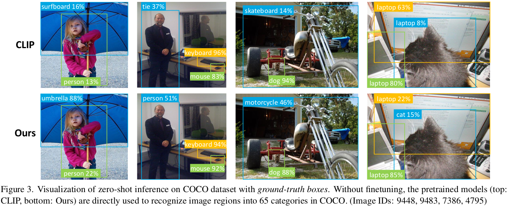

  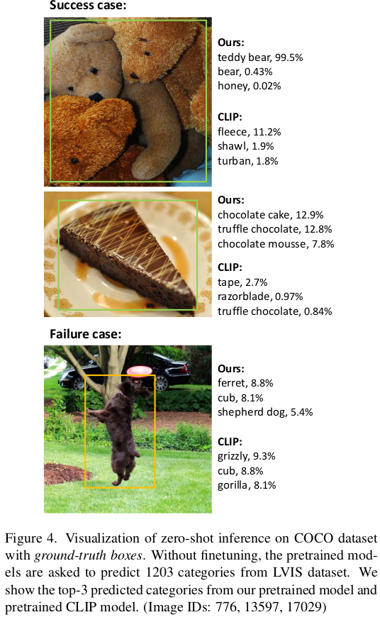