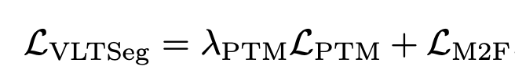
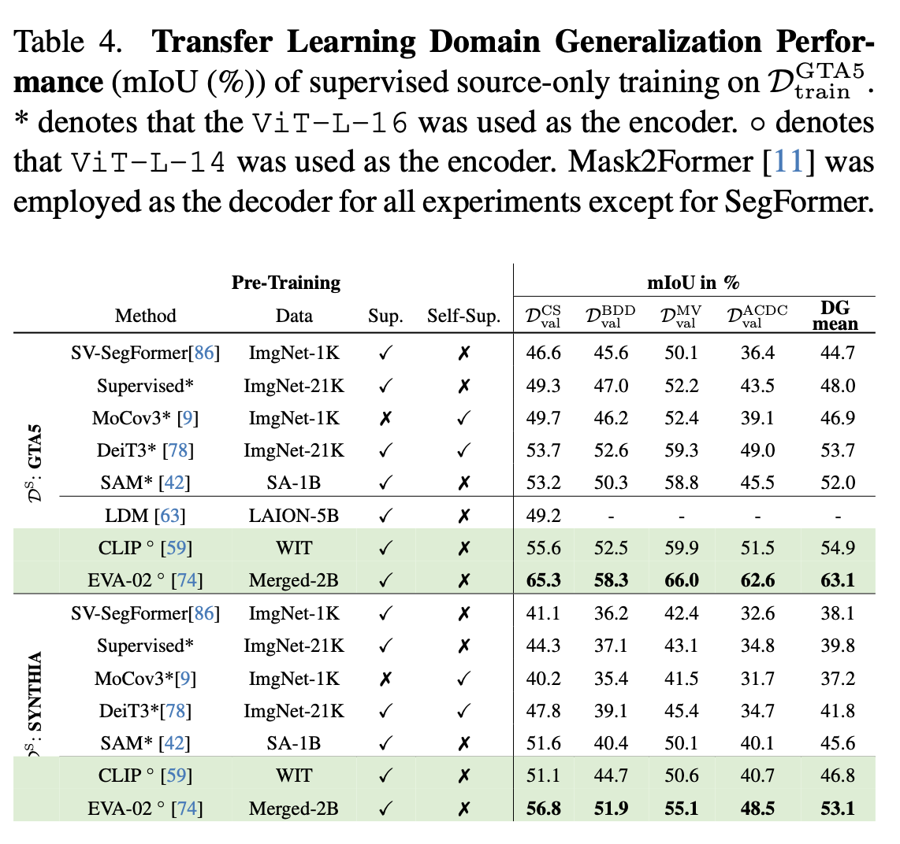

# [DG][SS] VLTSeg: Simple Transfer of CLIP-Based Vision-Language Representations for Domain Generalized Semantic Segmentation

- paper: https://arxiv.org/pdf/2312.02021.pdf
- github: x
- archived (인용수: 1회, '24-02-24 기준)
- downstream task: DG for SS
  - paperswithcode cityscapes test #1

# 1. Motivation

- image-text pair기반의 self-supervised learning으로 pretrained된 vision-language model을 단순하게 fine-tuning해보니 SOTA를 찍게됨

  

  $\to$ domain-invariant한 text description을 활용하여 DG for SS를 해보자!

# 2. Contribution

- 기존 vision-only SOTA모델을 상회하는 vision-language 모델 (CLIP, EVA-CLIP)을 사용하여 DG for SS에 적용
- DenseCLIP의 방식을 적용하여 EVA-CLIP pretrained weight기반에 Mask2Former Decoder를 fine-tuning하여 SOTA

# 3. VLTSeg: Vision-Language Transfer for DG Segmentation

- Overall Diagram

  

  - domain robust 특성 설명

    - text description은 domain별 invariant하므로, text description을 기반으로 visual feature를 contrastive learning을 수행한다면 vision-language alingment뿐만 아니라 domain alignment가 됨

      

      - X: image (target or source)
      - $M_E^V$: Visual encoder
      - $M_E^L$: Language encoder
      - T: Text description space
      - $\phi$: domain shift from source to target $D^s: x \to \phi(x) \in D^t$

- Fine tuning

  - Text encoder는 freeze시키고, visual encoder만 EVA-CLIP weight로 initial weight를 두고, SAM의 decoder와 함께 학습

  - Loss는 Mask2Former Loss활용

    

- Vision-Language Guidance for Domain Generalization

  - DenseCLIP을 기반으로 vision & language encoder를 initialization

  - CoOp처럼 visual feature와 text embedding을 matching하여 pixel-level class score를 예측

    

    - $r_{n,k,c}^S \in \mathbb{R}^{HW \times S}$: pixel-wise score map
    - S: class 갯수

  - FPN을 DenseCLIP with Mask2Former로 대체

  - EVA-CLIP initial weight 사용 및 LAMB Optimzier 활용

- Total Loss

  

  - $L_{PTM}$: DenseCLIP에서 제안한 Auxiliary Loss

- Evaluation Metric

  - Out-of-Distribution의 성능 하락여부를 수치화하기 위해 source의 mIoU와 target의 mIoU를 비교

    

    - rPD: robust metric relative Performance under Domain shift

# 4. Experiments

- Synthetic to Real DG

  

- real to real DG

  

- In-domain performance

  

- Pretrained weight에 따른 DG 성능 비교

  

- t-SNE for DG

  

- Ablation studies

  
