# [VLM][SS][OD] DenseCLIP: Language-Guided Dense Prediction with Context-Aware Prompting

- paper: https://arxiv.org/pdf/2112.01518.pdf
- github: https://github.com/raoyongming/DenseCLIP
- CVPR 2022 accepted (인용수: 322회, '24-02-26 기준)
- downstream task: OD, SS

# 1. Motivation

- 대량의 image-text pair (noisy) 를 contrastive learning으로 학습하는 것이 visual representation을 학습하는데 좋다고 알려짐

- image-text pair 기반 학습기법을 pixel-text pair기반의 dense prediction task로 적용하는 연구가 되지 않았음

  $\to$이를 진행해보자!

# 2. Contribution

- upstream contrastive pre-training task와 downstream per-pixel prediction task의 gap을 줄여주는 denseCLIP을 제안함

  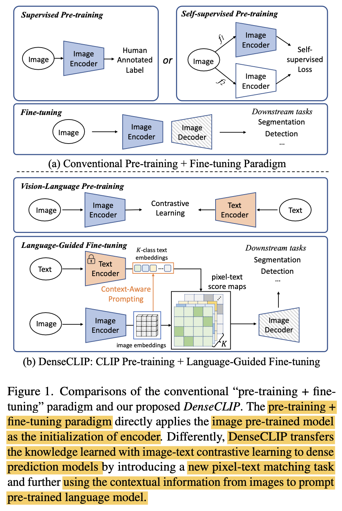

- Hyperparameter tuning만으로 ImageNet 기반의 supervised learning pretraining보다 CLIP기반의 pretrained weight를 사용하여 성능 향상을 봄

  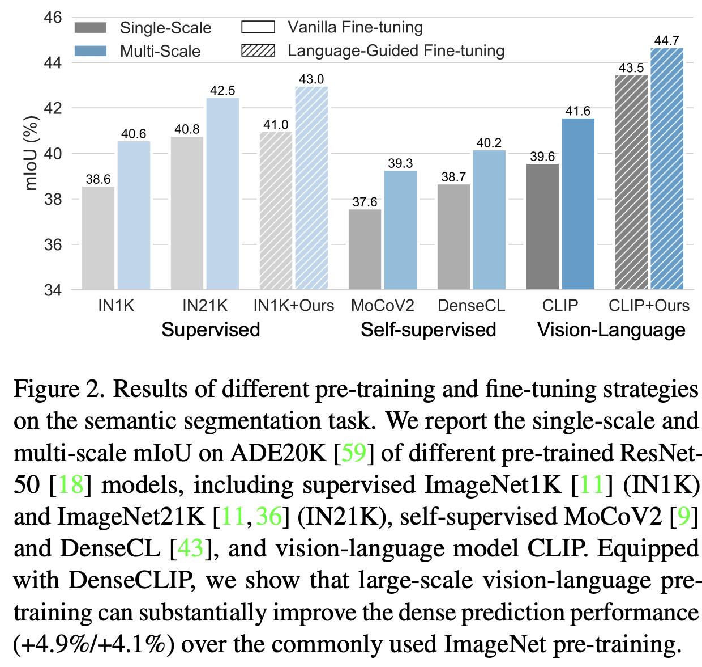

  -  image-to-prompt 정보를 Transformer module을 활용하여 (cross-attention) contextual 정보를 잘 추출함으로써 pre-trained knowledge를 잘 활용함

# 3. DenseCLIP

- overall diagram

  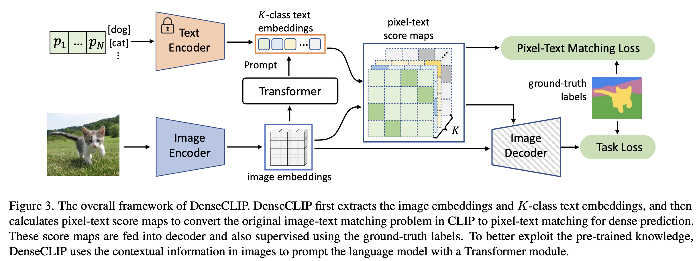

- language compatible feature map

  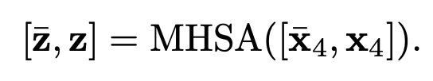

  - 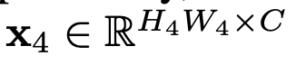
  - 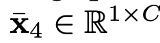: Global Averaged Pooling된 input feature 
  - $\bar{z}$: global feagture. 기존엔 이것만 사용함
  - z: language compatible feature map

- similarity score

  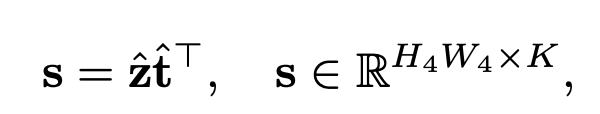

  - t: text embedding $\in \mathbb{R}^{K \times C}$

    - K: number of classes
    - C: embedding vector dimension

  - 이를 마지막 feature에 concat하여 사용 $\to$ language prior를 explicit하게 사용

    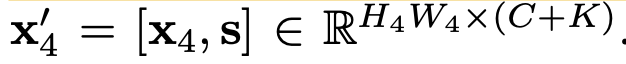

- Context-aware prompting

  - human-designed temple "a photo of [CLS]"이 아닌, CoOp처럼 learnable prompt를 활용

    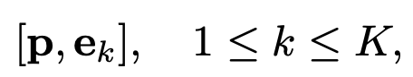

    - **p**: learnable textual prompt, 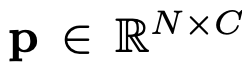
    - **e**: embedding for the k번째 class 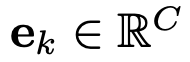

- Vision-to-language prompting

  - Transformer decoder의 cross-attention에 착안하여, vision과 text feature간의 interaction을 강화시켜주고자 함

    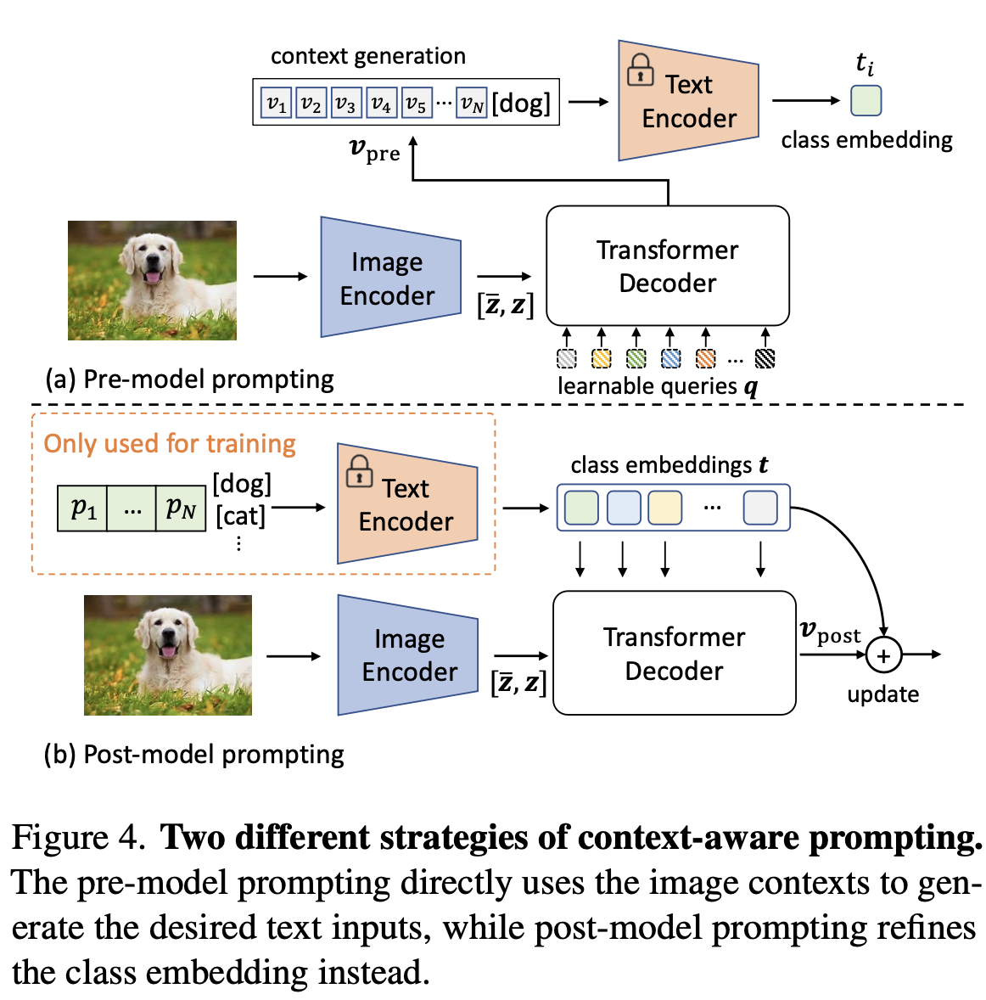

    - pre-model prompting: text encoder 통과 전 text에 visual feature output을 입력으로 넣어줌

      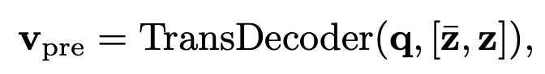

      - **q**: learnable queries

      - **z**: language compatible feature map

      - $\bar{z}$: global feature

        $\to$ text encoder를 통과시켜야 하므로, 비효율적이고 성능이 좋지 않아 사용하지 않음

    - post-model prompting: text encoder 통과한 text embedding을 visual encoder의 output에 넣어 Cross attention

      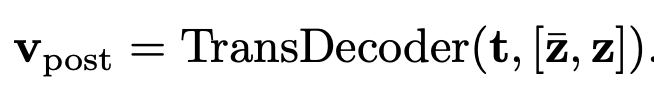

      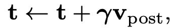

      - $\gamma$: learnable parameter. 초기에 매우 작은 값으로 시작하여 text embedding 정보를 헤치지 않도록 설계

        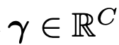

      - learned text embedding을 불러오기만 하면 되므로, post-model method을 최종 채택

    - Implementation

      - Semantic segmentation

        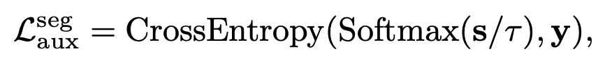

        - **y**: GT label 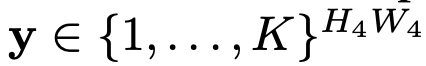
        - locality를 빠르게 학습하기 위해 auxiliary loss를 매 layer마다 추가해줌

      - Object Detection

        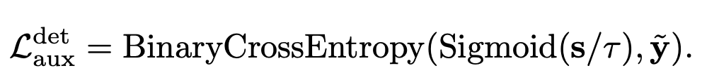

    

# 4. Experiments

- semantic segmentation

  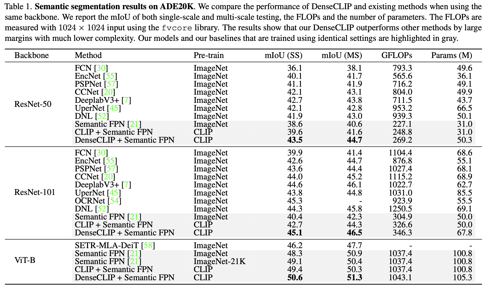

- Ablation study

  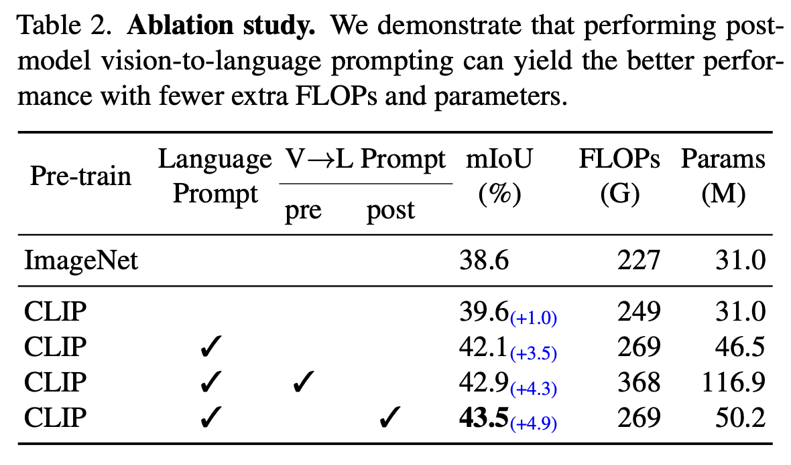

- object detection

  - RetinaNet

    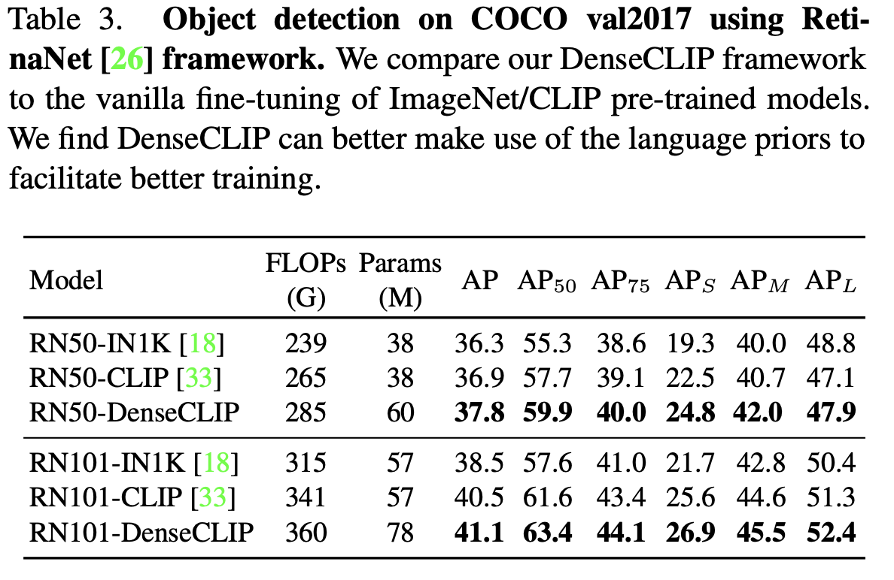

  - Mask-RCNN (+ Instance segmentation)

    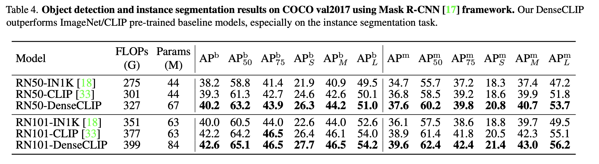

- Apply to any backbone

  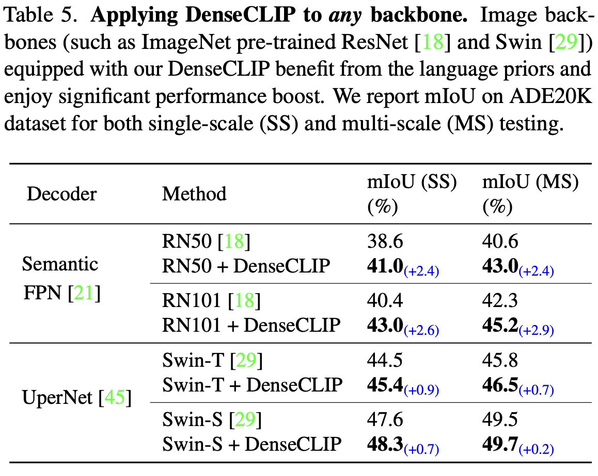

- Qualtitative Result

  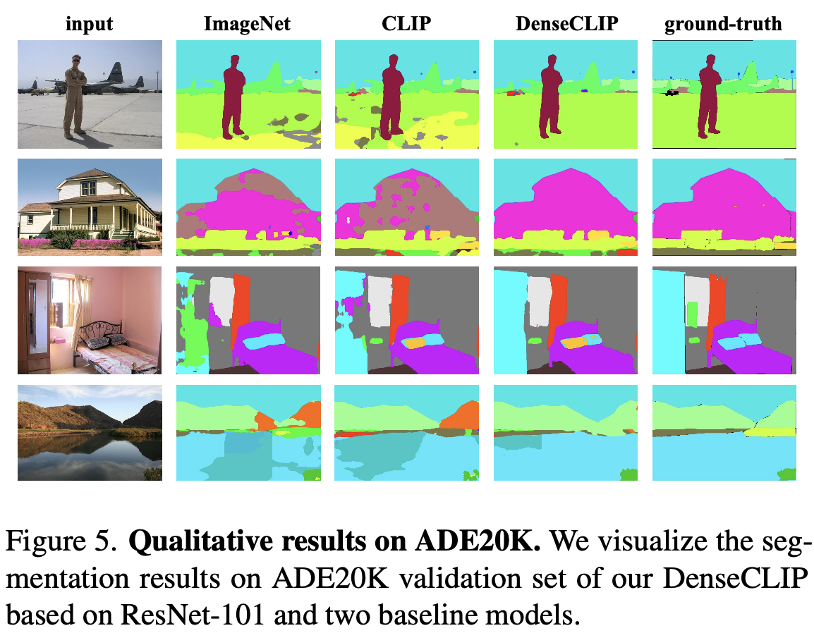
