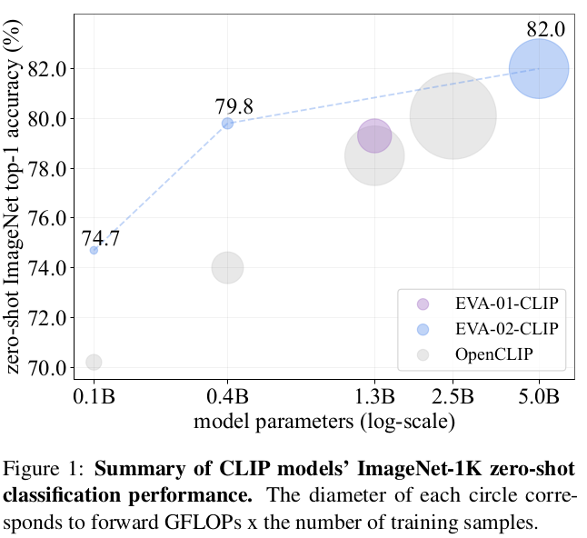
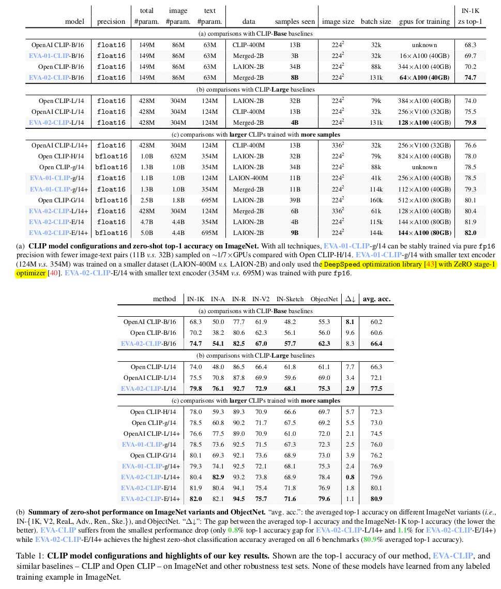
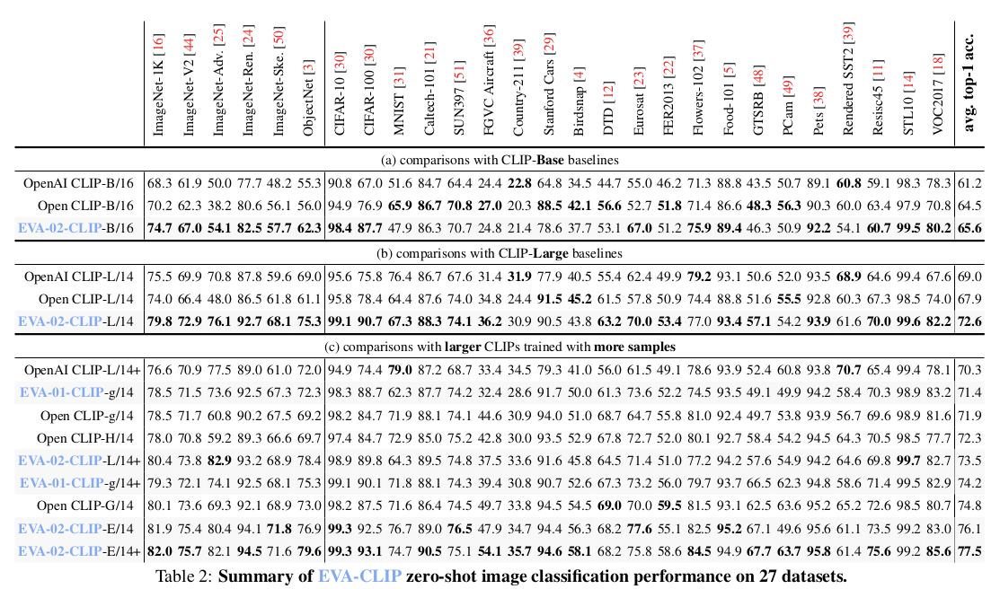
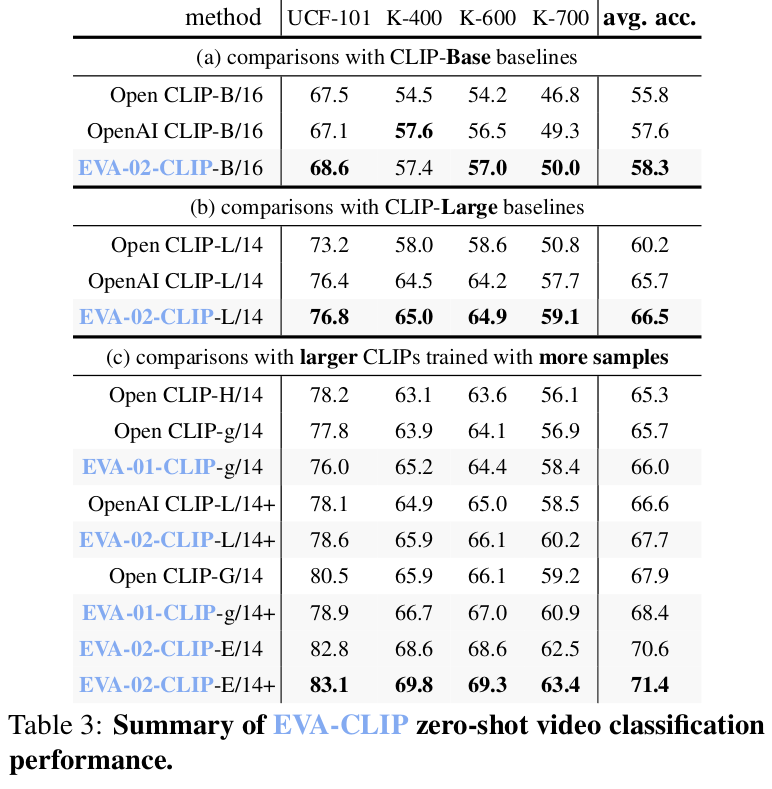
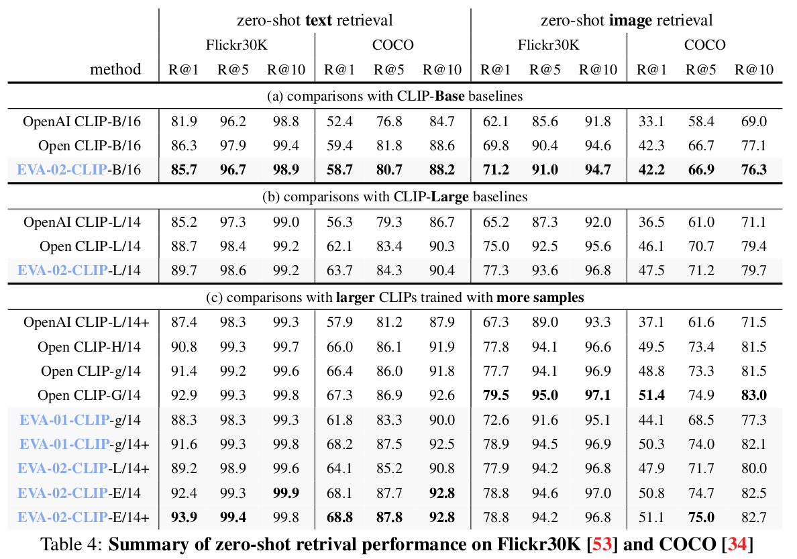
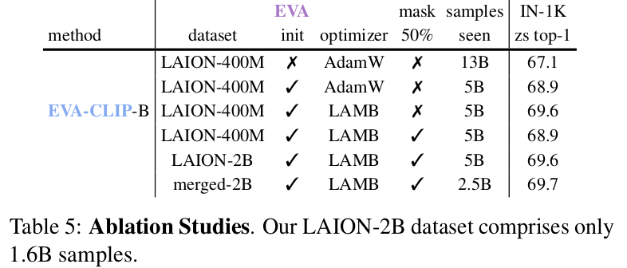
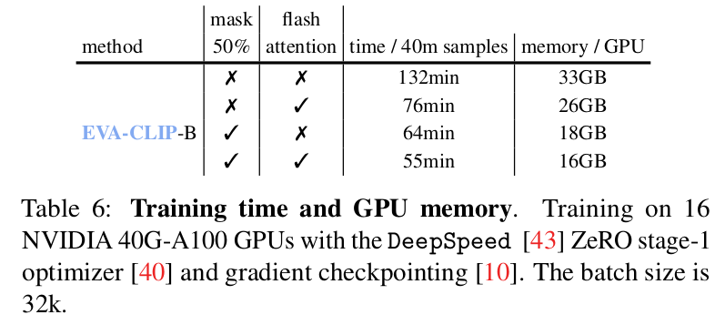
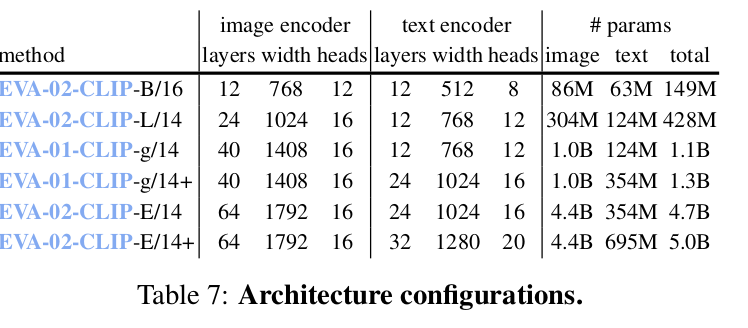
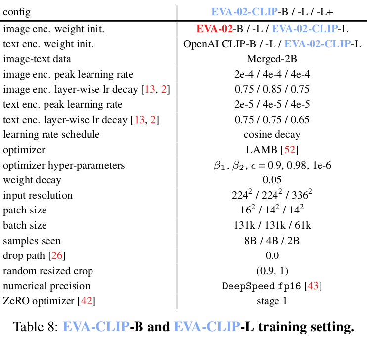

# [VLM][CLS] EVA-CLIP: Improved Training Techniques for CLIP at Scale 

-  paper: https://arxiv.org/pdf/2303.15389.pdf
-  github: https://github.com/baaivision/EVA/tree/master/EVA-CLIP
-  archived (인용수: 111회, '24-02-27 기준)
-  downstreamt task: zero-shot classification

# 1. Motivation

- CLIP을 학습하는데 high computational cost, training instability가 있음 
- 이를 해결하려는 선진 연구들을 종합해보자!

# 2. Contribution

- 선진 연구를 종합해 CLIP의 학습 효율성을 향상시킨 EVA-CLIP 제안

  - vision encoder의 pretrained weight (OpenCLIP $\to$ EVA-CLIP) 변경

  - optimizer: Large batch size에 적합한 LAMB 사용

  - drop-token: randomly drop image token 

    $\to$ save computation cost & stabilize training

- zero-shot benchmark에서 기존 보다 좋은 성능

  

# 3. EVA-CLIP

- Better initalization
  - CLIP $\to$ EVA-CLIP
- Optimizer
  - SGD $\to$ LAMB
- FLIP
  - 50% image token masking $\to$ 2x batch size향상

# 4. Experiments

- zero shot image classification (ImageNet, ObjectNet, 27 other classification)

  

  

- zero-shot video classification

  

- T2I, I2T retrieval

  

- Ablation Studies

  

- Training Time

  

- Architecture Configuration

  

- Training Setting

  
