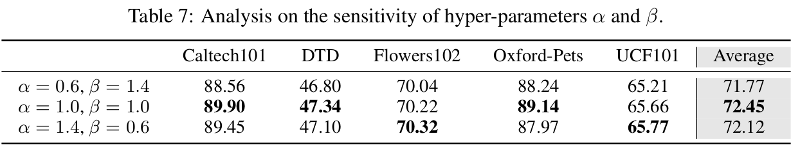

# [TTA][VLM] SwapPrompt: Test-Time Prompt Adaptation for
Vision-Language Models

- paper: https://openreview.net/pdf?id=EhdNQiOWgQ
- github: x
- NeurIPS 2023 accepted (인용수: 1회, '24-02-28 기준)
- downstreamtask: TTA for CLS

# 1. Motivation

- 기존의 VLM기반의 unsupervised prompt adaptation기법은 (TPT) entorpy based로 연구되었음

- 이는 (few-shot) supervised learning (CE loss)기반의 prompt adaptation에 비해 성능이 떨어짐

  - TPT는 entropy minimization으로 학습되다 보니, 본연의 특성상 over-confident해짐

- self-supervised contrastive learning기반의 prompt tuning 기법을 제안해서 성능을 향상시켜보자!

  - contrastive representation를 통해 better decision boundary를 학습

- pseudo label기반의 CE loss를 통해 TPT와 CoOps의 간극을 좁혀보자!

  

  

# 2. Contribution

- Dual prompt를 Self-supervised contrastive learning 기반의 test-time prompt adaptation하는 SwapPrompt를 제안함
- Pre-trained VLM에 unsupervised prompt representation learning으로 prompt adaptation하는 최초의 논문
- 여러 TTA Benchmark에서 SOTA

# 3. SwaPrompt

- Overview

  

- SwapPrompt : 

  - CoOp처럼 learnable text prompt사용

    - similarity score

      

      - **z**$_i$: i번째 image의 image embedding vector
      - **w**$_c$: c번째 class의 (learnable) text embedding vector
      - sim: cosine similarity

  - Dual-prompt paradigm을 적용

    - online prompt : Self-sup. contrastive loss + CE loss로 directly optimized 되는 prompt

      - Same image에 Alternative augmented view 적용

      

      - $A_1, A_2$: Different augmentation function
      - **p**$_i^1$, **p**$_i^2$: 서로 다른 augmented image에 대한 online prompt Similarity score

    - target prompt : online prompt의 EMA updated 된 prompt

      

      - target prompt **t**$_t$는 stop gradient로 업데이트 되지 않음

      $\to$ online prompt의 historical information을 고려

      $\epsilon$: decay rate

    

    - $A_1, A_2$: Different augmentation function

    - **q**$_i^1$, **q**$_i^2$: 서로 다른 augmented image에 대한 target prompt Similarity score

      

  - Loss

    
    

    

  

- Total Loss

  - Pseudo label을 활용한 CE loss와 SwapPrompt Loss를 적절히 활용

    

    $\to$ Clip의 generalized zero-shot 성능을 유지하기 위해 필수

    - target domain의 prediction score 기준 top-k sample을 가지고 $L_{pseudo}$를 계산
    - initial text : "a photo of [CLS]"

# 4. Experiments

- TTA benchmark

  

- average accuracy of 14 datasets

  

  - CoOp는 Few-shot learning이므로 upper bound
  - prompt adaptation epoch이 증가할수록 성능이 향상됨 $\to$ accuracy & efficiency trade-off

- Ablation study

  

  - UPL: Unsupervised Prompt Learning (baseline)

- EMA rate에 따른 ablation

  

  $\epsilon$이 1에 가까우면 fixed target prompt, 0이면 online = target prompt

- CE loss, L1 loss, L2 loss에 따른 ablation

  

- Test-set Top-K의 K에 따른 ablation

  

- Context length & initialization에 따른 ablation

  

- $\alpha$, $\beta$에 따른 ablation

  
