# [SSL][DG][CLS] Generalized Semi-Supervised Learning via Self-Supervised Feature Adaptation

- paper: https://openreview.net/pdf?id=A6PRwRjI8V
- github: X
- NeurIPS 2023 accpeted (인용수:0회, '24-03-01기준)
- Downstream task: SSL for CLS

# 1. Motivation

- Unlabeled data distribution이 labeled data distribution과 다른 real-world setting을 제안

  - FDM SSL (Feature Distribution Mismatch SSL)	

    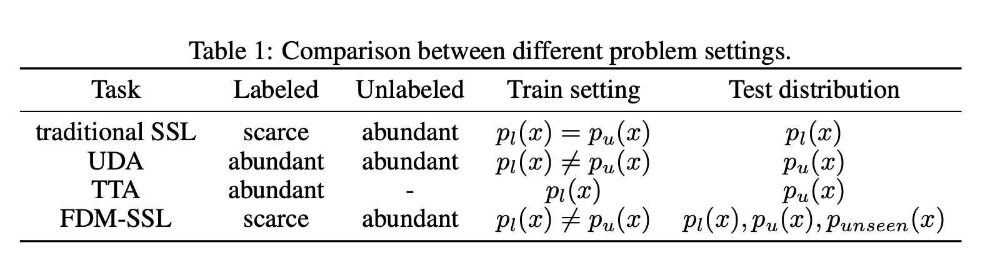

    - UDA와 다른점: labeled data(source domain)이 scarce한 setting! $\to$ IR detection과 유사

- 따라서, in-distribution, known-out-of-distribution, unknown-out-of-distribution에서 잘되는 SSL framework가 필요!

# 2. Contribution

- FDM-SSL에 적합한 Semi-supervised Feature Adaptation (SSFA) framework를 제안함
- FDM-SSL에 적합한 Evaluation protocol를 제안함

# 3. SSFA

- Problem Setting

  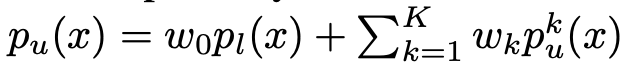

  - $p_u$: unlabeled distribution. labeled distribution과 K개의 서로다른 source에서 온 distribution의 합

- Overall Diagram

  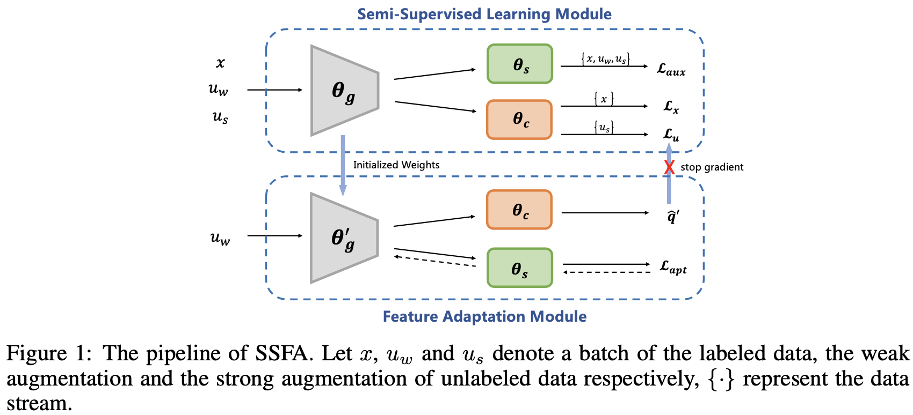

  - $\theta_g$: feature extractor. shared part
  - $\theta_c$: main classifier
  - $\theta_s$: self-supervised classifier.

- Loss

  - supervised loss

    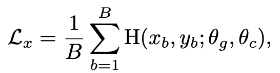

  - unlabeled loss

    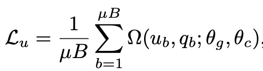

    - $\Omega$: Cross entropy loss or mean-square error 
    - $\mu$: unlabeled to labeled ratio. 클수록 unlabeled dataset의 비율이 커짐

  - Self-supervised loss

    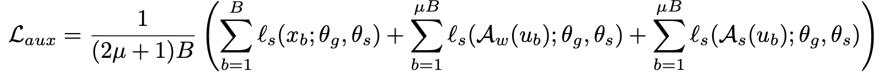

    - $A_w, A_s$: weak augmentation, strong augmentation

    - auxiliary loss는 rotation loss, regularization loss, entropy minimization loss등 다양하게 사용함

  - Total loss

    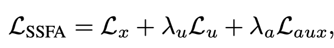

- Feature adaptation module

  - labeled data distribution와 unlabeled data distribution간의 간극이 있으므로, pseudo label을 활용한 unlabeled loss는 noisy label일 가능성이 있음 $\to$ confirmation bias에 노출될 우려

  - 따라서, 1-step만 self-supervised loss로 업데이트 수행 후, update된 weight로 unlabeled loss를 계산함

    - adatation loss

    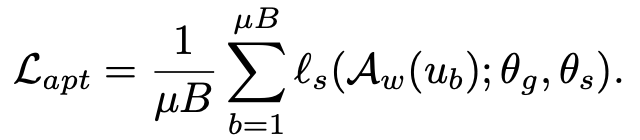

    - updated pseudo label

      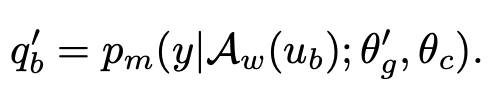

      - $\theta'_g$: updated backbone weight

    - unlabeled loss

      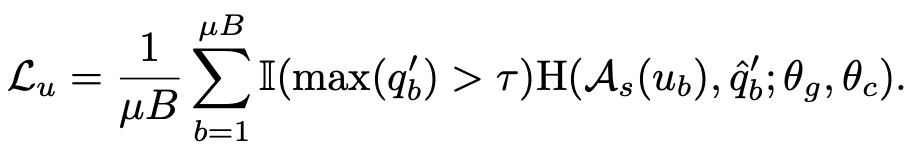

      - $\hat{q}_b'$: hard-label (argmax label)

- Theoretical insight

  - $\beta$-smooth convex function일 경우 self-sup. loss로 adaptation 수행한 empirical risk가 수행 전의 empirical risk보다 낮다는 가설

    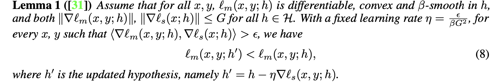

    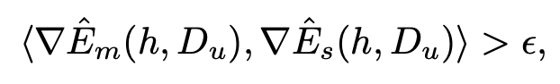

    - 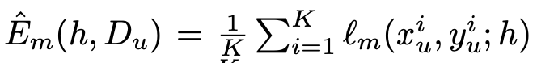

      $l_m$: main loss

    - 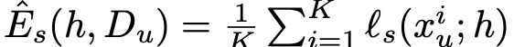

      $l_s$: self-supervised loss

  - 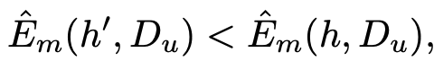

    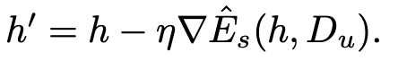

  - 이때, $\hat{E}_m$과 $\hat{E}_s$의 gradient dot product가 양수여야 SSFA가 유효함

    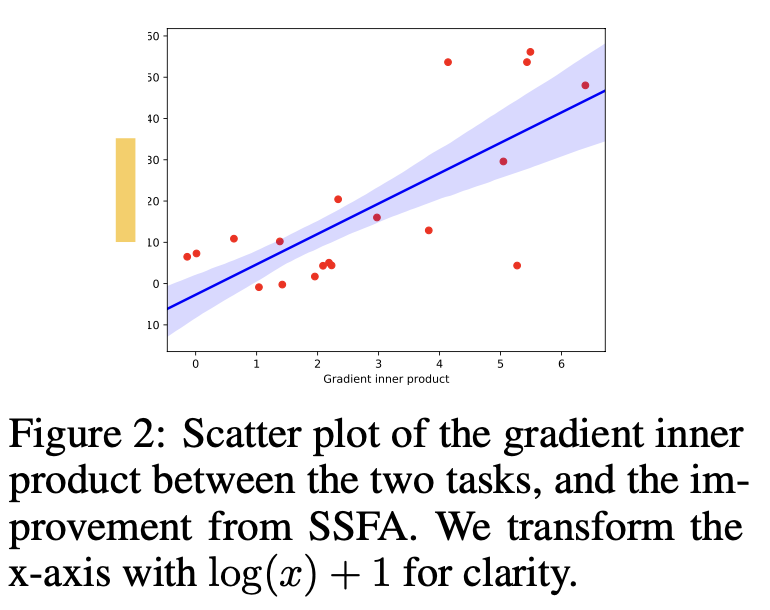

  

# 4. Experiments

- Unlabeled domain (UL) Evaluation & UnSeen-domain(US) evaluation

  - UL : unlabel domain의 분포에서 가져온 evaluation
  - US: unseen domain의 분포에서 가져온 evaluation

- Corrupted data

  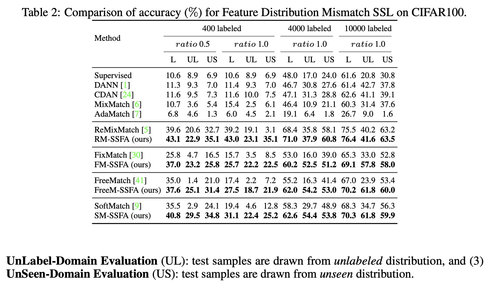

- Different Domain data

  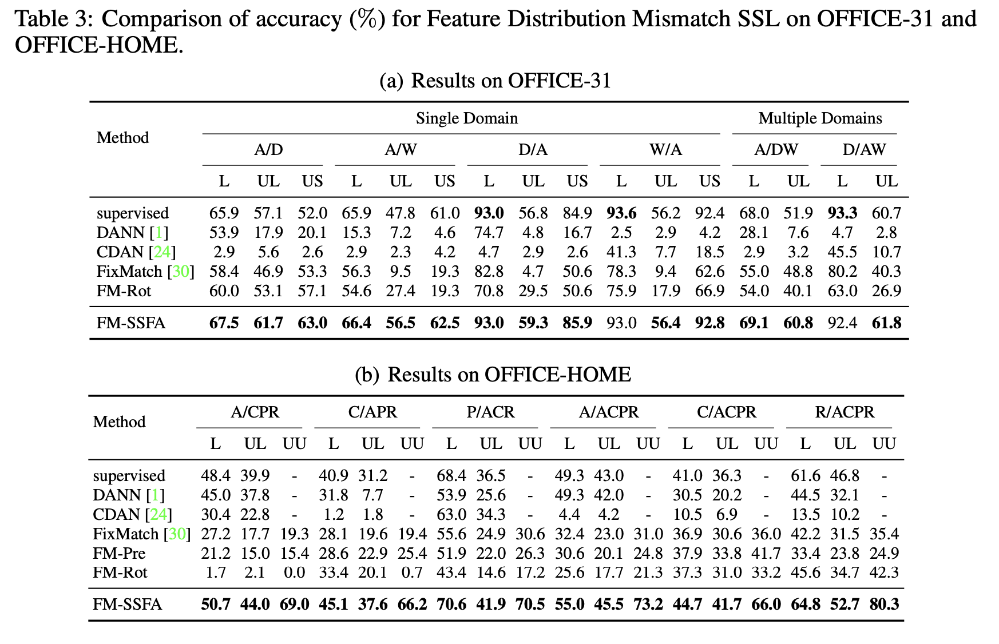 

- Feature Visualization

  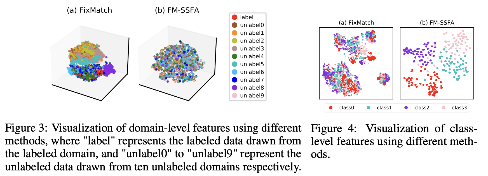

  Fig3. (a)는 labeled & unlabeled feature-level align이 안됬지만, (b) labeled data & unlabled data간에 align이 잘됨

  Fig4. (a) class-level feature cluser간 분리가 안됐지만, (b)는 class간 분리가 잘됨

- Ablation study

  - Self-supervised loss에 따른 ablation

    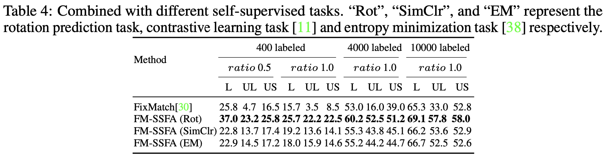

  - labeled & unlabeled distribution shift가 적을 경우 SSFA의 유용성 검토

    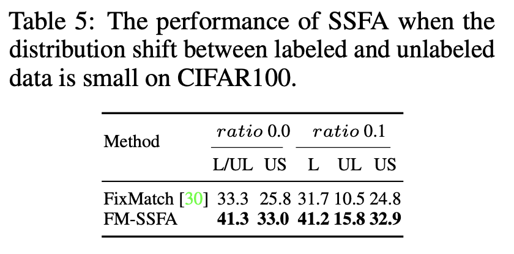

- $\tau$에 따른 ablation

  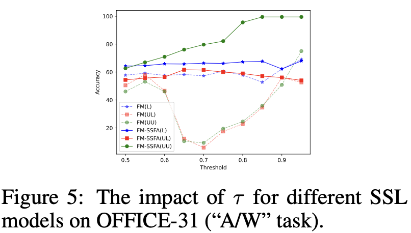

- Shared layer 갯수에 따른 ablation

  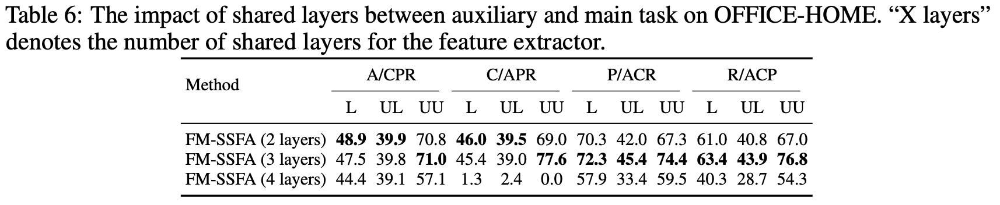
