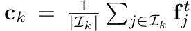

# [KD][CLS][OD] Improving Knowledge Distillation via Regularizing Feature Norm and Direction

- paper: https://arxiv.org/pdf/2305.17007.pdf

- github: https://github.com/WangYZ1608/Knowledge-Distillation-via-ND

- arxiv 2023 (인용수: 4회, 24-03-04 기준)

- downstream task: KD for CLS, OD

  

# 1. Motivation

- larger-capacity의 모델이 예측하는 feature norm값이 크고, small-capacity 모델이 예측하는 feature norm값이 작은 패턴을 발견함 $\to$이는 large-norm feature가 중요하다는 기존 model pruning, domain adaptation의 연구 결과와도 일치함

  

- Direct Naive logit-KD, feature-KD보다 class-mean의 norm을 guidance로 하는 KD를 해보면 어떨까?

# 2. Contribution

- student feature에 large-norm regularization을 부여하고, class-mean을 기준으로 alignment를 수행하는 ReviewKD++를 제안함
  - feature Norm의 크기와 direction을 regularization하는 ND Loss를 제안
- 기존의 KD방식들에 orthogonal하게 적용하면 모두 성능 향상을 보임
- CLS, OD benchmark에서 SOTA를 달성함

# 3. ReviewKD++

- overall

  

- Class-mean

  - Softmax이전의 final layer of DNN 의 output feature

    

    - $I_k$: k번째 class에 속한 data의 index 집합
    - **f**$^t_j$: j번째 class-k에 속한 sample의 teacher feature

- Feature norm Regularization

  - Naive Method : L2 norm으로 teacher의 feature와 같아지도록 student feature에 regularization 부여

    

  - Stepwise increasing feature norms(SIFN)

    - student feature의 norm을 stepwise하게 점진적으로 키우도록 유도함

      

      - $\Theta_{previous}^s$: 이전 step의 student model's wieght
      - $\Theta_{current}^s$: 현재 step의 student model's wieght
      - *r*: step size

- Feature Direction Regularization (FDR)

  - Cosine Similarity기반 FDR: Teacher의 class-mean과 Student의 feature가 방향이 같아지도록 cosine-similarity를 기반으로 loss를 계산

    

    $\to$ Sample이 해당하는 class-mean에 대한 방향만 고려하기 때문에, 다른 class의 class-mean을 고려하고 있지 않음

    $\to$ 실험적으로 InfoNCE보다 좋아서 채택

  - InfoNCE기반 FDR

    - Contrastive Learning Loss기반으로 구성하여 소속된 class-mean과는 당기고, 소속되지 않은 다른 class-mean과는 밀게함

    

- ND Loss

  

  - Centroid **c** : teacher feature의 class-wise mean으로 계산

  - **p**$^s$: student feature의 Centroid projection feature

    

  - **p**$^t$: teacher feature의 Centroid projection feature

    

    

  - ND Loss

    - teacher의 feature를 L2로 regularization하게 되면, 인위적으로 큰 (teacher)의 gradient로 학습하게 되어, 학습에 악영향을 줄 수 있음.

    - teacher의 feature로 normalize한 loss를 제안

      

    - 두 가지 경우

      - student feature의 norm이 teacher의 norm보다 작은경우 (대부분)

        - teacher의 norm으로 normalize (상동)

      - student feature의 norm이 teacher의 norm보다 큰 경우 (극소수)

        - student norm 그대로 사용 

          

- Total Loss

  

# 4. Experiments

- Cifar100

  

- ImageNet

  

- COCO-Val

  

- Ablation Study

  

  - (a), (b): norm만 쓰거나 (a), direction만 추가(b)했을 때도, 성능향상을 보임
  - (c)둘 다 쓰면 더 좋음
  - (d) ND-Loss가 제일 좋음 (c와 차이점: student feature norm값으로 normalize 수행. student norm이 크면 student norm으로 normalize)

- Scalable Teacher : Teacher가 커질수록 KD로 인한 성능 향상을 보임

  
