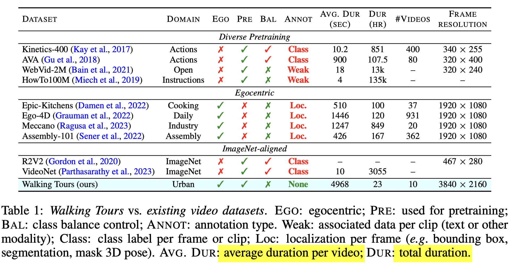

# [SSL2][OD][SS][OT] DoRA: IS IMAGENET WORTH 1 VIDEO? LEARNING STRONG IMAGE ENCODERS FROM 1 LONG UNLABELLED VIDEO

- paper: https://arxiv.org/pdf/2310.08584.pdf
- github: x
- ICLR 2024 accepted (인용수: 1회, '24-03-13 기준)
- downstream task: SSL2 pretraining and fine-tuning on OD / Depth estimation / SS / OT / DE, etc

# 1. Motivation

- Self-supervised learning 붐으로, 대량의 unlabeled data를 통해 성능 향상을 보고 있음

- 하지만, 대량의 데이터를 best use하고 있는가?

  

  - all the books : ImageNet (frame만 존재하는 이미지)

  - four of them : long-video (WT dataset)

  - 인간의 visual system이 학습되는 과정을 모사 : 갓난아이들은 처음으로 사물을 트래킹하는 방법을 배우고, 사물을 인식하고 분류하게됨

    $\to$ "track to learn to recognize"

# 2. Contribution

- 10개의 Walking Tours (WT) 긴 동영상 데이터셋을 소개함

  

  특징: 고화질, 매우 김(1.5h), 중간에 끊기지 않음, 다양한 정보를 내포함 (개인 여행영상), no special effects, no shot cuts, non-object-centric video, uncurated & unlabeled $\to$ realistic

  

- DINO (SSL2)를 base로하여 Multi-Object-Tracking self-sup. loss를 end-to-end로 학습하는 DORA (**D**isc**o**ver and t**Ra**cked across time)
  - multiple object across frame에 대해 tracking하도록 tailored됨
  - continous video로 학습하기에, curation & label이 필요없음
  - multiple view로 augmentation 수행 후, self-supervised distillation loss적용
  - 사물간의 분류를 하기 위해 Sinkhorn-Knopp clustering을 적용함
- Single long video로 pretrain하여 ADE20K segmentation, MS COCO detection에서 ImageNet-pretrained DINO보다 성능 향상

# 3. DoRA

- WalkingTours Dataset

  

  - 4K resolution (3840 x 2160 pixels) @ 60FPS

  - 평균 1h 38min. (max: 2h 55min, min: 59min)

  - 특성

    

    (a) lightness condition이 gradual하게 변화 (다양함)

    (b)(d) #Objects per frame이 많아 semantic information이 풍부함

    (c) Class갯수가 아주 다양함

- Attention-Based Multi-Object Tracking

  - overall digagram

    핵심 컨셉은 continuous stream에서 "multi-object Discovery and Tracking"을 수행함

    

    - input

      - **X**$_{t_0}$: $t_0$시점의 input frame 
      - **X**$_{t}$: $t$시점의 input frame $ \in \mathbb{R}^{h \times w \times c}$
        - patch pxp 단위로 split됨
        - n: patch의 갯수 $hw/p^2$

    - output

      - Z: [$Z^{CLS}, \tilde{Z}$] $\in \mathbb{R}^{\(n+1) \times d}$
      - $Z_t=g_{\theta}(X_t)$

    - teacher : student의 EMA 

      

  - Discovering object with Multi-head Attention

    - Q, K : teacher의 2nd last layer output를 통해 **X**$_{t_0}$를 가지고 계산함 

    - head의 갯수로 나눔

      

      

      

    - Self-attention matrix

      

      - Self-Attention matrix 중 [CLS] token과 다른 patch간의 correlation vector 

      - h개의 head 중 k개의 index를 random sampling

        

        

      - object prototypes

        

        - Query $\tilde{Q}$와 CLS-token의 k개의 Self-Attention Map을 통해 구함 (Self-Attention 느낌)
        - k개의 object를 표현하고 있음

      - Tracking Map

        

        

        - t번째 sample의 key값과  object prototype를 cross-attention하여 tracking 하고하는 Cross-Attention Map 생성

    - Sinkhorn-Knopp clustering의 등장

      - 배경: 위 방식대로 하면, k object 간의 분류가 잘 안됨

        

      - k개의 object간 분류를 하기 위해 SK clustering사용

        

        - SK 알고리즘 상세과정

          먼저, 비용 행렬 *C*가 주어지고, 이 행렬의 각 원소에 대해 ε로 나눈 후 지수 함수를 적용하여 K라는 새로운 행렬을 생성

          $K=\exp⁡(−C/\epsilon)$

          여기서 expp 함수는 행렬의 각 원소에 대해 element-wise 지수 함수를 취합니다. 그 결과로 얻어진 *K* 행렬의 각 원소는 0보다 크게 됩니다.

          Sinkhorn-Knopp 알고리즘은 이 K 행렬을 사용하여 행렬 M을 정규화합니다. 정규화 과정은 행렬 M이 다음 두 조건을 만족하도록 하는 것입니다:

          1. 모든 행의 합이 1이 되도록 한다 (row normalization).
          2. 모든 열의 합이 1이 되도록 한다 (column normalization).

          이 두 조건을 반복적으로 적용하는 과정은 다음과 같습니다:

          1. K의 각 행에 대해 정규화 인자를 적용하여 행 합이 1이 되도록 합니다. 이를 위해 각 행에 곱할 정규화 인자 벡터 u를 찾습니다.
          2. 정규화된 행렬에 대해 이번에는 열을 정규화합니다. 열의 합이 1이 되도록 하는 정규화 인자 벡터 v를 찾아 각 열에 곱합니다.
          3. 이 두 단계를 번갈아 가면서 반복적으로 적용하며, 행과 열이 모두 소정의 기준에 도달할 때까지 계속합니다. 이 과정을 반복하면, 각 행의 합이 1/k, 각 열의 합이 1/n이 되는 정규화된 행렬 *M*을 얻게 됩니다.

          이렇게 해서, *M* 행렬은 각각의 행과 열이 정규화된 확률 분포를 나타내며, 이는 최적 전송 계획을 나타내는 행렬로 사용될 수 있습니다.

      - refined object prototype

        

      - refined tracking-mask

        

  - Multi-object Masking

    - Cross-attention mask (tracking-mask)를 사용해서 input video clip을 masking하여 multi-object를 crop시킴

      

    - 서로다른 view로 augmentation된 image에 대해 CE Loss적용

      

# 4. Experiments

- ablation (dataset & k & SK+MASK)

  

- downstream task : OD & SS

  

- downstream task : video-object-segmentation & object-tracking

  

- downstream task: CLS & object discovery

  
