# [OVD][VLM][KD] RKD: Bridging the Gap between Object and Image-level Representations for Open-Vocabulary Detection

- paper: https://arxiv.org/pdf/2207.03482.pdf
- github: https://github.com/hanoonaR/object-centric-ovd
- NeurIPS 2022 accpeted (인용수: 92회, '24-03-17 기준)
- downstream task: Open Vocabulary Object Detection

# 1. Motivation

- 기존에 Open Vocabulary Object Detection은 두 가지 유명한 방식으로 vocabulary를 확장시켰음

  - pretrained CLIP이용: image-text pair를 기반으로 학습하다 보니, 정확한 object localization 을 예측할 수 없음

  - image-level (weak) supervision: object의 영역을 정확히 localize할 수 없었음

    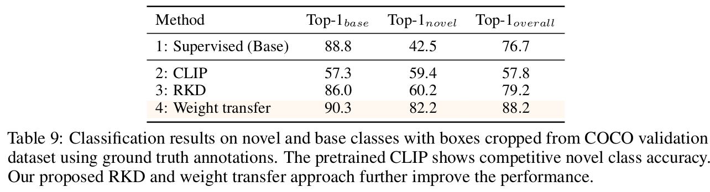

  $ \to$ (1) pretrained CLIP embedding을 object-centric alignment수행하고, (2) pseudo labeling을 통해 image-level 에서 object-level supervision으로 image-level과 object level representation 간의 gap을 bridging 할 수 있지 않을까?

# 2. Contribution

- Image-centric CLIP embedding을 region-based embedding으로 alignment시키는 Region-based Knowledge Distillation (RKD)을 제안함
- High-quality object proposal을 만드는 Multi-modal ViT (MViT)를 활용하여 image-level image에 pseudo-labeling을 적용함
- 위 두가지 (vision-based)뿐 아니라, language domain에도 region-based alignment을 적용하기 위해 *weight transfer function*을 도입
- OVD benchmark에서 SOTA

# 3. RKD

- preliminaries

  - Detector: 2-stage detector의 classifier head를 fixed language embedding으로 대체

    - fixed language embedding: CLIP text encoder에 "a photo of \[CLS]"로 입력하여 생성

    - region-based embedding: RPN-RoI layer를 통과시킨 후, text embedding과 align하기 위해 linear layer *f* 까지 통과시켜 생성

      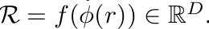

      - *r*: RPN에서 예측한 proposals
      - $\phi$: RoI head
      - *f*: CLIP text embedding과 align하기 위해 필요한 FC layer

  - Classification : text & region embedding간의 cosine similarity score

    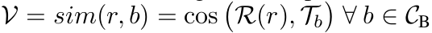

    - $C_B$: Base class
    - $T_b$: Base class text embedding
    - *R*: region-based (visual) embedding

  - Total Loss

    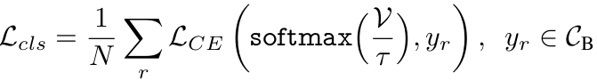

- overall diagram

  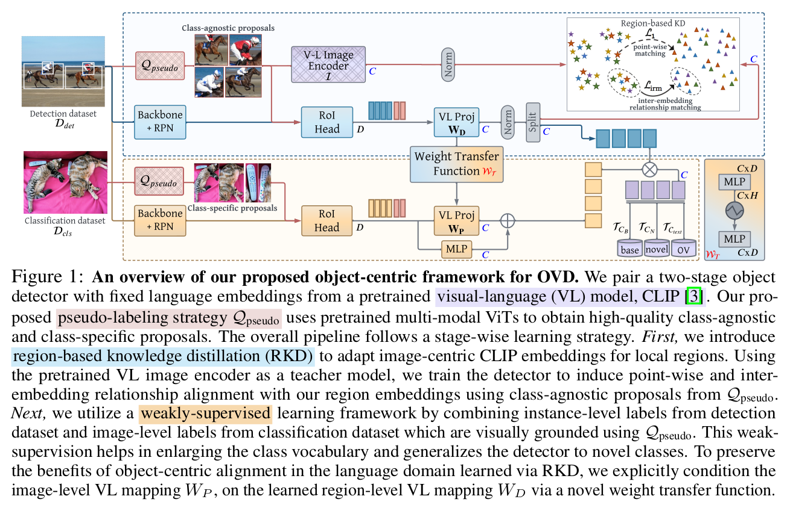

- Pseudo Label

  - MViT기반 high-quality psuedo label을 class-agnostic ("all objects"), class-specific ("every [CLS]")를 이용하여 CLIP embedding object proposal $\tilde{r}$과 함께 pseudo label을 예측

    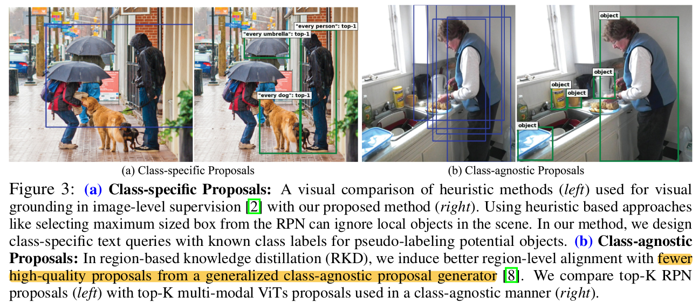

    (a) 좌: RPN의 max-box를 이용한 pseudo label / 우: MViT의 class-agnostic Top-K pseudo label

    - Detection dataset의 pseudo label로 활용 (localization 성능 향상)
      - 학습의 효율성을 위해 모든 image에 대한 top-k CLIP embedding을 offline으로 미리 만들어 놓고 (offline) 학습 진행

    (b) 좌: RPN의 Top-K pseudo label / 우: MViT의 class-specific Top-K pseudo label

    - Classification dataset의 pseudo label로 활용 (classification 성능 향상)
      - localization loss는 활용하지 않음

- Region-based Knowledge Distillation

  - 두 가지 loss를 이용

    - Point-wise embedding matching loss

      - CLIP region representation $I(\tilde{r})$와 region embedding $\tilde{R}=f(\phi(\tilde{r}))$간의 $L_1$ loss

        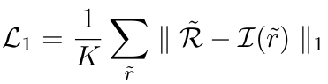

        $\to$ visual encoder (detector's feature extractor)가 CLIP의 text embedding과 Align되도록 학습

        $\to$ CLIP의 image encoder는 freeze시킬 것으로 예상

    - Inter-embedding relationship matching loss (IRM)

      - teacher (CLIP image encoder)와 student (our detector)는 학습방식이 다르므로, 두 예측값이 다른 경향을 나타냄

        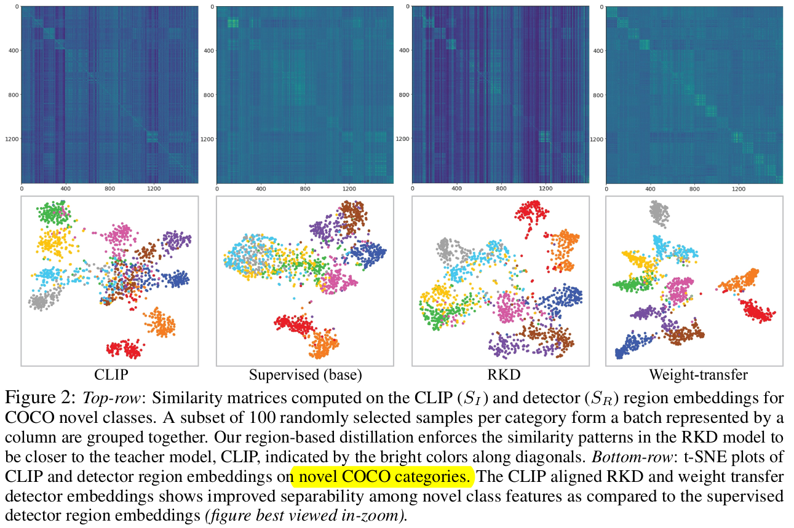

      - Top-K proposal에 대한 similarity matrix를 normalize시켜 IRM Loss를 계산

        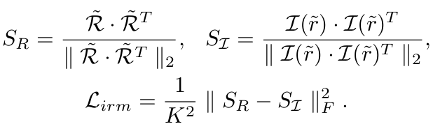

  - RKD Loss

    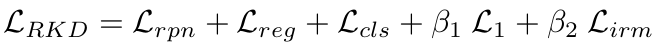

    

- Image-level supervision (ILS) with Pseudo Box Labels

  - pretrained MViT를 사용해서 class별 top-K pseudo label 중, class별 top-1 pseudo label만 필터링해서 사용

    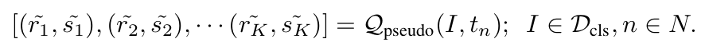

    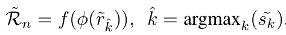

  - Pseudo Max Score (PMS) Loss 

    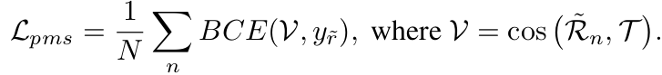

  - Image-Level Supervision (ILS) Loss

    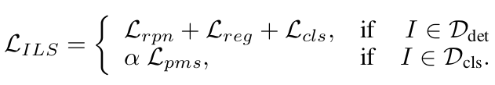

- Weight Transfer Function

  - 위 두가지 방식 (RKD+ILS)를 Naive하게 사용하면 text-embedding에 대해 학습이 안되므로 sub-optimal하게 학습됨

    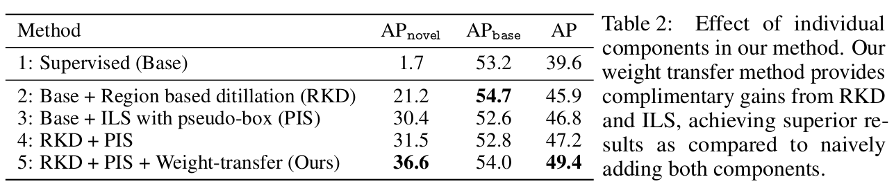

  - Language domain에도 object-centric alignment를 부여하기 위해 SAM에서 사용한 Weight Transfer방식을 도입

    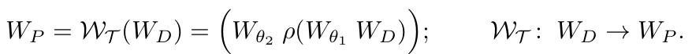

    - $W_T$: 2-Layer MLP weight transfer function (learnable)
      - $\theta_1, \theta_2$: learnable weights for 1st, 2nd layers
    - $W_D$: RKD의 *f* projection layer (frozen)
    - $\rho$: leaky-ReLu w/ 0.1 for negative slope
    - $W_P$: weak image level supervision weights

  - Total Loss

    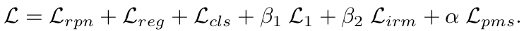

# 4. Experiments

- Datasets

  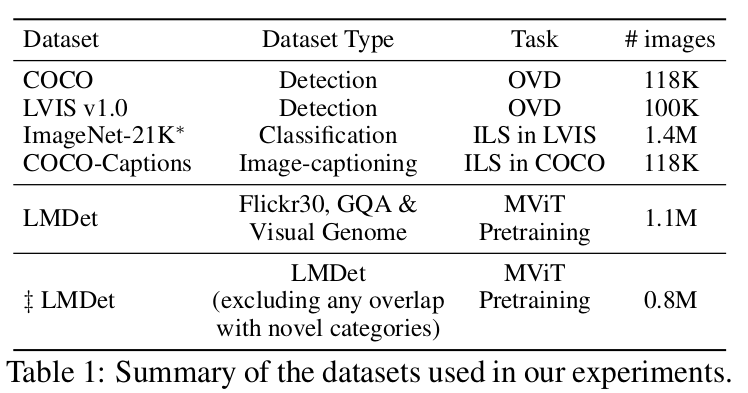

  - COCO OVD
    - ZS OD에서 구현한 setting 활용
      - base : 48 class
      - novel : 32 class 중 17 class만 선택

  - LVIS OVD
    - base: common, frequent class (866/1203 class)
    - novel: rare class (337/1203 class)
  - Cross-transfer Datasets 
    - Domain Generalization (unseen domain)
      - Source: LVIS
      - Target: OpenImages, Objects365, COCO

- Object Detection
  - Res50+Faster-RCNN을 사용

- Ablation

  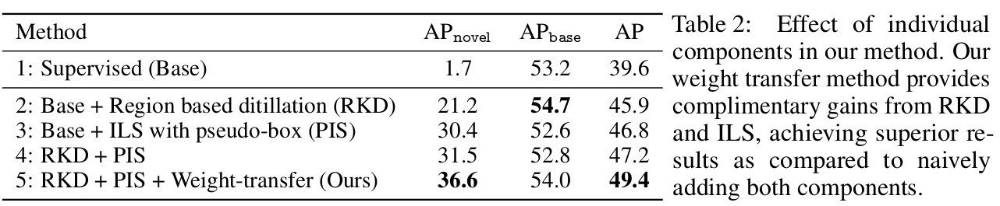

  - RKD 분석

    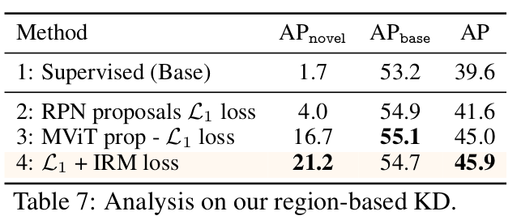

    (2vs3) Pseudo Labeling RPN vs. MViT

    (3vs4) IRM loss

  - ILS 분석

    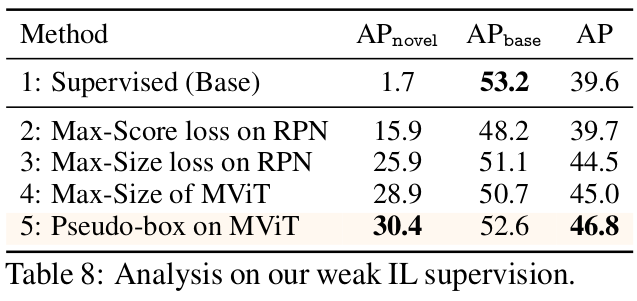

    (2,3,4vs5) Pseudo Labeling previous vs. MViT

- Open Vocabulary Evaluation

  - COCO

    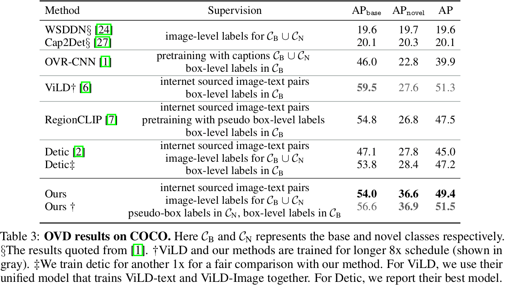

  - LVIS

    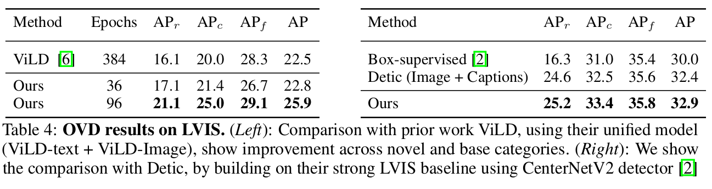

- Strict OVD setting

  - target class (open vocabulary) 가 unknown인 환경

  - Random하게 ImageNet-21K class 중 일부만 기존대비 vocab. size를 5배 증가시켜 novel/base class로 ILS 학습에 사용

    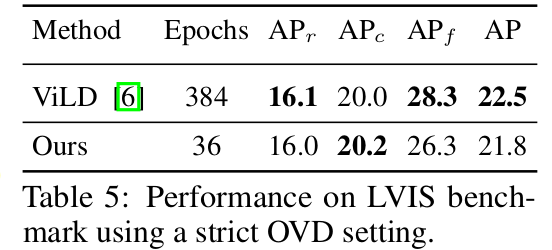

    - Table4에 의거, 학습 epoch을 늘리면 성능 향상이 될거라 예측

- Cross-Dataset (DG)

  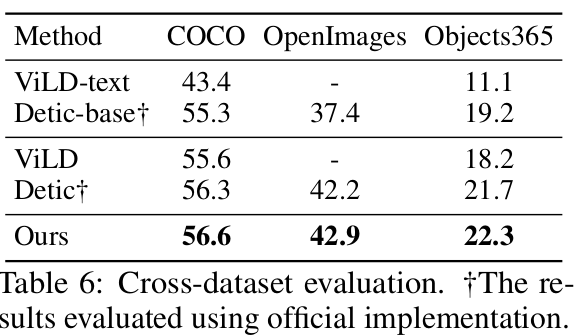

  

- Qualitative Result

  - COCO and LVIS

    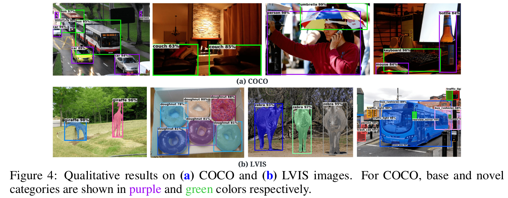

  - Cross-Dataset

    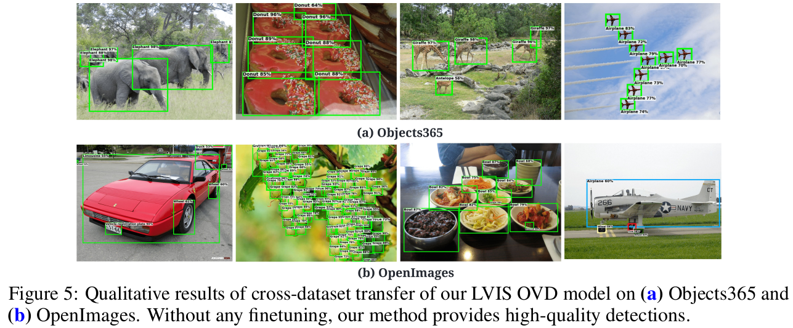
