# [AR] TimeSFormer: Is Space-Time Attention All You Need for Video Understanding?

- paper: https://arxiv.org/pdf/2102.05095.pdf
- github: https://github.com/facebookresearch/TimeSformer
- ICLR 2021 accpeted (인용수: 1545회, '24-03-19 기준)
- downstream task: Video Classification (Action Recognition)

# 1. Motivation

- 기존에 video classification에서 SOTA는 3D-Convolution기반으로 되어 있음 (ex. Slow-Fast)

  - 하지만 CNN은 근본적으로 Global 영역을 보는데 한계가 있음 (shared weights)
  - 이런 한계점은 long-range dependency를 catching해야 하는 video classification에 적은 정보만 제공하게됨

- NLP의 혁신적 성능 향상을 이끈 Self-Attention기반의 Transformer를 (그와 유사한 task인) video classification에 적용해보면 여러가지 이점이 있음

  - 단어 (프레임)간의 관계를 학습하기 용이하여 long-range dependency를 catching할 수 있음
  - 현대 GPU hardward acceleration에 3D Conv보다 효율적이라고 함

  $\to$ Self-Attention만 가지고 Video Attention을 해보자!

# 2. Contribution

- Self-Attention의 이점은 살리고, 단점을 보완한 TimeSFormer를 제안함
  - 단점: 모든 Spatial-Temporal patch간의 similarity를 계산하게 되어, 비효율적인 계산량이 요구되는 문제
  - 해결책: spatial-temporal "divided attention"을 적용하여 위 문제를 해결함
  - 장점: long-range modeling이 가능하며, 학습이 (3D-Conv보다) 빠르고, 성능이 향상됨
- Video Recongition benchmark에서 SOTA

# 3. TimeSFormer (Time-Space Transformer)

- preliminaries

  - input : $X \in \mathbb{R}^{H \times W \times 3 \times F}$

    - F: # of frames per clip

  - decomposition to patches : $P \times P$

    - $N=HW/P^2$: # of patches per frame

  - flatten patches $x_{(p,t)} \in \mathbb{R}^{3P^2}$

    - p: patch index
    - t: frame index

  - linear embedding : patch $x_{(p,t)} \to z_{(p,t)}^{(0)}$로 mapping

    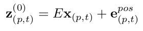

    - E : learnable matirx $\in \mathbb{R}^{D \times 3P^2}$
    - **e**: learnable positional embedding $\in \mathbb{R}^{D }$
    - **z**: embedding of classification token

  - query, key, value

    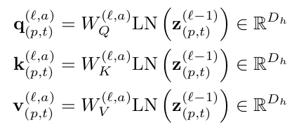

    - $D_h=D/A$
      - A: # of heads
      - L: # of blocks
      - *a = (1,..,A) / p=(1, ..., N) / t = (1, ..., F)* / *l = (1, ..., L)*

  - Self-attention computation

    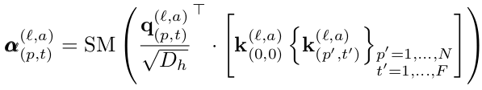

    - SM: softmax function
    - $a_{(l,a)}^{(l,a)}$: l번째 block의 a번째 head의 p번째 patch의 t번째 frame의 attention weight
    - ViT처럼 classification token $z_{(0,0)}^{(l,a)}$를 붙임

- Encoding

  - Residual Connection과 LayerNorm, 그리고 MLP로 구성

    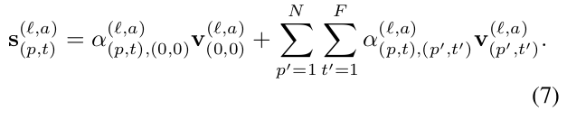

    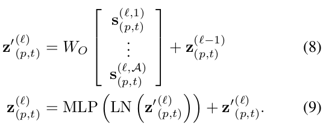

- Classification Embedding

  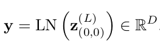

- Space-Time Self-Attention Module의 여러 Variations

  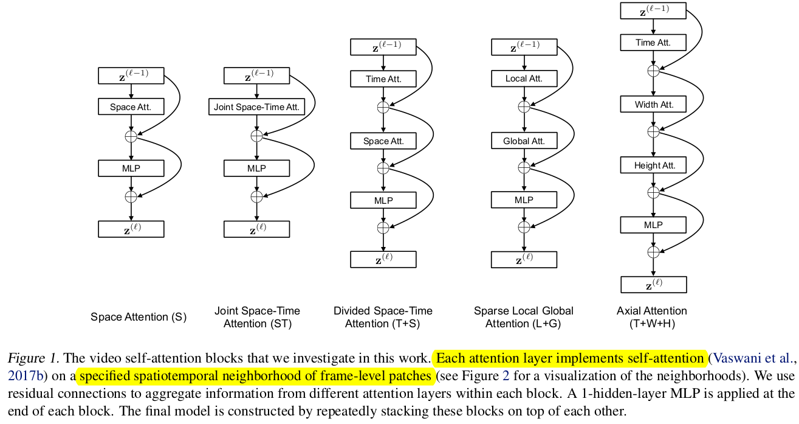

- Attention 하고자 하는 neighbors

  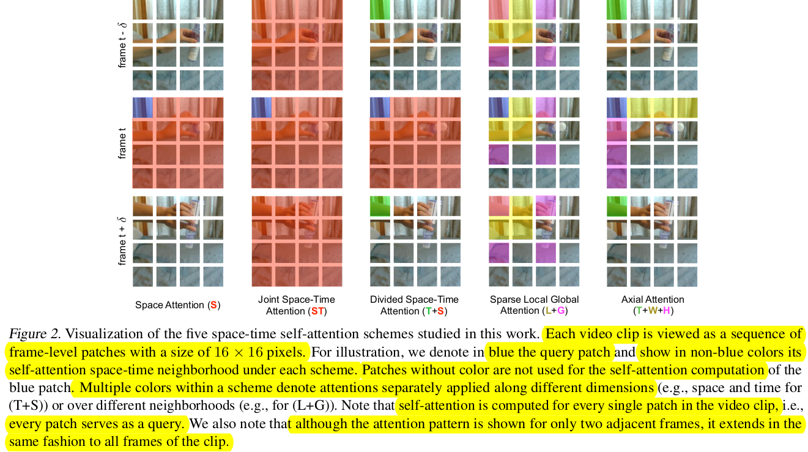

  - 실험적으로 성능&속도가 제일 좋은 T+S를 사용

# 4. Experiments

## 4.1. Dataset

1. Kinetics-400 

   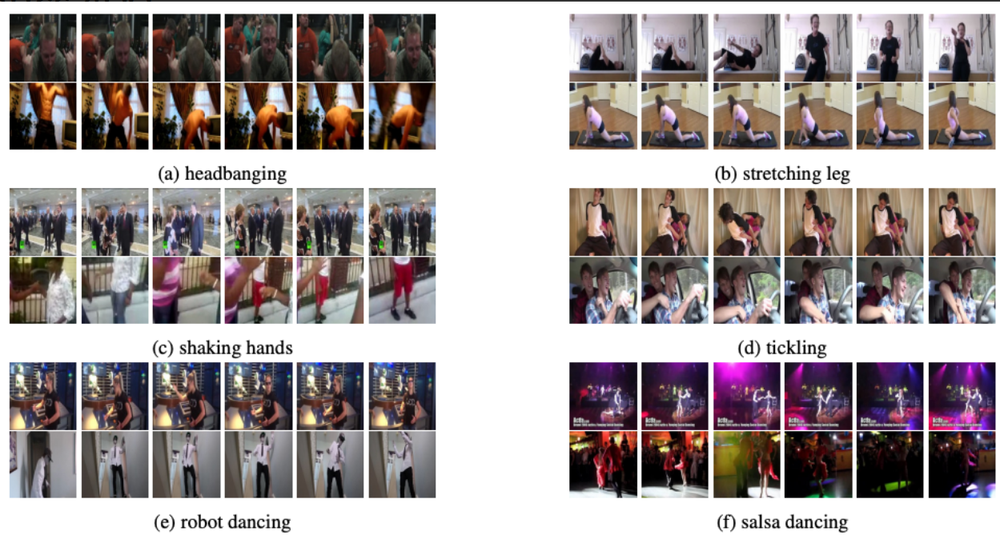

   - 400개의 human action class로 구성된 video action dataset
   - 각 class당 최소 400개의 clip으로 구성
   - 각 clip당 약 10초 영상으로 Youtube에서 취득
   - human-focused, human-object oriented interactions로 이루어짐 (ex. shaking-hands)

2. Something-Something-V2

   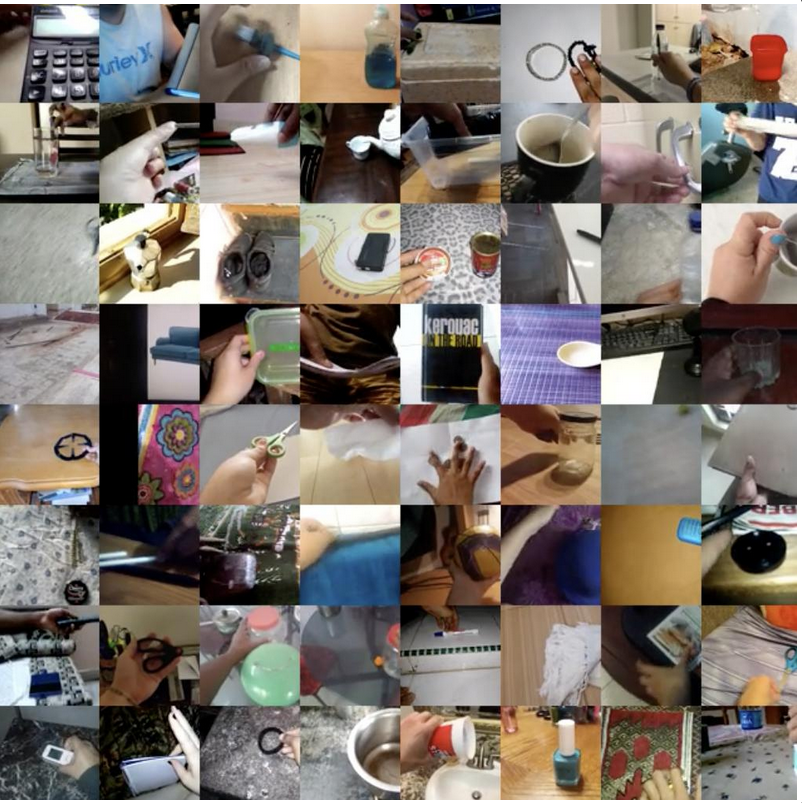

   - 174개의 basic actions in real-world로 구성된 human basic actions

     - ex. 

       Putting something on a surface
       Moving something up

       Covering something with something
       Pushing something from left to right
       Moving something down ...

   - Train: 168,913 / validation: 24,777 / test: 27,157개의 clip (fine-grained)

3. Diving-48

   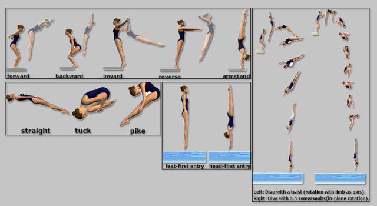

   - 48개의 diving sequence로 구성된 fine-grained video dataset

     - class: take-off, landing, flight, entry $\to$4가지 기본 동작을 응용하는 세부 동작들로 이루어짐

       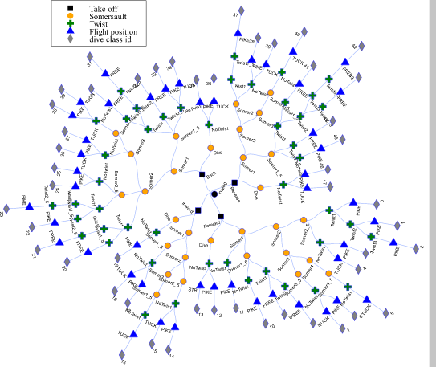

     - long-term dynamic을 이해해야하는 task

   - 18K dataset으로 구성

- Input & evaluation
  - clip size : 8x224x224 (8개 frame)
  - sampling rate : 1/32
  - 3 spatial crop (top-left, center, botton-right)의 평균 score
- Computational Cost vs. Parameters

| parameters vs. accuarcy                               | TFLOPS vs. resolution or #of frames                   |
| ----------------------------------------------------- | ----------------------------------------------------- |
| 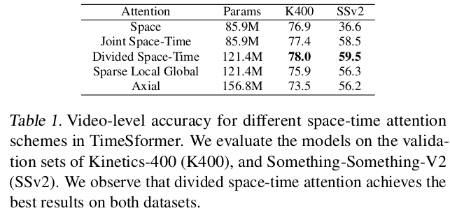 | 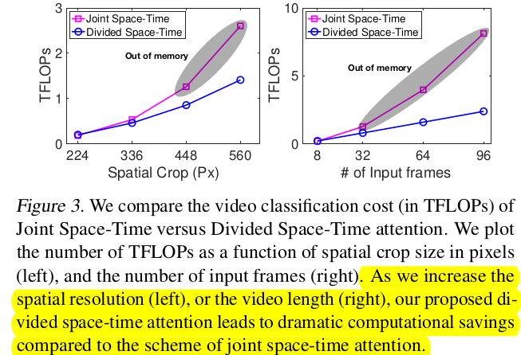 |

- Comparison to 3D CNNS

  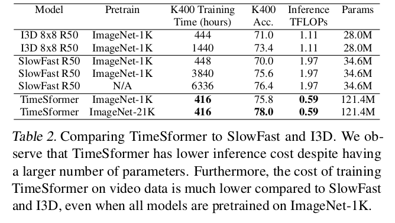

  - Model Capacity (#of parameters)가 TimeSformer가 더 많음

  - 하지만 inference TFLOPS가 적고, training / inference time도 훨씬 적음

    - 20K video evaluation inference time

      - 14.88h (3D CNN) vs. 36minute (TimeSformer)

        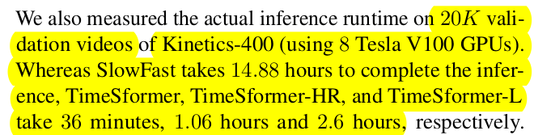

- Importance of pretraining

  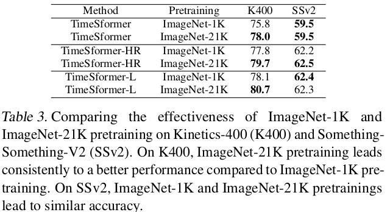

  - K400은 spatial scene information에 biased되어 있어, Image-based Pretrain에 영향을 많이 받음

  - SSv2는 "temporally-heavy"한 특성이 있으므로, frame간 관계가 학습성능에 더 민감하므로 Pretrain에 영향을 덜 받음 

  - ImageNet-21K > ImageNet-1K > Scratch (64.8%@K400)

    | TimeSFormer | TimeSformer-HR | TimeSFormer-L |
    | ----------- | -------------- | ------------- |
    | 8x224x224   | 16x448x448     | 96x224x224    |

- Impact of Video-Data Scale

  {25%, 50%, 75%, 100%}로 학습에 사용하는 데이터를 scaling

  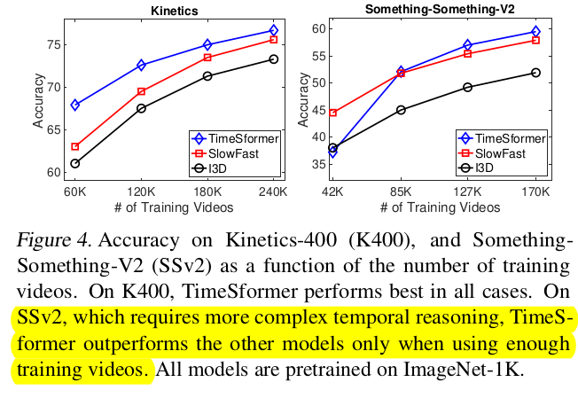

  - SSv2는 3D-Conv기반 SlowFast가 데이터가 적은 경우 성능이 좋음
    - 이는 inductive bias때문.
    - SSv2는 temporal 관계를 학습하기 상대적으로 더 복잡한 데이터이므로, 많은 데이터가 요구됨

- Varying # of tokens

  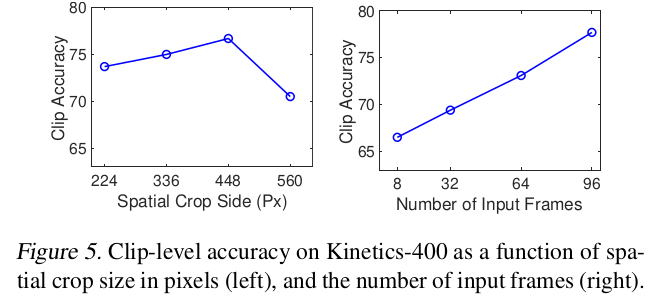

  - higher resoultion
  - longer videos

- Importance of positional embedding

  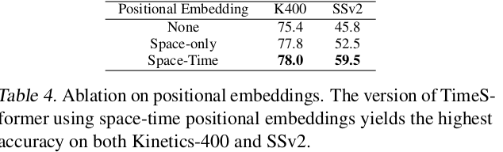

  - Space-Only에서 K400은 좋은 성능을 냄 $\to$ spatial biased
  - SSv2는 Space-Time모두 넣어야 좋은 성능 $\to$ temporal heavy

- VS SOTA

  

  | 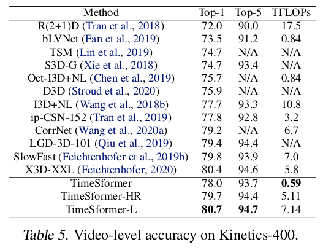 | 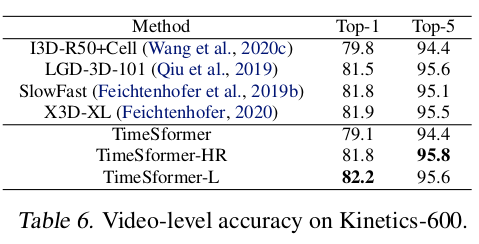 |
  | ----------------------------------------------------- | ----------------------------------------------------- |

  

| 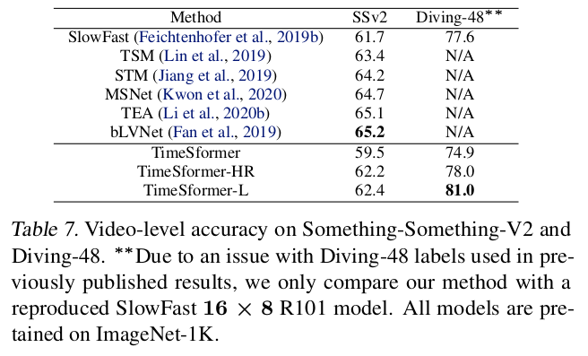 | 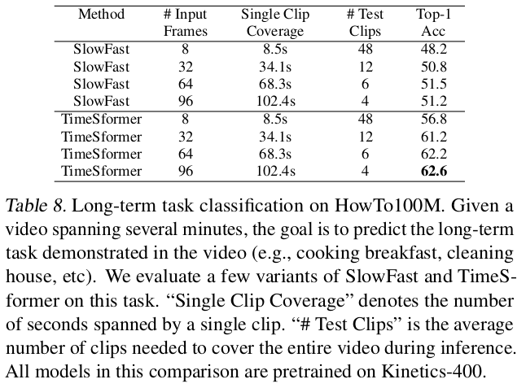 |
| ----------------------------------------------------- | ----------------------------------------------------- |

- Number of clips used for validation

  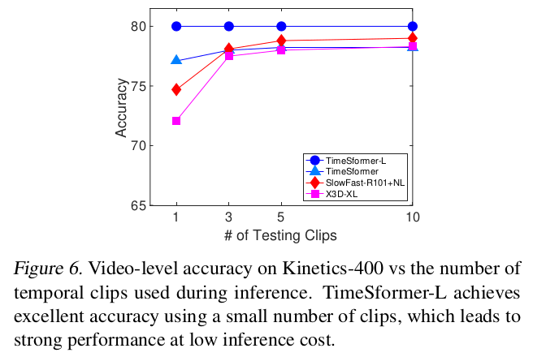

  - previous 방식들은 10 temporal clips with 3 staial crops (30 space-time views)를 가지고 판단했다고 함
  - TimeSFormer는 1개 clip로 좋은 성능을 

- Visualization

  - Attention Rollout scheme (CAM같은)

    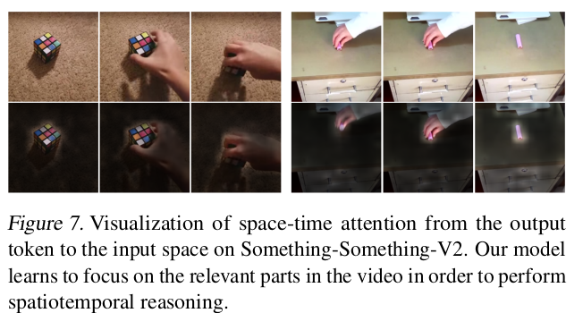

  - t-SNE

    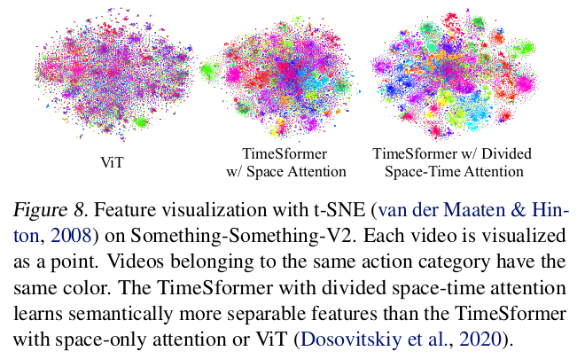

  
