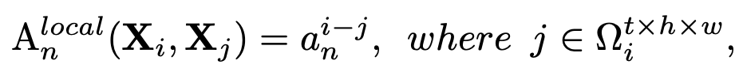
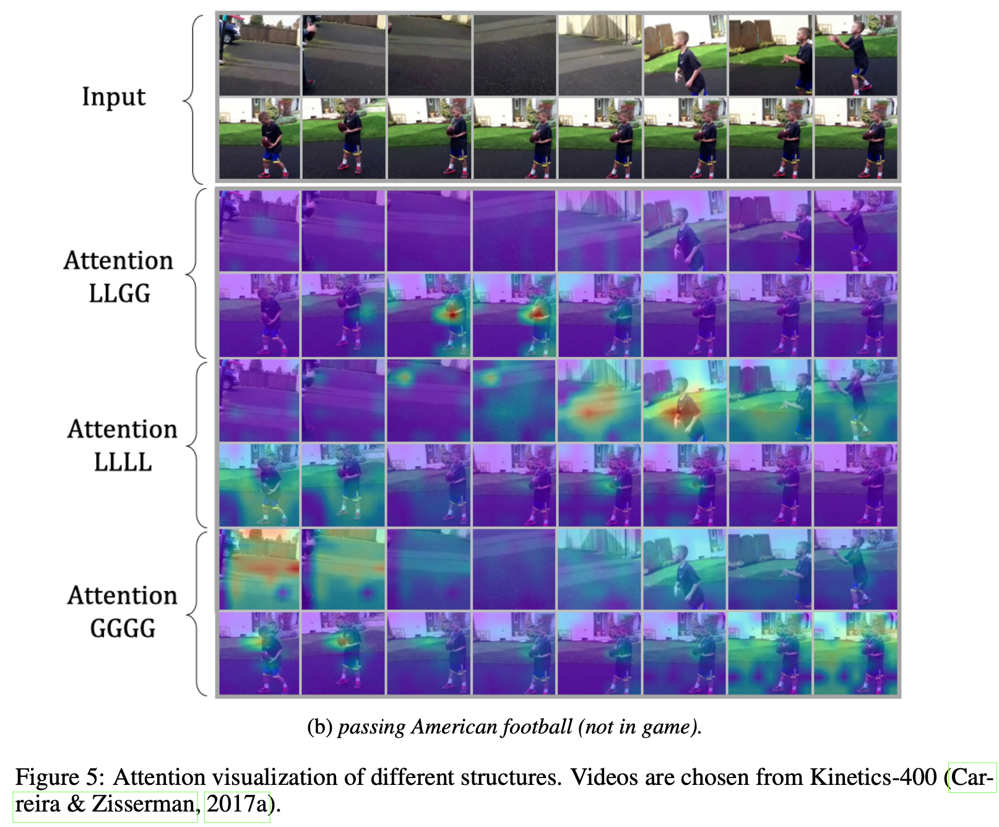

# [AR] UNIFORMER: UNIFIED TRANSFORMER FOR EFFICIENT SPATIOTEMPORAL REPRESENTATION LEARNING

- paper: https://arxiv.org/pdf/2201.04676.pdf
- github: https://github.com/Sense-X/UniFormer
- ICLR 2022 accepted (인용수: 182회, '24-03-20 기준)
- downstream task: Video classification (Action Recognition)

# 1. Motivation

- video classfication의 경우, 인접한 frame간의 redundunt한 특성, global (전체 frame)간의 complex dependency가 있어 학습이 용이하지 않음

  - 3D Conv는 redundant특성을 완화하는 반면, global dependency 추출이 어려움

  - Self-attention은 global dependency 추출이 가능한 반면, redundunt한 계산량이 많이 요구됨

    

    - Self-Attention만 사용한 대표적 모델 TimeSFormer의 경우, 초기 layer에서 인접한 영역만 attention되고 있음. 반면 전체 영역에 대해 계산을 하게되어 비효율적임

    - 이는 computation-accuracy trade-off를 안좋게 만듦

      

    $\to$두 장점을 조합하면 최상의 성능이 나오지 않을까?

# 2. Contribution

- 3가지 새로운 모듈을 제안한 Uniformer를 제안함
  - Multi-Head Relation Aggregation (MHRA)
    - Shallow layer에는 local relation만 학습하는 small parameter metrix 설계하여 인접한 token만 가지고 context를 aggregate
    - Deep layer에서는 spatiotemporal 을 나누지 않고 joint하게 전체를 attention하여 global complex dependency를 학습함
  - Dynamic Position Embedding (DPE)
    - 3D Conv로 설계
  - Feed-Forward Network (FFN)
- Video Classification benchmark에서 SOTA

# 3. Uniformer

- overall diagram

  

  

  - DPE: 3D positional information을 모든 token에 integrate
  - MHRA: MHSA와 다르게 Local-Global조합으로 구성
  - FFN : 2 MLP로 구성

  

- Multi-Head Relation Aggregator  (MHRA)

  

  - **X**: Input token (image) 

  - **A**$_n$: n번째 head의 token affinity. **V**$_n$의 결과를 summarize해줌 

    - Local MHRA

      - Shallow layer에 적용하여 redundunt 영역은 배제하고, neighbor영역만 attention하여 계산량을 줄임

        

        - **X**$_j$: j번째 neightbor token

      - MobileNet의 3D  version과 같음

    - Global MHRA 

      - Deep layer에 적용하며, spatio-temporal token에 대해 전체 영역을 attention

        

        - $Q_n, K_n$: n번째 linear transformation한 Query, Key

  - **V**$_n$: n번째 head의 context. 

- Dynamic Position Embedding

  - Spatial, temporal position별로 spatiotemporal encoding 정보를 주어야 translational-invariance특성을 학습할 수 있게됨

  - Long clip의 경우, relative positioning보다 absolution positioning정보를 주어야 전체 크기를 고려한 positioning encoding을 할 수 있음

  - 3D Conv의 shared parameter를 통해 이를 구현

    

    - 인접 영역 외에는 zero-padding

- 3D Conv, Self-Attention과의 비교

  

# 4. Experiments

- Kinetics 400 & 600

  

- Something-Something V1 & V2

  

- Ablation

  

- testing strategy

  

  - Kinetics는 scene-related된 dataset이고, 학습 시 dense sampling을 여러번 수행했기 때문에 crop을 여러번 하는 것보다, 여러 clip을 보며 frame 갯수를 늘려 사용하는 것이 성능 향상에 도움이 됨

  - 반면 Something-Something dataset은 temporal-related, uniform sampling으로 학습했기에 multi-crop이 성능에 좋음

    $\to$ IR도 이 방식이 좋을 것으로 생각됨

- Visualization

  

  
