# [DM][PS] CustomDiffusion: Multi-Concept Customization of Text-to-Image Diffusion

- paper: https://arxiv.org/pdf/2212.04488.pdf
- github: https://github.com/adobe-research/custom-diffusion
- CVPR 2023 accepted (인용수: 287회, '24-03-24 기준)
- downstream task: Generation of Personalization

# 1. Motivation

- Specific concept 이미지 몇 장만 가지고, 해당 concept의 semantic을 보존하면서 다양한 이미지를 생성하고 싶음 (DreamBooth)

- Multi concept을 compose하는 compositional-finetuning도 수행하고 싶음

  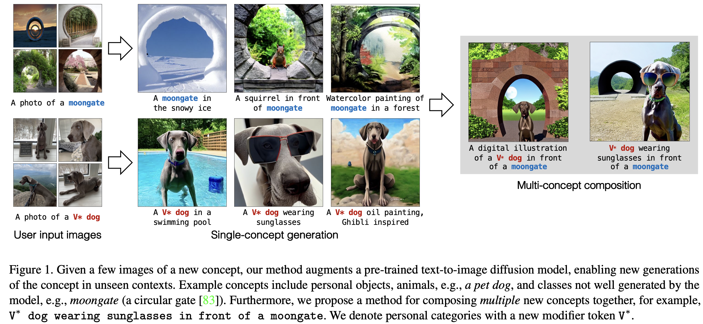

# 2. Contribution

- Text-to-Image Diffusion Model의 generalization을 헤치지 않으면서, specialized new concept의 new variation을 생성해낼 수 있는 efficient fine-tuning기법인 "Custom Diffusion"을 제안함
  - 기존 방식 (DreamBooth)보다 4x 빠르게 학습할 수 있고 (~6min), 3%의 weight만 tuning함)

# 3. CustomDiffusion

- Overall Diagram

  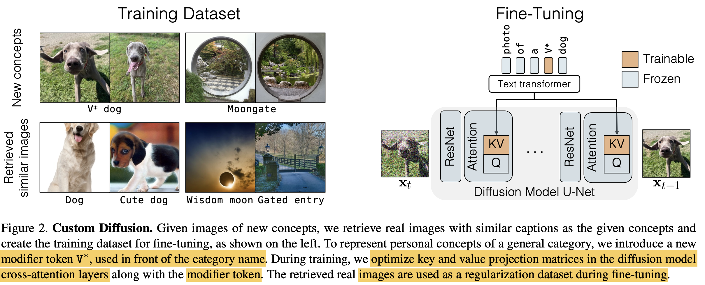

- baseline : Stable-Diffusion (LDM)

  - #### 목적: original data distribution **q**(**x**$_0$)를 학습하고자 함

    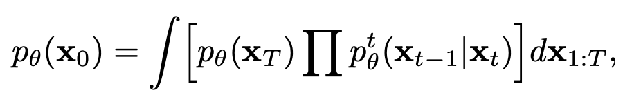

    - $p_{\theta}$(**x**$_0$): 생성된 image

  - Loss : Denoised Loss

    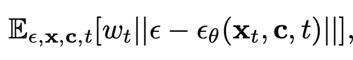

## 3.1 Single Concept Fine-tuning

### 1. Rate of change weights

- Pretrained Diffusion Model과 Full fine-tuned Diffusion Model의 layer-wise weight의 변화량을 분석한 결과, cross-attention layer weight들이 제일 많이 변화함 $\to$ 가장 critical한 정보를 학습했다고 가정 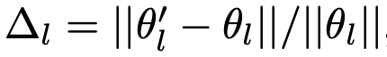

  - $\theta_l'$: fine-tuned diffusion model's weight
  - $\theta$: pretrained diffusion model's weight

  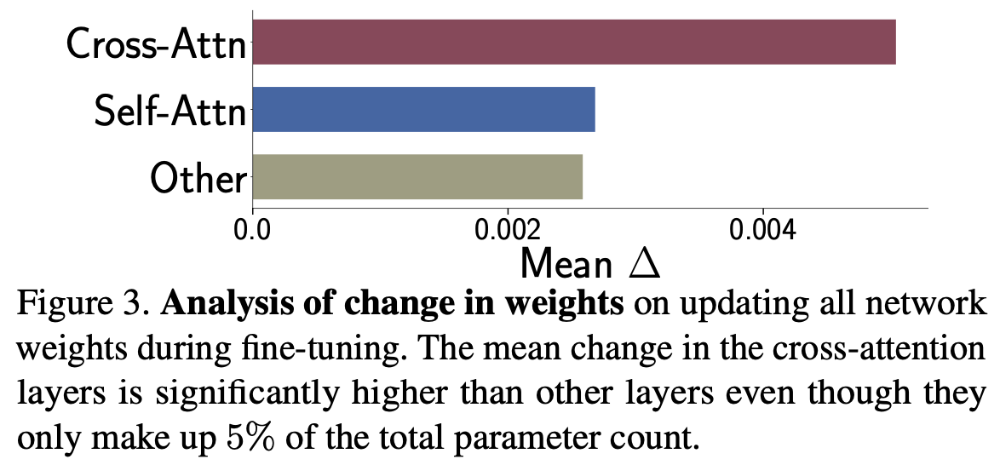

### 2. Model Finetuining

- Text embedding vector를 입력으로 받는 key, value의 linear transform matrix만 학습에 사용함

  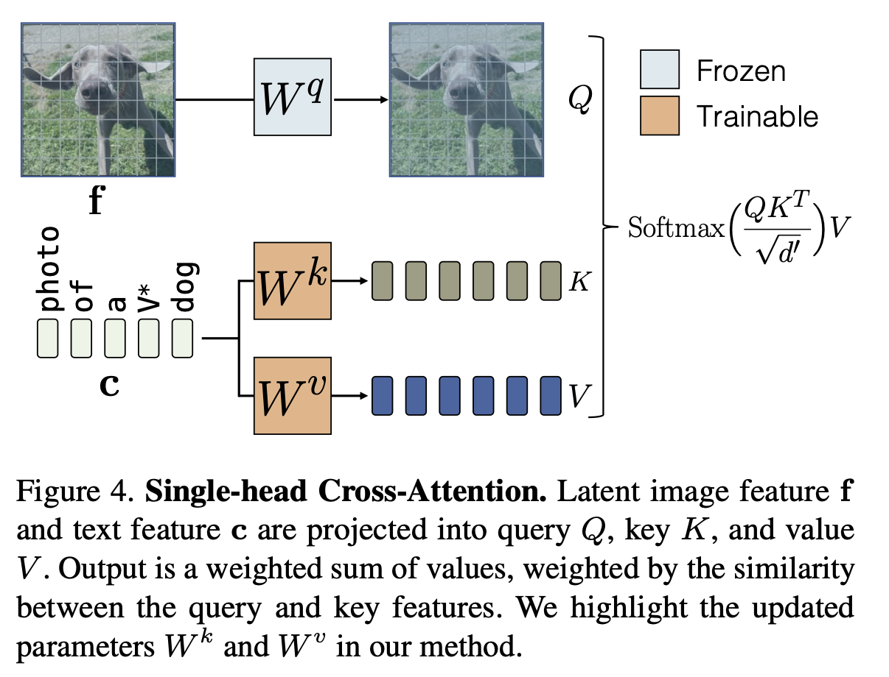

  - Query : 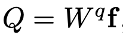
  - Key: 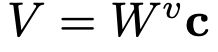
  - Value: 

- Attention Weight

  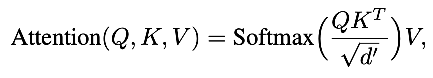

### 3. Text Encoding

- text caption이 주어진 경우, 그 값 그대로 활용함 (ex. "MoonGate")
- text caption이 없는 new concept인 경우, rare occuring token embedding을 활용함 (ex. "V* dog")

### 4. Regularization Dataset

- Few-shot target dataset으로 fine-tuning하면 생기는 "language drift"이슈를 해결하고자 Regularization Dataset을 활용함

  - ex. "MoonGate"을 학습하다보면 "Moon"과 "Gate"에 대해 모델이 forgetting 할 수 있음

    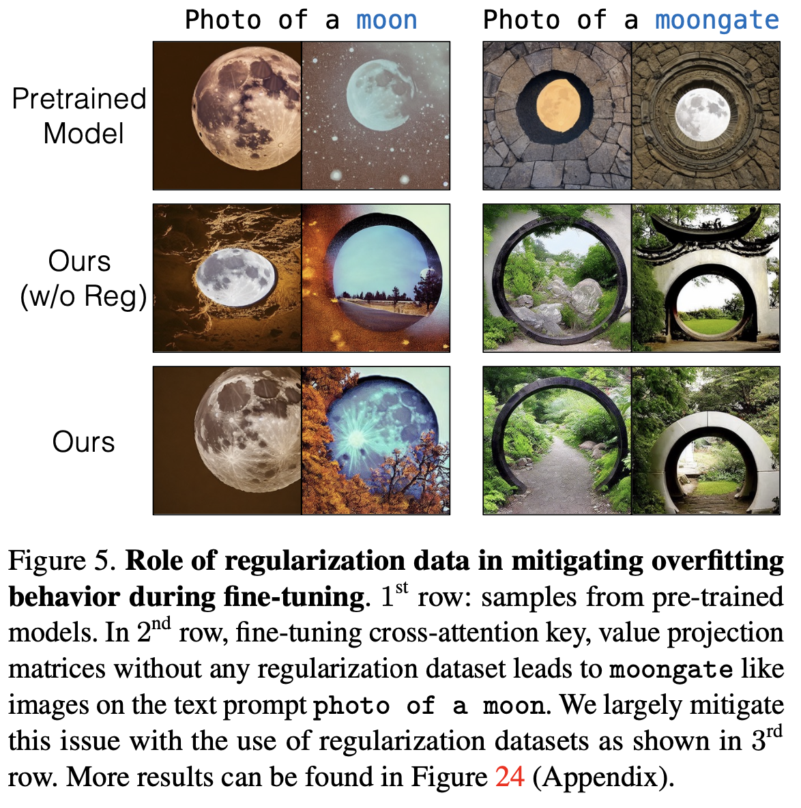

  - ex2. "Tortoise plushy"로 학습하다보면 "plushy(천으로된)" 란 단어가 target dataset에 overfitting됨

- 이를 해결코자 image-text opensource LAION-400M에서 CLIP-I score 0.85이상의 해당 target text와 제일 유사한 이미 200장을 뽑음

## 3.2 Multi Concept Fine-tuning

### 1. Joint Training on Multiple Concepts

- Multiple concept에 대해 joint training을 수행함 (sequential traning할 경우, 처음 학습된 concept이 지워진다고 함)

### 2. Constrained Optimization to merge Concepts

- N개의 concept, L개의 cross-attention layersdp 대해 해당 loss를 적용하여 optimization을 수행함

  - pretrained cross-attention weights for key, value: 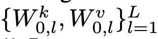
  - n번째 concept로 학습된 cross-attention weights for key, value: 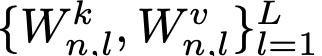

- Optimization Function

  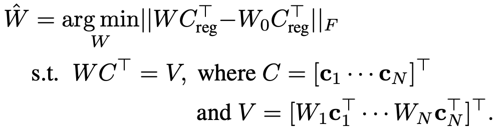 

  - $C_{reg}$: regularization을 위해 사용된 text embedding. 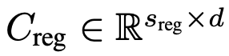로 1,000개의 random sampled caption으로 만들어짐 ($s_{reg} \neq 1000$)
  - $C_{reg}$: N개의 target text caption을 concat 하고 flatten하여 만든 text embedding. 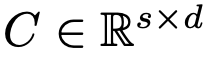
    - s는 단어의 개수로 보면 되고, N은 concept의 갯수로 보면 됨
      - ex. ["my dog", "your dog"]
        - s = 4, N = 2

  $\to$ constrained optimization문제로, Lagrange equation을 적용해서 Least Square 문제를 풀면

  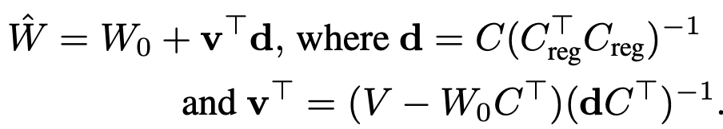

- 유도과정

  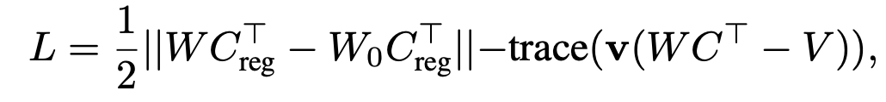

  위 식을 *W*로 미분하고, 0으로 equalization하면

  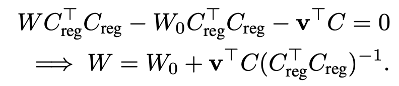

  LS 문제를 풀면

  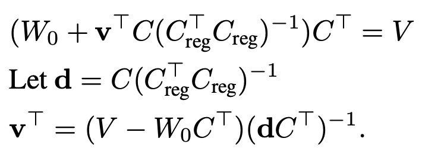

### 3. Training Details

- augmentation
  - single-concept은 250 step, multi-concept은 500 step으로 학습
  - 초반엔 1.2~1.4x crop하고 text에 "zoomed in", "close up"을 추가로 입력
  - 후반엔 0.6~0.8x resize하고 text에 "very small", "far awary"을 추가로 입력 

# 4. Experiments

- Datasets
  - 10개의 concept을 활용: 2 pets, 6 objects, 2 categories로 구성
- Evaluation Metrics
  - CLIP-I: generated image와 target image의 유사도를 CLIP Image encoder의 feature로 비교
  - Text-alignment: Target text prompt와 생성된 image의 유사도를 CLIP feature space를 이용
  - KID: LAION-400M 데이터에서 overfitting을 판단하기 위해 유사한 이미지와의 유사도를 비교. 유사도가 높을수록 language drift가 덜 발생하여 overfitting이 발생하지 않았다고 판단하는 것 같음

- Quantitative Result

  - Text-Alignment vs. Image-Alignment Trade-off

  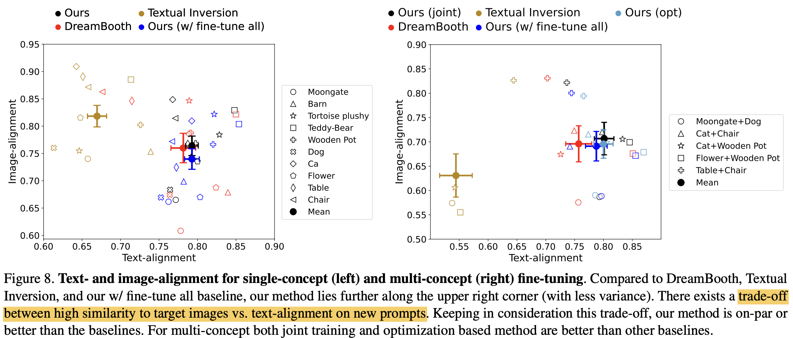

  - Text-Alignment & Image-Alignment & KID

  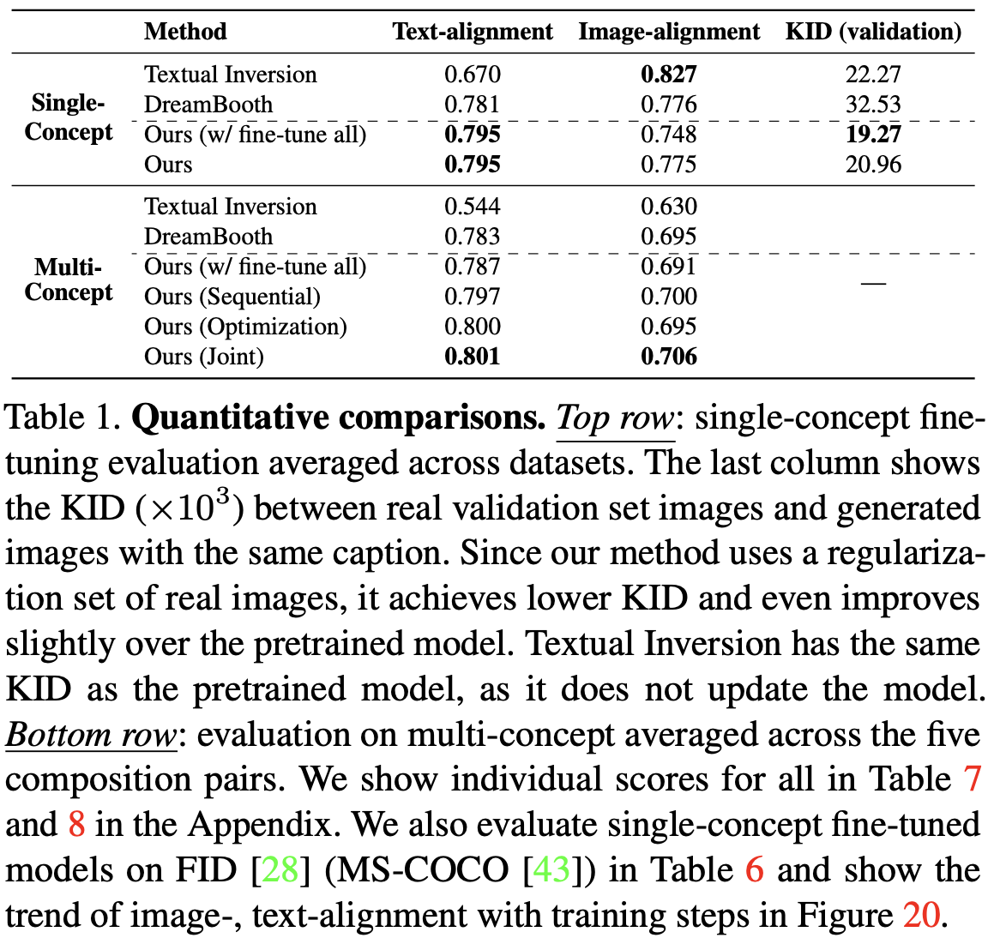

  - Human Preference

    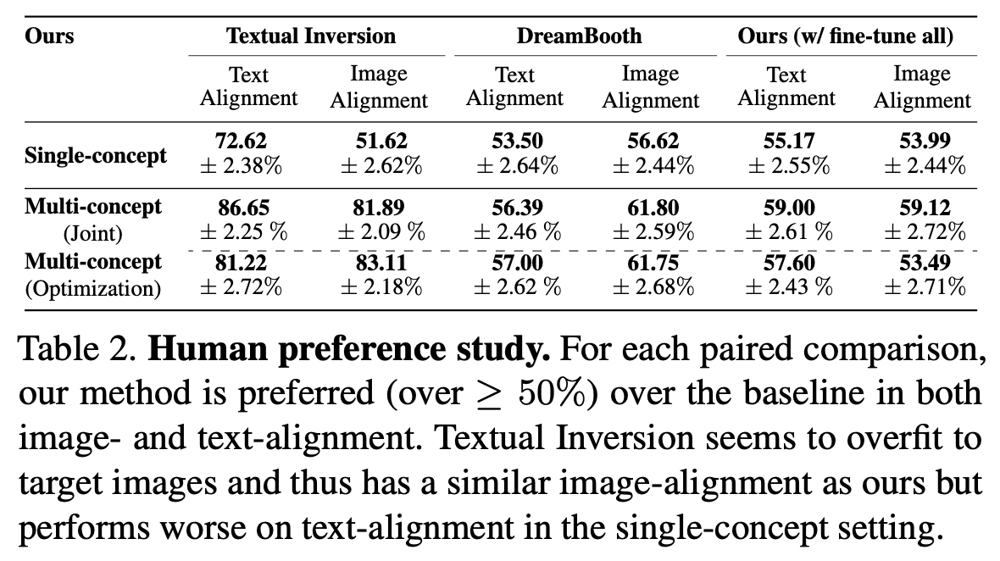

- Qualitative Result

  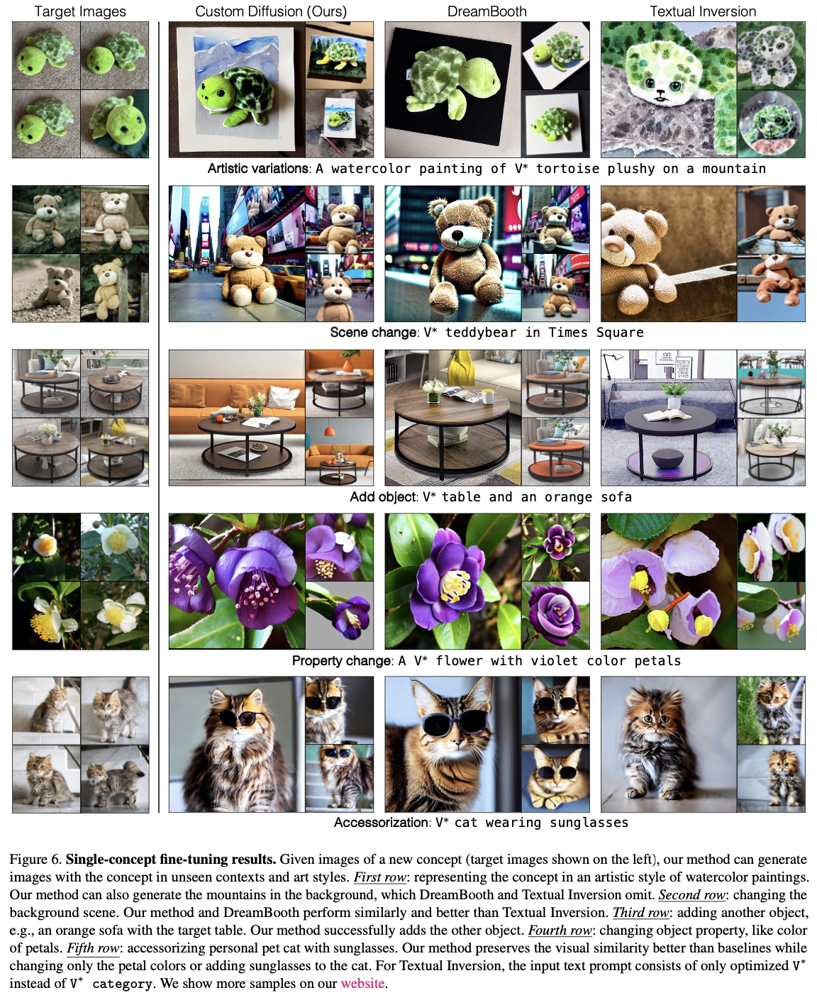

  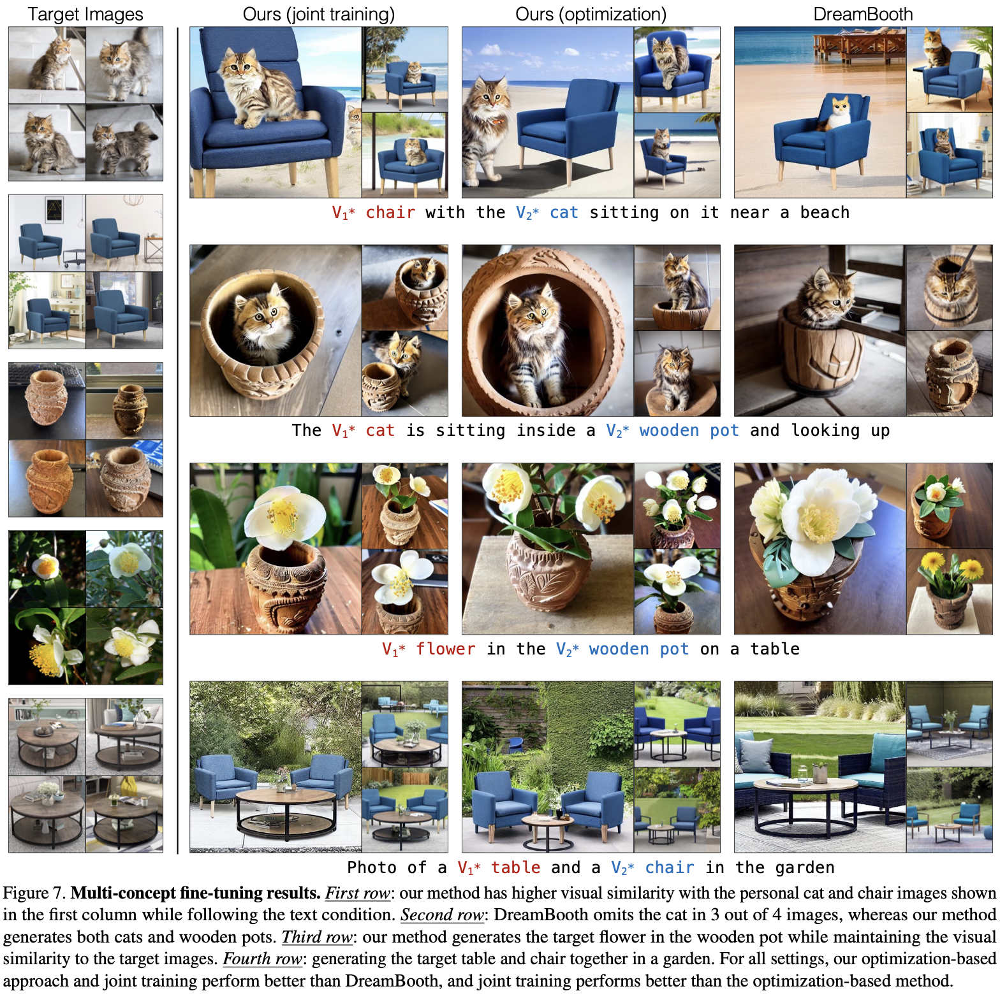

- Ablation Study

  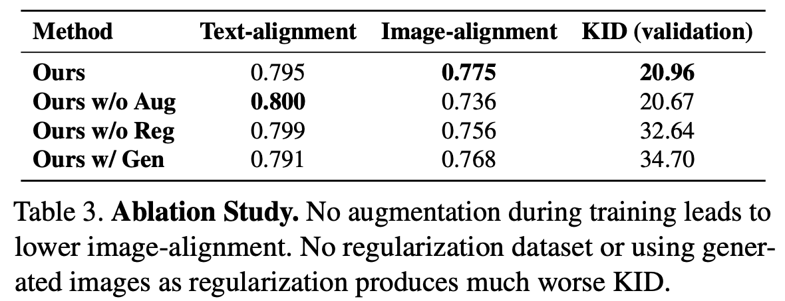

- Applications

  - Fine Tuning on a Style

  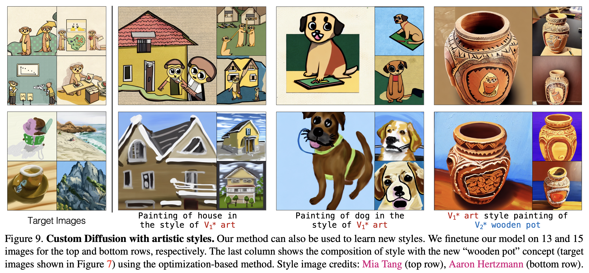

  - Image Editing

    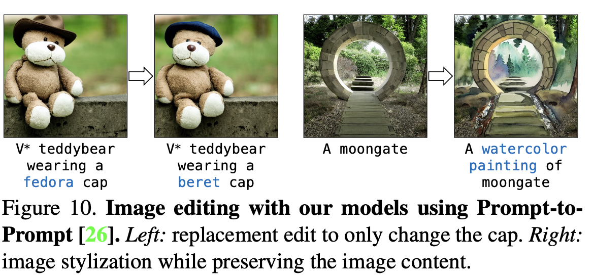

- Failure cases

  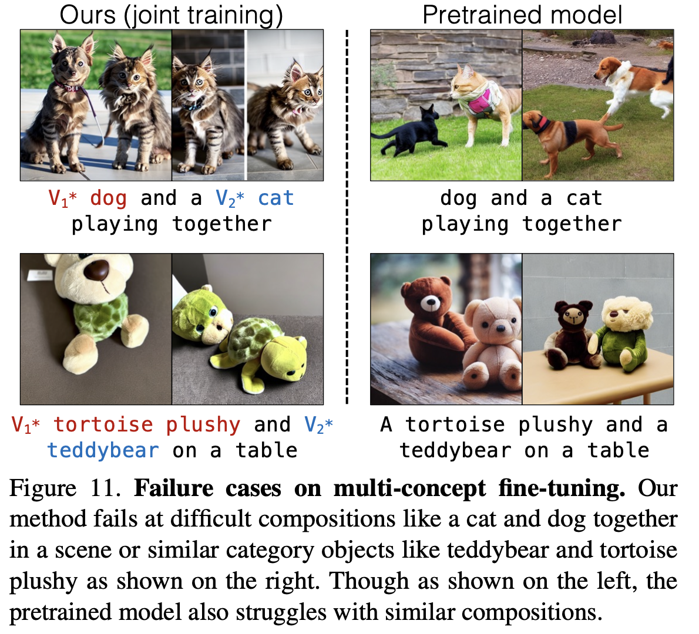

  - pet dog & pet cat을 생성하는 경우, 생성이 잘 안됨

    - 원인은 Pretrained Diffusion Model이 원래 안되었기 때문

      - Attention Map 분석 결과, 두 text에 대해 attention map이 겹치는 영역에 대해 반응해버려, 분리가 어렵게되기 때문

        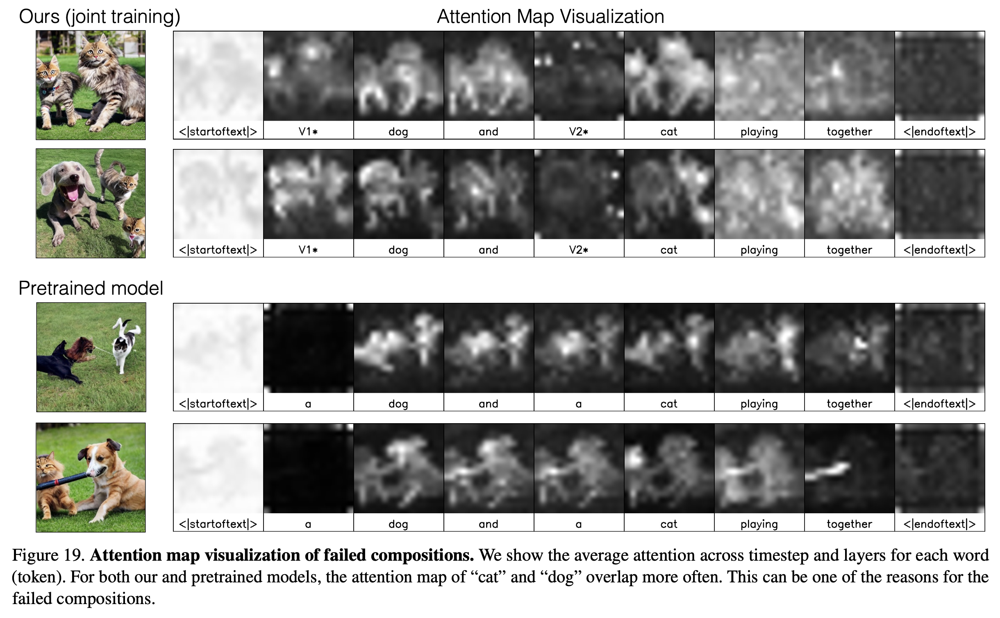

        $\to$ pretrained 모델이 안되는 경우, 해당 Custom Diffusion도 잘 안됨
