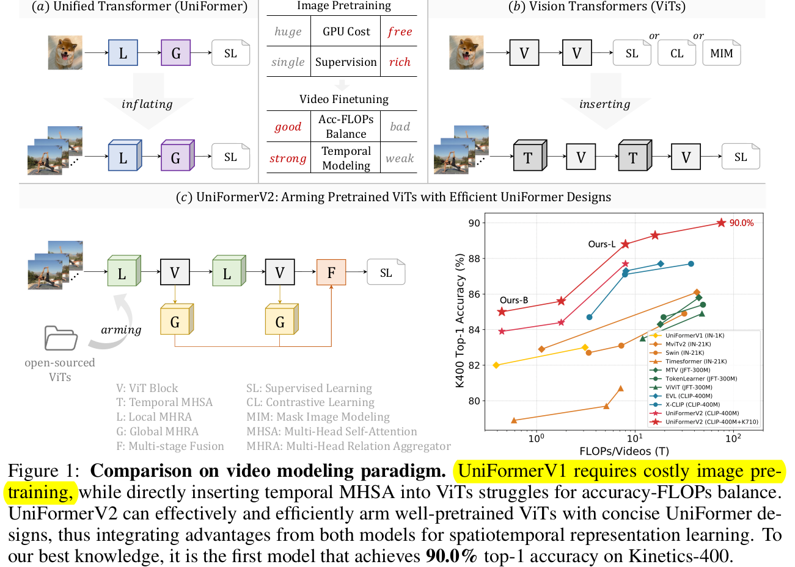
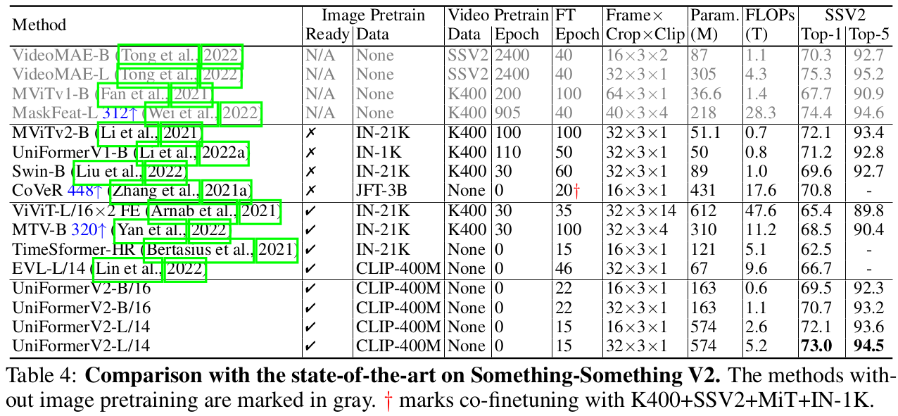

# [AR] UNIFORMERV2: SPATIOTEMPORAL LEARNING ARMING IMAGE VITS WITH VIDEO UNIFORMER

- paper: https://arxiv.org/pdf/2211.09552.pdf
- github: https://github.com/OpenGVLab/UniFormerV2
- ICCV 2023 accpeted (인용수: 56회, '24-03-25 기준)
- downstream task: Action Recognition

# 1. Motivation

- Uniformer로 convolution과 self-attention의 장점을 효과적으로 살리는 MHRA (Multi-Head Relation Aggregation) 이 최근 제안되었음

- 하지만, 이는 video based self-attention과정을 담고 있어 (spatio-temporal), image-based ViT pretrained weight를 사용할 수 없음 $\to$ Pretraining phase가 너무 itresome하고 복잡 (계산량이?)함

  $\to$ Open-sourced ViT model을 pretrain과 UniFormer를 잘 활용할 수 있는 방법은 없을까?

# 2. Contribution

- Open-sourced ViT model을 잘 활용할 수 있도록 UniFormer의 구조를 개선한 UniformerV2를 제안함

  - Brand-new local & global relation aggregator를 사용함

- Open Action Recognition benchmark에서 SOTA

  

# 3. Uniformer-V2

- Overall Architecture

  

  - 3D Conv: Input video를 tokenize하는데 활용

    

    

  - Local UniBlock : Local MHRA와 ViT의 MHSA (Global MHRA)+FFN으로 구성 

  - Global UniBlock : Uniformer의 SpatioTemporal Global MHRA의 막대한 계산비용을 줄이고자, Cross-Attention기반 (query-based) cross MHRA를 제안함

    - Multi-Feature의 Global token을 unifying해서 최종 video classification에 활용

## 3.1 Local Uniblock

- 구성

  

- Remind MHRA

  

  - 핵심: $A_n$을 어떻게 설계하는가?

#### 1. Local Temporal Multi-Head Relation Aggregation (LT-MHRA)

- $t \times 1 \times 1$ 의 temporal tube를 local neighbor로 활용

  

  - 초기값은 zero로

- $1 \times H \times W$의 spatial tube (1-frame) 내의 전체 token을 neighbor로 활용

  

  - 초기값은 Image-based ViT pretrained weight로
  - ViT의 Positional Encoding이 있으므로, DPE (Dynamic Position Encoding)은 제거함 (성능향상에 기여하지 않았다고 함)

  $\to$ TimeSFormer + Uniformer 섞은 느낌.. (Decompose Spatial and Temporal Attention Map)

## 3.2 Global Uniblock

- 기존 Uniformer는 SpatialTemporal Self-Attention을 Deep Layer에서 Global하게 계산함 ($T \times H \times W$)

- 계산량을 줄이고자, (learnable) query-based Cross-Attention을 적용 (나머진 동일)

  

  - C_MHRA: Cross-Attention기반 Global MHRA

    

    

    $\to$ Token의 길이 *L*에 대해 Complexity가 $O(L^2) \to O(L)$로 줄어듦

## 3.3 Multi-scale Fusion Block

- Local & Global UniBlock의 Multi-scale video-token을 합치는 4가지 방법을 제안함 (Sequential이 제일 좋았음)

  

- Final UniBlock의 output **F**$^C$ 와 weighted sum을 최종 score로 사용

  

# 4. Experiments

- Dataset

  - trimmed dataset (정제된 데이터) : 상대적으로 짧은 데이터

    - Scene Related : Kinetics family
    - Temporal Related : Something-to-Something V1/2

  - untrimmed dataset (정제되지 않은 데이터): 상대적으로 긴 비디오

    - ActivityNet

      - 200 classes
      - 100 untrimmed video per classes
      - 1.54 instances per activity instances per video
      - 648 video hours

    - HACS : ActivityNet과 동일한 class

      - 200 classes 
      - 504K videos from Youtube
      - < 4min videos (2.6min average)

    - 1.5M clips (2초 간격으로 sampling)로 구성 (0.6M positive / 0.9M negative)

      

- Kinetics-400

  

- Kinetics-600/700

  

- Moments in Time V1

  

- Something-to-Something V2

  

- Something-to-Something V1

  

- ActivityNet

  

- HACS

  

- Pretrained weight에 따른 성능비교

  

- Ablation Studies

  

  (a) Component 유/무에 따른 성능 비교

  (b) Local UniBlock의 Local MHRA에 따른 성능 비교

  (c) Global UniBlock에 따른 성능 비교

  (d) Multi-stage Fusion 4가지 방식에 따른 성능 비교

  (e) 학습 script에 따른 성능 비교

  
